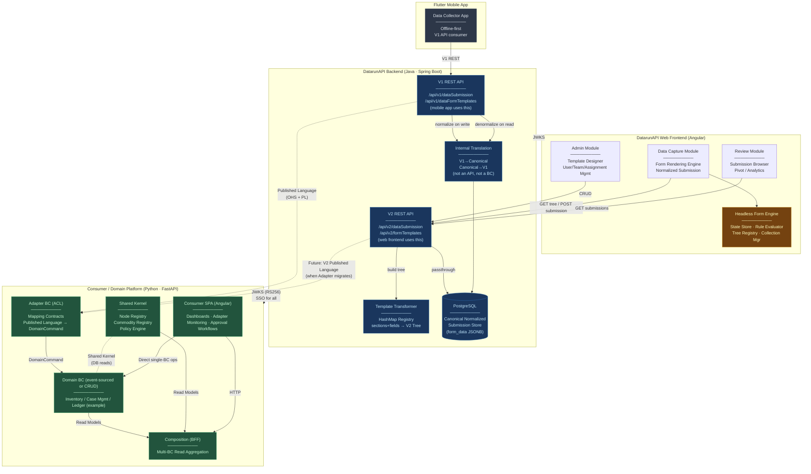

# Datarun

This is a "microservice" application intended to be part of a microservice architecture.

This application is configured for Service Discovery and Configuration with Consul. On launch, it will refuse to start if it is not able to connect to Consul at [http://localhost:8500](http://localhost:8500). For more information, read our documentation on [Service Discovery and Configuration with Consul][].

## Build dependencies

The current system is built upon:

* **Java 17+ (Spring Boot 3.4.2)**: A Maven-based project, initially generated with JHipster and extended.
* **PostgreSQL (tested with v16.x)**: Utilizes a compatible PostgreSQL JDBC driver.
* **Liquibase (XML)**: Used for managing schema migrations.
* **Spring Security & Application-level ACLs**: Integrated for security.
* **`jOOQ` & `NamedParameterJdbcTemplate`/`JdbcTemplate`**: Available for analytical queries.
* **Caching**: Employs Ehcache and Hibernate 2nd-level cache annotations where appropriate.
* **Codegen Tools**: Lombok.
* **Testing**: Testcontainers (Postgres), JUnit 5, and AssertJ are used for testing.
* **User authentication (will be deprecated)**:  
    * sending basic user's credentials and receiving Access/Refresh tokens.
    * **Authentication for New Services (new):** All new services authenticate via this backend, which issues RS256-signed JWTs and exposes the public key at `/ .well-known/jwks.json`. New services simply configure a `JwtDecoder` with this public key to validate tokens—no private keys or user DB access needed. Clients authenticate once with `datarunapi`, receive a JWT, and call any service with `Authorization: Bearer <token>`; each service validates the token locally.

## Key Architectural Principles

### 1. IDs, UIDs and business keys

* **id**: internal primary key (VARCHAR(26)) ULID format. Immutable, never recycled. Used for all foreign-key
  relationships.
* **uid**: short system generated business key (VARCHAR(11)), globally unique, stable across environments, used
  extensively in api client's requests and analytics for human-friendly references.

## 2. High level view of the core archtircture

* [Related discussion](docs\README.md)
* [DatarunAPI Frontend](docs\datarunapi\datarunapi-frontend\overview.md)