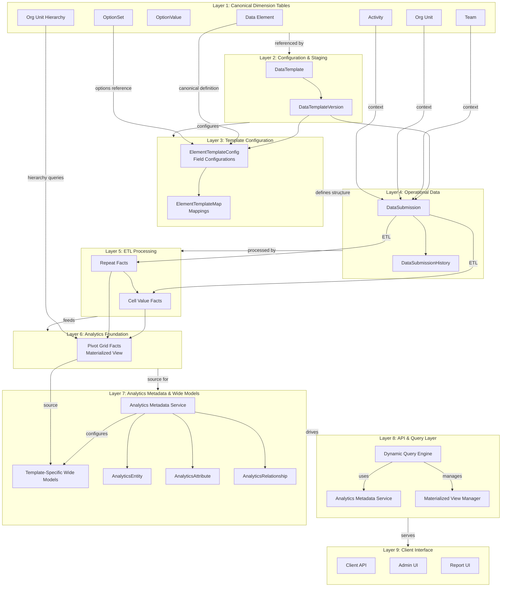
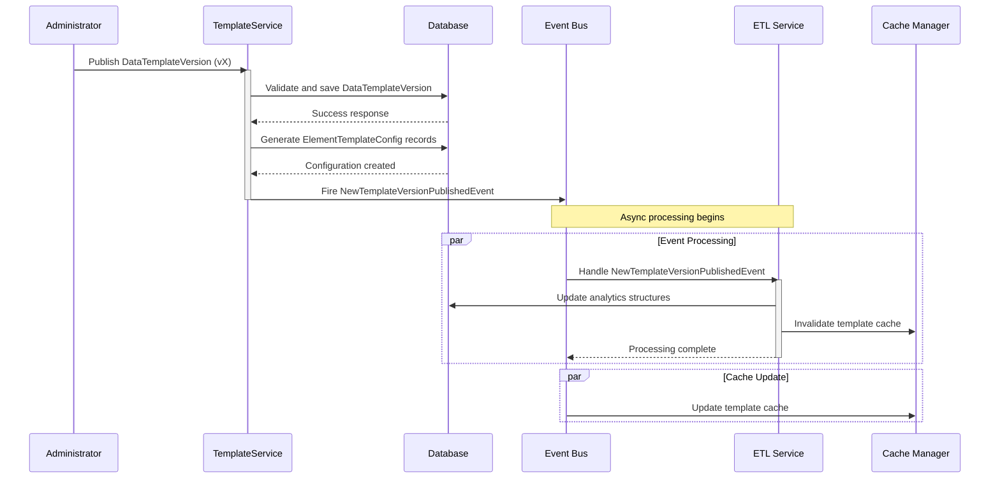
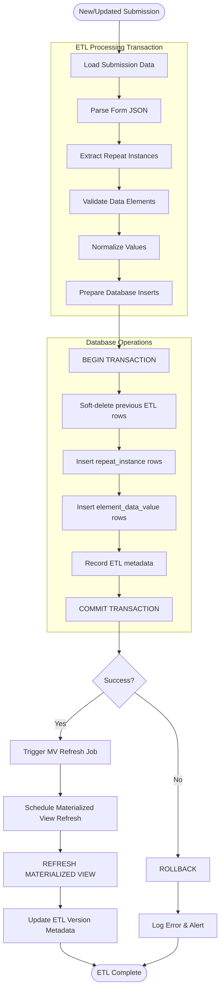

# Datarun

This is a "microservice" application intended to be part of a microservice architecture.

This application is configured for Service Discovery and Configuration with Consul. On launch, it will refuse to start if it is not able to connect to Consul at [http://localhost:8500](http://localhost:8500). For more information, read our documentation on [Service Discovery and Configuration with Consul][].

## Build dependencies

The current system is built upon:

* **Java 17+ (Spring Boot 3.4.2)**: A Maven-based project, initially generated with JHipster and extended.
* **PostgreSQL (tested with v16.x)**: Utilizes a compatible PostgreSQL JDBC driver.
* **Liquibase (XML)**: Used for managing schema migrations.
* **Spring Security & Application-level ACLs**: Integrated for security.
* **`jOOQ` & `NamedParameterJdbcTemplate`/`JdbcTemplate`**: Available for analytical queries.
* **Caching**: Employs Ehcache and Hibernate 2nd-level cache annotations where appropriate.
* **Mapping and Codegen Tools**: Lombok and MapStruct are used.
* **Testing**: Testcontainers (Postgres), JUnit 5, and AssertJ are used for testing.
* **User authentication**:  sending basic user's credentials and receiving Access/Refresh tokens.

## Key Architectural Principles

### 1. IDs, UIDs and business keys

* **id**: internal primary key (VARCHAR(26)) ULID format. Immutable, never recycled. Used for all foreign-key
  relationships.
* **uid**: short system generated business key (VARCHAR(11)), globally unique, stable across environments, used
  extensively in api client's requests and analytics for human-friendly references.

### 2. Immutability as the Bedrock of Integrity

**Principle:** Critical entities are immutable once published to prevent canonical drift

- **DataTemplateVersion:** Schema is locked upon publication
- **DataElement.valueType:** Semantic definition cannot change once in use
- **DataSubmission context:** template_uid and template_version_uid are immutable after creation

## System Architecture System Overview (Concept)



### Template Publishing Flow



### ETL Process Flow



## Dev Project Structure

Node is required for generation and recommended for development. `package.json` is always generated for a better
development experience with prettier, commit hooks, scripts and so on.

In the project root, generates configuration files for tools like git, prettier, eslint, husky, and others that are well
known and you can find references in the web.

`/src/*` structure follows default Java structure.

- `.yo-resolve` (optional) - Yeoman conflict resolver
  Allows to use a specific action when conflicts are found skipping prompts for files that matches a pattern. Each line
  should match `[pattern] [action]` with pattern been a [Minimatch](https://github.com/isaacs/minimatch#minimatch)
  pattern and action been one of skip (default if omitted) or force. Lines starting with `#` are considered comments and
  are ignored.
- `/src/main/docker` - Docker configurations for the application and services that the application depends on

## Development

To start your application in the dev profile, run:

```
./mvnw
```

## Building for production

### Packaging as jar

To build the final jar and optimize the dataRunApi application for production, run:

```
./mvnw -Pprod clean verify
```

To ensure everything worked, run:

```
java -jar target/*.jar
```

Refer to [Using Datarun in production][] for more details.

### Packaging as war

To package your application as a war in order to deploy it to an application server, run:

```
./mvnw -Pprod,war clean verify
```

## Testing

### Spring Boot tests

To launch your application's tests, run:

```
./mvnw verify
```

## Others

### Code quality using Sonar

Sonar is used to analyse code quality. You can start a local Sonar server (accessible on http://localhost:9001) with:

```
docker compose -f src/main/docker/sonar.yml up -d
```

Note: we have turned off forced authentication redirect for UI in [src/main/docker/sonar.yml](src/main/docker/sonar.yml)
for out of the box experience while trying out SonarQube, for real use cases turn it back on.

You can run a Sonar analysis with using
the [sonar-scanner](https://docs.sonarqube.org/display/SCAN/Analyzing+with+SonarQube+Scanner) or by using the maven
plugin.

Then, run a Sonar analysis:

```
./mvnw -Pprod clean verify sonar:sonar -Dsonar.login=admin -Dsonar.password=admin
```

If you need to re-run the Sonar phase, please be sure to specify at least the `initialize` phase since Sonar properties
are loaded from the sonar-project.properties file.

```
./mvnw initialize sonar:sonar -Dsonar.login=admin -Dsonar.password=admin
```

Additionally, Instead of passing `sonar.password` and `sonar.login` as CLI arguments, these parameters can be configured
from [sonar-project.properties](sonar-project.properties) as shown below:

```
sonar.login=admin
sonar.password=admin
```

For more information, refer to the [Code quality page][].

### Using Docker to simplify development (optional)

You can use Docker to improve Datarun development experience. A number of docker-compose configuration are available in
the [src/main/docker](src/main/docker) folder to launch required third party services.

For example, to start a postgresql database in a docker container, run:

```
docker compose -f src/main/docker/postgresql.yml up -d
```

To stop it and remove the container, run:

```
docker compose -f src/main/docker/postgresql.yml down
```

You can also fully dockerize your application and all the services that it depends on.
To achieve this, first build a docker image of your app by running:

```
npm run java:docker
```

Or build a arm64 docker image when using an arm64 processor os like MacOS with M1 processor family running:

```
npm run java:docker:arm64
```

Then run:

```
docker compose -f src/main/docker/app.yml up -d
```

When running Docker Desktop on MacOS Big Sur or later, consider enabling experimental
`Use the new Virtualization framework` for better processing
performance ([disk access performance is worse](https://github.com/docker/roadmap/issues/7)).

## Continuous Integration (optional)

To configure CI for your project, run the ci-cd sub-generator (`ci-cd`), this will let you generate configuration files
for a number of Continuous Integration systems. Consult the [Setting up Continuous Integration][] page for more
information.
