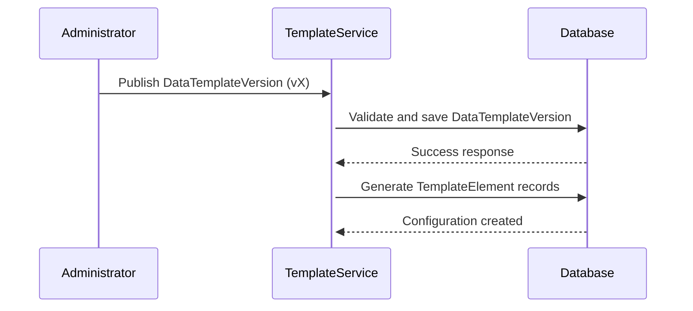
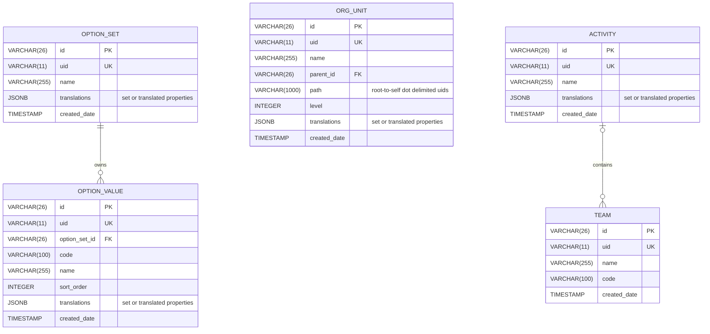
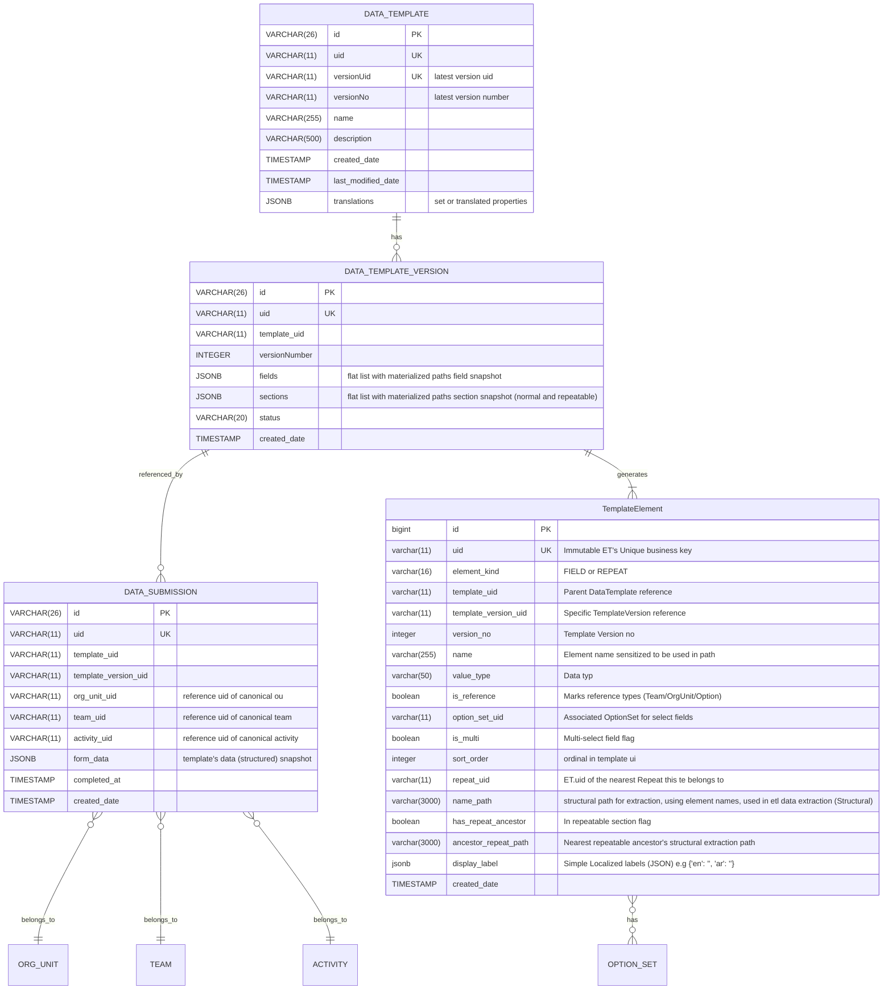
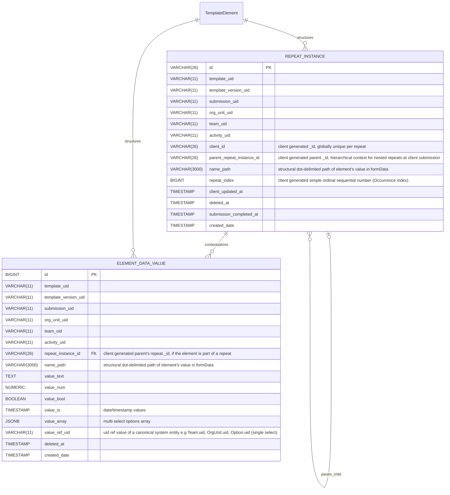

# Datarun: Key Architectural Principles & Diagrams

## Platform / Build dependencies

The current system is built upon:

* **Java 17+ (Spring Boot 3.4.2)**: A Maven-based project.
* **PostgresSQL (tested with v16.x)**: Utilizes a compatible PostgresSQL JDBC driver.
* **Liquibase (XML)**: Used for managing schema migrations.
* **Spring Security & Application-level ACLs**: Integrated for security.
* **`jOOQ` & `NamedParameterJdbcTemplate`/`JdbcTemplate`**: Available for analytical queries.
* **Caching**: Employs Ehcache and Hibernate 2nd-level cache annotations where appropriate.
* **Mapping and Codegen Tools**: Lombok and MapStruct are used.
* **Testing**: Testcontainers (Postgres), JUnit 5, and AssertJ are used for testing.
* **User authentication**:  sending basic user's credentials and receiving Access/Refresh tokens.

## Foundational Design Principles

The data platform already has a solid foundation for a **hybrid schema approach**, leveraging a **meta-data driven model
**. The key is to build a robust system on top of this foundation that can handle the raw data's flexibility while
providing a structured, queryable layer for business insights.

***

## Canonical ET TemplateElement

ET (which is an element's template-version-specific and immutable configuration, `Repeat` element, and scalar
`Elements`
element), maintain the canonical schema metadata of a template per template version.
**ET schema: see appendix**

### 1) ET paths Conceptual rules (short)

* **`namePath`** = *UI/physical path* showing where that element *is stored in the submission's JSON* (may
  include normal sections or UI grouping segments). Example: `mainsection.breedingsources.breeding_habitat_type` vs
  `breedingsources.breeding_habitat_type` (semantic). Use `namePath` when you must mirror the *exact* stored location.
* **Rule of thumb:** Use `namePath` when you traverse the exact stored location for a particular submission version.
* `name_path`/ each is unique per version.

### Template Publishing Flow

## Layer — Capture

## Purpose

Durably accept client submissions with *minimum* runtime semantics, preserve raw payload for replay/audit, and record
template/version references.

## Core artifacts

* `DATA_SUBMISSION` (DS): `form_data` JSONB, `template_uid`, `template_version_uid`, simple domain context refs e.g
  `orgUnitUid`, `teamUid`,
  activityUid)
* `DATA_TEMPLATE` (DT)/`DATA_TEMPLATE_VERSION` (DTV) (fields, sections config snapshot)
* `TEMPLATE_ELEMENT` (ET)

## Responsibilities & rules

* Only basic validation on arrival (required meta like `template_uid`, `template_version_uid`, `submission_uid`).
* Always store the raw JSON payload and submission metadata immutable in `data_submission`.

---

## Appendix

### 1. Canonical References Layer, Minimal ERD Diagrams

### 1. Data Capture Layer, Minimal ERD Diagrams

#### Capture Templates Register (minimal)

mostly uid native.

### 3. Ingestion stage 1 transformation (Structural):

queryable structural normalized data with minimal domain semantics present at ingestion time (org_unit_uid, team_uid,
etc)

referential Join: (template_version_uid, name_path) -> etc.(template_version_uid, name_path) to get the template
descriptor metadata
including name and display labels, etc.

## current JPA entity/dto elements:

all with repository, service, and basic endpoints controllers:

`DATA_TEMPLATE`/`DATA_TEMPLATE_VERSION`/`TemplateElement` management.
`DATA_SUBMISSION` ingestion.

Domain references management: `ORG_UNIT`, `TEAM`, `ACTIVITY`, `OptionSet`, `Option`, each is a jpa entity and have
proper repositories, services, and crud rest endpoints

### Common Abbreviations Used Throughout The System

* `act`: Activity.
* `ds`: DataSubmission.
* `dt`: DataTemplate.
* `dtv`: DataTemplateVersion.
* `te`: TemplateElement (repeat or scalar)
* `ops`: OptionSet.
* `ou`: OrgUnit.
* `ov`: OptionValue.
