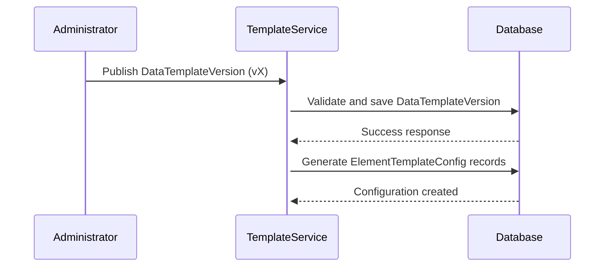
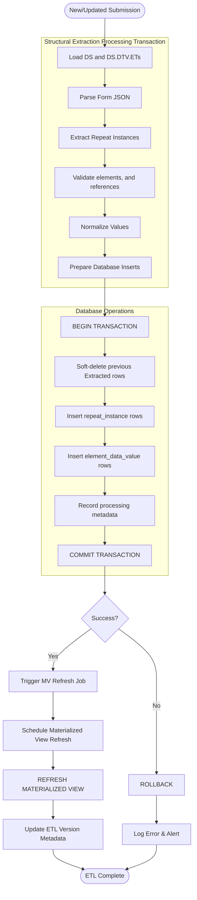
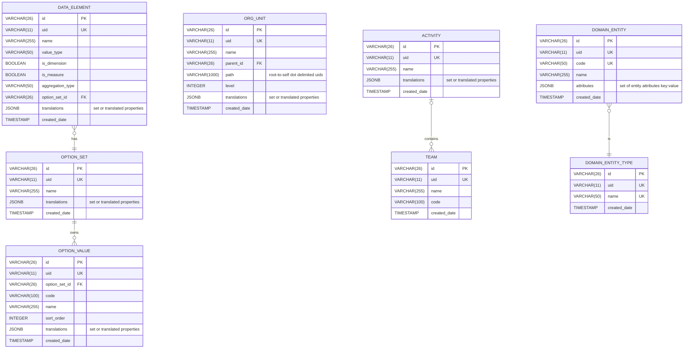
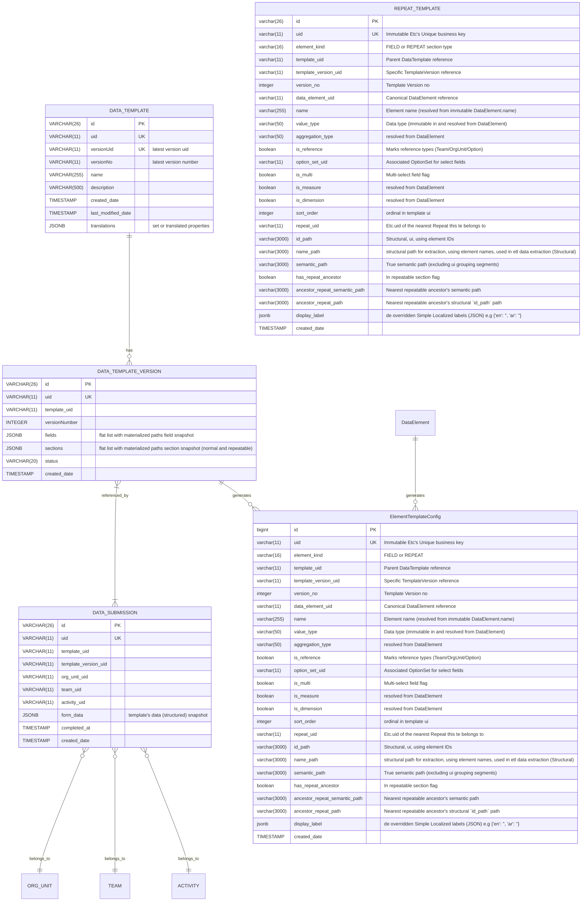

# Datarun: Key Architectural Principles & Diagrams

## Platform / Build dependencies

The current system is built upon:

* **Java 17+ (Spring Boot 3.4.2)**: A Maven-based project.
* **PostgresSQL (tested with v16.x)**: Utilizes a compatible PostgresSQL JDBC driver.
* **Liquibase (XML)**: Used for managing schema migrations.
* **Spring Security & Application-level ACLs**: Integrated for security.
* **`jOOQ` & `NamedParameterJdbcTemplate`/`JdbcTemplate`**: Available for analytical queries.
* **Caching**: Employs Ehcache and Hibernate 2nd-level cache annotations where appropriate.
* **Mapping and Codegen Tools**: Lombok and MapStruct are used.
* **Testing**: Testcontainers (Postgres), JUnit 5, and AssertJ are used for testing.
* **User authentication**:  sending basic user's credentials and receiving Access/Refresh tokens.

## Foundational Design Principles

### 1. IDs, UIDs and business keys

* **id**: internal primary key (VARCHAR(26)) ULID format. Immutable, never recycled. Used for all foreign-key
  relationships.
* **uid**: short system generated business key (VARCHAR(11)), globally unique, stable across environments, used
  extensively in api client's requests and analytics for human-friendly references.

### 2. Immutability as the Bedrock of Integrity

**Principle:** Critical entities are immutable once published to prevent canonical drift

- **DataTemplateVersion:** Schema is locked upon publication
- **DataElement.valueType:** Semantic definition cannot change once in use
- **DataSubmission context:** template_uid and template_version_uid are immutable after creation

### Canonical DataElement (DE)

**schema: see appendix**
**1) DE key points (short)**

* **DE.type (valueType enum)** = *canonical valueType* in addition to primitive basic types, a de can also be of a
  system's canonical entity type, such as [`OrgUnit`, `Entity`, `Team`, `Activity`, `SelectOne (option)`,
  `SelectMulti (option)`]. De.type = `selectMulti/SelectOne` should define the `option_set`.
* A DE's value type, and its linked optionSet (if of select type) are both immutable and never change after referenced
  from anywhere.
* **Rule of thumb:** ETC per template version (see below) just copies the immutable properties and never change them.
* enforce strict publish-time validation and ETC encodes a lot of the resolved decisions (value_type, is_measure,
  option_set, etc.), and every ETC maps to an immutable DataElement with an immutable value_type. Which gives a strong
  structural / schema-driven base. But the semantic meaning of DataElements (their “domain name”, what they mean in
  business terms) is thin — the canonical DataElement.name doesn’t guarantee a domain-contextual meaning, and it can
  drift over time. A low-complexity blueprint to get semantics correct in the domain layer is needed, with a path to
  evolve governance, mapping, and authoring later.

## ETC ElementTemplateConfig

ETC (which is an element's template-version-specific and immutable configuration, `Repeat` element/and scalar `Field`
element), maintain the canonical metadata needed to extract or process and resolve a value from DataSubmission.formData.
**schema: see appendix**

### 1) ETC paths Conceptual rules (short)

* **`semantic_path`** = *canonical path* maps the logical model to data. It’s what is use for extraction
  and
  projection. Example: `supply.month_name` means “the `month_name` element that belongs to the `supply` repeat (
  logical)”.
* **`namePath` / `idPath`** = *UI/physical path* showing where that element *is stored in the submission JSON* (may
  include
  normal sections or UI grouping). Example: `mainsection.breedingsources.breeding_habitat_type` vs
  `breedingsources.breeding_habitat_type` (semantic). Use `namePath` when you must mirror the *exact* stored location.
* **Rule of thumb:** Use `semantic_path` to drive extraction logic. Use `namePath` only when you must traverse the exact
  stored location for a particular submission version.
* `semantic_path`/`name_path`/`id_path` each is unique per version.
* reference the canonical DataElement's uid, valueType/isDimensional/isMeasure/aggregationType.
* all types of paths are unique per template version.

## Layer 1 — Capture

## Purpose

Durably accept client submissions with *minimum* runtime semantics, preserve raw payload for replay/audit, and record template/version references.

## Core artifacts

* `DATA_SUBMISSION` (form_data JSONB, template_uid, template_version_uid, simple domain context e.g orgUnitUid, teamUid, activityUid)
* `DATA_TEMPLATE_VERSION` (fields, sections config snapshot)
* `ELEMENT_TEMPLATE_CONFIG` (ETC)

## Responsibilities & rules

* Only basic validation on arrival (required meta like template_uid, template_version_uid, submission uid).
* Always store the raw JSON payload and submission metadata immutable.
* Does *not* let downstream logic read raw JSON except ETL/ACL.

---

### Template Publishing Flow

### Ingestion structural extraction Process (schema idempotent)

## Appendix

### 1. Canonical References Layer, Minimal ERD Diagrams

### 1. Data Capture Layer, Minimal ERD Diagrams

#### Capture Templates Register (minimal)

### 3. Ingestion stage 1 etl transformation (Structural, minimal domain semantics):

```mermaid
erDiagram
    REPEAT_INSTANCE {
        VARCHAR(26) id PK
        VARCHAR(26) parent_repeat_instance_id "hierarchical context for nested repeats"
        JSONB repeat_section_label
        VARCHAR(11) submission_uid
        VARCHAR(3000) semantic_path "repeat template canonical path"
        VARCHAR(11) etc_uid "repeat's ElementTemplateConfig.uid"
        BIGINT repeat_index "simple ordinal sequential number (Occurrence index)"
        TIMESTAMP client_updated_at
        TIMESTAMP deleted_at
        TIMESTAMP submission_completed_at
        TIMESTAMP created_date
    }

    ELEMENT_DATA_VALUE {
        BIGINT id PK
        VARCHAR(26) repeat_instance_id FK "parent's repeat._id, if the element is part of a repeat"
        VARCHAR(3000) semantic_path "canonical path of element etc.semantic_path"
        VARCHAR(11) etc_uid "ETC.uid of element"
        VARCHAR(11) data_element_uid "canonical DE.uid"
        TEXT value_text
        NUMERIC value_num
        BOOLEAN value_bool
        TIMESTAMP value_ts "date/timestamp values"
        JSONB value_array "multi-select options array"
        VARCHAR(11) value_ref_uid "uid value of a canonical system entity e.g Team.uid, OrgUnit.uid, Option.uid (single select)"
        TIMESTAMP deleted_at
        TIMESTAMP created_date
    }

    REPEAT_INSTANCE |o--o{ REPEAT_INSTANCE: parent_child
    REPEAT_INSTANCE ||--o{ ELEMENT_DATA_VALUE: contextualizes
    ElementTemplateConfig ||--o{ ELEMENT_DATA_VALUE: structures
    ElementTemplateConfig ||--o{ REPEAT_INSTANCE: structures
```

### Common Abbreviations Used Throughout The System

* `act`: Activity.
* `de`: DataElement.
* `ds`: DataSubmission.
* `dt`: DataTemplate.
* `dtv`: DataTemplateVersion.
* `etc`: ElementTemplateConfig
* `ops`: OptionSet.
* `ou`: OrgUnit.
* `ov`: OptionValue.
