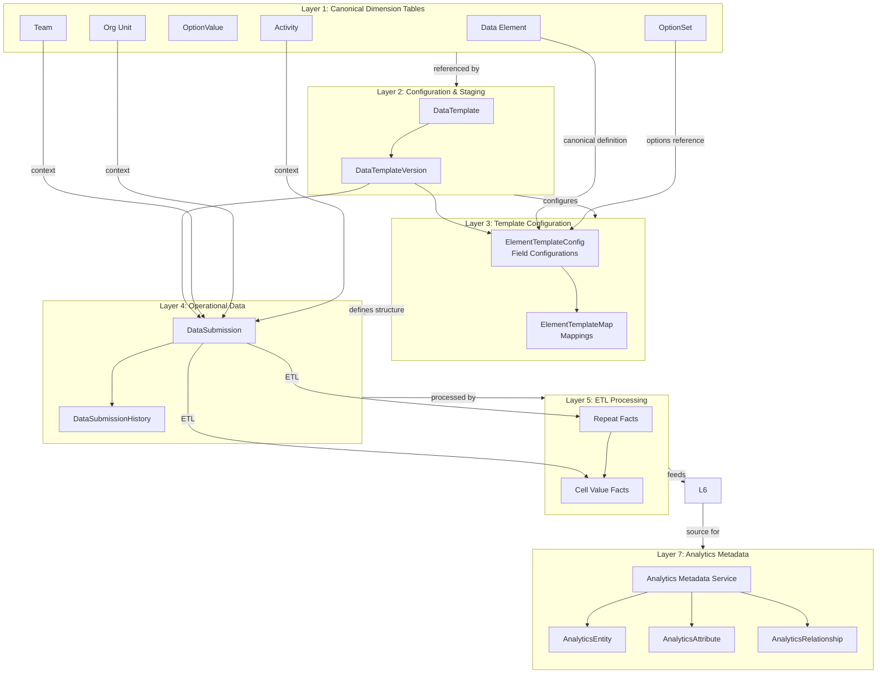
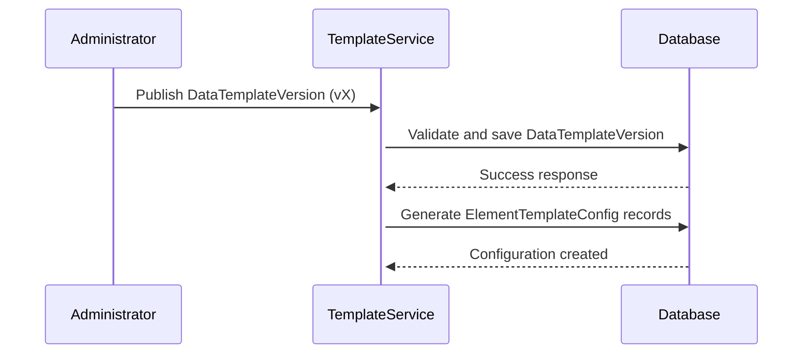
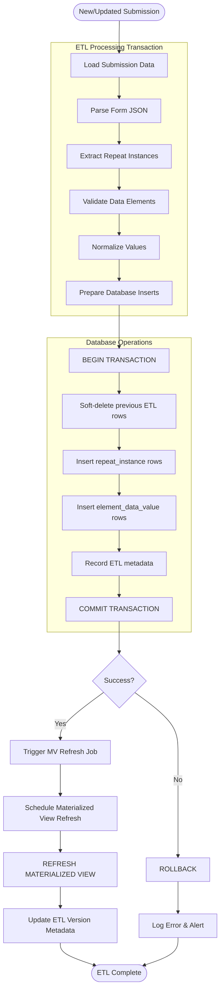
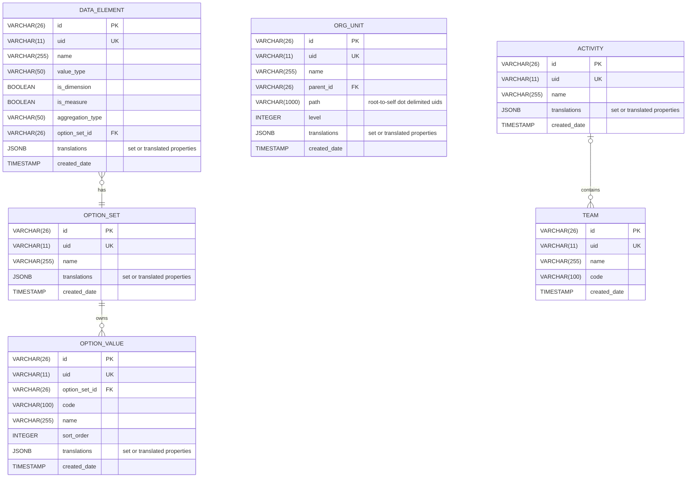
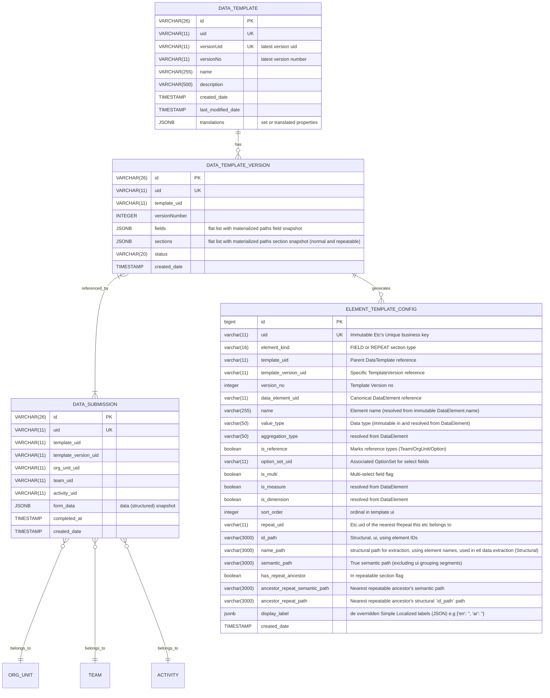
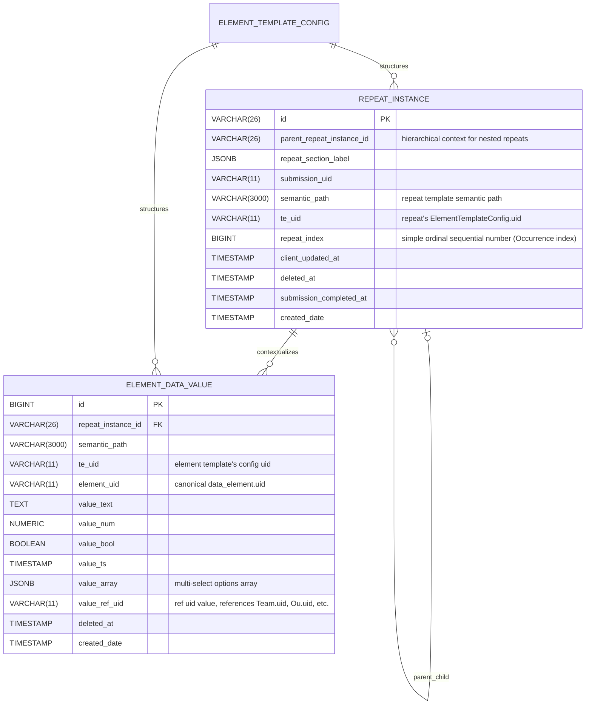

# Datarun: Key Architectural Principles & Diagrams

## Platform / Build dependencies

The current system is built upon:

* **Java 17+ (Spring Boot 3.4.2)**: A Maven-based project, initially generated with JHipster and extended.
* **PostgresSQL (tested with v16.x)**: Utilizes a compatible PostgreSQL JDBC driver.
* **Liquibase (XML)**: Used for managing schema migrations.
* **Spring Security & Application-level ACLs**: Integrated for security.
* **`jOOQ` & `NamedParameterJdbcTemplate`/`JdbcTemplate`**: Available for analytical queries.
* **Caching**: Employs Ehcache and Hibernate 2nd-level cache annotations where appropriate.
* **Mapping and Codegen Tools**: Lombok and MapStruct are used.
* **Testing**: Testcontainers (Postgres), JUnit 5, and AssertJ are used for testing.
* **User authentication**:  sending basic user's credentials and receiving Access/Refresh tokens.

## Foundational Design Principles

### 1. IDs, UIDs and business keys

* **id**: internal primary key (VARCHAR(26)) ULID format. Immutable, never recycled. Used for all foreign-key
  relationships.
* **uid**: short system generated business key (VARCHAR(11)), globally unique, stable across environments, used
  extensively in api client's requests and analytics for human-friendly references.

### 2. Immutability as the Bedrock of Integrity

**Principle:** Critical entities are immutable once published to prevent canonical drift

- **DataTemplateVersion:** Schema is locked upon publication
- **DataElement.valueType:** Semantic definition cannot change once in use
- **DataSubmission context:** template_uid and template_version_uid are immutable after creation

## System Architecture System Overview (Concept)

**Note:** Layer 8 API & Query Layer (metadata based, generation), is not fully implemented yet.

### Template Publishing Flow

### Ingestion ETL Process Flow

## Appendix

### 1. Initial Canonical Layer, Minimal ERD Diagrams

### 1. Data Capture Layer, Minimal ERD Diagrams

### 3. Ingestion stage 1 etl transformation (Structure, no semantics):

### Common Abbreviations Used Throughout The System

* `act`: Activity.
* `de`: DataElement.
* `ds`: DataSubmission.
* `dt`: DataTemplate.
* `dtv`: DataTemplateVersion.
* `etc`: ElementTemplateConfig
* `ops`: OptionSet.
* `ou`: OrgUnit.
* `ov`: OptionValue.
