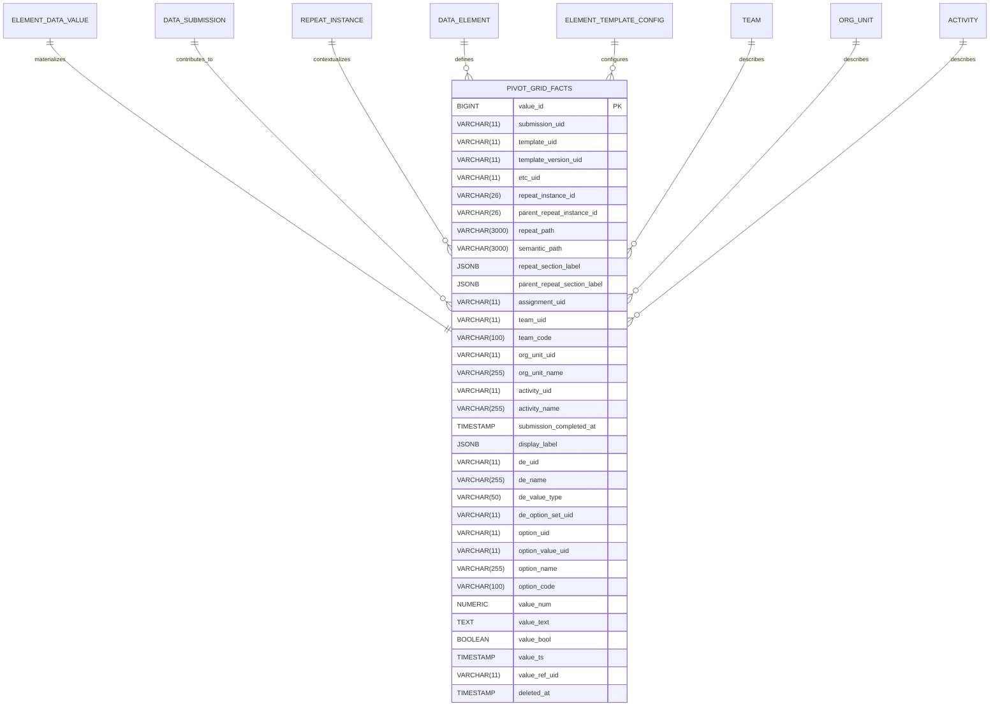

### 2. ANALYTICS CATCH ALL `PIVOT_GRID_FACTS` MV ERD

```mermaid
erDiagram
    PIVOT_GRID_FACTS {
        BIGINT value_id PK
        VARCHAR(11) submission_uid
        VARCHAR(11) template_uid
        VARCHAR(11) template_version_uid
        VARCHAR(11) etc_uid
        VARCHAR(26) repeat_instance_id
        VARCHAR(26) parent_repeat_instance_id
        VARCHAR(3000) repeat_path
        VARCHAR(3000) semantic_path
        JSONB repeat_section_label
        JSONB parent_repeat_section_label
        VARCHAR(11) assignment_uid
        VARCHAR(11) team_uid
        VARCHAR(100) team_code
        VARCHAR(11) org_unit_uid
        VARCHAR(255) org_unit_name
        VARCHAR(11) activity_uid
        VARCHAR(255) activity_name
        TIMESTAMP submission_completed_at
        JSONB display_label
        VARCHAR(11) de_uid
        VARCHAR(255) de_name
        VARCHAR(50) de_value_type
        VARCHAR(11) de_option_set_uid
        VARCHAR(11) option_uid
        VARCHAR(11) option_value_uid
        VARCHAR(255) option_name
        VARCHAR(100) option_code
        NUMERIC value_num
        TEXT value_text
        BOOLEAN value_bool
        TIMESTAMP value_ts
        VARCHAR(11) value_ref_uid
        TIMESTAMP deleted_at
    }

    ELEMENT_DATA_VALUE ||--|| PIVOT_GRID_FACTS: materializes
    DATA_SUBMISSION ||--o{ PIVOT_GRID_FACTS: contributes_to
    REPEAT_INSTANCE ||--o{ PIVOT_GRID_FACTS: contextualizes
    DATA_ELEMENT ||--o{ PIVOT_GRID_FACTS: defines
    ELEMENT_TEMPLATE_CONFIG ||--o{ PIVOT_GRID_FACTS: configures
    TEAM ||--o{ PIVOT_GRID_FACTS: describes
    ORG_UNIT ||--o{ PIVOT_GRID_FACTS: describes
    ACTIVITY ||--o{ PIVOT_GRID_FACTS: describes
```
