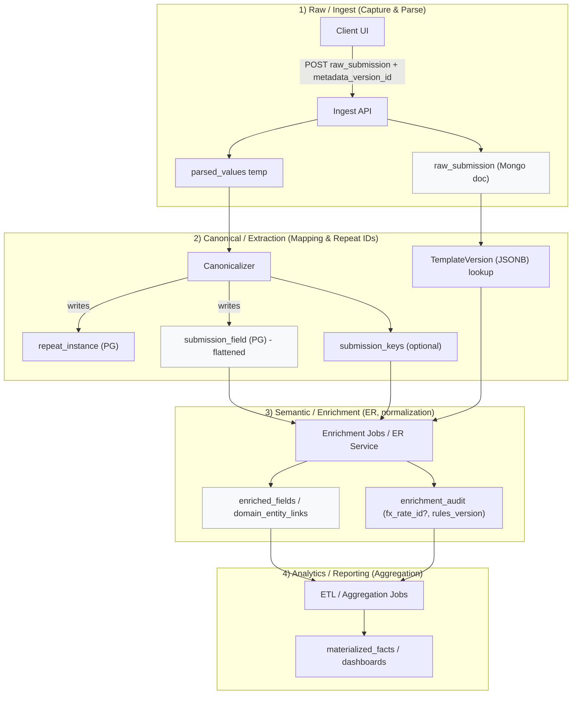

# Pipeline diagram & contracts (mermaid + quick legend)

Below is a one-page mermaid diagram of the pipeline (Raw → Canonical → Enrichment → Analytics) with the main artifacts and the minimal contract/provenance tokens passed between layers.

---

# Quick legend — artifacts & required contract fields

1. **raw_submission (immutable) — owner: Ingest**

    * Stored where: Document DB (Mongo)
    * Minimal required fields:

        * `submission_id` (UUID)
        * `template_id`
        * `template_version` / `metadata_version_id`
        * `capture_timestamp`
        * `user_id` / `user_role`
        * `capture_hint` (short tokens)
        * `raw_payload` (UI nested JSON)
    * Purpose: audit, replay, client round-trip.

2. **submission_field (canonical flattened row) — owner: Canonical**

    * Stored where: Postgres (JSONB/rows)
    * Minimal required fields:

        * `submission_id`
        * `element_id` (from ElementDescriptor)
        * `path` (semantic path)
        * `repeat_instance_id` (nullable)
        * `value_text` (raw)
        * `value_numeric` / `value_minor_units` (if applicable)
        * `currency_code` (if applicable)
        * `value_type` / `semantic_type`
        * `metadata_version_id`
    * Purpose: deterministic ETL, joins, reprocessing.

3. **repeat_instance — owner: Canonical**

    * Fields:

        * `repeat_instance_id`
        * `submission_id`
        * `repeat_path`
        * `client_rid` (optional)
        * `idx` (fallback)
    * Purpose: stable identity for repeated items.

4. **submission_keys (optional) — owner: Canonical/ER helper**

    * Fields:

        * `submission_id`
        * `key_type` (e.g., patient_id)
        * `key_value` (normalized)
        * `element_id`
        * `metadata_version_id`
    * Purpose: fast lookup for Entity Resolution.

5. **TemplateVersion / ElementDescriptor / RepeatDescriptor — owner: Template registry**

    * Fields:

        * `template_version_id`, `metadata_hash`, `metadata` (JSONB)
        * `element_catalog` rows: `element_id`, `path`, `type`, `semantic_type`, `sensitivity`, `validation`
        * `repeat_definition` rows
    * Purpose: authoritative mapping for canonicalization and reprocessing.

6. **enriched_fields / domain_entity_links — owner: Enrichment**

    * Fields:

        * `submission_id`, `element_id`, `normalized_value`, `domain_entity_id`
        * `enrichment_version_id`, `enrichment_audit` (rules used)
        * `fx_rate_id` if conversion occurred
    * Purpose: domain normalization, ER results, provenance for analytics.

7. **materialized_facts / dashboards — owner: Analytics**

    * Fields:

        * `aggregation_grain` (explicit)
        * `pipeline_version`, `enrichment_version_id`, `fx_rate_id`
        * computed KPIs / aggregates
    * Purpose: reporting; must reference provenance for reproducibility.

---

# Minimal contract rules (enforceable)

* **Every artifact must carry:** `submission_id`, `metadata_version_id` (template snapshot), timestamps, and producing service version (`ingest_version`, `enrichment_version`).
* **Canonicalizer must be deterministic** given `metadata_version_id` and produce stable `element_id` mappings; never depend on UI grouping.
* **Enrichment services must append (never overwrite) enrichment artifacts** and record `enrichment_version_id` and any external IDs (fx rates, vocab version).
* **Analytics must reference enrichment provenance** (enrichment_version_id, fx_rate_id) in materialized facts for reproducibility.

---

# One-paragraph callout (why this prevents accidental decisions)

Keep the ingest layer **minimal and deterministic** — parsing and small deterministic normalizations only. Push interpretations (grain, currency conversion, KPI definitions) to enrichment/analytics where rules are versioned and auditable. Contracts above (especially `metadata_version_id` + `element_id` + `service_version`) make it trivial to re-run and reproduce any decision downstream without mutating raw data.

---

Would you like this exported as a printable PDF or the mermaid image (SVG) embedded for documentation?
