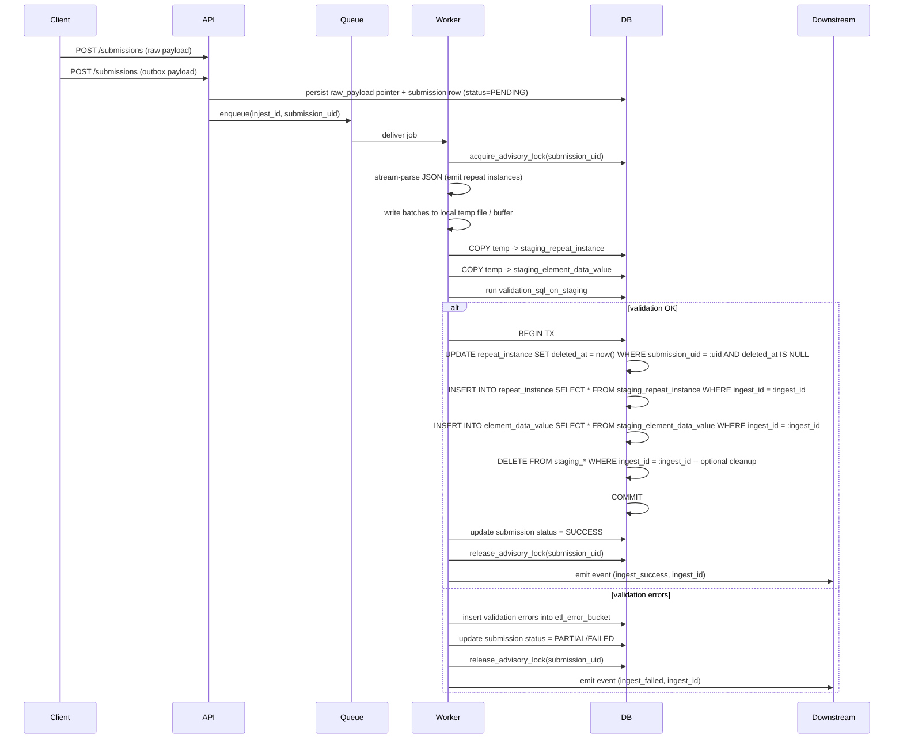

# ETL sequence diagram — ingestion worker playbook + metrics

Below you'll find a clear mermaid sequence diagram of a single-submission ingestion flow, followed by a step-by-step worker playbook with lightweight SQL pseudocode for staging & swap, and finally a compact set of Prometheus metrics + example PromQL queries and Grafana panel suggestions.

---

## Sequence diagram (mermaid)



---

## Worker playbook (step-by-step)

### 0) Preconditions

* `submission_uid` and `ingest_id` available.
* Raw payload persisted or accessible (S3, blob, or DB text).
* ElementTemplateConfig (ETC) metadata available to map nodes.

### 1) Claim & safety

* Try to acquire an advisory lock scoped to `submission_uid` (or worker queue claim).
* If lock can't be obtained within a short timeout, retry with exponential backoff or requeue.

**Why:** prevents two workers from racing to re-ingest the same submission.

### 2) Stream-parse & emit

* Use a streaming (SAX-like) JSON parser.
* On encountering a repeat start: create an in-memory object for that repeat instance (small footprint), assign a new ULID for `id`, record `etc_uid`, `semantic_path`, `repeat_index`, `parent_repeat_instance_id` (if nested), minimal `metadata` (ingest\_id, created\_by).
* On encountering primitive fields inside the repeat instance: append a value row to the current repeat's buffer as a plain tuple ready for COPY.
* When a repeat instance ends: flush the repeat and its value rows to the temporary buffer/file and discard in-memory structures.

**Buffering guideline:** flush every N instances or when buffer size reaches X MB (configurable).

### 3) Bulk write to staging

* Convert buffered rows to CSV/NDJSON lines and stream to DB using `COPY staging_repeat_instance FROM STDIN` and `COPY staging_element_data_value FROM STDIN` OR write to temporary staging files and run COPY from file.

**Staging row columns (recommendation):** include `ingest_id`, `submission_uid`, `staged_at`, all repeat\_instance columns plus the raw typed value columns for element\_data\_value.

### 4) DB-side validation (run lightweight SQL checks)

Run quick SQL checks against staging tables for this `ingest_id`:

* Cardinality check (example):

```sql
-- returns rows for repeat nodes missing min instances
SELECT sr.etc_uid, sr.semantic_path, (sr.count) as found, etc.repeat_cardinality->>'min' as min
FROM (
  SELECT semantic_path, etc_uid, COUNT(*) as count
  FROM staging_repeat_instance
  WHERE ingest_id = :ingest_id
  GROUP BY semantic_path, etc_uid
) sr
JOIN element_template_config etc ON etc.uid = sr.etc_uid
WHERE (etc.repeat_cardinality->>'min')::int > sr.count;
```

* Depth guard (example):

```sql
-- checks maximum parent chain length for staging rows
WITH RECURSIVE p AS (
  SELECT id, parent_repeat_instance_id, 1 AS depth
  FROM staging_repeat_instance
  WHERE ingest_id = :ingest_id AND parent_repeat_instance_id IS NULL
  UNION ALL
  SELECT s.id, s.parent_repeat_instance_id, p.depth + 1
  FROM staging_repeat_instance s
  JOIN p ON s.parent_repeat_instance_id = p.id
  WHERE s.ingest_id = :ingest_id
)
SELECT id FROM p WHERE depth > :max_depth LIMIT 1;
```

* Required fields check: ensure required child elements present for each repeat instance (simple left-join count check).

If checks return rows, insert error records into `etl_error_bucket` with `ingest_id`, `submission_uid`, `etc_uid`, `semantic_path`, `reason` and policy `fatal` or `flagged`.

### 5) Activation swap (short transaction)

If validation passes or after deciding to accept partial:

* Start a short DB transaction.
* Soft-delete previous active rows for the `submission_uid` (optionally scoped to `template_version`):

```sql
UPDATE repeat_instance
SET deleted_at = now(), deleted_by_ingest_id = :ingest_id
WHERE submission_uid = :submission_uid
  AND deleted_at IS NULL;

UPDATE element_data_value
SET deleted_at = now(), deleted_by_ingest_id = :ingest_id
WHERE submission_uid = :submission_uid
  AND deleted_at IS NULL;
```

* Insert from staging to production tables (use `INSERT INTO ... SELECT ... FROM staging WHERE ingest_id = :ingest_id`). Ensure FK integrity and indexes are in place for fast lookups.

Example:

```sql
INSERT INTO repeat_instance (id, submission_uid, etc_uid, semantic_path, parent_repeat_instance_id, repeat_index, metadata, created_at)
SELECT id, submission_uid, etc_uid, semantic_path, parent_repeat_instance_id, repeat_index, metadata, staged_at
FROM staging_repeat_instance
WHERE ingest_id = :ingest_id;

INSERT INTO element_data_value (id, repeat_instance_id, submission_uid, etc_uid, element_uid, semantic_path, value_text, value_num, created_at)
SELECT id, repeat_instance_id, submission_uid, etc_uid, element_uid, semantic_path, value_text, value_num, staged_at
FROM staging_element_data_value
WHERE ingest_id = :ingest_id;
```

* Commit transaction.

**Why short transaction?** avoids long-held locks and minimizes replication lag; heavy work was done in staging beforehand.

### 6) Post-process & cleanup

* Update `submission` row with `status=SUCCESS` and `ingest_id`.
* Emit an event/message that ingestion finished (for downstream jobs like domain reconciliation).
* Optionally, asynchronously delete staging rows or keep them for a short retention window for debugging and replay.

### 7) Error handling

* Fatal parse error: write payload to dead-letter store + `etl_error_bucket` and mark submission FAILED.
* Validation errors: write one or more `etl_error_bucket` records, set submission status to PARTIAL or FAILED depending on policy.
* Swap failure (transaction rollback): leave staging intact for diagnostics; re-try swap.

---

## Lightweight SQL DDL for staging (pseudocode)

```sql
CREATE TABLE staging_repeat_instance (
  ingest_id varchar,
  id varchar,
  submission_uid varchar,
  etc_uid varchar,
  semantic_path varchar,
  parent_repeat_instance_id varchar NULL,
  repeat_index int,
  metadata jsonb,
  staged_at timestamptz
);

CREATE TABLE staging_element_data_value (
  ingest_id varchar,
  id bigserial,
  repeat_instance_id varchar NULL,
  submission_uid varchar,
  etc_uid varchar,
  element_uid varchar,
  semantic_path varchar,
  value_text text,
  value_num numeric,
  value_bool boolean,
  value_ts timestamptz,
  staged_at timestamptz
);

-- small indexes to speed validation queries
CREATE INDEX idx_stg_repeat_ingest ON staging_repeat_instance (ingest_id, semantic_path);
CREATE INDEX idx_stg_val_ingest ON staging_element_data_value (ingest_id, repeat_instance_id);
```

---

## Prometheus metrics & Grafana panels (compact)

### Metric names to emit (recommended)

* `ingest_duration_seconds{service,worker}` (histogram)
* `ingest_repeat_count{service,template_version}` (gauge per-ingest)
* `ingest_error_total{service,error_type}` (counter)
* `staging_rows{service,table}` (gauge)
* `ingest_in_progress{service}` (gauge)
* `ingest_success_total{service}` (counter)
* `etl_deadletter_count{service}` (counter)

### Example PromQL queries

* **P95 ingest latency (last 5m)**

```
histogram_quantile(0.95, sum(rate(ingest_duration_seconds_bucket[5m])) by (le))
```

* **Error rate (errors / ingests) over 10m**

```
sum(rate(ingest_error_total[10m])) / sum(rate(ingest_success_total[10m]))
```

* **Recent failed ingests (count in last 1h)**

```
sum(increase(ingest_error_total[1h]))
```

* **Staging rows per table (current)**

```
staging_rows{service="ingest", table="staging_repeat_instance"}
```

* **Active ingests (workers currently processing)**

```
sum(ingest_in_progress) by (service)
```

### Grafana panels (suggested)

1. **Ingestion throughput** — timeseries of `ingest_success_total` / minute + error rate overlay.
2. **Latency histogram** — p50/p95/p99 from `ingest_duration_seconds`.
3. **Staging size** — gauge showing staging rows for repeat & value tables.
4. **Error table** — single-stat for `etl_deadletter_count` and drill-down link to recent `etl_error_bucket` rows (link to DB viewer or log explorer).
5. **DB health** — replication lag, DB connections, CPU; combine with ingestion error spikes.

### Alerts (examples)

* Alert if `error_rate > 2%` over 10 minutes.
* Alert if `p95_latency > 120s` over 5 minutes.
* Alert if `staging_rows` for a single ingest > X (e.g., 1M rows) — may indicate a pathological submission.

---

## Quick troubleshooting checklist (one-liners)

* If ingestion stuck: check advisory locks on `submission_uid` and worker logs for `ingest_id`.
* If staging tables grow: check for lingering staging rows (failed swap) and inspect `staging_rows` metric.
* If many partial failures: inspect `etl_error_bucket` grouped by `reason`.

---

If you want, I can now:

* Render this diagram as a PNG/SVG for architecture docs, or
* Produce the **detailed SQL files** for staging + swap and a shell script to run the COPYs, or
* Generate a sample Grafana dashboard JSON (panels + queries) you can import.

Which of those next?
