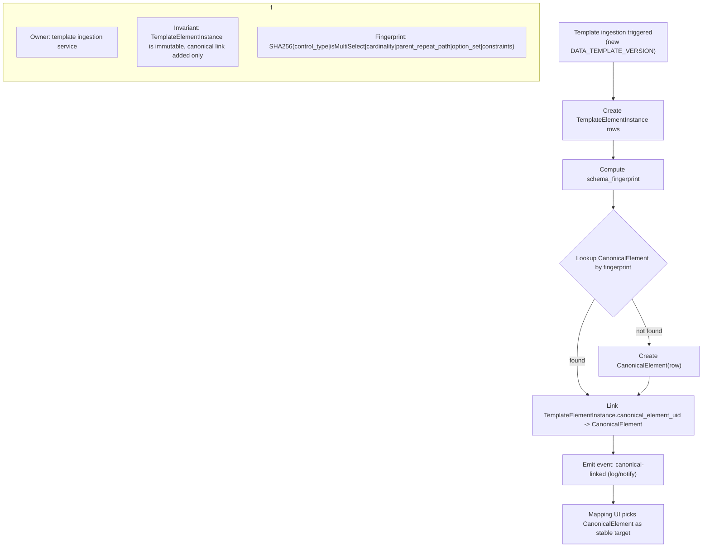
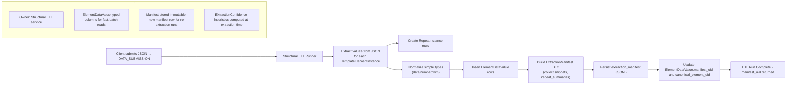
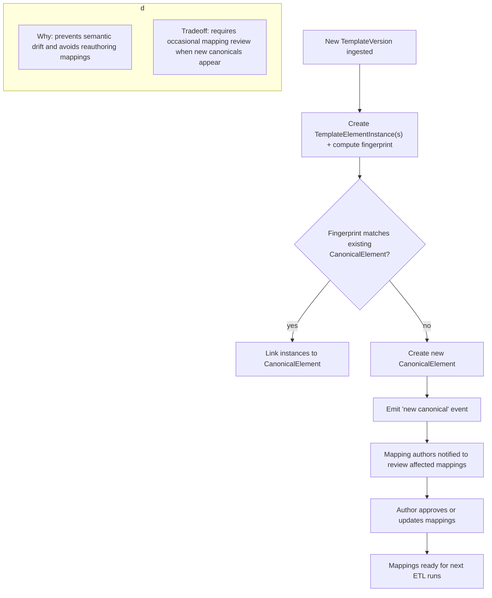
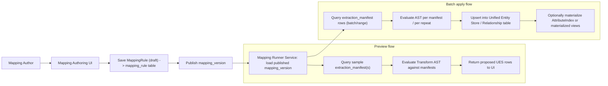
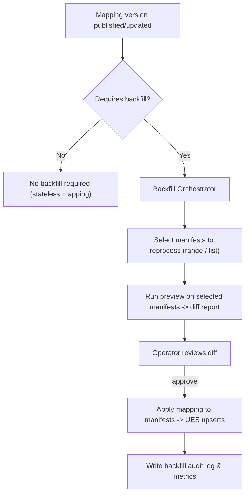

Nice — below are clear, production-grade lifecycle diagrams (Mermaid) for each artifact and the key processes that
produce/update them. I include a short narrative for each diagram that states ownership, lifecycle events, invariants
and important implementation notes you’ll need while wiring this into your services.

You can paste these Mermaid blocks into any Markdown preview that supports Mermaid (or into diagrams.net / Mermaid Live
Editor) to visualize the flows.

# TemplateElementInstance → CanonicalElement lifecycle

**Narrative**

* **Owner**: Template ingestion service (the code that runs when a `DATA_TEMPLATE_VERSION` is persisted).
* **When produced**: `TemplateElementInstance` rows are created on template version publish; `schema_fingerprint`
  computed immediately; `CanonicalElement` may be created if fingerprint unseen.
* **Invariants**: `TemplateElementInstance` is a per-template-version immutable record (for provenance).
  `CanonicalElement.schema_fingerprint` is unique. `TemplateElementInstance.canonical_element_uid` links to canonical.
* **Idempotency**: lookup-or-create must be atomic (`INSERT ... ON CONFLICT` or transaction with `SELECT FOR UPDATE`) to
  avoid duplicate canonicals.

---

# Structural ETL → ExtractionManifest → ElementDataValue & RepeatInstance

**Narrative**

* **Owner**: Structural ETL (extraction) service.
* **When produced**: For each `DATA_SUBMISSION` processed, ETL produces `RepeatInstance` entries, `ElementDataValue`
  typed rows, and a single `ExtractionManifest` JSONB row (timestamped).
* **Invariants**:

    * Each `ElementDataValue` links to `template_element_uid` and (after link) `canonical_element_uid`.
    * Manifest contains `repeat_summaries` with `repeat_instance_id` values that correspond to
      `ElementDataValue.repeat_instance_id`.
    * `value_normalized` and typed value columns obey type consistency (if `is_null` true then typed values null).
* **Implementation note**: Persist manifest first (or within same transaction) and write `manifest_uid` into EDV rows;
  for large EDV batches write in chunks.

---

# CanonicalElement / TemplateElement change detection & mapping review flow

**Narrative**

* When templates change, fingerprints detect semantic changes (e.g., moved into/out of repeat, multi-select changed,
  control type changed).
* New canonicals prompt mapping authors to verify mappings (or mapping UI can auto-suggest the prior canonical if
  semantic match near).

---

# Mapping runner & downstream usage (preview & batch apply)

**Narrative**

* Preview uses `extraction_manifest` DTOs so authors get fast dry-runs with provenance. No raw JSONB scan needed.
* Batch apply consumes `extraction_manifest` + `ElementDataValue` as input (for historical loads or incremental).
* Mapping Runner must record `mapping_version_uid` in `attribute_provenance` when writing UES rows.

---

# Backfill / Reprocessing flow (mapping change impact)

**Narrative**

* Mapping changes that affect DDE semantics should trigger a backfill with dry-run reports. Use `manifest_uid` lists to
  scope backfills and run incremental batches.

---

# Artifact state & lifecycle quick-reference table

| Artifact                |                         Owned By | Created When                 | Updated When                         |                  Immutable? | Key Invariants                                          |
|-------------------------|---------------------------------:|------------------------------|--------------------------------------|----------------------------:|---------------------------------------------------------|
| TemplateElementInstance |               Template ingestion | new template version         | never (except set canonical link)    | Yes (except canonical link) | `uid`, `template_version_uid`, `name_path` stable       |
| CanonicalElement        | Template ingestion/canonicalizer | first time fingerprint seen  | metadata (notes, candidates)         |                      Mostly | `schema_fingerprint` unique                             |
| schema\_fingerprint     |               Template ingestion | computed on create           | recompute on reingest only           |                         N/A | Deterministic from canonicalized fields                 |
| ExtractionManifest      |                   Structural ETL | every ETL run per submission | new manifest on re-extract           |                         Yes | `elements[]` reference existing TemplateElementInstance |
| RepeatInstance          |                   Structural ETL | per extraction run           | new on re-extract                    |          Yes (per manifest) | ordinal\_index >=0; parent links valid                  |
| ElementDataValue        |                   Structural ETL | per extracted value          | new on re-extract or additional runs |               No (new rows) | typed value columns consistent; linked to manifest      |
| ElementStats            |                        Stats job | periodic                     | periodic                             |      Overwritten per window | sample\_count > 0 when present                          |
| CodeList                |                            Admin | on code-list creation        | on code-list update (new version)    |                   Versioned | version immutability                                    |

---

# Important invariants & engineering rules (summary)

* **Separation of concerns**: Extraction = structural parsing + deterministic normalization + provenance. No business
  mapping, identity merging, or dedup here.
* **Provenance everywhere**: Every EDV and manifest includes `submission_uid`, `template_version_uid`, and
  `template_element_uid` (and `manifest_uid`) so higher layers can always trace to original source.
* **Canonicalization**: Fingerprint formula must be identical between the DB backfill SQL and the Java compute function.
  Keep unit tests to enforce parity.
* **Idempotency**: Manifests are immutable rows; re-extraction produces a new manifest row. TemplateElement
  canonicalization must be idempotent (lookup-or-create).
* **Repeat handling**: RepeatInstance ids are stable per manifest; mapping runner uses `repeat_instance_id` to apply
  repeat-scoped rules.
* **Performance**: For bulk loads use COPY for EDV inserts; GLUE JPA for metadata only.

---

If you want I can now:

* produce PNG/SVG exports of these Mermaid diagrams (if your tool requires), or
* produce a single combined Mermaid diagram that shows *end-to-end* (template ingestion → extraction → mapping → UES) in
  one view (might be very wide), or
* convert the diagrams into developer-facing sequence diagrams (Mermaid sequence) for each process for implementation
  tasks.

Which one next?
