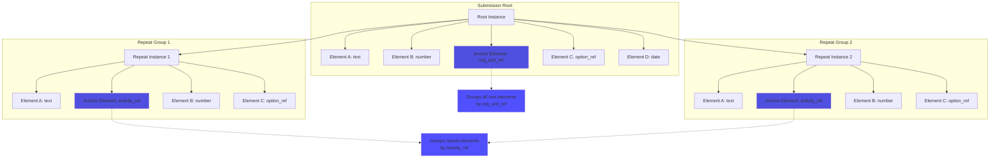
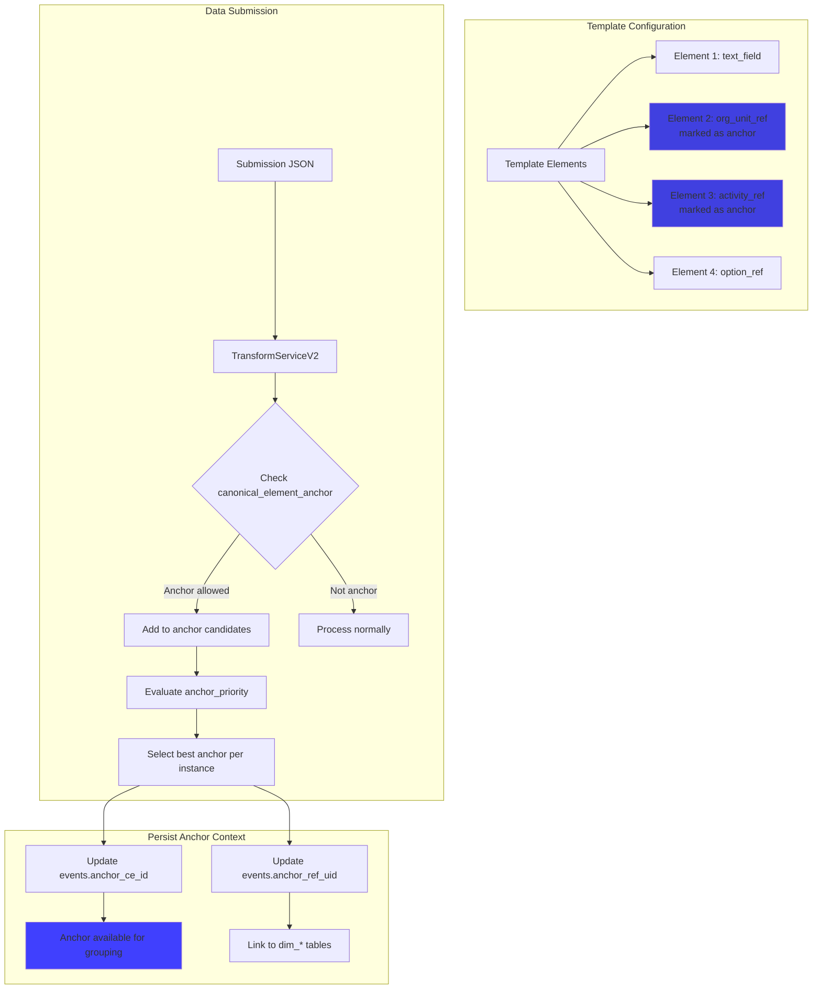
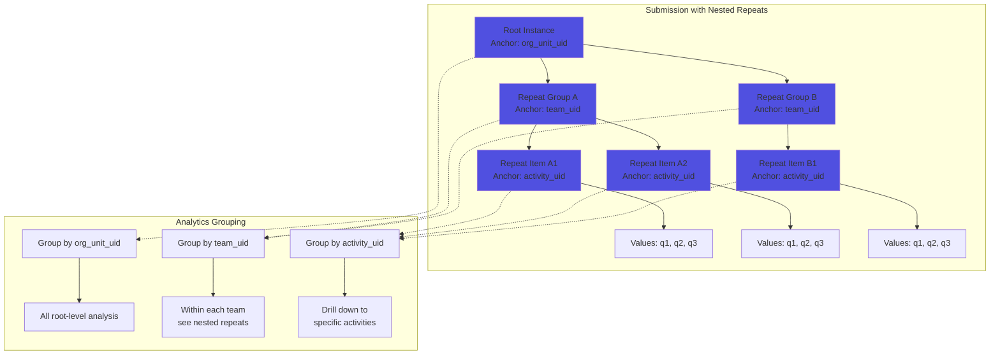
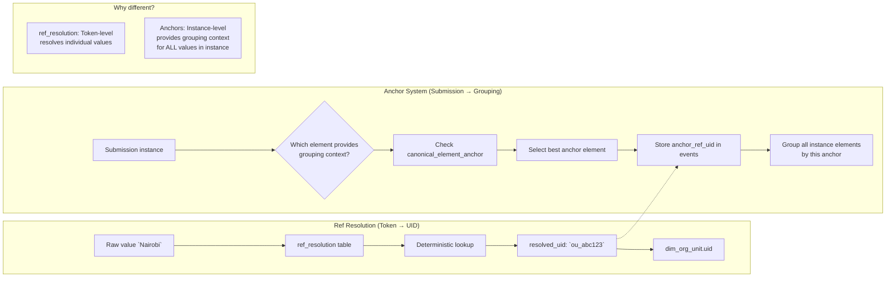
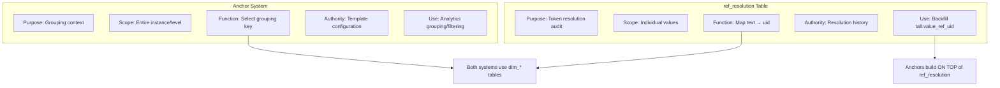
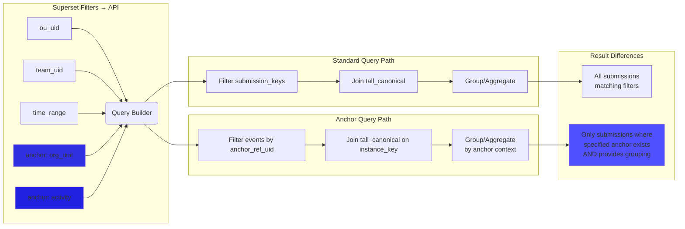

## 1. **Anchor Concept: Within-Submission Grouping Elements**

### 2. **Anchor Configuration & Selection Flow**

## 3. **Hierarchical Anchor Grouping**

## **`ref_resolution` And Anchors**

## 4. **Anchor vs ref_resolution: Complementary Systems**

```mermaid
flowchart TD
    subgraph "Data Flow"
        A[Submission JSON] --> B[TransformServiceRobust]
        B --> C[tall_canonical rows]
        C --> D[RefResolutionService]
        D --> E[Resolve ref values]
        E --> F[Update tall.value_ref_uid]
        
        C --> G[TransformServiceV2]
        G --> H[Identify anchor candidates]
        H --> I[Select best anchor]
        I --> J[Update events.anchor_ref_uid]
    end
    
    subgraph "Anchor-Specific Processing"
        K[Check canonical_element_anchor] --> L[anchor_allowed?]
        L --> M[Yes: Consider for anchor]
        L --> N[No: Skip for anchor]
        
        M --> O[Evaluate anchor_priority]
        O --> P[Compare with other candidates]
        P --> Q[Select highest priority<br/>non-null anchor]
    end
    
    subgraph "Analytics Usage"
        R[Query for submissions] --> S{Group by?}
        S -- Standard --> T[submission_keys dims]
        S -- Anchor-based --> U[events.anchor_ref_uid]
        
        U --> V[Join to dim tables<br/>via anchor_ref_uid]
    end
    
    style Q fill:#1212e0
    style U fill:#2020fe
```

## **Key Differences Summary:**

## 5. **Analytics: Anchor vs Standard Filtering**

