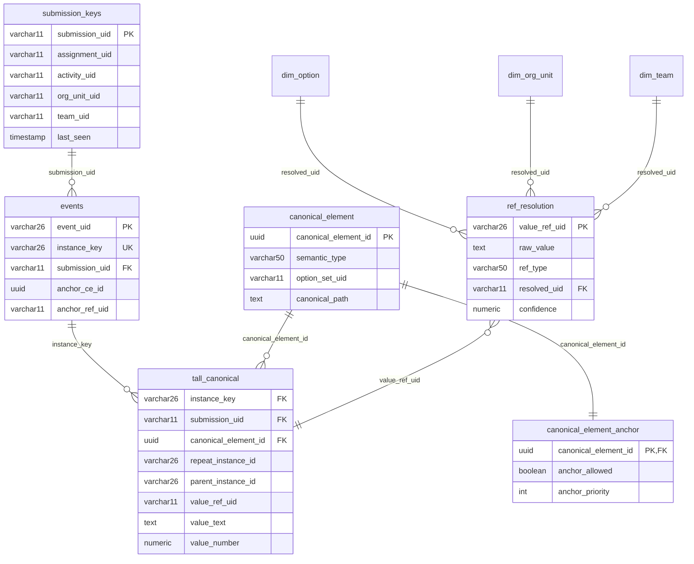
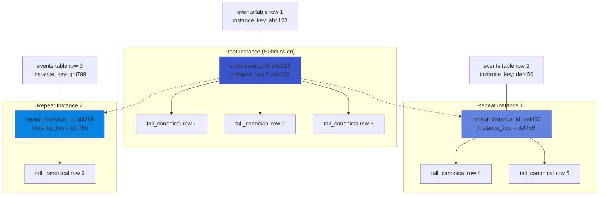
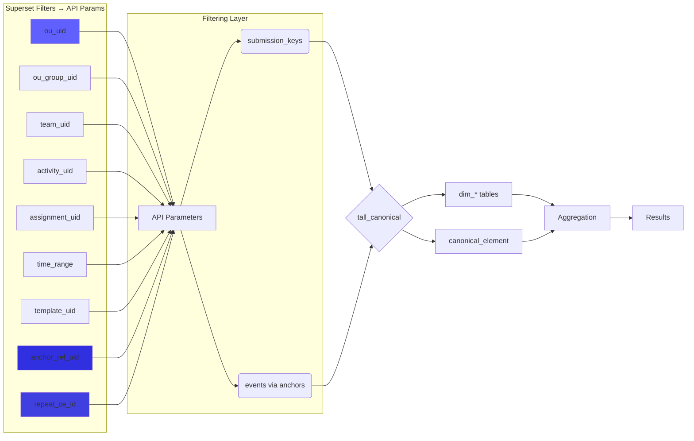
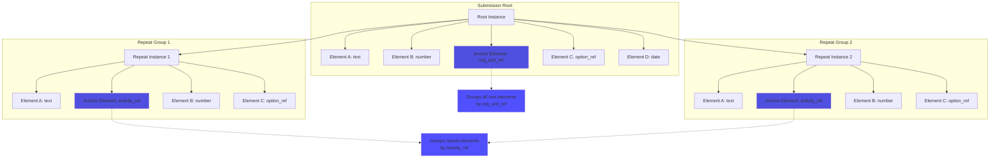
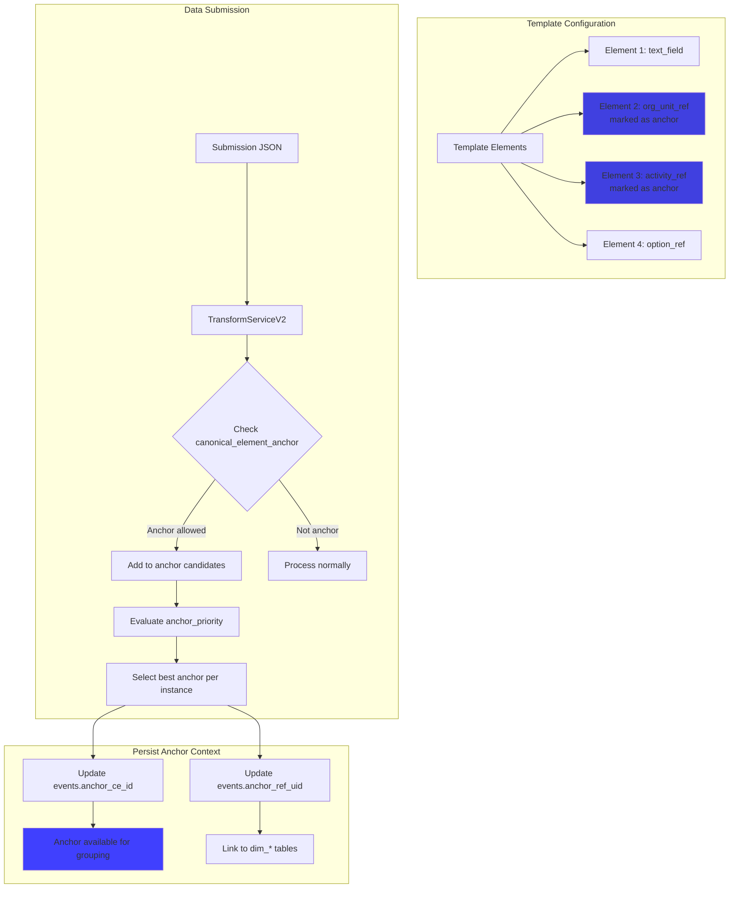
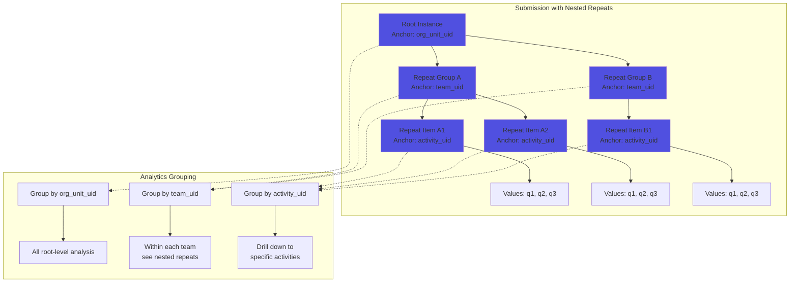

# Authoritative Model Description

This document is the authoritative source for the model used by the ETL/analytics pipeline. It describes table schemas,
key types, service responsibilities, and deterministic behaviors used by transforms, resolution, and event anchoring.

---

## Platform / Build dependencies

* **Java 17+ (Spring Boot 3.4.2)**: A Maven-based project.
* **PostgresSQL (tested with v16.x)**: Utilizes a compatible PostgresSQL JDBC driver.
* **Liquibase (XML)**: Used for managing schema migrations.
* **`jOOQ` & `NamedParameterJdbcTemplate`/`JdbcTemplate`**: Available for analytical queries.
* **Caching**: Employs Ehcache and Hibernate 2nd-level cache annotations where appropriate.
* **Mapping and Codegen Tools**: Lombok (preferred for compactness and brevity) and MapStruct are used.

## Key primitive types and lengths

* `submission_uid`: `varchar(11)` (external short id used in submissions)
* `submission_id`: `varchar(26)` (internal ULID for submission records)
* `instance_key`: `varchar(26)` (ULID; equals `submission_uid` for root, `repeat_instance_id` for repeats)
* `value_ref_uid`: canonical 11-char UIDs for values of reference type i.e referencing a canonical entity in the system
  `ce.semantic_type` = one of `Option`, `OrgUnit`, `Team`, `Activity`, it would have the resolved `option_uid`,
  `org_unit_uid`, `team_uid`, etc. already resolved upstream.
* `canonical_element_id`: `uuid` (deterministic id derived from template_uid + canonical_path + data_type +
  semantic_type)

---

## Tables (concise spec)

### analytics.submission_keys

* Purpose: small denorm one-row-per-submission for fast grouping/filters.
* PK: `submission_uid (varchar11)`.
* Columns: `submission_id (varchar26)`, `assignment_uid (varchar11)`, `activity_uid (varchar11)`,
  `org_unit_uid (varchar11)`, `team_uid (varchar11)`, `template_uid (varchar11)`, `last_seen`, `created_at`,
  `updated_at`.
* Indexes: `activity_uid`, `org_unit_uid`, `team_uid`.

### analytics.events

* Purpose: canonical instance registry (root or repeat) with anchors.
* PK: `event_uid (varchar26)`, unique `instance_key (varchar26)`.
* Columns: `instance_key`, `event_type` (`root`|`repeat`), `submission_uid`, `submission_id`, `assignment_uid`,
  `activity_uid`, `org_unit_uid`, `team_uid`, `template_uid`, `submission_creation_time`, `start_time`, `last_seen`,
  `created_at`, `updated_at`.
* Anchor columns: `anchor_ce_id uuid`, `anchor_ref_uid (varchar11)`, `anchor_value_text (text)`,
  `anchor_confidence (numeric(5,4))`, `anchor_resolved_at (timetamp)`.
* Indexes: unique(instance_key), `(anchor_ce_id, anchor_ref_uid)`, `submission_uid`.

### analytics.tall_canonical

* Purpose: EAV tall attribute store (one row per attribute instance).
* Uniqueness: unique constraint on `(instance_key, canonical_element_id)` for idempotent upserts.
* Important columns: `instance_key (varchar26)`, `submission_uid (varchar11)`, `submission_id (varchar26)`,
  `canonical_element_id (uuid)`, `element_path`, `repeat_instance_id`, `parent_instance_id`, `repeat_index`, typed
  values `value_text` (store all type of values), `value_number` (values numeric types also available here),
  `value_json` (values of List<String> i.e multi-select choices, or other json type values are stored only here),
  `value_ref_type` (if value of ref type i.e ce.semantic_type=Option, OrgUnit, Team, etc, in addition to storing the raw
  value in value_text,  `value_ref_uid` will store the resolved uid of the entity),
  `is_deleted`, provenance (`outbox_id, ingest_id, created_at, updated_at`, `submission_creation_time`, `start_time`).
* Joins: `tall_canonical.instance_key -> events.instance_key` for instance joins;
  `tall_canonical.value_ref_uid -> dim_*` for resolved refs.

### analytics.ref_resolution

* Purpose: authoritative audit and cache of raw token → canonical uid resolutions.
* PK: `value_ref_uid (varchar)`.
* Columns: `raw_value (text)`, `raw_source (varchar100)`, `ref_type (varchar50)` (e.g., `option`, `orgunit`, `team`,
  `activity`, `assignment`), `resolved_uid (varchar11)`, `confidence numeric(5,4)`, `resolved_at (timetamp)`,
  `replaced_by (varchar26)`, `notes`, `created_at`, `updated_at`.
* Indexes: `(raw_value, ref_type)`, `(resolved_uid)`.

### public.canonical_element (ce)

* Purpose: canonical metadata for elements.
* PK: `canonical_element_id (uuid)` deterministic from template+path+types.
* Key attrs: `semantic_type` (e.g., `option`, `orgunit`, `team`, `activity`, `assignment`), `option_set_uid`,
  `canonical_path`, `data_type`.
* Treated as stable/immutable; used to map element → semantic handling.

### public.canonical_element_anchor (cea)

* Purpose: 1:1 auxiliary config for ce used as anchors.
* PK/FK: `canonical_element_id` → `canonical_element.canonical_element_id`.
* Columns: `anchor_allowed boolean`, `anchor_priority int` (smaller = higher priority), `updated_by`, `updated_at`.

### analytics.dim_* (dim_option, dim_org_unit, dim_team, ...)

* Purpose: canonical dimension/dict tables. Keys are `*_uid (varchar11)` and include codes / names / option_set links.
* Used by `RefResolutionService` for deterministic lookup and by analysts via joins.

---

## Service responsibilities & deterministic behaviors

### TransformServiceRobust

* Pure JSON traversal: accepts `JsonNode root` and a **List<TemplateElement>** (template element descriptions with
  `jsonDataPath`) and produces `List<TallCanonicalRow>` without side effects. This component strictly expects
  `TemplateElement` objects (not CE).

### TransformServiceV2

* Calls `TransformServiceRobust` (with `TemplateElement` list), then:

    1. Upserts `submission_keys` for the submission root (idempotent).
    2. For each tall row: determines CE id, inspects CE metadata and `cea` to decide if the element is a ref/anchor
       candidate.
    3. For ref-type elements (`option`, `orgunit`, `team`, `activity`, `assignment`) calls
       `RefResolutionService.resolve(...)` to get `(resolvedUid, confidence, resolvedAt)` and sets
       `tall.value_ref_uid` + `tall.value_ref_type`.
    4. Collects anchor candidates per `instance_key` (repeat or root) when `anchor_allowed=true` for the CE.
    5. Writes an `events` row for every observed `instance_key` (root + repeats). If candidates exist, chooses best
       candidate and sets anchor fields; otherwise upserts a row with null anchors (instance registry).
    6. Returns enriched tall rows for persistence to `tall_canonical` (caller persists with idempotent upsert).

### RefResolutionService (deterministic v1 behavior)

* Behavior: (1) check in-process cache, (2) lookup `ref_resolution` latest row for `(raw_value, ref_type)`, (3) if
  absent perform deterministic dim lookup via `dim_*` repo methods (optionSet-aware for options), (4) persist a
  `ref_resolution` row (including misses with `resolved_uid=NULL` and confidence=0), (5) return
  `Resolution(resolvedUid, confidence, resolvedAt)`.

---

## Relational model and join patterns (concise)

* `instance_key` is the canonical join column linking `tall_canonical` <-> `events`. For submission root
  `instance_key == submission_uid`. Repeats have `repeat_instance_id` stored in tall rows and used as `instance_key`.
* For submission-level dashboards use `submission_keys` (one-row) for filters and joins. For attribute-level or
  repeat-aware queries join `tall_canonical` → `events` by `instance_key`.
* Use `tall.value_ref_uid` to join to `dim_*` for analyses that require canonical dimensions instead of fragile text
  matching.

---

## Appendix

### 2. **Core Database Schema Relationships**

Visualizes how main tables relate:

### 2. **Instance Identity Model**

Clarifies the `instance_key` concept and relationships:

### 3. **Analytics Query Pattern**

Shows how typical queries join tables:

### 4. **Anchor Concept: Within-Submission Grouping Elements**

### 2. **Anchor Configuration & Selection Flow**

### 4. **Hierarchical Anchor Grouping**

