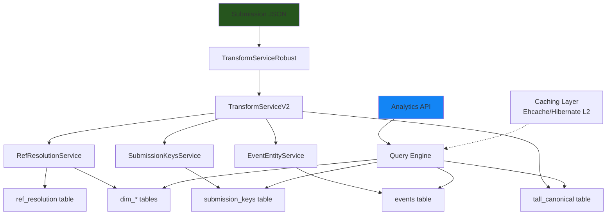
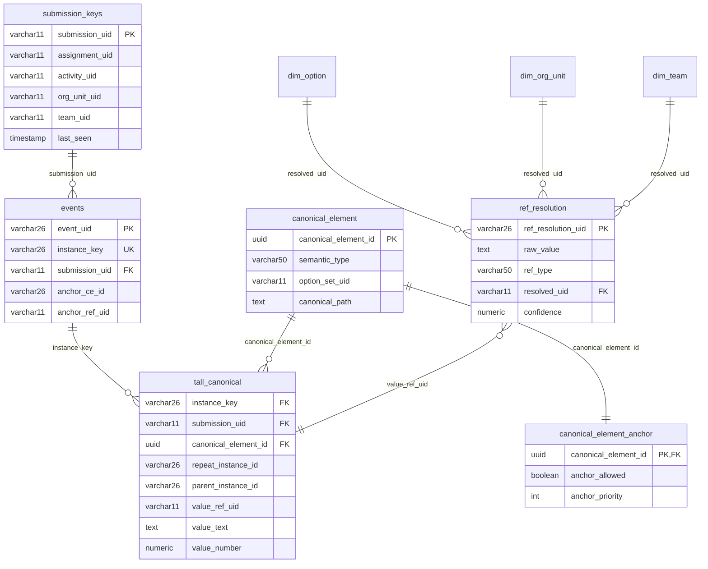
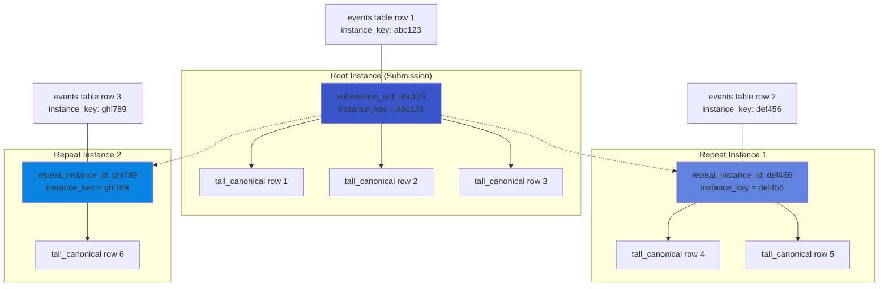
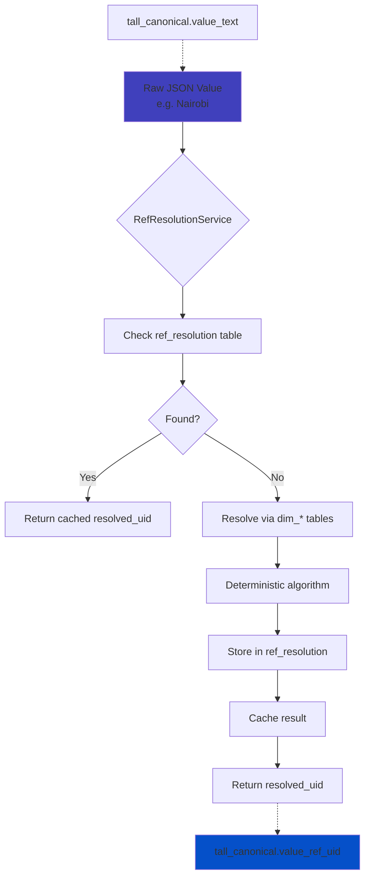
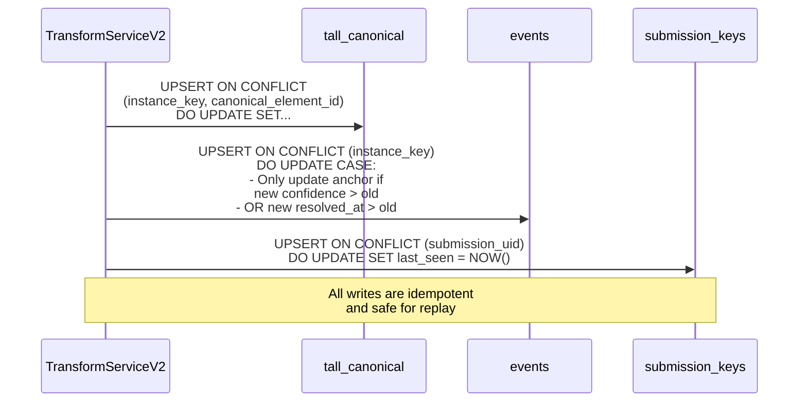
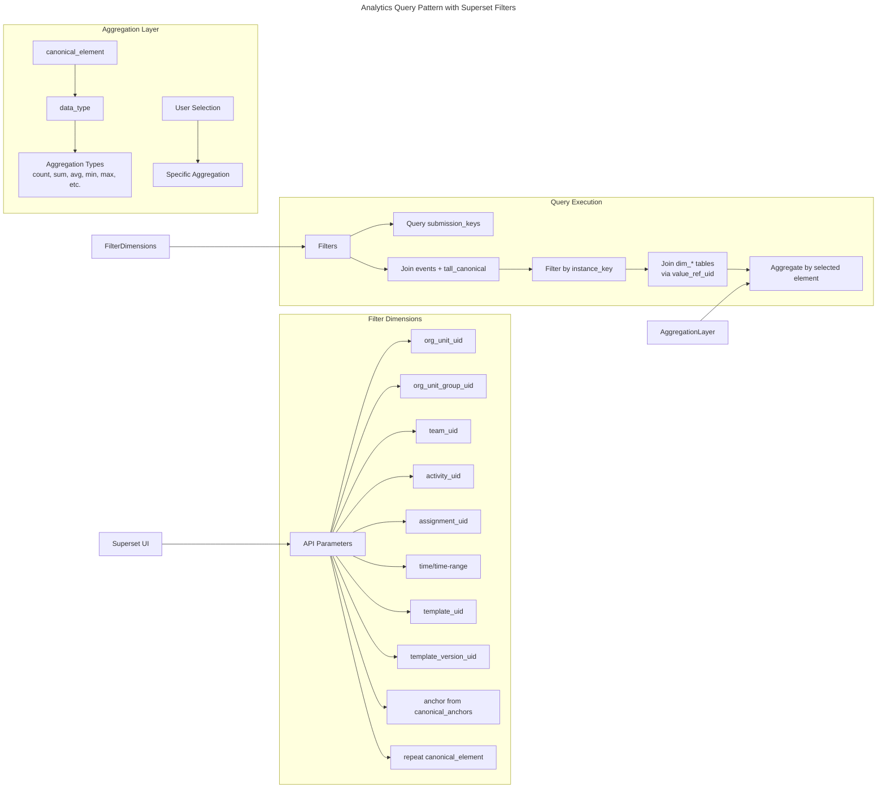
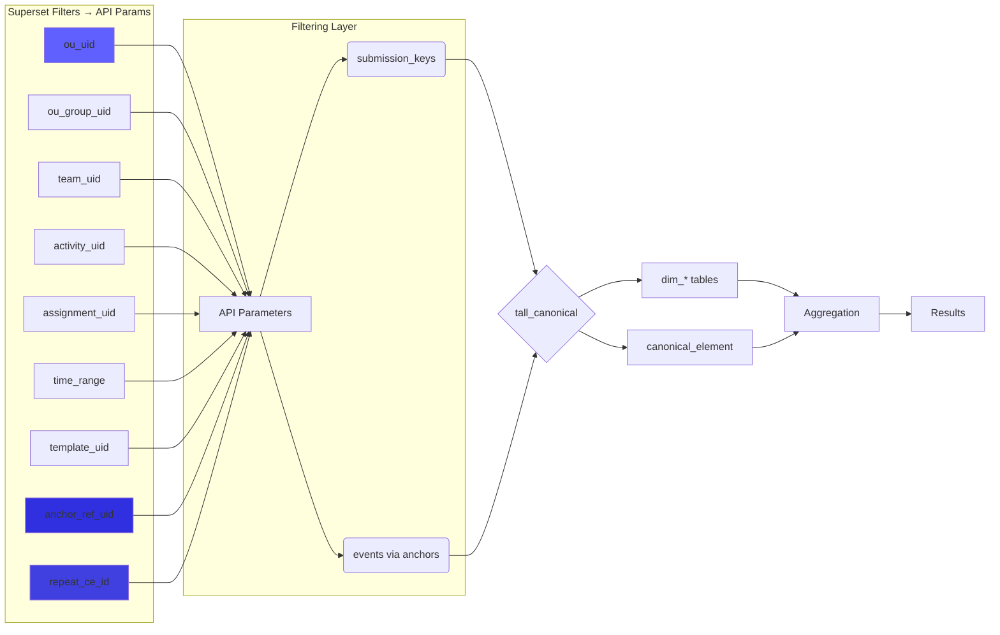
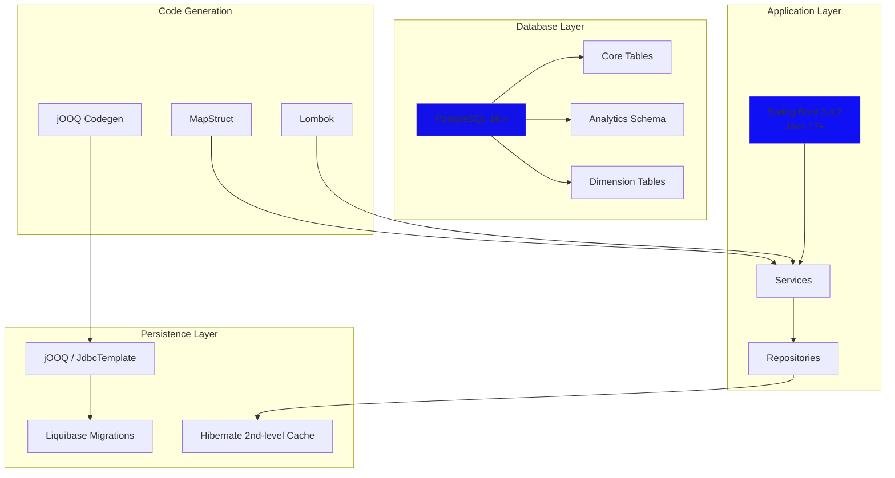

## Appendix
### 1. **System Architecture Diagrams**
Shows how components interact at a high level:

## 2. **Core Database Schema Relationships**
Visualizes how main tables relate:

## 3. **Instance Identity Model**
Clarifies the `instance_key` concept and relationships:

## 4. **Reference Resolution Flow**
Shows how tokens get resolved to canonical UIDs:

## 5. **Idempotent Write Process**
Visualizes the upsert logic:

## 6. **Analytics Query Pattern**
Shows how typical queries join tables:

## 7. **Technology Stack Layers**

