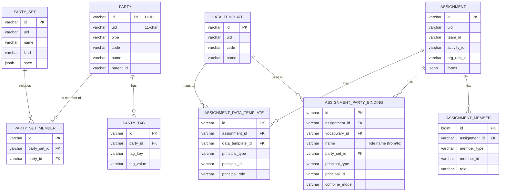
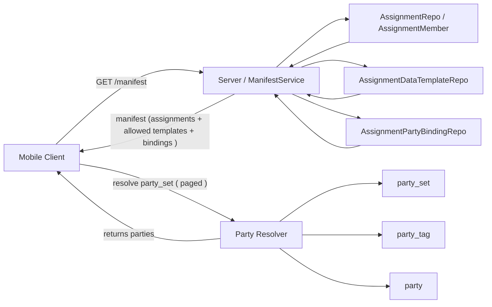
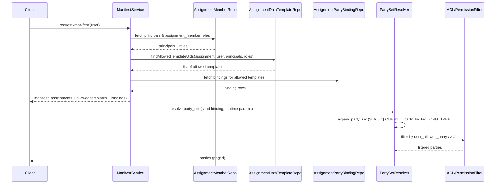
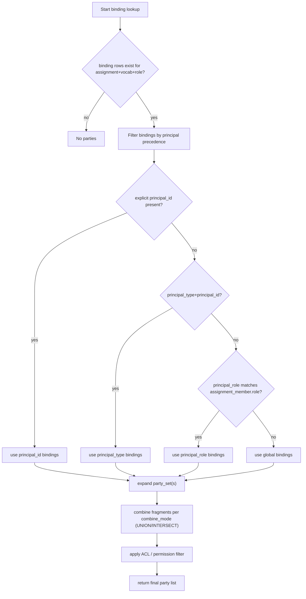

# Current model — final snapshot (concise)

## Entities & purpose

* **party** — registry of selectable actors/locations (types: ORG_UNIT, TEAM, USER, EXTERNAL, etc.). Minimal canonical
  fields: `id, uid, type, code, name, parent_id`.
* **party_tag** — normalized tags for `party` (`party_id, tag_key, tag_value`) used for admin-friendly grouping and
  dynamic queries.
* **party_set** — named set of parties used by bindings. Kinds:

    * `STATIC` — explicit `party_set_member` rows.
    * `ORG_TREE` — recursive subtree (rare for our usage).
    * `QUERY` — dynamic; `spec.sqlKey='party_by_tag'` or other server-side safe queries; accepts runtime params.
* **assignment** — context window for data collection (activity + scope). Holds `forms` (template UIDs) as base list.
* **assignment_member** — membership rows for assignment (who can act). Columns:
  `assignment_id, member_type (USER|TEAM|USER_GROUP), member_id, role, valid_from, valid_to`. This is the first gate: if
  no member row → stop.
* **assignment_data_template** — controls which `data_template` (vocabulary/form) is visible/usable inside an assignment
  for specific principals. Scoped by `principal_type/principal_id` or `principal_role`. Global rows (no principal
  fields) mean visible to all assignment members.
* **assignment_party_binding** — maps `(assignment, data_template, role_name)` → `party_set`. Can be principal-scoped (
  principal_type/principal_id) for overrides. Also has `combine_mode` (UNION / INTERSECT).
* **data_template** — form definition (fields, repeat blocks). Fields referencing parties use role labels (e.g., `from`,
  `to`) and rely on bindings to resolve allowed parties.

## Key config patterns

* Use **one assignment per activity** (per MU) where possible; add `assignment_member` rows for teams/users.
* Use `assignment_data_template` to hide templates per principal (team/user/role) — prefer using
  `assignment_member.role` values to group principals and reduce rows.
* Use a **single reusable QUERY `party_set`** (sqlKey = `party_by_tag`) that resolves parties by tags; pass runtime
  params (teamUid, activityUid) to get intersections (AND semantics). Use STATIC sets only for small curated lists (
  campaign warehouses).

## Resolution & runtime flow

1. **Client manifest** request: server builds manifest per user by:

    * collecting principals (user id, team ids, user_group ids),
    * collecting `assignment_member` roles for each assignment,
    * calling `AssignmentDataTemplateRepository.findAllowedTemplateUids(assignmentId, userId, principalIds, userRoles)`
      to compute visible templates (intersect with `assignment.forms`),
    * returning assignments + only allowed templates + bindings for those templates.
2. **Party resolution** for a role in a template:

    * Resolver loads matching `assignment_party_binding` rows (respecting principal precedence: explicit principal_id →
      principal_type+id → principal_role → global),
    * For each binding, expand `party_set` per its kind:

        * `STATIC`: read members,
        * `QUERY`: run server-side `party_by_tag` with runtime params (tags from spec + client context) to get parties,
        * `ORG_TREE`: expand subtree if used.
    * Combine fragments according to `combine_mode` (UNION/INTERSECT) and apply permission filter (user_allowed_party /
      ACL) if configured.
3. **Client behavior**:

    * Sync manifest → fetch templates → resolve required party_sets (paged) → cache locally.
    * Use role-dependent pickers; on `from` selection pass value as runtime param when resolving `to` if `to` uses QUERY
      cascade.
4. **Submission validation (server-side, mandatory)**:

    * Re-check `assignment_member` membership and `assignment_data_template` visibility for the principal.
    * Re-resolve `assignment_party_binding` for submitted `from`/`to` and confirm submitted party ids are allowed.
    * Persist submission snapshot; pass submission to ledger/processing pipeline if validated.

## Precedence & deduplication rules

* **Template visibility precedence:** explicit `principal_id` → `principal_type+id` → `principal_role` → global.
* **Binding precedence:** same ordering for matching binding rows; combine multiple matched bindings per `combine_mode`.
* **Role grouping:** use `assignment_member.role` to assign teams/users to logical roles (e.g., `issuing`, `reporter`)
  and map templates to roles in `assignment_data_template` to avoid many per-principal rows.

## Admin ergonomics

* Tag parties (`party_tag`) for flexible team/activity scoping; build `party_by_tag` QUERY party_set once and reuse with
  runtime params.
* Use STATIC sets for ephemeral campaign lists if admins want explicit curated members.
* Admin UI should allow: preview of party_set results, mapping roles → templates, and principal overrides for bindings.

---

## Diagrams

Below are four compact Mermaid diagrams:

- ER (data model).
- Manifest flow.
- Party resolution sequence.
- and Binding precedence.

Paste these ` ```mermaid ... ``` ` blocks where you need them.








