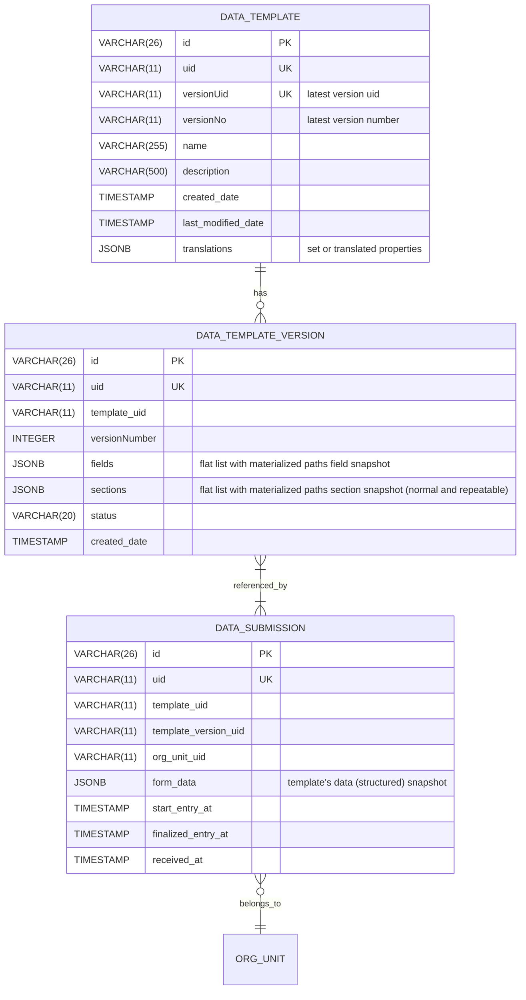

# Layered architecture — responsibilities, minimal artifacts, and structural classification

Below I give a compact, prescriptive model we can use immediately. For each layer (Raw → Bronze → Silver → Gold → Diamond) I list:

1. **Responsibility** — what this layer must guarantee.
2. **Minimal artifacts** — the concrete artifacts (tables/documents/messages) the layer must produce/own.
3. **Minimal structural classification properties** — the required fields/shape and the small set of classification/metadata tags every artifact must carry so downstream layers can operate deterministically.

This is both a design contract and an implementation checklist. Use it to lock behavior without prematurely locking domain models.

---

# 1) RAW (Ingestion)

**Responsibility**

* Capture *exactly what the client sent* and preserve immutably (audit/tracing).
* Provide a minimal envelope for routing the submission further.
* Be tolerant of schema drift and malformed payloads (record errors rather than reject).

**Minimal artifacts**

* `raw_submission` document (immutable).
* `raw_audit` log / ingestion events (streamed to message bus).

**Minimal structural classification properties (per raw_submission)**

* `submission_id` (UUID, idempotency key)
* `template_id` (string)
* `metadata_version_id` (string) — the pointer to the TemplateVersion snapshot used to render the UI
* `capture_timestamp` (ISO8601) and `timezone`
* `user_id` / `actor_id` and `actor_role` (short token)
* `capture_hint` (small JSON with tokens only: `connectivity_state`, `capture_environment`, `submission_mode`, `data_classification` — i.e., short enums or IDs)
* `raw_payload` (original UI-nested JSON)
* `ingest_status` (`RECEIVED` / `FAILED` / `PROCESSED`) and `ingest_error` (nullable)
* `created_at` and `source_system` (if applicable)

**Design notes**

* Store as an append-only document store (Mongo / S3 + manifest) or write-ahead event log.
* Keep `metadata_version_id` required — it is the *deterministic hook* for reprocessing.
* Do **not** carry full policy/config JSON in the submission — only short tokens/ids.

---

# 2) BRONZE (Canonical Extraction / Lightweight normalization)

**Responsibility**

* Deterministically convert UI-nested raw payload into canonical, semantic key/value artifacts the system can query and process.
* Extract natural keys (normalized) used for ER.
* Persist repeat instance identities. Keep extraction idempotent and stable.

**Minimal artifacts**

* `submission_field` (flattened canonical field rows) — one row per leaf value.
* `repeat_instance` (stable id per repeat item — server-generated if client lacks stable id)
* `submission_key` (normalized natural keys: type + value + element_id)
* `canonical_payload` (compact JSONB map path → { element_id, value, value_type }) — optional alternative to flattened table.
* `bronze_event` (message with summary of extracted keys to trigger ER)

**Minimal structural classification properties (per submission_field / submission_key)**

* `submission_id`, `element_id`, `path` (semantic path: `root.foo.bar` or `root.repeats[rid=...]`), `repeat_instance_id` (nullable)
* `value_text` and `value_json` (both persisted if possible), `value_type` (ValueType), `metadata_version_id`
* `normalized_value` (for keys only) and `normalization_version` (so normalization is reproducible)
* `sensitivity_hint` (short token: `public|pii_low|pii_high|phi`)
* `semantic_type` (short controlled vocab token)
* `extraction_timestamp`, `extractor_version` (code version / worker id)

**Design notes**

* `submission_field` is the bronze canonicalization artifact ETL always consumes.
* Index for fast lookup: (element_id), (submission_id, path), (value indexes for keys).
* `normalization_version` + `metadata_version_id` are required for determinism.

---

# 3) SILVER (Entity Recognition / Domain Linking / Enrichment)

**Responsibility**

* Recognize and link field values to domain entities (entity recognition/resolution).
* Enrich bronze rows with canonical ids, confidence, and mapping provenance.
* Provide an enriched submission view that downstream analytic pipelines can consume.

**Minimal artifacts**

* `submission_entity_mappings` (bridge table mapping submission fields → canonical entity ids with confidence and mapping_type)
* `domain_entity_registry` (canonical entities table; may be updated here)
* `enriched_submission` (submission-level artifact that contains canonical ids per logical role, plus mapping metadata)
* `er_event` (message indicating mapping results / manual review items)

**Minimal structural classification properties**

* `mapping_id`, `submission_id`, `submission_path`, `entity_type`, `candidate_key` (JSON), `canonical_id` (nullable), `confidence` (float), `mapping_type` (`exact|fuzzy|manual|created`), `resolved_at`, `resolved_by`
* `domain_entity_registry` rows: `canonical_id`, `entity_type`, `natural_key` (JSON), `canonical_payload` (JSONB), `source_systems[]`, `created_at`, `updated_at`
* `resolution_rule_id` used (so you can reproduce why a mapping was produced)

**Design notes**

* Make ER *pluggable*: exact-match, rule-based, fuzzy, ML. Start with exact-match only.
* Keep `submission_entity_mappings` as the audit trail — it must be append-only (or append-versioned).
* Writes must be idempotent using unique constraint on `(submission_id, submission_path)`.

---

# 4) GOLD (Domain-normalized, analytics-ready)

**Responsibility**

* Produce curated, denormalized, analytics-friendly tables and aggregates (subject-matter canonical models).
* Join enriched submissions to domain canonical tables; compute derived attributes and time-series ready facts.
* Enforce governance rules: retention, anonymization for downstream consumption.

**Minimal artifacts**

* `gold_entity_tables` (domain-specific canonical tables for stable domain concepts — e.g., `product`, `patient`, `org_unit`) — normalized per entity type.
* `gold_facts` (event-level fact tables keyed by canonical ids, time, measures)
* `gold_dimensions` (denormalized dimension tables for BI)
* `gold_metadata` (provenance: which `metadata_version_id` and `mapping_id` produced this row)

**Minimal structural classification properties**

* Domain entities must include: `canonical_id`, `entity_type`, `effective_from`, `attributes`, `source_links[]` (list of mapping ids), `version`
* Facts must include: `fact_id`, `canonical_ids[]` (FKs), `event_time`, `value(s)`, `derived_flags`, `ingestion_provenance` (`bronze_id`, `mapping_ids`, `metadata_version_id`)
* Governance tags: `privacy_tier`, `retention_policy_id`

**Design notes**

* Gold is where business-level semantics live; design the schema for queries you expect.
* Each gold row must include provenance pointers so you can trace back to raw.
* Apply anonymization/encryption where required before exposing gold to wider users.

---

# 5) DIAMOND (Curated, certified data products / APIs)

**Responsibility**

* Expose *trusted, curated* data products and APIs for business consumption (dashboards, exchange, reporting).
* Enforce SLA, access-control, and certification processes (data quality checks passed, steward sign-off).

**Minimal artifacts**

* `diamond_views` (materialized views or export tables with certified data)
* `data_product_registry` (what exists, who owns it, freshness, SLA)
* `access_policies` and `audits` (who accessed what product and when)

**Minimal structural classification properties**

* `product_id`, `product_schema` (contract), `last_certified_at`, `certified_by`, `sla_ms`, `privacy_classification`, `retention_policy_id`, `desc`
* For each row: `product_row_id`, `source_provenance` (pointers to gold rows), `certification_version`

**Design notes**

* Diamond can be multi-tenant and versioned. Enforce strict access controls and audit trails.
* Certification process must include reproducible re-run using `metadata_version_id` and stored pipeline configs.

---

# Cross-layer contracts (the minimal API between layers)

Define deterministic contracts so you can evolve implementations under the hood.

1. **Raw → Bronze**

    * Input: `raw_submission` document.
    * Output: `submission_field` rows + `submission_key` rows + `repeat_instance`.
    * Contract fields: `submission_id`, `metadata_version_id`, `extractor_version`.

2. **Bronze → Silver (Entity Recognition)**

    * Input: `submission_key` rows (normalized) and `submission_field` rows.
    * Output: `submission_entity_mappings` (audit trail) + `enriched_submission`.
    * Contract fields: `mapping_type`, `confidence`, `resolution_rule_id`, `timestamp`.

3. **Silver → Gold**

    * Input: `enriched_submission` and `domain_entity_registry`.
    * Output: `gold_entity` updates, `gold_fact` inserts.
    * Contract fields: `canonical_id` (FK), `provenance` (mapping_ids), `metadata_version_id`.

4. **Gold → Diamond**

    * Input: curated gold artifacts + certification metadata.
    * Output: `diamond_views` per product contract (schema + SLA).
    * Contract fields: `product_id`, `certification_version`, `access_policy`.

**Contracts must include**: `metadata_version_id` and `processor_version` for reproducibility.

---

# Classification mechanism (the bridge that preserves adaptability & consistency)

We need a classification system that is:

* **Extensible**: add new semantic types, container types, or roles without schema churn.
* **Configurable**: per-template rules & profiles that instruct the classification engine which patterns matter.

## Minimal classification artifacts

* `SemanticTypeRegistry` (table): `semantic_type_id`, `name`, `allowed_value_types`, `normalization_rules`, `privacy_tier`, `default_derivations`.
* `ClassifierProfile` (table, per template or global): `profile_id`, `metadata_version_id`, `rules` (JSON list of pattern/action pairs), `priority`.
* `ClassifierRule` (structured JSON): `{ match: { path_pattern, value_type, regex, appearance_count }, actions: { semantic_type, is_identity_candidate, normalize_with, route_to_pipeline } }`

## Minimal rule structure example (JSON)

```json
{
  "id": "rule-001",
  "match": {
    "path_pattern": "root.*.national_id",
    "value_type": "Text"
  },
  "actions": {
    "semantic_type": "national_identifier",
    "is_identity_candidate": true,
    "normalization": "national_id_v1",
    "route_to": "entity_recognition"
  }
}
```

## How classification is applied (process)

1. Bronze extraction emits `submission_field`.
2. Classifier picks a `ClassifierProfile` (by `metadata_version_id` or template family override).
3. Run rules in priority order. Rules are deterministic and pure functions (no side effects).
4. Annotate `submission_field` with `semantic_type`, `is_identity_candidate`, `normalization_version`.
5. Emit `submission_key` if rule marks identity candidate (with normalized value).

**Important**: keep rules declarative and versioned. Changing rules = new classifier profile or new `metadata_version_id`.

---

# Golden Micro-Rule operationalization (balance flexibility & consistency)

**Principle**: Delay domain decisions until enough signal exists, but make domain decisions deterministic, auditable, and reversible.

**Operational checklist**

* **Always attach `metadata_version_id` to submissions** (determinism anchor).
* **Keep classification declarative & versioned** (profiles per template_version or family).
* **Start with conservative classification** (exact-match identity candidates only); add fuzzy/ML later.
* **Implement a promotion pipeline**: lazy promotion + entity_identity_bridge + steward override.
* **Audit everything**: mapping events, rule versions, classifier_profile used, processor_version, and normalization_version.

**Acceptance criteria (trustworthiness & adaptability)**

* Reprocessing a submitted row with the same `metadata_version_id` and `processor_version` produces identical results.
* Adding new `semantic_type` or classifier profile does not change previously processed bronze artifacts — only affects new submissions or reprocessing explicitly triggered.
* The system can support a new domain by adding classifier rules + semantic types and occasional new gold tables; no rewrite of ingestion needed.

---

# Non-functional guidance (security, performance, operability)

* **Security:** never log raw PHI in plaintext. Use tokens and redact before logging. Enforce RBAC on `domain_entity_registry` updates.
* **Idempotency:** unique constraints on `(submission_id, path)` for mapping writes. Use DB transactions + advisory locks where needed.
* **Observability:** record pipeline name, `metadata_version_id`, classifier_profile_id, stage timings, and stage outcomes. Export metrics: extract success, match rate, manual review queue size.
* **Scalability:** bronze extraction can be sharded by submission_id; ER can be horizontally scaled and should support bulk/batched matching.
* **Backwards compatibility:** store `metadata_version_id` and `processor_version` and never mutate the `template_version` or descriptors in-place.

---

# Minimal schema / JSON snippets you can adopt today

**Raw submission (JSON)** — minimal envelope

```json
{
  "submission_id": "uuid",
  "template_id": "tpl-a",
  "metadata_version_id": "meta-v3",
  "capture_timestamp": "2025-09-27T12:34:56Z",
  "user_id": "u-1",
  "capture_hint": { "connectivity_state": "offline_first", "data_classification": "phi" },
  "raw_payload": { /* UI-nested */ }
}
```

**submission_field (row)** — minimal fields

```json
{
  "submission_id": "uuid",
  "element_id": "e-123",
  "path": "root.patient.national_id",
  "repeat_instance_id": null,
  "value_text": "ABC123",
  "value_json": null,
  "value_type": "Text",
  "semantic_type": "national_identifier",
  "normalized_value": "ABC123",
  "normalization_version": "natid:v1",
  "sensitivity_hint": "pii_high",
  "metadata_version_id": "meta-v3"
}
```

**submission_entity_mappings (row)**

```json
{
  "submission_id": "uuid",
  "submission_path": "root.patient.national_id",
  "entity_type": "patient",
  "candidate_key": {"national_id":"ABC123"},
  "canonical_id": "canonical-patient-xyz",
  "confidence": 1.0,
  "mapping_type": "exact",
  "resolved_at": "2025-09-27T12:37:00Z",
  "resolution_rule_id": "rule-001"
}
```

---


### 1. Data Capture Layer, Minimal ERD Diagrams

#### Capture Templates Register (minimal)

