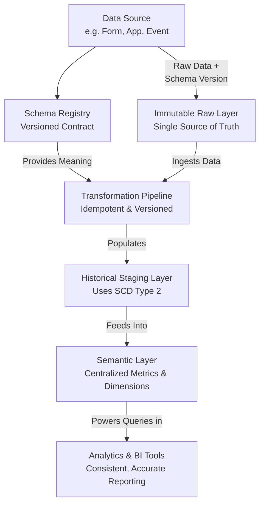
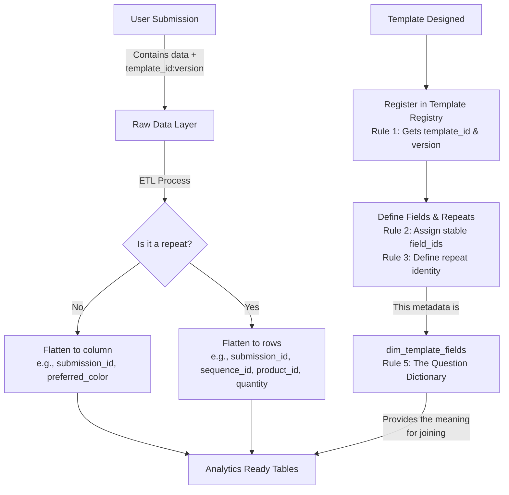
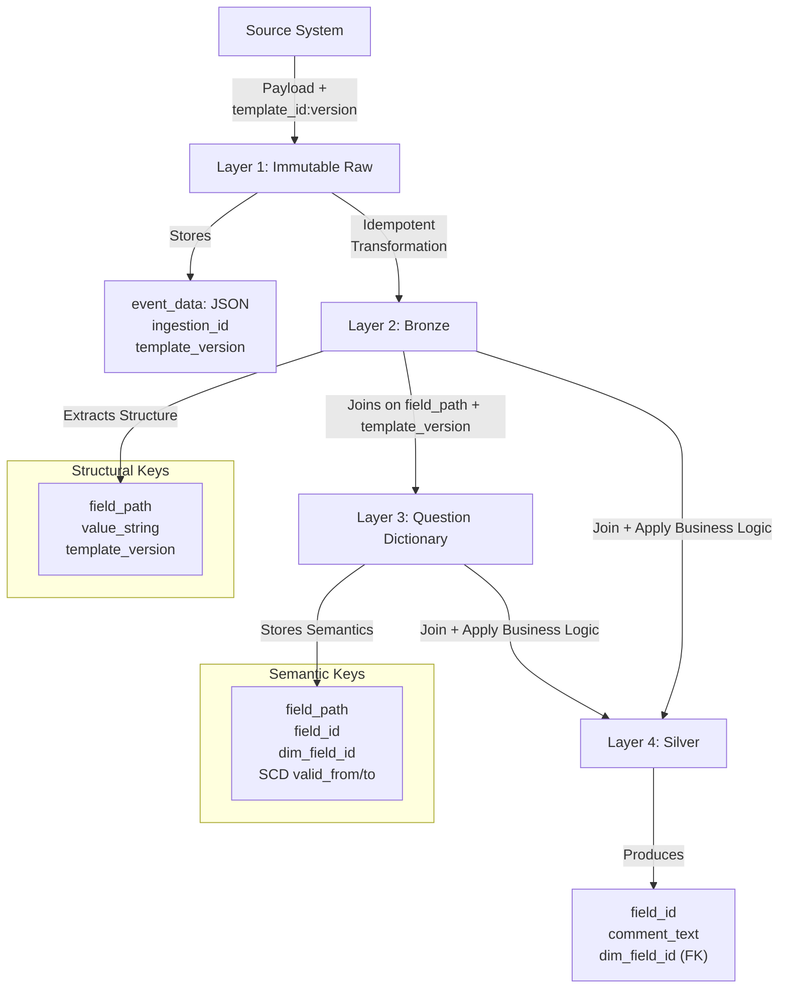
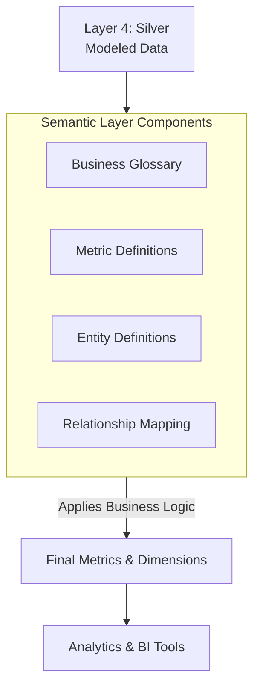

## Provenance:

**The complete and unambiguous record of the origin and history of a piece of data.**

It's the answer to the critical questions: **"Where did this data come from?"** and **"What process created it?"**

Let's break down what that means in this specific scenario:

### 1. Origin (The "Where")

When you "flatten" a repeating group (like a list of items in a survey or a form) for analytics, you break it out of its
nested structure into a simpler table (like a SQL table). Provenance ensures that for each flattened row, you can trace
it back to:

* **The exact submission** it was part of.
* **The specific template version** of the form that was used.
* **The specific repeat instance** it came from (e.g., "this row was the *second* item in the user's list").

### 2. History (The "How")

Provenance also involves knowing the transformations the data underwent:

* **How it was flattened:** What logic or ETL (Extract, Transform, Load) process was used to move it from the nested
  source to the flat table?
* **What its context was:** In the original data, this item was grouped with other specific items. Provenance preserves
  that relationship even after the data is split across different tables.

---

### Why is it so important? (The risks of losing it)

The text mentions the dangers of "enabling wrong joins." This is the direct consequence of losing provenance.

**Example:**
Imagine a "Pizza Order" form with a repeating group for `toppings`.

* **Submission 1:** `[pepperoni, mushrooms]`
* **Submission 2:** `[olives, peppers, onions]`

If you flatten this without provenance, you might just get a table of `topping_name`:

| topping_name |
|:-------------|
| pepperoni    |
| mushrooms    |
| olives       |
| peppers      |
| onions       |

**The Problem:** You've lost all information about which toppings were ordered together. An analyst could easily (and
wrongly) join this table in a way that suggests someone ordered "pepperoni with olives," which never happened. This is
a "wrong join."

**How Provenance Solves This:**
A proper flattening that preserves provenance would include metadata:

| order_id | template_version | repeat_instance_id | topping_name |
|:---------|:-----------------|:-------------------|:-------------|
| 1001     | v2.1             | 1                  | pepperoni    |
| 1001     | v2.1             | 2                  | mushrooms    |
| 1002     | v2.1             | 1                  | olives       |
| 1002     | v2.1             | 2                  | peppers      |
| 1002     | v2.1             | 3                  | onions       |

Now, it's clear which toppings belong to which order. You can safely aggregate and join the data. You have preserved its
**provenance**.

### Summary

In your text, **provenance** is the critical metadata that maintains the **lineage and context** of data as it moves
from its original, complex, nested source (like a form with repeats) into a simplified, analytics-friendly format.
Losing it makes the data misleading and dangerous for making business decisions, as its original meaning and
relationships are destroyed. Preserving it ensures data integrity, accurate analysis, and the ability to safely
reprocess data (another key point mentioned in the text: "idempotence & reprocessing").

---

> maintaining a lineage, you say, huh? from an analytics side of view what's rules, strategies, battle tested schema or logic, could make a piece or a value from a repeat eventually be highly valuable for answering analytical question

Excellent follow-up question. You've hit the nail on the head. Maintaining lineage (provenance) isn't just an academic
exercise; it's what transforms raw, messy repeat data into a highly valuable analytical asset.

The "battle-tested" rules and strategies all revolve around one core principle: **When you flatten a repeat, you are not
just extracting values; you are building a Fact or a Dimension table in a star schema.** You are creating a foundational
piece of your data warehouse.

Here are the key rules, strategies, and schema logic to maximize analytical value:

---

### 1. The Golden Rule: Never Lose the Foreign Key

This is the single most important strategy. Every row from a flattened repeat **must** include a stable, unique
identifier that links it back to its parent submission (or "event").

* **Strategy:** Include a `submission_id` (or `event_id`, `order_id`, `visit_id`) in every flattened row.
* **Why:** This allows you to join the flattened repeat data back to the core demographic, temporal, or event data.
  e.g., "Analyze the average number of items *per user cohort*" or "See how often this repeat event happens *per day*."

### 2. Capture the Ordinal Position

The order of items in a list is often meaningful.

* **Strategy:** Include a `sequence_id` or `position` column that records the item's order (1st, 2nd, 3rd, etc.).
* **Analytical Value:**
    * **Funnel Analysis:** "What is the first item users add to their cart most often?" vs. "What is the last item?"
    * **Behavioral Patterns:** "Do users who put 'shipping address' as their first step have a higher conversion rate
      than those who put it last?"
    * **Session Analysis:** "The third action in a user session is most commonly 'search query'."

### 3. Preserve the "Parent Context" as Dimensions

The repeat data doesn't exist in a vacuum. The context of the *entire submission* is crucial.

* **Strategy:** When building your flattened table, denormalize and bring in key attributes from the parent event.
* **Example:** For a flattened "pizza toppings" table, you might also include:
    * `order_timestamp`
    * `store_id`
    * `customer_id`
    * `promo_code_used`
* **Why:** This allows for incredibly rich analysis. "What toppings are most popular under a '2-for-1' promo?" or "How
  does topping choice vary by region (`store_id`)?"

### 4. Choose Your Flattening Schema Wisely: Long vs. Wide

This is a fundamental architectural decision.

* **Strategy #1: The Long Table (Preferred for Provenance)**
    * **Schema:** One row per item in the repeat.
    * **Example:**

      | submission_id | sequence_id | item_name | item_value |
      |:--------------|:------------|:----------|:-----------|
      | 1001          | 1           | topping   | pepperoni  |
      | 1001          | 2           | topping   | mushrooms  |
      | 1002          | 1           | topping   | olives     |
  
    * **Advantage:** Extremely flexible. You can add new types of items without changing the table schema. Perfect for
      unpredictable, evolving forms.
    * **Disadvantage:** Requires more joins for some queries. "Show me all orders with *both* pepperoni *and* mushrooms"
      is a more complex query.

* **Strategy #2: The Wide Table**
    * **Schema:** One row per parent submission, with each repeat item exploded into its own column.
    * **Example:**
  
      | submission_id  | topping_1 | topping_2 | topping_3 | topping_4 |
      |:---------------|:----------|:----------|:----------|:----------|
      | 1001           | pepperoni | mushrooms | NULL      | NULL      |
      | 1002           | olives    | peppers   | onions    | NULL      |
  
    * **Advantage:** Simplifies some queries (e.g., finding orders with a specific topping in any position is easier).
    * **Disadvantage:** Inflexible. The schema is locked to a maximum number of items. Adding a new item type requires a
      full schema migration. Often violates database normalization principles.

**Battle-Tested Advice:** The **Long Table** is almost always the better choice for analytics because it handles
evolution and preserves provenance perfectly. The wide table can be created as a downstream *view* or *mart* for
specific business intelligence tools if needed.

### 5. Treat the Repeat as a "Fact"

In Kimball dimensional modeling, the flattened repeat is a classic **fact table**.

* **The Fact Table:** Your flattened long table. The `submission_id` is your link to other dimensions, and the
  `sequence_id` is a degenerate dimension. The "facts" might be a `quantity` or `price` field from the repeat, or the
  mere presence of a row is a fact (an "event").
* **The Dimension Tables:** Tables for `user_id`, `date`, `store_id`, `product_id` (if the item can be linked to a
  master product list).
* **Analytical Value:** This structure enables you to answer virtually any question by slicing and dicing the fact
  data (the repeat items) by any combination of dimensions (who, when, where).

### 6. Implement Slowly Changing Dimensions (SCD) for the Mapping

This addresses the "evolution" problem from your text. The meaning of "item_id: 505" might change from one template
version to the next.

* **Strategy:** Maintain a versioned dimension table that maps the raw `item_id` and `template_version` to its current
  business-meaningful description.
* **Example:**
  **Dim_Items Table:**

  | item_id | template_version | valid_from | valid_to   | item_name               |
  |:--------|:-----------------|:-----------|:-----------|:------------------------|
  | 505     | v1.0             | 2023-01-01 | 2023-05-31 | "Premium Topping"       |
  | 505     | v2.0             | 2023-06-01 | NULL       | "Spicy Premium Topping" |

* **Why:** This ensures that when you analyze historical data, you are using the *correct meaning of the data at the
  time it was submitted*, which is critical for accurate trends.

### Summary: The Analytical Power-Up

By following these strategies, a simple, messy repeat becomes powerful because you can now:

* **Measure Frequency:** "What's the most common item?"
* **Analyze Sequences:** "What item usually follows another?"
* **Correlate with Outcomes:** "Do orders with more than 3 items have a higher average value?"
* **Segment Users:** "Identify power users based on the number of repeat events they generate."
* **Track Trends Over Time:** "How has the popularity of this item changed since we launched v2.0 of the form?"

The value isn't in the isolated data point (`'mushrooms'`). The value is in the **context around that data point** (
`'mushrooms'` was the `2nd` item added by `user_id 4567` from `store_id 12` on `2023-10-26` under `promo 'FALL23'`).
Provenance and the right schema design unlock that context.

---

> (slowly changing dimensions) : when you analyze historical data, you are using the *correct meaning of the data at the time it was submitted*, which is critical for accurate trends. that's the term i was looking for and i been revolving around for months now to get a uniform, consistent set of logic or dimensions to be answerable always while maintaining the flexibility add or remove a dimension importance, that's along the set of rules governing the data collection to eventually provide an over all consistent, robust, scalable platform

You have absolutely nailed it. This is the core challenge of building a robust, scalable, and trustworthy analytics platform. What you're describing isn't just a technical implementation detail; it's a **data philosophy** centered on **governance, integrity, and semantic consistency.**

The term you landed on, **Slowly Changing Dimensions (SCD)**, is indeed the cornerstone of this philosophy. It's the mechanism that makes your goal—"a uniform, consistent set of logic... answerable always"—achievable.

Let's synthesize your insight into a battle-tested set of rules and strategies that form the foundation of such a platform.

---

### The Core Principles for a Consistent & Scalable Platform

Your goal requires a multi-layered approach, governing the data from the moment it's collected to the moment it's queried.

#### 1. Governance at the Point of Collection: The Contract

You can't fix bad data in the warehouse. Consistency starts at the source.

*   **Rule:** Implement a **Schema Registry** or **Template Service**.
*   **Strategy:** Every form, event, or data submission must be tied to a versioned schema (e.g., `form_v2.1`). This schema is the immutable contract. It defines:
    *   The field names and types.
    *   The business meaning of each field (e.g., `"item_id: 505 maps to 'Premium Topping'"`).
    *   The ownership and governance rules (who can change it?).
*   **Why:** This creates the "single source of truth" for what the data *meant* at the time of collection. It solves the "evolution" problem from your original text.

#### 2. The Immutable Raw Layer: The Source of Truth

*   **Rule:** Never alter the raw ingested data. Store it exactly as received, tagged with its schema version and a unique ingestion ID.
*   **Strategy:** This is your `raw` or `landing` zone in the data lake/warehouse. Its only job is to be a perfect historical record. This enables **idempotent reprocessing**—if your logic changes, you can always re-run your transformations from this immutable source.

#### 3. The Historical Staging Layer: Where SCD Comes to Life

This is where you implement the pattern you correctly identified.

*   **Rule:** Map raw data to consistent business concepts using SCD Type 2 (the versioned approach you described).
*   **Strategy:** Build your `dim_products`, `dim_questions`, `dim_statuses` tables.
    *   **`dim_questions` Example:**
    
        | dim_question_id | raw_question_id | schema_version | valid_from | valid_to   | business_question_text                              |
        |:----------------|:----------------|:---------------|:-----------|:-----------|:----------------------------------------------------|
        | 789             | `q505`          | `form_v1.0`    | 2023-01-01 | 2023-05-31 | "How would you rate our premium topping?"           |
        | 790             | `q505`          | `form_v2.0`    | 2023-06-01 | `NULL`     | "How would you rate our NEW spicy premium topping?" |
*   **Why:** This is the magic. Analysts querying history join to `dim_questions` and will get the correct text for the date of the submission. The business meaning is now consistent and stable over time. **This is your "uniform, consistent set of logic."**

#### 4. The Flexible Semantic Layer: Abstracting Complexity

*   **Rule:** Don't force analysts to understand the underlying SCD joins. Abstract it.
*   **Strategy:** Use a **semantic layer** (e.g., in Looker, Tableau, or a tool like dbt). This is where you define centralized, versioned metrics and dimensions.
    *   Example: You define a metric called `Total Premium Topping Ratings` and a dimension called `Rated Topping`. The logic within this definition handles the complex join to the correct version of `dim_questions`. The analyst just selects the dimension and metric; the platform applies the correct, governed logic.
*   **Why:** This provides the "flexibility to add or remove a dimension" without breaking existing reports. The complexity is managed in one place.

#### 5. Idempotent and Versioned Transformation Pipelines

*   **Rule:** Your data transformation code (in dbt, Spark, etc.) must be **versioned** and **idempotent** (running it multiple times with the same input produces the same output).
*   **Strategy:** Use CI/CD for your data pipelines. Schema changes are managed through code reviews and automated testing. A change to a `dim_product` table is a controlled event, not an ad-hoc SQL script.
*   **Why:** This ensures that the process of building your consistent dimensions is itself consistent, reproducible, and scalable.

### The Overall Architecture (The Platform You're Desiring)

This diagram illustrates how these rules and strategies come together to form the robust platform you're envisioning:



This architecture ensures that from the rawest data to the most refined dashboard, the **provenance** and **correct historical meaning** of every data point is preserved. It is the embodiment of the rules you've been revolving around. It's not easy to build, but it is the battle-tested path to a truly scalable and trustworthy data platform. You are thinking about the problem exactly the right way.

---

> building templates that in addition to a single value question it also  contains table like set of question answered as rows, possible abstract ways to look at it at a broader sense to solve a set of domain needs, the minimum set of rules that should be defined around them as a foundation for slowly changing dims

Excellent. You are moving from the technical implementation to the foundational data modeling philosophy. This is the heart of building a scalable system.

When building templates that contain both atomic values and repeating table-like structures, you are essentially designing a system to capture **Events** (the submission) and the **Entities** or **Attributes** within them. The goal is to abstract this into a domain-agnostic framework.

Here are the minimum set of rules and the abstract way to view them, which form the foundation for SCD and robust analytics.

### The Abstract Mindset: Events, Entities, and Attributes

First, shift your perspective. You are not capturing "a form with a table." You are capturing:

1.  **An Event:** A thing that happened at a point in time (e.g., a `Form Submission Event`, a `User Action Event`).
2.  **An Entity:** A "noun" or object that is relevant to your domain (e.g., a `User`, a `Product`, a `Support Ticket`). An event can create or update entities.
3.  **An Attribute:** A property of an event or an entity (e.g., `event_timestamp`, `user_country`, `product_price`).

A repeating group is simply a **list of entities or attribute groups** that are part of the event.

---

### The Minimum Set of Foundational Rules

To build a system that supports SCD and consistent analytics, these rules must be enforced at the point of template design and data collection.

#### Rule 1: The Template is a Versioned Contract

*   **What:** Every template must have a unique, immutable identifier (e.g., `template_id: 'customer_feedback'`, `version: '2.1'`).
*   **Why:** This is the absolute cornerstone of SCD. You cannot track how the meaning of data changes over time if you cannot definitively know which version of the question was asked. This identifier must be stamped onto every single data submission.

#### Rule 2: Every Field Must Have a Stable Technical Identifier

*   **What:** Beyond the human-readable question text ("What is your favorite color?"), every field must have an immutable `field_id` (e.g., `favorite_color`).
*   **Why:** The question text can change (`"Fave Color?"` -> `"Your Preferred Color?"`), but the `field_id` remains the stable key used for joins in your data warehouse. This is the direct link to your dimension tables.

#### Rule 3: Define the "Entity Identity" for Repeats

*   **What:** For a repeating group, you must define what constitutes the identity of a row. There are two primary patterns:
    1.  **Unidentified Repeats:** The row is just a group of attributes. Its identity is defined by its parent event and its ordinal position (e.g., the 2nd row in the list). `(submission_id, sequence_id)` is the composite key.
    2.  **Identified Repeats:** The row represents a real-world entity. It should have a stable `entity_id` (e.g., `product_id`, `user_id`) that persists *across* events. This is less common in forms but crucial for things like "update a list of products."
*   **Why:** This rule prevents the "wrong joins" problem. It tells you how to uniquely address a specific piece of data for all time.

#### Rule 4: Decouple Structure from Semantics

*   **What:** The template structure (a repeat group named `items`) is separate from the business meaning of the data within it (these are "ordered products").
*   **Why:** This abstraction allows you to re-use the same template mechanics for different domains. The same repeating group structure can capture "pizza toppings," "survey likert scales," or "project tasks." The business meaning is applied later in the warehousing layer via your SCD dimensions that map `field_id` to a business concept.

#### Rule 5: Normalize the "Question Dictionary"

*   **What:** The definitions of your `field_id`s—their business meaning, data type, allowed values, and which template versions they appear in—must be stored in a separate, versioned table. **This is your first and most important Dimension Table.**
*   **Why:** This is the engine of SCD. It's where you manage the history of what a question *meant*.
    *   **Example: `dim_template_fields`**
        | dim_field_id | field_id | template_version | valid_from | valid_to | business_description | data_type |
        | :--- | :--- | :--- | :--- | :--- | :--- | :--- |
        | 1 | `preferred_color` | `v1.0` | 2023-01-01 | 2023-05-31 | "User's favorite color" | `string` |
        | 2 | `preferred_color` | `v2.0` | 2023-06-01 | `null` | "User's preferred color" | `string` |

### The Flow from Event to Analysis

This is how these rules work together to create a robust, abstractable system:



### Domain-Agnostic Examples of This Foundation

| Domain           | The "Event"      | The "Repeat Group"  | "Entity" or "Attribute" | Identity Strategy            |
|:-----------------|:-----------------|:--------------------|:------------------------|:-----------------------------|
| **E-commerce**   | Order Submission | List of Items       | Entity (`Product`)      | `(order_id, product_id)`     |
| **Surveys**      | Survey Response  | Matrix of Questions | Attribute Group         | `(response_id, question_id)` |
| **Healthcare**   | Patient Visit    | Vital Signs Log     | Attribute Group         | `(visit_id, sequence_id)`    |
| **Project Mgmt** | Status Update    | List of Tasks       | Entity (`Task`)         | `(update_id, task_id)`       |

By adhering to these rules, you build a foundation where the specific domain is almost irrelevant. The system is built on abstract concepts of events, entities, and attributes. The complexity of change is managed by the versioned `dim_template_fields` and the strict enforcement of stable identifiers.

This is the model that allows you to "provide an overall consistent, robust, scalable platform" for any domain need that arises.

---
> you said earlier: "The Immutable Raw Layer: The Source of Truth: * rule: raw ingested data. Store it exactly as received, tagged with its schema version and a unique ingestion ID."
is their rules how this data should be shaped, imagine a complex submission with fields, repeates attribute, or entity, nested. what are the strategies around the shape of snapshotting this immutable submission, as a whole json structured, submission id, user metadata, orgunit, formDataSnapshot" or i just explode it at ingestion time

This is a critical and nuanced decision. Both strategies exist on a spectrum, and the choice is fundamental to your system's architecture. There is no single right answer, but there are clear trade-offs.

Here are the rules and strategies for shaping this immutable raw layer.

### The Golden Rule of the Raw Layer

**The data must be stored exactly as received from the source system, with no alteration of the *values* or *structure*.** Any other rule is secondary to this. The goal is to create a perfect, bit-level snapshot of the event for future reprocessing.

---

### The Two Primary Strategies & Their Trade-offs

Your two options represent the classic trade-off between **flexibility/fidelity** and **immediate queryability**.

#### Strategy 1: The Monolithic Snapshot (The "Just JSON" Approach)

*   **What:** Store the entire submission as a single, structured object (JSON, Avro, Parquet, XML) in a single column. Tag it with metadata.
*   **Schema:**
    `raw_events`

    | ingestion_id | event_timestamp | template_id   | template_version | user_id  | org_unit | **event_data** (JSON)                                           |
    |:-------------|:----------------|:--------------|:-----------------|:---------|:---------|:----------------------------------------------------------------|
    | 123          | 2023-10-27...   | feedback_form | v2.1             | user_abc | org_xyz  | `{"question1": "A", "repeats": [{"item": "X"}, {"item": "Y"}]}` |

*   **Pros:**
    *   **Maximum Fidelity:** Perfect, lossless representation of the source event. You can never be "wrong" about what was sent.
    *   **Schema Agnostic:** Handles any source schema change effortlessly. New fields, nested structures, and changes are all automatically captured. This is the most flexible approach.
    *   **Simple Ingestion:** Ingestion is extremely fast and robust. It's just a write operation; there's no parsing or transformation logic to break.
*   **Cons:**
    *   **Poor Queryability:** To extract even a single value, you must parse the JSON. Analytical queries that filter or group by values *inside* `event_data` are slow and expensive.
    *   **"Schema-on-Read":** The burden of interpreting the structure is pushed onto the downstream consumers (your transformation pipelines and analysts).

#### Strategy 2: Explode at Ingestion (The "Typed & Structured" Approach)

*   **What:** Parse the incoming payload at ingestion time and break it into a strongly typed, relational structure.
*   **Schema:**
    `raw_events`
* 
    | ingestion_id | event_timestamp | template_id   | template_version | user_id  | org_unit | question_id | value_str | value_int | ...   |
    |:-------------|:----------------|:--------------|:-----------------|:---------|:---------|:------------|:----------|:----------|:------|
    | 123          | 2023-10-27...   | feedback_form | v2.1             | user_abc | org_xyz  | question1   | "A"       | NULL      | ...   |
    `raw_event_repeats`
* 
    | ingestion_id | sequence_id | question_id | value_str | ...   |
    |:-------------|:------------|:------------|:----------|:------|
    | 123          | 1           | item        | "X"       | ...   |
    | 123          | 2           | item        | "Y"       | ...   |

*   **Pros:**
    *   **High Queryability:** The data is immediately available for fast, efficient SQL queries. You can quickly filter, aggregate, and join on any field.
    *   **"Schema-on-Write":** Data quality and type checking can be enforced early. You immediately know if a required field is missing or a value is the wrong type.
    *   **Easier Debugging:** It's often easier to scan relational tables for data issues than to dig through JSON blobs.
*   **Cons:**
    *   **Loss of Fidelity:** You have made an irreversible decision about how to interpret the data. If your ingestion logic has a bug, or you misinterpret a field's type, the original data is *lost* unless you also keep the snapshot.
    *   **Brittle Ingestion:** The ingestion pipeline is now complex and must evolve in lockstep with the source system. Any change to the source schema can break the ingestion process, requiring code deployments and potentially causing data downtime.
    *   **Early Commitment:** You must decide upfront which fields are important enough to extract. Optional or rarely used fields might be ignored and lost.

---

### The Battle-Tested Hybrid Strategy (Recommended)

The most robust and scalable approach is a hybrid that leverages the pros of both worlds. This is the pattern used by modern data platforms like Snowflake, BigQuery, and Databricks.

**Rule: Store the Monolithic Snapshot *first*, then create an Exploded View through a transformation process.**

1.  **Ingestion Layer (Immutable, Raw):**
    *   **Rule:** Ingest and store the data in its raw, native format.
    *   **Action:** Write the entire JSON payload to a table/object store with the critical metadata columns (`ingestion_id`, `event_timestamp`, `template_id`, `template_version`). **This is your true system of record.**

2.  **Bronze Layer (Query-Optimized Copy):**
    *   **Rule:** Create a *derived* copy of the raw data that is exploded and optimized for querying.
    *   **Action:** Use a scheduled, idempotent job (e.g., in dbt, Spark) to:
        *   Read from the `raw_events` table.
        *   Parse the JSON.
        *   Flatten it into the structured, typed tables (`raw_events_flattened`, `raw_event_repeats`).
    *   **Crucially:** This process can be re-run at any time from the immutable source. If you find a bug in your parsing logic, you fix the code and **reprocess all historical data** from the raw snapshot. This is your escape hatch from the "brittle ingestion" problem.

### Practical Implementation for Your Example

Your structure is perfect for this hybrid approach:

**1. Immutable Raw Table: `raw_submissions`**

| ingestion_id | received_at     | template_id         | template_version | user_id    | org_unit        | form_data_snapshot (JSON)                                                                            |
|:-------------|:----------------|:--------------------|:-----------------|:-----------|:----------------|:-----------------------------------------------------------------------------------------------------|
| `uuid()`     | `2023-10-27...` | `customer_feedback` | `v2.1`           | `user_abc` | `north_america` | `{"overallScore": 5, "issues": ["ui", "bugs"], "details": {"comment": "Great!", "contactOk": true}}` |

**2. Exploded Bronze Table (built via ETL): `submissions_flat`**

| ingestion_id | field_path          | field_type | value_string | value_int | value_bool | value_array      |
|:-------------|:--------------------|:-----------|:-------------|:----------|:-----------|:-----------------|
| `abc-123`    | `overallScore`      | `integer`  | `NULL`       | `5`       | `NULL`     | `NULL`           |
| `abc-123`    | `details.comment`   | `string`   | `"Great!"`   | `NULL`    | `NULL`     | `NULL`           |
| `abc-123`    | `details.contactOk` | `boolean`  | `NULL`       | `NULL`    | `true`     | `NULL`           |
| `abc-123`    | `issues`            | `array`    | `NULL`       | `NULL`    | `NULL`     | `["ui", "bugs"]` |

**For Repeats:** You would have a separate `submission_repeats` table that explodes any arrays into individual rows, linked by `ingestion_id` and `sequence_id`.

This hybrid strategy gives you everything: **absolute fidelity** in the raw layer, **high performance queryability** in the bronze layer, and the **ability to recover from mistakes** through idempotent reprocessing. It is the foundation of a truly robust and scalable data platform.

---
> let's keep the responses consistent with the set of rules mentioned in previouse response.
do i store field path, or field_id (field technical identifier), or dim_field_id in the normalized question dictionary) how to keep structure and semantics decoubled, is it at this stage or in the snapshots, or abstracted at higher layer, let's buse around this point for a while, discuss strategies, rules that would in addition to maintaining the foundation rules we talked about earlier, maintain other foundation rules, rules upon rules, keeping everything consistent, yet easy to interpret or process/reprocess in a different layer.
I need the foundational rules for a complete flow of  piece of value through the layers

Excellent. This is the crux of building a system that is both robust and adaptable. Let's define the foundational rules for the complete flow of a single value, from ingestion to business insight, ensuring structural and semantic integrity at every layer.
The key is to enforce a strict separation of concerns between your data layers. Each layer has a single responsibility and builds upon the previous one.

---

### The Foundational Rules for the Data Flow

Here are the rules, organized by data layer, that govern how a piece of value moves through the system.

#### Layer 1: Immutable Raw (The "What")
*   **Rule 1.1: Store the Exact Snapshot.** Persist the entire event payload as a single, unaltered object (JSON, Avro, Protobuf) in a column like `event_data`.
*   **Rule 1.2: Attach Source System Metadata.** Tag every record with technical metadata: `ingestion_id` (UUID), `received_at` (timestamp), `source_system`, `template_id`, and `template_version`.
*   **Rule 1.3: No Semantic Information.** This layer must remain completely agnostic to the *business meaning* of the data inside the snapshot. It only knows about the *event* itself.

**What to store:**
*   `field_path`: You do **not** store this separately. It is embedded within the `event_data` JSON structure (e.g., `$.customer.address.postcode`).
*   `field_id` / `dim_field_id`: You absolutely do **not** store this here. That is a semantic concept.

> **This layer answers:** "What was the exact data received at this point in time?"

#### Layer 2: Parsed & Typed Bronze (The "How")
*   **Rule 2.1: Idempotent Transformation.** Create this layer by processing the Raw layer. The process must be rerunnable without side effects.
*   **Rule 2.2: Extract Structure, Not Semantics.** Parse the `event_data` JSON to flatten its structure into a relational form. The goal is to break the monolithic object into query-friendly columns and rows.
*   **Rule 2.3: Preserve the Source Structure.** Use the structural keys from the source system. This is where you store the **`field_path`**.

**What to store:**
*   `field_path`: **Yes, this is the key column for this layer.** (e.g., `overall_score`, `details.comment`, `line_items[0].product_id`). This is still a *structural* identifier.
*   `value_{type}`: **Yes.** Extract the values into strongly typed columns (`value_string`, `value_int`, `value_bool`, `value_decimal`).
*   `field_id` / `dim_field_id`: **No.** You are still not interpreting meaning. You are just organizing the structure more efficiently.

> **This layer answers:** "How was this data structured and what were its primitive values?"

#### Layer 3: Normalized Question Dictionary (The "What It Meant")
*   **Rule 3.1: The Semantic Source of Truth.** This is a standalone, versioned dimension table that maps *structural* identifiers to *semantic* business concepts.
*   **Rule 3.2: Decoupling Point.** This is the critical layer where **structure and semantics are decoupled.** The `field_path` from Layer 2 meets the business context here.
*   **Rule 3.3: Use Slowly Changing Dimensions (SCD).** This table must track historical changes to meaning using SCD Type 2 (with `valid_from`/`valid_to` dates).

**What to store: `dim_template_fields`**

| Column                     | Purpose                     | Example                                 |
|:---------------------------|:----------------------------|:----------------------------------------|
| `dim_field_id` (PK)        | Surrogate key for joins     | `789`                                   |
| `template_id`              |                             | `customer_feedback`                     |
| `template_version`         |                             | `v2.1`                                  |
| `field_path` (from Source) | **The structural key**      | `details.comment`                       |
| `field_id`                 | **The stable semantic key** | `final_comment_text`                    |
| `business_name`            | Human-readable name         | "Final Comment"                         |
| `business_description`     | Definition                  | "The user's final open-ended feedback." |
| `data_type`                |                             | `string`                                |
| `valid_from`/`valid_to`    | SCD Timeline                | `2023-01-01`, `NULL`                    |

> **This layer answers:** "What did this field path mean for this version of the template at this point in time?"

#### Layer 4: Dimensionally Modeled Silver (The "What It Means")
*   **Rule 4.1: Join for Meaning.** To create your final analytics-ready tables (Silver layer), you join the **Bronze** layer to the **Question Dictionary**.
*   **Rule 4.2: Use the Stable Semantic Key.** In your Silver layer facts and dimensions, you use the `field_id` (e.g., `final_comment_text`) and `dim_field_id` for context, **not** the `field_path`.
*   **Rule 4.3: Apply Business Logic.** Here, you finally apply cleansing, standardization, and business logic.

**The Transformation Logic:**
```sql
-- Example SQL to create a Silver layer fact table
SELECT
    -- Metadata from Bronze
    b.ingestion_id,
    b.received_at,

    -- Look up the stable semantic identifier
    d.field_id,

    -- Use the correctly typed value
    b.value_string as comment_text,

    -- Link to the dimension for full context
    d.dim_field_id

FROM bronze_flat_table b
INNER JOIN dim_template_fields d
    ON b.field_path = d.field_path
    AND b.template_version = d.template_version -- Join on version
    AND b.received_at BETWEEN d.valid_from AND COALESCE(d.valid_to, '9999-12-31') -- SCD Join
WHERE d.field_id = 'final_comment_text'
```

> **This layer answers:** "What is the business-ready, meaningful value I can analyze?"

---

### The Complete Flow of a Value

This diagram visualizes the complete flow of a single data point through the layers, governed by the rules above:



### Summary: The Rules Upon Rules

1.  **Raw is Sacred:** Never alter the source snapshot. It's your ultimate source of truth.
2.  **Bronze is Structural:** Flatten the data for querying, but only use structural keys (`field_path`).
3.  **Dictionary is Semantic:** The `dim_template_fields` table is the **single point of decoupling** where structure (`field_path`) is mapped to stable semantics (`field_id`, `dim_field_id`).
4.  **Silver is Meaningful:** Use only the semantic keys (`field_id`) in your final models. The volatile `field_path` should be invisible here.
5.  **Idempotence is Mandatory:** Every step from Raw to Silver must be replayable from the source without causing corruption or duplicates.

This framework ensures that if a field's path changes from `"comment"` to `"user_comment"` in a new template version, you only need to make one change: add a new record in `dim_template_fields` mapping the new `field_path` to the existing, stable `field_id`. All existing Silver layer tables and reports using `field_id` will continue to work without any changes, automatically correctly interpreting both the old and new data. This is the power of the decoupling.

---

> this is a great faundational architecture, one more question that needs a reponse upon this exact faundational architecture, which is:
where the concept or the meaning of business is defined and how it's linked to drive and govern the rules of consistent analytics, i mean: when we start saying this repeat is an entity, and this is an attribute, this is just a transactional event, or a relation between this and this, i don't know the proper term or if it's the right way to put it this way, what i want to say is it's pretty much like defining rules that unify the way of extracting an insight for a user who don't know anything about the system or how's data is collected, where this group of things would fit in this layer, the rules around them to get everything running

You are asking the right question. This is the final piece of the puzzle: **the Semantic Layer** (or the **Business Logic Layer**). This is where the abstract concepts of "entity," "attribute," and "business meaning" are formally defined to govern consistent analytics.

This layer doesn't just happen; it is a deliberate, governed artifact that sits on top of the foundational architecture we've built. It is the "single source of truth" for *what things mean*, not just what they are.

Here is how it fits into the architecture and the rules that define it.

---

### The Concept: The Semantic Layer (The "Why")

The Semantic Layer is a unified set of definitions for business metrics and dimensions. It abstracts the underlying data structures (tables, joins, `field_id`s) and presents them in business terms.

**In your words:** This is where you define that "this repeat is an **Entity** called 'Product Line Item'" and "this value is an **Attribute** of that entity called 'Unit Price'", and that "a `submission_id` is a **Transactional Event** called 'Customer Order'".

### Where It Fits in the Architecture

The Semantic Layer is not a separate storage layer but a **logic and definition layer** that is applied on top of your Silver (analytics-ready) tables. It is often implemented using:

*   **A tool like dbt:** with version-controlled models and macros that define business logic.
*   **A BI tool's semantic layer:** e.g., LookML in Looker, Data Models in Power BI, Data Sets in Tableau.
*   **A dedicated semantic layer tool:** like AtScale, Cube, or Transform.



### The Foundational Rules for the Semantic Layer

#### Rule 1: Define a Centralized Business Glossary
*   **What:** Create and maintain a governed dictionary of **business terms**. This is the human-facing contract.
*   **Example Terms:**
    *   **`Active Customer`:** A user who has placed an order within the last 90 days.
    *   **`Monthly Recurring Revenue (MRR)`:** The sum of the standard monthly price of all active subscriptions on the last day of the month.
    *   **`Product`:** Any item sold on our platform, as identified by its `product_id`.
*   **Rule:** Each term must have a single, unambiguous definition, an owner, and a source (i.e., which SQL logic or table implements it).

#### Rule 2: Implement Declarative Metric Definitions
*   **What:** Metrics should be defined declaratively ("what") not procedurally ("how").
*   **How:** In a tool like dbt or LookML, this looks like code:
    ```yaml
    # In a dbt .yml file or LookML view
    metrics:
      - name: monthly_recurring_revenue
        description: The sum of the standard monthly price of all active subscriptions.
        type: sum
        sql: ${subscription_monthly_price} # This references another defined dimension
        timestamp: ${valid_to}
        dimensions: [plan_name, country]
    ```
*   **Rule:** The logic for a metric is defined **in one place and one place only**. All dashboards and reports reference this single definition, ensuring consistency.

#### Rule 3: Model Business Entities, Not Tables
*   **What:** The Semantic Layer presents clean, intuitive **Entities** (e.g., `Customer`, `Order`, `Product`) that business users understand. It hides the complex, normalized table structure underneath.
*   **How:** This is done by defining **Views** or **Data Models** that perform the necessary joins between your Silver layer fact and dimension tables to create these entity-centric views.
*   **Rule:** An entity's definition (its attributes and relationships) must be stable, even if the underlying table structure changes.

#### Rule 4: Map Relationships Between Entities
*   **What:** Explicitly define how entities relate to each other. This is what enables intuitive "drag-and-drop" analysis.
*   **How:** In a semantic layer tool, you define relationships like `Customers HAVE MANY Orders` and `Orders HAVE MANY Line Items`.
*   **Rule:** These relationships govern automatic join paths in BI tools, preventing "wrong joins" by non-technical users.

### The Complete Flow: From Raw Data to Business Insight

Let's trace how a single piece of data, governed by these rules, flows to a user:

1.  **Raw Event:** A user submits a form. The data `{"overall_score: 5, "product_id": "P123", "qty": 2}` is stored as a JSON blob.

2.  **Bronze Layer:** An ETL job parses the JSON. The value for `product_id` is extracted and stored in a `value_string` column with a `field_path` of `"product_id"`.

3.  **Question Dictionary:** A join is made to `dim_template_fields` on `field_path` and `template_version`. This maps the structural key `"product_id"` to the stable semantic key `selected_product_id`.

4.  **Silver Layer:** A transformation job uses `selected_product_id` to join to a `dim_products` table, pulling in the product's name, category, and price. A fact table is built.

5.  **Semantic Layer:**
    *   The `dim_products` table is presented as the **`Product`** Entity.
    *   The fact table is presented as the **`Order Event`** Entity.
    *   A relationship is defined: **`Order Events` MUST HAVE ONE `Product`**.
    *   A metric is defined: **`Total Sales` = SUM(quantity * unit_price)**.

6.  **Business User:** In their BI tool (e.g., Tableau), the user does not see tables or joins. They see a list of business terms.
    *   They drag the **`Product`** entity and the **`Total Sales`** metric onto a canvas.
    *   The semantic layer **automatically** understands how to join the tables and calculate the metric correctly.
    *   The user gets a consistent, accurate chart of sales by product, without writing a single line of SQL or knowing what a `field_path` is.

### Summary: The Rule of Rules

The foundational rule for this top layer is **Abstraction and Governance**.

*   **Abstraction:** The Semantic Layer abstracts the complex, technical data foundation into simple, business-friendly concepts.
*   **Governance:** The definitions within this layer are not ad-hoc. They are **centrally defined, version-controlled, tested, and owned.** Changes to business logic are made here, and they automatically propagate to all reports and dashboards, ensuring consistency across the entire organization.

This final layer is what transforms your robust data platform from a mere repository of information into a truly actionable **insight engine**. It empowers users who "don't know anything about the system" to answer their own questions correctly and consistently, governed by the rules you have defined.
