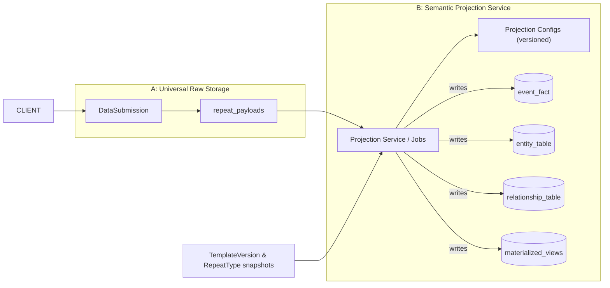

Love this — you’re already thinking in the right direction. Your two-tier idea (A = universal raw storage, B = separate semantic projection) is exactly the pattern I’d call **“capture-first, interpret-later”** and it aligns strongly with your goals: analytics clarity, domain fidelity, reproducibility, and safe evolution. I’ll be your partner here: I’ll briefly push back on the risks, then convert your idea into a concrete, practical plan you can implement now — with schemas, projection-config examples, ETL pseudocode, migration/pilot steps, and governance rules.

---

# Short verdict (straight to the point)

Your two-layer model is a very good fit. It gives the decoupling you want and lets repeats be interpreted as attribute / event / entity / relationship depending on the projection rules. The trade-offs are: **more moving parts** (projection service and configs), **storage duplication**, and **added operational complexity** (reprocessing, latency). Those are acceptable for the gains if you adopt good versioning, snapshotting, and a small pilot-first rollout.

---

# Quick pushback (risks & how to mitigate)

1. **Latency** — projections create eventual consistency. Mitigate: make synchronous quick projections for critical UX use-cases; otherwise accept eventual consistency for analytics.
2. **Operational complexity** — projection service, config management, reprocessing jobs, monitoring. Mitigate: keep projection rules declarative, versioned, and run an automated test suite + replayable pipelines.
3. **Duplication / storage cost** — raw + projected data stores increase storage. Mitigate: compress raw JSONB, partition archival, keep projections targeted (only create tables you actually query).
4. **Governance drift** — if projection configs live unmanaged, different teams may create inconsistent projections. Mitigate: central registry + code-review + CI for projection config changes.

---

# Concrete architecture (diagram + components)



Components:

* **Capture Layer (A)**: write-optimized DB with minimal structure: `data_submission` and `repeat_payloads`. No semantics here.
* **Projection Service (B)**: reads raw rows (stream or batch), reads projection metadata/config, runs deterministic mapping, writes to semantically typed tables (events, entities, relationships, aggregates).
* **Projection Config Registry**: declarative JSON rules that map a repeat shape → one or more target tables and specify dedupe/natural-key rules and transformations.
* **Audit & Lineage**: every projected row stores provenance: `source_submission_uid`, `template_version_uid`, `projection_config_version`, `projection_run_id`.

---

# Minimal schema suggestions (DDL snippets)

## A. Raw storage (capture-first)

```sql
-- submissions (already exists in your system)
CREATE TABLE data_submission (
  id         uuid PRIMARY KEY,          -- or ULID
  uid        varchar(32) UNIQUE,        -- business key
  template_uid varchar(32) NOT NULL,
  template_version_uid varchar(32) NOT NULL,
  form_data  jsonb NOT NULL,            -- full raw JSONB
  created_at timestamptz NOT NULL DEFAULT now()
);

-- normalized raw repeat payloads (simple store for easier processing)
CREATE TABLE raw_repeat_payload (
  id                uuid PRIMARY KEY,
  submission_uid    varchar(32) NOT NULL REFERENCES data_submission(uid),
  repeat_path       text NOT NULL,      -- e.g. "household.children"
  occurrence_index  int NOT NULL,       -- which array index in the formData
  payload           jsonb NOT NULL,     -- the repeat item JSON
  created_at        timestamptz NOT NULL DEFAULT now()
);

CREATE INDEX idx_raw_repeat_by_path ON raw_repeat_payload(repeat_path);
CREATE INDEX idx_raw_repeat_by_submission ON raw_repeat_payload(submission_uid);
```

Notes:

* We keep `form_data` intact for replayability and attach a second table `raw_repeat_payload` which is derived on ingest (or by a quick pre-process) to simplify projections. That step is optional but practical.

## B. Projection registry & config storage

```sql
CREATE TABLE projection_config (
  id uuid PRIMARY KEY,
  uid varchar(32) UNIQUE NOT NULL, -- human id like PROJ_orderLine_v1
  name text NOT NULL,
  target_type text NOT NULL,       -- 'EVENT'|'ENTITY'|'RELATIONSHIP'|'MEASUREMENT'
  payload jsonb NOT NULL,          -- projection rules & mappings (see example below)
  version int NOT NULL DEFAULT 1,
  created_by varchar(64),
  created_at timestamptz DEFAULT now()
);
```

## C. Example projected target tables (event\_fact and entity example)

```sql
-- event / transaction fact example (order line)
CREATE TABLE order_line_event (
  id uuid PRIMARY KEY,
  projection_source_submission_uid varchar(32) NOT NULL,
  projection_run_id uuid NOT NULL,
  natural_key text NOT NULL,        -- deterministic key for idempotence
  order_uid varchar(32),
  product_uid varchar(32),
  quantity numeric,
  price numeric,
  event_ts timestamptz,
  extra jsonb,                      -- raw payload subset
  created_at timestamptz DEFAULT now(),
  updated_at timestamptz
);
CREATE UNIQUE INDEX uq_order_line_by_natural_key ON order_line_event(natural_key);

-- entity example (product)
CREATE TABLE product_entity (
  id uuid PRIMARY KEY,
  uid varchar(32) UNIQUE,
  sku varchar(64),
  name text,
  attributes jsonb,
  created_at timestamptz DEFAULT now(),
  updated_at timestamptz
);
```

---

# Projection config: declarative mapping example

Example projection\_config.payload (JSON) that maps a repeat at `order.lines` to `order_line_event`:

```json
{
  "source": {
    "repeat_path": "order.lines",
    "payload_path": "$" 
  },
  "target": {
    "table": "order_line_event",
    "mode": "upsert",
    "natural_key": "concat(submission_uid, '|', payload.order_uid, '|', payload.line_number)",
    "mappings": {
      "order_uid": "payload.order_uid",
      "product_uid": "payload.product_uid",
      "quantity": "payload.quantity",
      "price": "payload.price",
      "event_ts": "payload.timestamp"
    },
    "post_transform": [
      { "set": { "extra": "payload" } }
    ]
  },
  "dedupe": {
    "strategy": "natural_key",
    "conflict": "update"
  },
  "provenance": {
    "copy_submission_uid": true,
    "copy_template_version": true
  }
}
```

Notes:

* `natural_key` is an expression evaluated deterministically (can be generated by code). The projection service must compute the same natural\_key when reprocessing to guarantee idempotence.
* `mode: upsert` indicates projection will `INSERT ... ON CONFLICT (natural_key) DO UPDATE ...`.
* For entity promotion, `target.table` would be `product_entity` and `mode` could include `merge_on` specifying fields to update.

---

# Projection service design (pattern & pseudocode)

Two supported modes:

* **Near-real-time stream**: use event bus (Kafka/Rabbit) -> projection worker consumes `SubmissionCreated` or `RawRepeatCreated` events and projects.
* **Batch job**: scheduled or on-demand full reprocess (useful for migrations or re-projections).

Idempotent per-submission projection pseudocode:

```python
# high-level pseudocode
for raw_row in fetch_raw_repeat_rows(batch):
    cfg = find_projection_config_for(raw_row.repeat_path)
    for mapping in cfg.targets:
         natural_key = eval_expression(cfg.target.natural_key, raw_row, submission)
         values = apply_mappings(cfg.target.mappings, raw_row, submission)
         if cfg.target.mode == 'upsert':
             upsert_target_table(cfg.target.table, natural_key, values, provenance={
                 'submission_uid': raw_row.submission_uid,
                 'template_version': submission.template_version_uid,
                 'projection_config_version': cfg.version
             })
```

Key requirements for the projection worker:

* Deterministic key generation for idempotence.
* Write provenance columns: `source_submission_uid`, `projection_run_id`, `projection_config_version`.
* Transactional upserts or use staging tables and atomic swaps for heavy writes.
* Maintain projection run logs so you can roll back or re-run by run\_id.

---

# Deduping & entity resolution strategies

1. **Deterministic natural key** — easiest: compose stable fields that uniquely identify the object within the domain (submission\_uid + line\_no, product\_sku). Use a hash of those fields as `natural_key`.
2. **Fingerprinting & checksum** — compute SHA256(payload subset) to detect changed payloads; update row when checksum differs.
3. **Entity resolution** — for entity promotion:

    * Use natural business key(s) (national id, serial, SKU).
    * If incoming data is fuzzy, use a separate entity resolution service (scoring, manual reconciliation).
4. **Late-binding keys** — first project a provisional row with a provisional uid and later merge when entity resolution decides it's the same entity.

---

# Versioning / Reproducibility rules (must-have)

* **Always record `template_version_uid` in DataSubmission** — you already do; projection must use it for deterministic mapping.
* **Version projection configs** (the `projection_config.version` field). Each projection run records the config version used.
* **Snapshot projection config when you run** — store a copy of the config with the run log for perfect replay.
* **Keep raw JSONB unchanged** — allow reprocessing against any historical projection config.

---

# Pilot plan — minimal viable experiment (4 steps, 1–2 sprints)

1. **Pick 1 repeat type** with medium complexity and useful analytics (e.g., `order.lines` or `household.members` used in 3+ templates).
2. **Implement raw\_repeat\_payload extraction** (lightweight job that extracts repeat items into `raw_repeat_payload` if not present).
3. **Create `projection_config` for that repeat** that maps to a single `event_fact` or `entity_table`.
4. **Implement projection worker & run it** for new submissions; reprocess historical submissions for the pilot repeat. Measure ETL time, query speed improvement, and check idempotence.

Acceptance:

* Upserts are idempotent on re-run (no duplicates).
* Analytics queries against the new table are simpler / faster.
* No breaking changes for UI — UI still posts same `form_data`.

---

# Governance & operational checklist (short)

* Keep projection configs in code or in a repo with PRs and CI tests (unit tests + replay tests).
* Provide a UI or CLI to visualize projection config and sample mapped rows.
* Add metrics & alerts: projection lag, failed runs, projection-run duration.
* Create a "replay" job: re-run projection\_config X against date range Y for backfills.
* Add an approval workflow for promoting a repeat to entity (must include natural key fields, owner, and reconciliation plan).

---

# Comparison to your earlier hybrid idea

* Your hybrid (RepeatType + snapshot) is conceptually compatible with this two-tier approach: the projection layer B is where canonical `RepeatType` semantics live. The raw layer A remains pure.
* The projection layer takes the responsibilities we discussed earlier (analytics generator, entity promotion) and makes them pluggable and versioned.
* This design **improves** evolvability and governance: you can change projections without rewriting capture code or the frontend.

---

# Concrete artifacts I’ve included above (ready-to-use)

1. DDL snippets: `raw_repeat_payload`, `projection_config`, `order_line_event`, `product_entity`.
2. Example `projection_config.payload` JSON for order lines.
3. Deterministic pseudocode for an idempotent projection worker (batch/stream).
4. Pilot plan with acceptance criteria and metrics.

---

# My recommended immediate next steps (what I would do if I were you)

1. Implement `raw_repeat_payload` extraction (quick job) so projections don’t need to parse nested JSON each time. (Low effort, high payoff.)
2. Create a `projection_config` for one repeat and implement a one-off projection worker for that config. Run it for historical submissions (replay) and compare analytics queries.
3. Add provenance columns & projection-run logs.
4. If pilot is successful, roll out projection configs for other high-value repeats and create config repo + CI.

---

# Final partner-style question (I won’t block you)

I’ll pick a pragmatic next deliverable for you: I can **generate a ready-to-run projection-config + SQL migration** for a single pilot repeat (I’ll assume `order.lines`) including:

* full DDL for `raw_repeat_payload`, `projection_config`, `order_line_event`.
* a sample projection-config JSON (filled).
* idempotent upsert SQL or a small node/python script to run the projection for historical data.

I’ll produce that now unless you want a different pilot repeat (e.g., `household.members`). I’ll pick **order.lines** as it’s a clear transactional example and tests natural-key/deduping behavior.

Do you want me to generate the pilot artifacts now (DDL + config + projection script) for `order.lines`?
