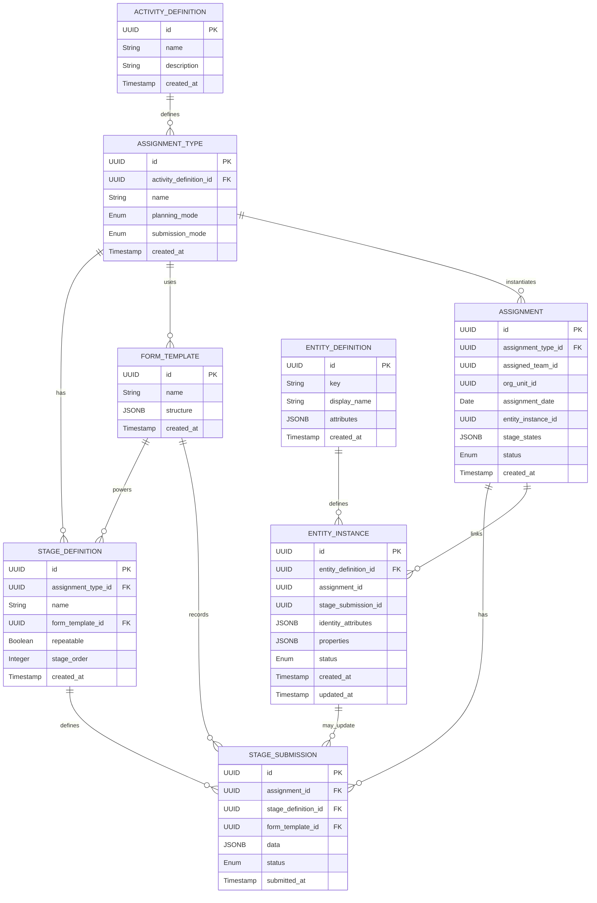

# Stages, assignment, submission workflow
## Diagram

---

### How to migrate in stages

1. **Add metadata tables**

    * Create `activity_definitions`, `assignment_types`, `stage_definitions` and `form_templates` (if not already).
2. **Extend `assignments`**

    * Add `assignment_type_id`, `entity_instance_id`, `stage_states`, and `status`.
3. **Create submission table**

    * `stage_submissions` holds all form data, with an optional `stage_definition_id`.
4. **Introduce entity types**

    * `entity_definitions` → holds your repeat-entity schemas.
    * `entity_instances` → holds actual repeat data, linked to assignments/submissions.
5. **Wire up processing**

    * On form save: insert into `stage_submissions`; if template has an entity-bound section, upsert into `entity_instances`.
6. **Back-fill or migrate existing data**

    * For existing repeatable sections, you can run a one-off script that reads old JSON submissions and populates `entity_instances`, linking back to assignments.

This ER diagram and table list should give you a clear roadmap for expanding your schema—layering in stages and entities without breaking your current flow.

---

Below is a **step-by-step walkthrough** of each scenario against the schema we sketched—showing how **repeat modes** (“free” vs **entity-bound**) are realized via **StageDefinition.repeatable** and your existing **FormTemplate** configuration. This will help you see where a **stage** can fully replace a legacy repeat, where you still need “free” JSON arrays, and where you’ll invoke the **EntityInstance** machinery.

---

## Schema Recap

* **StageDefinition**

    * `repeatable: Boolean` → allows **multiple** StageSubmissions for that stage.
    * `form_template_id` → points at the template (which may contain repeatable sections).

* **StageSubmission**

    * One row per submission per stage (or one if single-stage).
    * `stage_definition_id` = `NULL` for single-stage Assignments.

* **EntityInstance**

    * Created/updated **only** when a StageSubmission’s FormTemplate has sections marked **entity-bound**.
    * Linked to both the `assignment_id` and the `stage_submission_id`.

* **Free repeat** (legacy nested arrays)

    * Simply lives inside `StageSubmission.data` JSON.
    * No EntityInstance created.

---

## Scenario 1: One-off form (no repeat, no stages)

* **Config**:

    * `AssignmentType.submission_mode = SINGLE`
    * `stages = []` (empty → implicit single stage)
    * FormTemplate has no repeatable sections.

* **Flow**:

    1. User submits form → one `StageSubmission` row (with `stage_definition_id = NULL`).
    2. No entity logic invoked.

* **Result**:

    * Exactly as today—your legacy JSON-only behavior.
    * **No change** in your UI or backend except new table `stage_submissions`.

---

## Scenario 2: One-off free repeat (nested JSON array)

* **Config**:

    * Same as Scenario 1, but FormTemplate contains a **repeatable** section (legacy free-repeat).
    * **Not** marked entity-bound.

* **Flow**:

    1. Submission saved to `StageSubmission.data` JSON—nested array under that section’s path.
    2. No `EntityInstance` created because FormTemplate didn’t signal entity-bound.

* **Result**:

    * Legacy behavior preserved.
    * You’ll later query those nested arrays via your `DataValue` extraction or back-fill script.

---

## Scenario 3: Single-stage, entity-bound repeats

* **Config**:

    * `AssignmentType.submission_mode = SINGLE`
    * FormTemplate has a **repeatable, entity-bound** section.

* **Flow**:

    1. User fills form → one `StageSubmission` row.
    2. **Post-hook** (or DB transaction) scans that submission for the entity-bound section.
    3. For each entry in the JSON array, **upsert** an `EntityInstance`, setting:

        * `entity_definition_id`
        * `assignment_id`
        * `stage_submission_id`
        * `identity_attributes` & `properties` from that row.

* **Result**:

    * The JSON still carries the raw array (for audit), but your repeat data now lives in `entity_instances`.
    * You can query `entity_instances WHERE assignment_id = X` to get all “repeat rows” as flat records.

---

## Scenario 4: Multi-stage, no repeats

* **Config**:

    * `submission_mode = MULTI_STAGE`, `stages = [ A, B, C ]`
    * Each StageDefinition has `repeatable = false`.
    * FormTemplates contain no repeatable sections.

* **Flow**:

    1. User submits Stage A → `StageSubmission(stage_id = A.id)`.
    2. Then Stage B → one row.
    3. Then Stage C → one row.
    4. No entity logic invoked.

* **Result**:

    * Each logical “step” is its own JSON row in `stage_submissions`.
    * No changes to legacy repeats.

---

## Scenario 5: Multi-stage, entity-bound at one stage

* **Config**:

    * `stages = [ Registration (repeatable=false), MemberEnrollment (repeatable=true, entity-bound), FollowUp (repeatable=false) ]`.

* **Flow**:

    1. **Registration** submission → `StageSubmission(stage_id=Registration)`; no entities.
    2. **MemberEnrollment**: user can add N entries → each submission of that stage:

        * Creates one `StageSubmission(stage_id=MemberEnrollment)` per entry (because `repeatable=true`).
        * **Post-hook** for each submissions upserts a **single** `EntityInstance` (e.g. each Patient).
    3. **FollowUp** → one `StageSubmission(stage_id=FollowUp)`; may read or update existing entities.

* **Result**:

    * **Entities** appear only for the MemberEnrollment stage.
    * You get both the JSON submissions and a clean `entity_instances` table.

---

## Scenario 6: Planned visit to existing entity

* **Config**:

    * An `Assignment` is **pre-linked** to an existing `entity_instance_id` (e.g. a Household you created earlier).
    * StageDefinition = single‐stage or multi‐stage, but that stage’s FormTemplate contains fields bound to that `EntityType`.

* **Flow**:

    1. When rendering the form, your UI loads the `EntityInstance.identity_attributes` as initial values.
    2. On submit → one `StageSubmission`, then **post-hook** upserts the same `EntityInstance` (update mode).

* **Result**:

    * You’re truly “following up” on that entity—no new instances created.
    * Historical state preserved via your JSON + upsert logic.

---

## Scenario 7: Ad-hoc (“log-as-you-go”) submissions

* **Config**:

    * `planning_mode = LOG_AS_YOU_GO` in `AssignmentType`.
    * You may or may not pre-create an `Assignment` record; UI auto-generates a transient one.

* **Flow**:

    1. UI creates a new `Assignment(planning_mode=LOG_AS_YOU_GO)` on first form open.
    2. User submits one or multiple stages as above (depending on `submission_mode` & `stages`).
    3. Entities created only if template sections demand it.

* **Result**:

    * Flexibility: you get the same stage/entity machinery even without pre-planning.
    * Later, you can reconcile/log those assignments like planned ones, or archive them.

---

## Key Takeaways

1. **Free repeats** (legacy nested arrays) remain untouched unless you explicitly **entity-bind** them.
2. **StageDefinition.repeatable** controls **how many** times you can submit a stage—but **not** whether it creates entities.
3. **EntityInstance** logic only fires when a section in the FormTemplate is flagged **entity-bound**.
4. You can progressively migrate old repeats by back-filling `entity_instances` from existing JSON, without disrupting current forms.
5. **Planned vs log-as-you-go**, **single vs multi-stage**, and **entity-bound vs free** are orthogonal dimensions—any combination is supported by our schema.

With this mapping, you can be confident:

* **Stages** fully replace legacy repeats for any use-case you flag as “entity-bound.”
* **Legacy behavior** lives on for all others.
* You avoid confusion or conflicting flows by keeping “free repeats” and “entity repeats” separate in your FormTemplate metadata.
