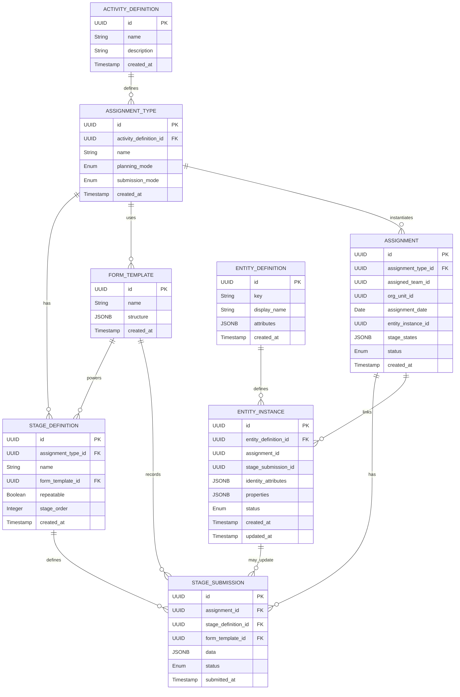

---

---

### How to migrate in stages

1. **Add metadata tables**

    * Create `activity_definitions`, `assignment_types`, `stage_definitions` and `form_templates` (if not already).
2. **Extend `assignments`**

    * Add `assignment_type_id`, `entity_instance_id`, `stage_states`, and `status`.
3. **Create submission table**

    * `stage_submissions` holds all form data, with an optional `stage_definition_id`.
4. **Introduce entity types**

    * `entity_definitions` → holds your repeat-entity schemas.
    * `entity_instances` → holds actual repeat data, linked to assignments/submissions.
5. **Wire up processing**

    * On form save: insert into `stage_submissions`; if template has an entity-bound section, upsert into `entity_instances`.
6. **Back-fill or migrate existing data**

    * For existing repeatable sections, you can run a one-off script that reads old JSON submissions and populates `entity_instances`, linking back to assignments.

This ER diagram and table list should give you a clear roadmap for expanding your schema—layering in stages and entities without breaking your current flow.
