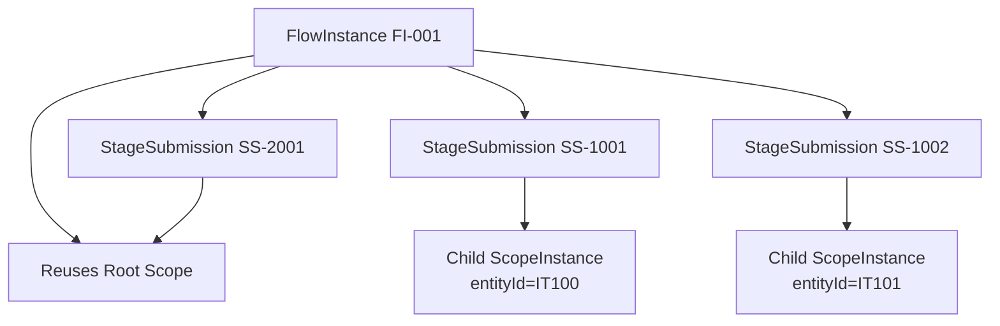

# key Design choices:

## ScopeInstance to flow and stage relation

**Key Points**

1. Every `FlowInstance` must have at least one `ScopeInstance` (the root scope) that captures the context for the entire
   flow (e.g., orgUnit, date, team, etc.).
2. When a stage is entity-bound (e.g., in a repeatable stage that captures data about a specific entity like an Item),
   each submission of that stage may create a new `ScopeInstance` that is linked to that specific entity. This new
   `ScopeInstance` is a child of the flow and is associated with one `StageSubmission`.
3. The relationship between `FlowInstance` and `ScopeInstance` is one-to-many: one flow can have multiple scopes (the
   root scope and potentially several stage scopes).
4. The `ScopeInstance` table serves as a single point for querying by any scope dimension (whether at the flow level or
   stage level).
5. The `ScopeInstance` has:

- `flow_instance_id` (non-null) to link to the parent flow.
- `stage_submission_id` (nullable) which is set only if the scope was created for a stage submission (and then it points
  to that stage submission).

### Design Choices:

#### Option 1: Current Design (as described in the initial model)

- `FlowInstance` has a reference to its root `ScopeInstance` (one-to-one for the root). But note that the `FlowInstance`
  does not directly reference the child scopes (those are linked via the `StageSubmission` and also by
  `flow_instance_id` in the `ScopeInstance` table).
- The `ScopeInstance` table has:
- `id` (PK)
- `flow_instance_id` (FK to FlowInstance, non-null)
- `stage_submission_id` (FK to StageSubmission, nullable) → if not null, then this scope was created for a stage
  submission and is not the root scope.
- `scope_data` (JSONB)
- This design allows:
- The root scope (for the flow) is created when the flow is created and has `stage_submission_id = null`.
- For an entity-bound stage, when a submission is made, a new `ScopeInstance` is created with `stage_submission_id` set
  to the new `StageSubmission` and `flow_instance_id` set to the parent flow. The `scope_data` will include the entity
  ID and possibly other context (like the parent flow's context?).
- **Querying**: To get all scopes for a flow (including the root and all stage scopes), you can query by
  `flow_instance_id`. To get the root scope, you can query by `flow_instance_id` and `stage_submission_id IS NULL`.
  Similarly, to get scopes for a particular stage submission, you can use the `stage_submission_id`.

#### Option 2: Hierarchical Scopes (parent-child)

- Alternatively, we could have a `parent_scope_id` in the `ScopeInstance` to form a tree. Then:
- The root scope would have `parent_scope_id = null` and `flow_instance_id` set.
- A stage scope would have `parent_scope_id` pointing to the root scope (or potentially to another scope?).

However, the initial design does not require this hierarchy because the stage scopes are independent and are linked to
the flow and the stage submission. Also, the requirement is to have a flat table for easy querying without recursion.

### Why the Current Design is Chosen:

1. **Simplicity in Querying**: The initial design allows all scopes (whether flow-level or stage-level) to be found by
   `flow_instance_id`. There is no need for recursive queries.
2. **Clear Ownership**: Each scope is owned by exactly one flow. Stage scopes are also owned by the flow and
   additionally linked to a stage submission.
3. **Reporting**: The design supports the requirement: "show me all stage submissions for Household HH123" by simply
   joining `stage_submissions` and `scope_instances` on `stage_submission_id` and filtering by
   `scope_data->>'entity_instance_id' = 'HH123'`.

### Potential Issue and Solution:

- **Inheritance of Scope Dimensions**: The stage-level scope might need to inherit some dimensions from the flow-level
  scope (e.g., orgUnit, date). How is this achieved?
- In the `resolveScope` method (in `ScopeService`), when creating a new stage scope, we can take the root scope's
  `scope_data` and add/override with the new entity and any other stage-specific dimensions.

- **Example:**
- Root scope: `{ orgUnit: "WH1", date: "2025-06-20", team: "A" }`
- Stage scope (for an item): `{ orgUnit: "WH1", date: "2025-06-20", team: "A", entityId: "IT100" }`
- This way, the stage scope has the full context.

### Code Adjustment:

In the `ScopeService` when creating a new stage scope:

```java
public ScopeInstance createStageScope(FlowInstance flow, Map<String, Object> additionalScopeData) {
    // Get the root scope data as a map
    Map<String, Object> rootScopeMap = objectMapper.convertValue(flow.getRootScope().getScopeData(), Map.class);

    // Merge with additionalScopeData (overriding if keys exist)
    rootScopeMap.putAll(additionalScopeData);
    ScopeInstance scope = new ScopeInstance();
    scope.setFlowInstance(flow);
    scope.setScopeData(objectMapper.valueToTree(rootScopeMap));

    return scopeRepo.save(scope);
}

```

### Conclusion:

The current design of having a `ScopeInstance` table that can have multiple records per flow (one root and multiple for
stages) is sound and meets the requirements. The `ScopeInstance` is designed to be a flat context record that captures
all the dimensions (including inherited ones for stages) for easy querying.

### Next Steps:

1. Implement the `ScopeInstance` entity and repository with the described fields.
2. Adjust the `FlowInstance` to have a reference to the root scope (one-to-one) and also have a one-to-many relationship
   to all scopes (if needed for easy access, but this can be queried via the repository).
3. In the `StageService`, when processing an entity-bound stage, call the `ScopeService` to create a new stage scope by
   merging the root scope data and the new entity data.

---

### Design Analysis: Scope Relationships

#### 1. Scope Hierarchy & Ownership



#### 2. Key Design Choices

| **Decision**                            | **Rationale**                                                                |
|-----------------------------------------|------------------------------------------------------------------------------|
| Single `flow_instance_id` on all scopes | Enables efficient "show all contexts for flow FI-001" queries                |
| `stage_submission_id` discriminator     | Clearly separates root (NULL) vs. child scopes                               |
| JSONB `scopeData` inheritance           | Child scopes automatically inherit orgUnit/date unless explicitly overridden |
| No parent-child FK between scopes       | Avoids recursive complexity; all scopes are siblings under the flow          |

#### 3. Query Performance Optimization

```sql
-- Find all item submissions in warehouse WH1
SELECT ss.*
FROM step_instance ss
         JOIN scope_instance si ON ss.scope_instance_id = si.id
WHERE si.scope_data ->> 'orgUnit' = 'WH1'
  AND si.scope_data ? 'entityId'
-- Only entity-bound stages

-- Create partial indexes
CREATE INDEX idx_scope_orgunit
    ON scope_instance ((scope_data ->> 'orgUnit'))
    WHERE stage_submission_id IS NULL;

CREATE INDEX idx_scope_entity
    ON scope_instance ((scope_data ->> 'entityId'))
    WHERE stage_submission_id IS NOT NULL;
```

---

### Code Implementation: Scope Handling

#### 1. Scope Inheritance Logic

```java

@Service
public class ScopeService {

    public ScopeInstance createChildScope(FlowInstance flow,
                                          StageSubmission submission,
                                          Map<String, Object> entityData) {

        // 1. Load root scope as base template
        JsonNode rootScope = flow.getRootScope().getScopeData();

        // 2. Merge entity data (override if conflicts)
        ObjectMapper mapper = new ObjectMapper();
        ObjectNode childScope = rootScope.deepCopy();
        childScope.setAll(mapper.valueToTree(entityData));

        // 3. Persist child scope
        ScopeInstance scope = new ScopeInstance()
            .setFlowInstance(flow)
            .setStageSubmission(submission)
            .setScopeData(childScope);

        return scopeRepo.save(scope);
    }
}
```

#### 2. Stage Submission with Scope Resolution

```java

@Transactional
public StageSubmission submitStage(UUID flowId, UUID stageDefId,
                                   Map<String, Object> formData) {

    FlowInstance flow = flowRepo.findById(flowId);
    StageDefinition stageDef = stageDefRepo.findById(stageDefId);

    // Resolve scope
    ScopeInstance scope;
    if (stageDef.isEntityBound()) {
        // Create child scope for entity
        Map<String, Object> entityData = extractEntityData(formData);
        scope = scopeService.createChildScope(flow, null, entityData); // submission added later
    } else {
        // Reuse root scope
        scope = flow.getRootScope();
    }

    // Create submission
    StageSubmission submission = new StageSubmission()
        .setFlowInstance(flow)
        .setStageDefinition(stageDef)
        .setScopeInstance(scope);

    // Back-link scope to submission if child
    if (stageDef.isEntityBound()) {
        scope.setStageSubmission(submission); // Set FK after submission created
        scopeRepo.save(scope);
    }

    return stageRepo.save(submission);
}
```

#### 3. JPA Entity Definitions

```java

@Entity
public class ScopeInstance {
    @Id
    private UUID id;

    @ManyToOne(optional = false)
    @JoinColumn(name = "flow_instance_id")
    private FlowInstance flowInstance;

    @OneToOne
    @JoinColumn(name = "stage_submission_id")
    private StageSubmission stageSubmission; // NULL for root

    @Column(columnDefinition = "JSONB")
    private JsonNode scopeData;
}

@Entity
public class StageSubmission {
    @Id
    private UUID id;

    @ManyToOne(optional = false)
    private FlowInstance flowInstance;

    @OneToOne
    @JoinColumn(name = "scope_instance_id")
    private ScopeInstance scopeInstance; // Always populated
}
```

---

### Testing Scenarios

#### 1. Root Scope Inheritance Test

```java

@Test
void entityBoundStage_inheritsRootScopes() {
    // Given root scope: {orgUnit: "WH1", date: "2025-06-20"}
    FlowInstance flow = createFlowWithRootScope();

    // When submitting entity-bound stage
    Map<String, Object> formData = Map.of("itemId", "IT100", "batch", "BATCH001");
    StageSubmission submission = stageService.submitStage(flow.getId(), entityStageId, formData);

    // Then child scope contains root + entity data
    JsonNode scope = submission.getScopeInstance().getScopeData();
    assertThat(scope.get("orgUnit").asText()).isEqualTo("WH1");
    assertThat(scope.get("itemId").asText()).isEqualTo("IT100");
}
```

#### 2. Scope Isolation Test

```java

@Test
void twoEntities_createsSeparateScopes() {
    // Submit first entity
    stageService.submitStage(flowId, entityStageId, Map.of("itemId", "IT100"));

    // Submit second entity
    stageService.submitStage(flowId, entityStageId, Map.of("itemId", "IT101"));

    // Verify two distinct child scopes
    List<ScopeInstance> scopes = scopeRepo.findByFlowInstanceId(flowId);
    assertThat(scopes)
        .hasSize(3) // root + 2 children
        .extracting(s -> s.getScopeData().get("itemId"))
        .containsExactlyInAnyOrder(null, "IT100", "IT101");
}
```

---

**Scope Override Semantics**: child Inherits root scope, allows adding new keys, and allow overriding root dimensions (
e.g., changing entity, date,..., )? (Implement scope inheritance with deep copy)

### Next Steps & Open Questions

1. **Scope Override Semantics**
    - Should child scopes allow overriding root dimensions (e.g., changing date)?
    - Current design: Inherits root, allows adding new keys, but doesn't override existing.

2. **Bulk Operations**
    - How to handle "re-scope all submissions for warehouse WH1 to WH2"?

3. **Concurrency Controls**
    - Add `@Version` to `FlowInstance` to prevent conflicting scope updates?

4. **Historical Tracking**
    - Should we version `scopeData` changes for auditing?

5. **Performance Testing**
    - Benchmark queries with 100K+ scope instances
    - Validate JSONB index effectiveness

**Immediate Actions**:

1. Implement scope inheritance with deep copy
2. Add partial DB indexes for common query patterns
3. Write integration tests for multi-scope workflows

Let me know which area needs deeper exploration!
