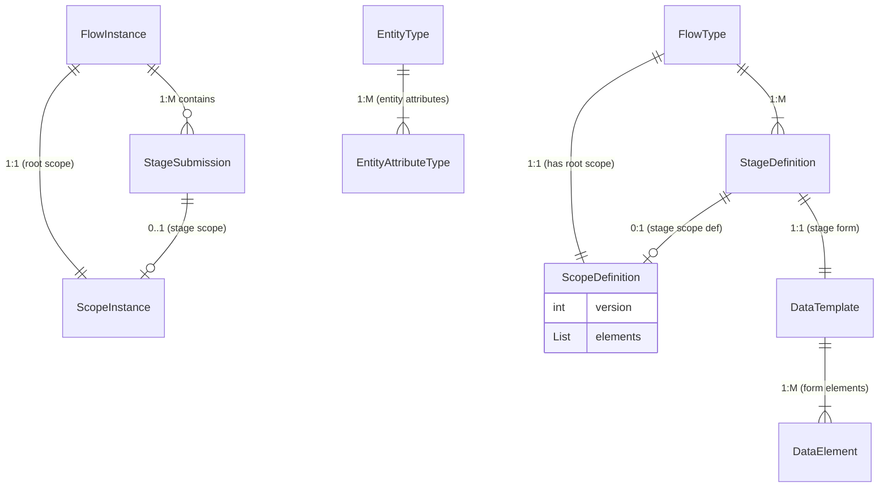
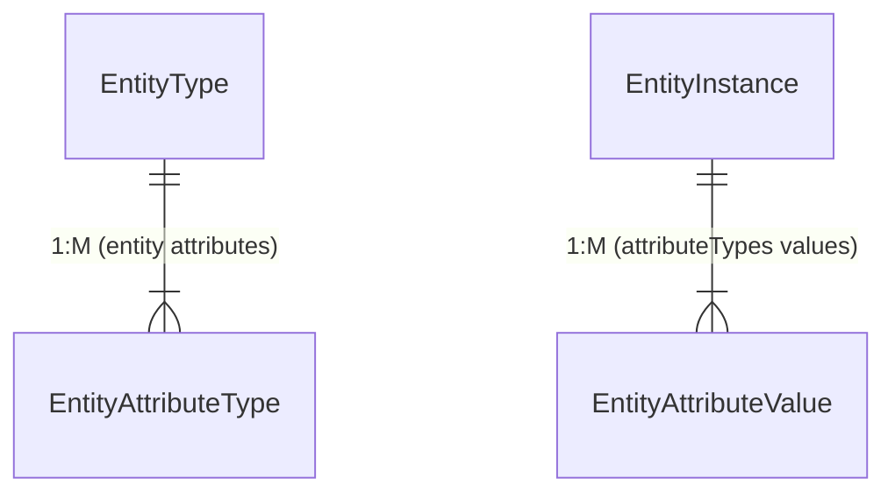
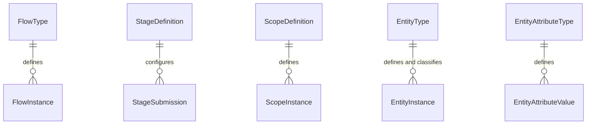

# Proposal For initial Model for multi-stage flow data entry

**Understanding**: I am Designing a metadata-driven workflow system supporting multi-stage data entry flows across
domains (
inventory, healthcare, surveys). Key requirements:

1. **Flexible Scoping**: Capture context (orgUnit/team/date/entity) at flow and stage levels for filtering/reporting
2. **Multi-Stage Support**: Handle repeatable stages
3. **Evolution Simplicity**: Start minimal (single developer) and scale gradually

## Initial Assumptions

1. Moderate data volumes (<500K flows/year initially)
2. Spring boot, JPA/Hibernate used for ORM
3. No real-time analytics requirements
4. initially its ok to use JSONP for parts of the model until getting the core working, we may refactor some.

---

## Core Concepts

### Flows (**the shape** and configuration of a process)

* **FlowType**
    * Defines **the shape** of a process: Workflow template (scope/stage definitions)
    * a FlowType can be defined with 1 or more stages, and only one scopeDefinition.
    * **scope** (a required flow level ScopeDefinition, with at least `ORGUNIT,` and `DATE` scope elements).
    * **Stages** (a one or more StageDefinitions)
* **FlowInstance**

    * A runtime instantiation of a FlowType, has and links to:
        * `scopeInstance` (map of the chosen team/orgUnit/date/… values)
        * `status` (IN\_PROGRESS → COMPLETED | CANCELLED)
        * `stageSubmissions` (defined stages submissions, repeated, or multiple of different stages per config)

### Domain Object `Entity`

* **EntityType**

    * Defines a “referencable domain object” (Household, Patient, etc.).
    * Lists key attributes (which map to `EntityAttributeTypes`).

* **EntityAttributeType**

    * One record of an Defined EntityAttribute type per entityInstance, created/updated when creating/updating an
      EntityInstance.
    * Linked back to the EntityInstance and the attributeType definition.

* **EntityInstance**

    * Defines an “entity attribute configuration” (type, name, ...etc).
    * Created/updated by a dedicated form and process.
    * Linked back to the Scopes of the (flows/of stages) that they are enrolled in, when enrolling in a scopeInstance.
    * After creating an EntityInstances, their attributes are rarely updated, it can be selected/referenced on different
      flow (per configuration)

* **EntityAttributeValue**

    * One record ber value.
    * Linked back to the `EntityInstance` and its definition `EntityAttributeType`.

* **EntityInstance Example:**

```json-sample
    {
      "entityInstanceId": "HH001",  // Household ID, can be used as lookup key
      "entityType": "Household", 
      "entityAttributesValues": [
        {"attributeType": "householdAttributeType", "value": "HH001"}, // can be used as lookup key
        {"attributeType": "addressAttributeType", "value": "123 Main St"}
      ],
      "createdBy": "userId456",
      "createdDate": "2025-05-24T10:00:00Z",
      "status": "ACTIVE",  // ACTIVE, INACTIVE, ARCHIVED
    }
```

### Scopes (Dimensioning data)

A configured single, shareable record that captures “all the context” for either a whole flow (root scope instance) or
an individual stage submission. Why? Scope is **Single join point** for any reporting or grouping of rows we do by
“dimensions”, Components related to scoping:

* **ScopeDefinition**:

    * Configuration of a scope, contains different `ScopeElement`s which are the scope's dimensions, like: team,
      orgUnit...etc.

* **ScopeElement**:
    * ScopeElementTypes: [ORG_UNIT, TEAM, ENTITY, ATTRIBUTE]
    * **example of `ScopeElement` configurations:**
        * TEAM: `{ "key": "team", "type": "TEAM" , "required": true, "multiple":false }`.
        * ENTITY:
          `{ "key": "household", "type": "ENTITY", "required":true, "multiple": false, "entityTypeId": "householeET" }`.
        * ATTRIBUTE: `{ "key": "invoiceNumber", "type": "NUMBER", "required": true, "multiple": false }`

* **ScopeInstance**

    * The runtime instance (values) of a scope definition.

### 3. Stages (the row data)

* **StageDefinition**

    * A named step in a multi-stage FlowType, points to one `DataTemplate` + repeatable flag, and optionally one
      stage-level ScopeDefinition.

* **StageSubmission**

    * The actual submission of that stage.
    * If stage defines a scope, the submission's data is scoped by this scope nested under parents, otherwise data is
      scoped only by parent's flowInstance scope.

---

## Core Relationships

### Configurations Entity Relationships



### Entity and Attributes



### configuration-to-instance Entity Relationships



---

## Simple Code Implementation

### ScopeInstance Entity (Core)

```java

import com.fasterxml.jackson.databind.JsonNode;

@Entity
@Table(name = "flow_type")
public class FlowType {
    @Id
    private String id;
    private String name;
    @Type(JsonType.class)
    @Column(columnDefinition = "jsonb", optional = false)
    private ScopeDefinition scopeDefinition; // Flow-level scope definitions
    @OneToMany(cascade = CascadeType.ALL, orphanRemoval = true)
    private List<StageDefinition> stages;
}


@Entity
@Table(name = "stage_definition")
public class StageDefinition {
    @Id
    private String id;
    private String name;
    private boolean repeatable;
    @Type(JsonType.class)
    @Column(columnDefinition = "jsonb", optional = true)
    private ScopeDefinition scopeDefinition; // Stage-level scopes
}


@Entity
@Table(name = "flow_instance")
public class FlowInstance {
    @Id
    private String id;

    @ManyToOne(optional = false)
    private FlowType flowType;

    @OneToOne(mappedBy = "flowInstance", cascade = CascadeType.ALL, optional = false)
    private ScopeInstance rootScope; // Root scope

    @OneToMany(mappedBy = "flowInstance")
    private List<StageSubmission> stages = new ArrayList<>();
}


@Entity
@Table(name = "stage_submission")
public class StageSubmission {
    @Id
    private String id;

    @ManyToOne(optional = false)
    private FlowInstance flowInstance;

    @ManyToOne(optional = false)
    private StageDefinition stageDefinition;

    @OneToOne(cascade = CascadeType.ALL, mappedBy = "stageSubmission", optional = true)
    private ScopeInstance stageScope; // Optional stage-specific scope

    @Type(JsonType.class)
    @Column(columnDefinition = "jsonb")
    private JsonNode instanceData; // Data Template data
}


@Entity
@Table(name = "scope_instance",
    indexes = {
        @Index(name = "idx_scope_flow", columnList = "flow_instance_id"),
        @Index(name = "idx_scope_stage", columnList = "stage_submission_id"),
        @Index(name = "idx_scope_entity", columnList = "entity_instance_id"),
        @Index(name = "gin_scope_data", columnList = "scope_data",
            columnDefinition = "USING gin")
    })
@Check(constraints =
    "(flow_instance_id IS NOT NULL AND stage_submission_id IS NULL) OR " +
        "(flow_instance_id IS NULL AND stage_submission_id IS NOT NULL)")
public class ScopeInstance {
    @Id
    private String id;

    @Version
    private Integer version; // Optimistic lock

    @OneToOne
    @JoinColumn(name = "flow_instance_id")
    private FlowInstance flowInstance;

    @OneToOne
    @JoinColumn(name = "stage_submission_id")
    private StageSubmission stageSubmission;

    // Regularly used dimensions
    private String orgUnitId;
    private String teamId;
    private String entityInstanceId; // Entity binding (optional)
    private LocalDate scopeDate;

    // Flexible JSONB for Less Common Custom dimensions (e.g., code, invoiceNumber, typeOfSomething)
    @Type(JsonType.class)
    @Column(columnDefinition = "jsonb")
    private JsonNode extraScopeData;
}

// EntityType and EntityInstance are standard; omitted for brevity.
```

## Scope Configuration Examples

**FlowType Definition (Receive Inventory):**

```json-sample
{
    "stages": [
        {
            "id": "unpackCheck",
            "name": "Unpack & Quality Check",
            "dataTemplate": {
                "id": "dtId", 
                "version": "1.0", 
                elements: ["name": "quantity", "type": "NUMBER"]
                },
            "scopeDefinition": {
                "version": "1.0",
                "elements": [
                { "key": "item", "type": "ENTITY", "entityTypeId": "item" },
                { "key": "batch", "type": "TEXT", "required": true }
            ]
            },
        },
        {
            "id": "storeItem",
            "name": "Store Items",           
            "dataTemplate": {...}, //storeItem data template defenition
            "scopeDefinition": {
                "version": "1.0",
                "elements": [
               { "key": "storageLocation", "type": "ENTITY", "entityTypeId": "location" }
              ]
            }
        }
    ]
}
```

**ScopeInstance Creation:**

1. Root scope: `{orgUnit: "WH-1", date: "2025-06-20", invoice: "INV-001"}`
2. Unpack stage: `{item: "ITEM-123", batch: "BATCH-A"}`, instanceData: `{ "quantity": "30.0" }`
3. Store stage: `{storageLocation: "SHELF-A1"}`, instanceData: `{ ... }`
