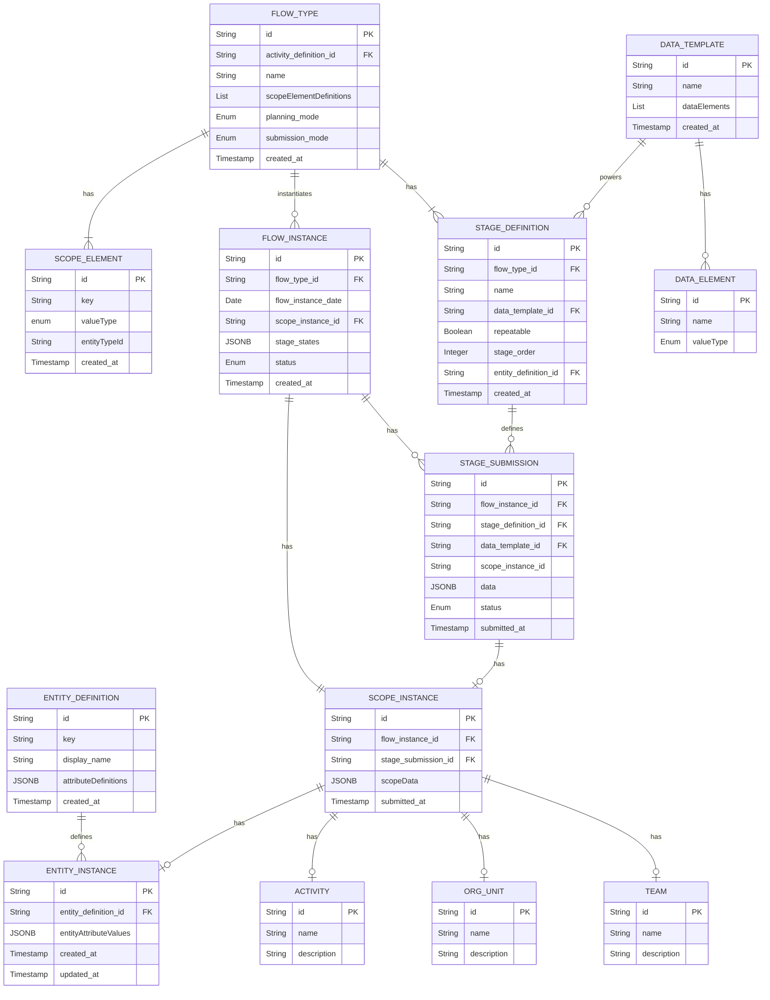

# Stages, flow_instance, submission workflow

## Diagram

```mermaid
erDiagram
    FLOW_TYPE ||--|{ SCOPE_ELEMENT: has
    FLOW_TYPE ||--|{ STAGE_DEFINITION: has
    FLOW_TYPE ||--o{ FLOW_INSTANCE: instantiates
    FLOW_INSTANCE ||--o{ STAGE_SUBMISSION: has
    FLOW_INSTANCE ||--|| SCOPE_INSTANCE: has
    STAGE_DEFINITION ||--o{ STAGE_SUBMISSION: defines
    DATA_TEMPLATE ||--o{ STAGE_DEFINITION: powers
    STAGE_SUBMISSION ||--o| SCOPE_INSTANCE: has
    DATA_TEMPLATE ||--o{ DATA_ELEMENT: has
    ENTITY_DEFINITION ||--o{ ENTITY_INSTANCE: defines
    SCOPE_INSTANCE ||--o| ENTITY_INSTANCE: has
    SCOPE_INSTANCE ||--o| ACTIVITY: has
    SCOPE_INSTANCE ||--o| ORG_UNIT: has
    SCOPE_INSTANCE ||--o| TEAM: has
%% Table-entity definitions
    FLOW_TYPE {
        String id PK
        String activity_definition_id FK
        String name
    %% {}
        List scopeElementDefinitions
    %% PLANNED LOG_AS_YOU_GO
        Enum planning_mode
    %% SINGLE MULTI_STAGE
        Enum submission_mode
        Timestamp created_at
    }
%% Definition of a scope element
    SCOPE_ELEMENT {
        String id PK
        String key
    %% valueType.ORG_UNIT, valueType.TEAM, valueType.ACTIVITY, valueType.ENTITY, valueType.DATE, ...
        enum valueType
    %% when valueType.ENTITY, provide the id of its type, e.g. "Household", "Patient"
        String entityTypeId
        Timestamp created_at
    }
    STAGE_DEFINITION {
        String id PK
        String flow_type_id FK
        String name
        String data_template_id FK
        Boolean repeatable
        Integer stage_order
    %% if the
    %% where entity fits better, option1: bound entity to a stage instance in flow instance level
        String entity_definition_id FK
        Timestamp created_at
    }
    DATA_TEMPLATE {
        String id PK
        String name
    %% your existing template JSON (DataElements)
        List dataElements
        Timestamp created_at
    }
%% optional pre-created and pre-link scope for planned flow instances
    FLOW_INSTANCE {
        String id PK
        String flow_type_id FK
        Date flow_instance_date
    %% entity_instance_id {team: team_id, orgUnit: ou_id, entity: ei_id, ...}
        String scope_instance_id FK
    %% { stageId: [...submissionIds] }
        JSONB stage_states
    %% PLANNED, IN_PROGRESS, COMPLETED, CANCELLED
        Enum status
        Timestamp created_at
    }
%% default implicit single stage if no stages
    STAGE_SUBMISSION {
        String id PK
        String flow_instance_id FK
        String stage_definition_id FK
        String data_template_id FK
    %% nullable if scoped by parent
        String scope_instance_id
        JSONB data
    %% PENDING, SUBMITTED, REJECTED
        Enum status
        Timestamp submitted_at
    }
    SCOPE_INSTANCE {
        String id PK
        String flow_instance_id FK
    %% null if a scope is of flow instance
        String stage_submission_id FK
    %% a map of scope elements values
        JSONB scopeData
        Timestamp submitted_at
    }
    ENTITY_DEFINITION {
        String id PK
    %% e.g. "Household", "Patient"
        String key
        String display_name
    %% list of { id, type, required }
        JSONB attributeDefinitions
        Timestamp created_at
    }
    ENTITY_INSTANCE {
        String id PK
        String entity_definition_id FK
    %% e.g id, name, code
        JSONB entityAttributeValues
        Timestamp created_at
        Timestamp updated_at
    }
    DATA_ELEMENT {
        String id PK
        String name
        Enum valueType
    }
%% System entities
    ACTIVITY {
        String id PK
        String name
        String description
    }

    ORG_UNIT {
        String id PK
        String name
        String description
    }

    TEAM {
        String id PK
        String name
        String description
    }
```

