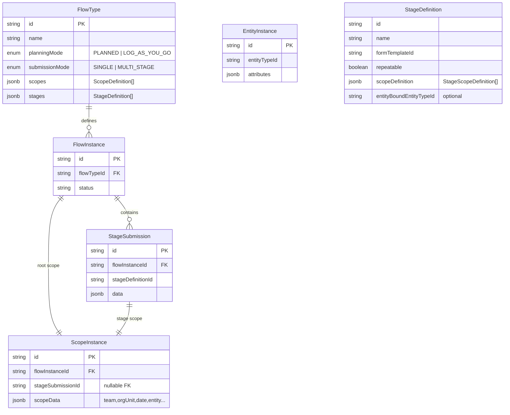
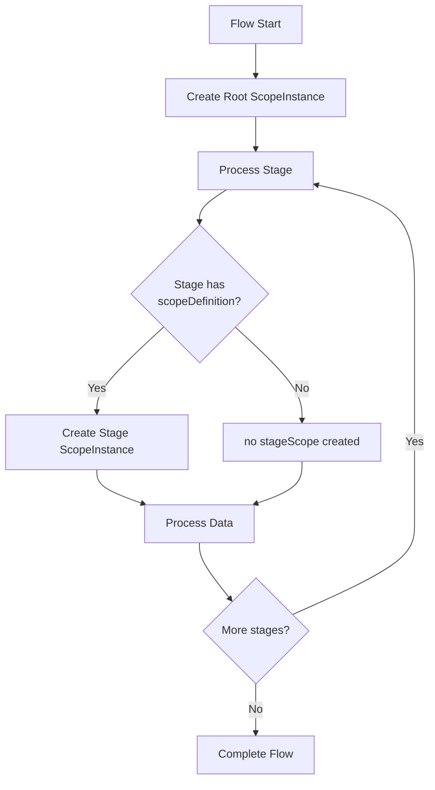
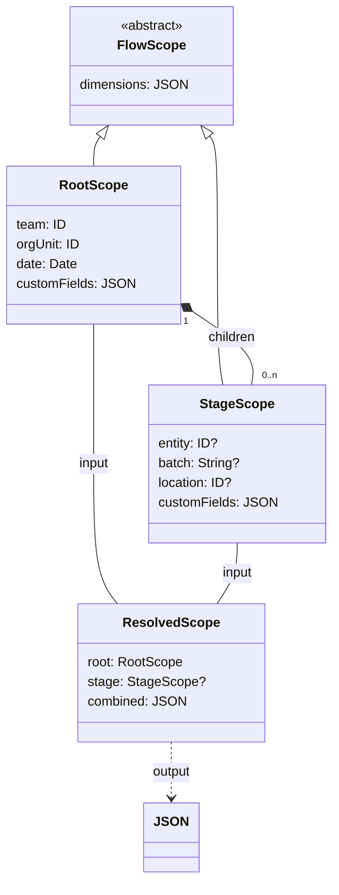
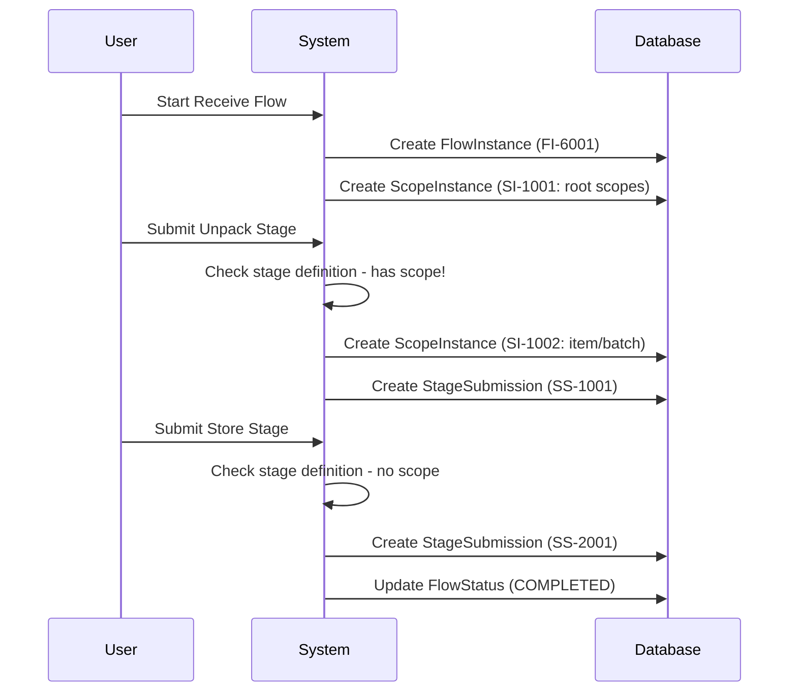

Here's the revised model with stage-level scoping capabilities, maintaining your core concepts while adding the
flexibility for stages to define their own scoping dimensions:

### 1. Core ER Diagram with Stage Scoping



Key changes:

1. Added `scopeDefinition` to `StageDefinition`
2. Made `ScopeInstance` relationship with `StageSubmission` mandatory
3. Removed entity-binding as special case (now just part of scopeDefinition)

### 2. Scope Inheritance Flow



### 3. Scope Resolution Hierarchy



### 4. Inventory Receive Flow with Stage Scoping



### Implementation Logic for Stage Scoping

```python
def handle_stage_submission(flow_instance, stage_definition, form_data):
    # Resolve scope
    if stage_definition.scopeDefinition:
        # Create new scope instance for stage
        stage_scope = create_scope_instance(
            flow_instance.id,
            stage_submission_id=None,  # Set later
            scope_data=resolve_scope_values(stage_definition.scopeDefinition, form_data)
        )
    else:
        # Inherit from flow root scope
        stage_scope = flow_instance.root_scope
    
    # Create stage submission
    submission = create_stage_submission(
        flow_instance.id,
        stage_definition.id,
        data=form_data,
        scope_instance_id=stage_scope.id
    )
    
    # Update scope instance with submission reference
    if stage_definition.scopeDefinition:
        stage_scope.stage_submission_id = submission.id
        save(stage_scope)
    
    # Handle entity binding if defined in scope
    if entity_type := stage_definition.entityBoundEntityTypeId:
        entity_id = form_data.get(entity_type.identifier_field)
        upsert_entity(entity_type, entity_id, form_data)
```

### Scoping Configuration Examples

**FlowType Definition (Receive Inventory):**

```json
{
    "stages": [
        {
            "id": "unpackCheck",
            "name": "Unpack & Quality Check",
            "scopeDefinition": [
                {
                    "key": "item",
                    "type": "ENTITY",
                    "entityTypeId": "item"
                },
                {
                    "key": "batch",
                    "type": "TEXT",
                    "required": true
                }
            ],
            "entityBoundEntityTypeId": "item"
        },
        {
            "id": "storeItem",
            "name": "Store Items",
            "scopeDefinition": [
                {
                    "key": "storageLocation",
                    "type": "ENTITY",
                    "entityTypeId": "location"
                }
            ]
        }
    ]
}
```

**ScopeInstance Creation:**

1. Root scope: `{orgUnit: "WH-1", date: "2025-06-20", invoice: "INV-001"}`
2. Unpack stage: `{item: "ITEM-123", batch: "BATCH-A"}`
3. Store stage: `{storageLocation: "SHELF-A1"}`

### Query Advantages

```sql
/* Get all unpack submissions for specific item */
SELECT ss.*
FROM stage_submissions ss
         JOIN scope_instances si ON ss.scope_instance_id = si.id
WHERE si.scope_data ->> 'item' = 'ITEM-123'

/* Get all storage operations in location */
SELECT ss.*
FROM stage_submissions ss
         JOIN scope_instances si ON ss.scope_instance_id = si.id
WHERE si.scope_data ->> 'storageLocation' = 'SHELF-A1'
```

This revised model maintains your core concepts while:

1. Making stage scoping a first-class citizen (not just for entities)
2. Keeping entity binding as optional specialization
3. Preserving the ScopeInstance single-table advantage
4. Simplifying query patterns with direct stage-scope relationships
5. Allowing gradual complexity (stages can start without scopes)
6. Enabling cross-flow reporting through consistent dimensioning

The changes are minimal in implementation but significantly expand the flexibility for healthcare workflows where stages
might need to scope by patient/encounter while still inheriting facility/team context.
