# Core Concepts

1. **FlowType**

    * Defines **the shape** of a process:

        * `planningMode` (PLANNED | LOG\_AS\_YOU\_GO)
        * `submissionMode` (SINGLE | MULTI\_STAGE)
        * **Scopes** (ScopeDefinition, contains `ScopeElement` which are the dimensions like: team, orgUnit, entityType,
          Or an Attribute i.e DATE, STRING, NUMBER e.g invoiceNumber )
        * **Stages** (a StageDefinition each linked to a formTemplate, repeatable flag, optional entityBinding)
    * Example (Receive Inventory Flow type)
2. **FlowInstance**

    * A runtime instantiation of a FlowType, with:
        * `scopeInstance` (map of the chosen team/orgUnit/date/… values)
        * `status` (PLANNED → IN\_PROGRESS → COMPLETED | CANCELLED)
        * `stageStates` (map of stageId → list of submissionIds, for repeatable stages)

3. **StageSubmission**

    * One row per form submit, tied to a FlowInstance and (optionally) a StageDefinition.
    * ScopeInstance if the stage definition define an entity-bound, or it would be scoped only by parent scopeInstance
      elements.

4. **EntityInstance**

    * Spawned only when a stage or a stage's form section is **entity-bound**; upserted post-submission and linked back
      to its FlowInstance (and stageInstance).
5. ScopeDefinition:
    * Contains different `ScopeElement`s.
6. ScopeElement: ScopeElementTypes: [ORG_UNIT, TEAM, ENTITY, ATTRIBUTE]
    * define a scope Element configuration, for example:
        * TEAM,ORG_UNIT: `{ "key":"team","type":"TEAM","required":true,"multiple":false }`.
        * ATTRIBUTE: `{ "key":"invoiceNumber", "type":"NUMBER", "required":true, "multiple":false }`
7. **ScopeInstance**
    * every flow would at least be scoped by `ORGUNIT,` and `DATE`, other optional scoping elements: `TEAM`, `ACTIVITY`,
      `ENTITY`. its the values of the `ScopeDefinition`'s Elements.
    * A single, shareable record that captures “all the context” for either a whole flow (root scope instance) or an
      individual stage submission.

---

## Some Key Details About Scoping

### Formal Definition:

**`ScopeDefinition` → `ScopeInstance`** can be the context of a data, the something(s) that a flow, or stage(s) are
associated with and grouped by, can be one or more of:

- A system core entity `ORGUNIT (location)`, `USER`, `TEAM`, `ACTIVITY`.
- An `ENTITY` restricted to a certain `entity_type_id`.
- A `DATE`.
- Or a free typed-attribute like `INVOICE_No, DATE...`.

**Scope Instance Table Fields:**

* `flow_instance_id`: always points back to the parent flow.
* `stage_submission_id`: null when this SI was created at flow start; set when created by a stage.
* A JSONB scope defined dims `scopeData` (entity_instance_id, team_id, org_unit_id, date…).
* **Why it helps**
    - **Single join point** for any reporting or grouping you do by “scope.”
    - You never need to remember “is the entity in FlowInstance.scopes or StageSubmission.scopes?” — everything is in
      one table.
    - Easy to query: “show me all stage submissions for Household HH123” ⇒ join `stage_submissions → scope_instances`
      where `scope_data->>entity_instance_id = HH123`.

### Scoping Dimension Flow

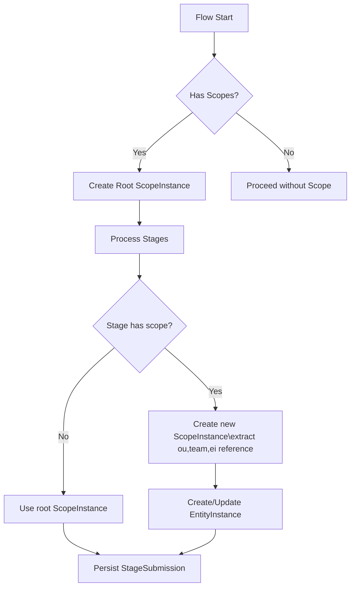

### 2. How It Works in Each Scenario

#### 2.1 One‐Off Form

* **On Start**:

    * Create `FlowInstance` (FI-001).
    * Create `ScopeInstance` (SI-001) with `flow_instance_id = FI-001`, one default `stage_submission_id` linking back
      `=null`
      and a `scope_data` JSONB with the least defined scope dims, no `entity_instance_id` (unless the flow’s scope
      deliberately included an entity).

**One‐Off Form Flow Diagram**

This diagram shows the steps when a user submits a one-off form (SINGLE submission mode).

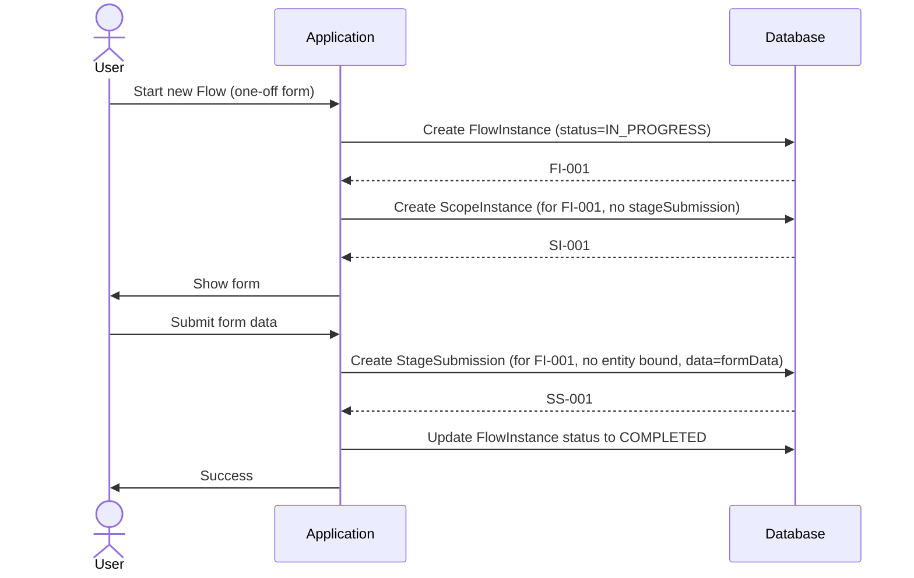

#### 2.2 Multi‐Stage (ordered), No Repeats

* **Flow Start**: SI-001 created.
* **Each Stage Submit**: ordered (no stage is accepted if previous is not already exist and valid)

    * SS-N is created. `stageSubmission.stageScope=null`
    * process in sequence (first or check previous if exist in system or in same payload)

**This diagram shows a multi-stage flow without repeatable stages**

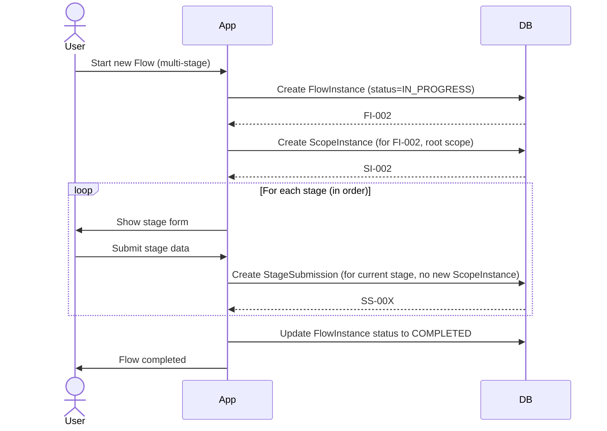

#### 2.3 Multi‐Stage, Scope with Entity at One Stage (entities pre exist in the system 'dropdown selection')

* **Flow Start**: SI-001 , flow scope with the least flow level's required dims `OrgUnit, and scopeDate` .
* **Stage “Enroll”**: for each repeated submission:

    1. Create SS-2a.
    2. Create *new* SI-002 with `flow_instance_id=FI`, `stage_submission_id=SS-2a`, and
       `scope_data={"entity_instance_id": P001}`.
    3. Next repeat ⇒ SI-003 for P002, etc.

* **This diagram shows a multi-stage flow where one stage is repeatable and entity-bound**

    ```mermaid
    sequenceDiagram
        actor User
        participant App
        participant DB
        User ->> App: Start new Flow
        App ->> DB: Create FlowInstance (FI-003, status=IN_PROGRESS)
        DB -->> App: FI-003
        App ->> DB: Create ScopeInstance (root scope for FI-003: SI-003)
        DB -->> App: SI-003
        Note over User, DB: Stage 1: Entity-bound and repeatable
    
        loop For each entity (e.g., each item)
            User ->> App: Start new repeat for Stage1
            App ->> User: Show stage1 form
            User ->> App: Submit form for one entity (e.g., item)
            App ->> DB: Create StageSubmission (SS-00Y for FI-003, stage1)
            DB -->> App: SS-00Y
            App ->> DB: Create ScopeInstance (for SS-00Y, with entityId=...)
            DB -->> App: SI-00Y
            App ->> DB: Create/Update EntityInstance (if new entity, or update attributes)
    
        end
    
        Note over User, DB: Next stage (non-repeatable)
        User ->> App: Submit next stage
        App ->> DB: Create StageSubmission (SS-00Z for FI-003, stage2, no new ScopeInstance)
        DB -->> App: SS-00Z
        App ->> DB: Update FlowInstance status to COMPLETED
        App ->> User: Flow completed
    ```

#### 2.4 Planned Visit to Existing Entity

* **Flow Start**: FI linked to existing flowScope `SI-001` with `{entity_instance_id=HH999}`.
* **Stage 1**: SS-001 is just data that is grouped by parent root scope instance.
* **No extra** SI needed unless a stage binds *another* entity (e.g. enrolling a member).

#### 2.5 Ad‐Hoc (“Log‐As‐You‐Go”)

* **FlowInstance** created on‐demand ⇒ SI-001 created at same time.
* **Stage Submission** ⇒ null.
* **When to create**

    * **Always on flow start** (tie the flow’s scope).
    * **Also** when a stage binds a *new* entity → new SI with `stage_submission_id`.

---

This is supposed to cover different workflows scenarios: campaign-data, inventory, health facility cases, surveys ...

## Example OF WorkFlow Configuration for “Receive Inventory”:

**User sees “Receive Inventory” on their FlowInstance List**

### **FlowInstance**

* **Flow Instance Scope dims Capturing**
    * Form fields:

        1. **ScopeDefinition elements:**
            * `supplierId` (core dim `ENTITY`: `EntityType` “Supplier” dropdown)
            * `teamId` (core dim `TEAM`: automatically injected, or selected, current user’s team) or select
            * `orgUnitId` (core dim `ORG_UNIT`: warehouse location for this assignment)
            * `invoiceNumber` (extra dim `STRING`) value will be stored in `ScopeAttributes`
            * `receiveDate` (extra dim `DATE`) value will be stored in `ScopeAttributes`
        2. **dataTemplate elements**:{`quantityReceived` (number), `qualityStatus` (Good/Damaged)}

    * On “Save,” we insert a `FlowInstance` row, and `FlowScope` row with core attributes and extra dim
      scopeAttributes.
    * No EntityInstances created, just suppliers are selected from a pre-existing entities.

    * **Stage 1: “Unpack & Quality Check”**
        * Stage definition fields:
            1. **ScopeDefinition elements:**
                * `itemId` (core dim `ENTITY`: EntityType “Item” dropdown)
                * `batchNumber` (extra dim `STRING`:)
                * `expirationDate` (extra dim `DATE`)
            2. **dataTemplate elements**:{`quantityReceived` (number), `qualityStatus` (Good/Damaged)}
            3. repeatable = true

    * **Stage 3: “Store in Warehouse” Single‐submission stage:**
        * Stage definition fields:
            1. **ScopeDefinition elements:**
                * `storageLocationId` (core dim `ENTITY`: “Location/Shelf” or simple dropdown item)
            2. **dataTemplate elements**:{`quantityReceived` (number), `qualityStatus` (Good/Damaged)}
                * `storageLocationId` (EntityType “Location” or simple dropdown)
                * Optionally, a multi‐select of which `EntityInstance` items (from Stage 2) go to that location—though
                  we can also assume “all from Stage 2” if our process dictates.
            3. repeatable = false.

### INSERTS SAMPLES

Below is a concrete **Warehouse Inventory** example showing how we’d model **Receive**, **Issue**, and **Discard** flows
with the metadata‐driven engine. It includes:

1. **EntityType** definitions for the core “things” (Item, Supplier).
2. **FlowType** definitions for the three key workflows.
3. Example **FlowInstance** JSON for each.
4. Sketches of **StageSubmission** and **EntityInstance** behavior.

Receive Inventory Flow Example

---

### 1. EntityType Definitions

#### 1.1. `Item`

```jsonc
// POST /api/entity-types
{
  "id": "itemEntityTypeId",
  "name": "Inventory Item",
  "attributes": [
    { "id":"itemId",        "type":"string", "required":true },
    { "id":"itemName",      "type":"string", "required":true },
    { "id":"unitOfMeasure", "type":"string", "required":true }
  ]
}
```

#### 1.2. `Supplier`

```jsonc
{
  "id": "supplierEntityTypeId",
  "name": "Supplier",
  "attributes": [
    { "id":"supplierId",   "type":"string", "required":true },
    { "id":"supplierName", "type":"string", "required":true }
  ]
}
```
// other entityTypes definition as needed

#### 2. FlowType Definitions

##### 2.1. Receive Inventory Flow type

```jsonb
// POST /api/flow-types
{
    "id": "receiveInventory",
    "name": "Receive Inventory",
    "forceStageOrder": true,
    "submissionMode": "MULTI_STAGE",
    "flowScopeDefinition": {
    "scopeElements": [
      {
        "key": "Warehouse",
        "type": "ORG_UNIT",
        "coreElement": true,
        "required": true
      },
      {
        "key": "Receiving Team",
        "type": "TEAM",
        "coreElement": true,
        "required": false
      },
      {
        "key": "Supplier",
        "type": "ENTITY",
        "coreElement": true,
        "required": true,
        "entityTypeId": "SUPPLIER"
      },
      {
        "key": "Invoice #",
        "type": "STRING",
        "coreElement": false,
        "required": true
      }
    ]
  },
    "flowScopeDefinition": {
        "scopeElements": [
            { "key":"supplier","type":"ENTITY",   "required":true,  "multiple":false, "entityTypeId":"Supplier" }
            { "key":"team",    "type":"TEAM",     "required":true,  "multiple":false },
            { "key":"orgUnit", "type":"ORG_UNIT", "required":true,  "multiple":false },
            { "key":"date",    "type":"DATE",     "required":true,  "multiple":false },
            { "key":"invoiceNumber",    "type":"NUMBER",     "required":true,  "multiple":false },
        ]  
  },
  "stages": [
    {
      "id":"unpackCheck",
      "name":"Unpack & Quality Check",
      "sortOrder": 2,
      "formTemplateId":"unpackForm", // {contains: quantityReceived, and qualityStatus elements definitions }
      "repeatable":true,
      "stageScopeDefinition": {
        "scopeElements": [
            { "key":"item","type":"ENTITY",   "required":true,  "multiple":false, "entityTypeId":"ItemEntityTypeId" }         
        ]
      }
    },
    {
      "id":"storeItem",
      "sortOrder": 3,
      "name":"Store Items",
      "formTemplateId":"storeForm",
      "repeatable":false,
      "stageScopeDefinition": {
        "scopeElements": [ // or it can be defined as an optionSet dropdown, not entity.
            { "key":"item","type":"ENTITY",   "required":true,  "multiple":false, "entityTypeId": "storageLocationEntityTypeId" }         
        ]
      }
    }
  ]
}
```

##### 2.2. Issue Inventory

```jsonc
{
  "id": "issueInventory",
  "name": "Issue Inventory",
  "forceStageOrder": true,
  "submissionMode": "MULTI_STAGE",
  "stageScopeDefinition": {
        "scopeElements": [ 
            { "key":"team","type":"TEAM","required":true,"multiple":false },
            { "key":"orgUnit","type":"ORG_UNIT","required":true,"multiple":false },
            { "key":"date","type":"DATE","required":true,"multiple":false }         
        ]
   }
  "stages":[
    {
      "id":"pickItems",
      "name":"Pick Items",
      "formTemplateId":"pickForm",
      "sortOrder": 1,
      "repeatable":true,
      "stageScopeDefinition": {
        "scopeElements": [
            { "key":"item","type":"ENTITY",   "required":true,  "multiple":false, "entityTypeId":"ItemEntityTypeId" }         
        ]
      }
    },
    {
      "id":"validateRecipient",
      "name":"Validate Recipient",
      "sortOrder": 2,
      "formTemplateId":"recipientForm",
      "repeatable":false
    },
    {
      "id":"finalizeIssue",
      "name":"Finalize Issue",
      "sortOrder": 3,
      "formTemplateId":"issueForm",
      "repeatable":false
    }
  ]
}
```

##### 2.3. Discard Inventory

```jsonc
{
  "id": "discardInventory",
  "name": "Discard Inventory",
  "planningMode": "PLANNED",
  "submissionMode": "SINGLE",
  "stageScopeDefinition": {
        "scopeElements": [ 
            { "key":"team","type":"TEAM","required":true,"multiple":false },
            { "key":"orgUnit","type":"ORG_UNIT","required":true,"multiple":false },
            { "key":"date","type":"DATE","required":true,"multiple":false }     
        ]
   }
  "stages":[...]
}
```

---

### 3. Example FlowInstance & Submissions

#### 3.1. Receive FlowInstance

1. **FlowInstance: (two tables)**
    * Table 1 (FlowInstance=`FI-6001`):
        ```jsonc
        POST /api/flow-instances
        {
          "flowTypeId":"receiveInventory",
          "flowInstanceId": "FI-6001",
          "scopeInstance": { // "SI-1001", one to one relation to its scope (see next)
            "scopeDate": {"team": "teamA", "orgUnit":"warehouse1", "date":"2025-06-20", "invoiceNumber":"INV001", "supplier":"supplierX" }
          }, 
        }
        ```
    * Table 2 (`FI-6001` FlowInstance's ScopeInstance=`SI-1001`):
        ```jsonc
        {
            "scopeInstanceId": "SI-1001",
            "flowInstanceId": "FI-6001",
            "stageSubmissionId": null,
            "scopeData": { "team":"teamA", "orgUnit":"warehouse1", "date":"2025-06-20", "invoiceNumber":"INV001", "supplier":"supplierX"}
        }
        ```

2. **Unpack & Quality Check** (repeatable, entity‐bound) scopes only kicks in if there are an entity.

    * Entry 1:
        * Table 1 (StageSubmission=`SS-1001`):
          ```jsonc
          POST /api/stage-submissions
          {
            "stageDefinitionId": "unpackCheck", 
            "flowInstanceId": "FI-6001",
            "stageSubmissionId": "SS-1001",
            "formTemplateId": "unpackForm",
            "scopeInstance": { // `SI-1002`, one to one relation to its scope (see next)
                "scopeDate": {"itemId":"IT100"} 
            } 
            "data":{ "batchNumber":"B100","qty":300,"quality":"Good" } // submission's jsonb data
          }
          ```
        * Table 2 (`SS-1001` StageSubmission's ScopeInstance=`SI-1002`):
          ```jsonc 
          {
            "scopeInstanceId":"SI-1002",
            "flowInstanceId":"FI-6001",
            "stageSubmissionId":"SS-1001", // unpack
            "scopeData":{ "itemId":"IT100"}
          }
          ``` 
    * Entry 2: same for next batch=`SS-xxxx`.
3. **Store Items**
    * Table 1 (StageSubmission=`SS-2002`) :
       ```jsonc
       POST /api/stage-submissions
       {
         "flowInstanceId":"FI-6001",
         "stageSubmissionId": "SS-2002", 
         "stageDefinitionId":"storeItem",
         "scopeInstanceId": "SI-2002",
         "formTemplateId":"storeForm",
         "scopeInstance": null, // (null means: no soping of its own, and scoped by its parent flow scopeInstance)
         "data":{ "storageLocation":"ShelfA","notes":"Completed" }, // submission's jsonb data
       }
       ```
    * Table 2 (`SS-2002` StageSubmission's ScopeInstance) no upsert (means: scoped by its parent flow scope): (unless
      storageLocation is of entity type)

      → marks `FlowInstance.status = COMPLETED`

---

**Multi-Stage Inventory Flow (Receive Example)**

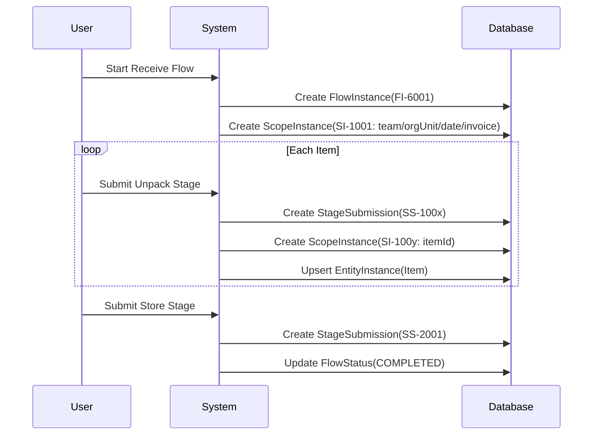

---

### 4. Issue FlowInstance

1. **FlowInstance**
    * Table 1 (FlowInstance=`FI-7001`):
        ```jsonc
        POST /api/flow-instances
        {
          "flowTypeId":"issueInventory",
          "flowInstanceId": "FI-7001",
          "scopeInstance": { // SI-2001, one to one relation to its scope (see next)
               "scopeData": {"team":"teamB", "orgUnit":"warehouse1", "date":"2025-06-21"} }
        }
        ```

    * Table 2 (`FI-7001` FlowInstance's ScopeInstance=`SI-4001`):
        ```jsonc
        {
            "scopeInstanceId": "SI-4001",
            "flowInstanceId": "FI-7001",
            "stageSubmissionId": null,
            "scopeData": { "team":"teamB", "orgUnit":"warehouse1", "date":"2025-06-21" }
        }
        ```

* **Pick Items**: repeat to select batches/quantities → upsert `Item` ScopeInstance linked to this stage.
* **Validate Recipient** → submission with recipient info.
* **Finalize Issue** → final submission, then `status = COMPLETED`.

---

### 5. Discard FlowInstance

* Table 1 FlowInstance=`FI-8001`:
  ```jsonc
  POST /api/flow-instances
  {
    "flowTypeId":"discardInventory",
    "flowInstanceId": "FI-8001",
    "scopeInstance": { // one to one relation to its scope 
        "scopeData": { "team":"teamA", "orgUnit":"warehouse1", "date":"2025-06-22" } 
    }
  }
  ```
* Table 2 `FI-8001` FlowInstance's ScopeInstance=`SI-xxx`: goes the same as above

### How This Scales to Other Warehouse Flows

* **Transfer Inventory**: define a `transferInventory` FlowType with `scopes` including `fromOrgUnit` and `toOrgUnit`.
* **Returns or Repairs**: bind stages to an `ItemBatch` or `Equipment` EntityType for lifecycle tracking.

## Model Diagram

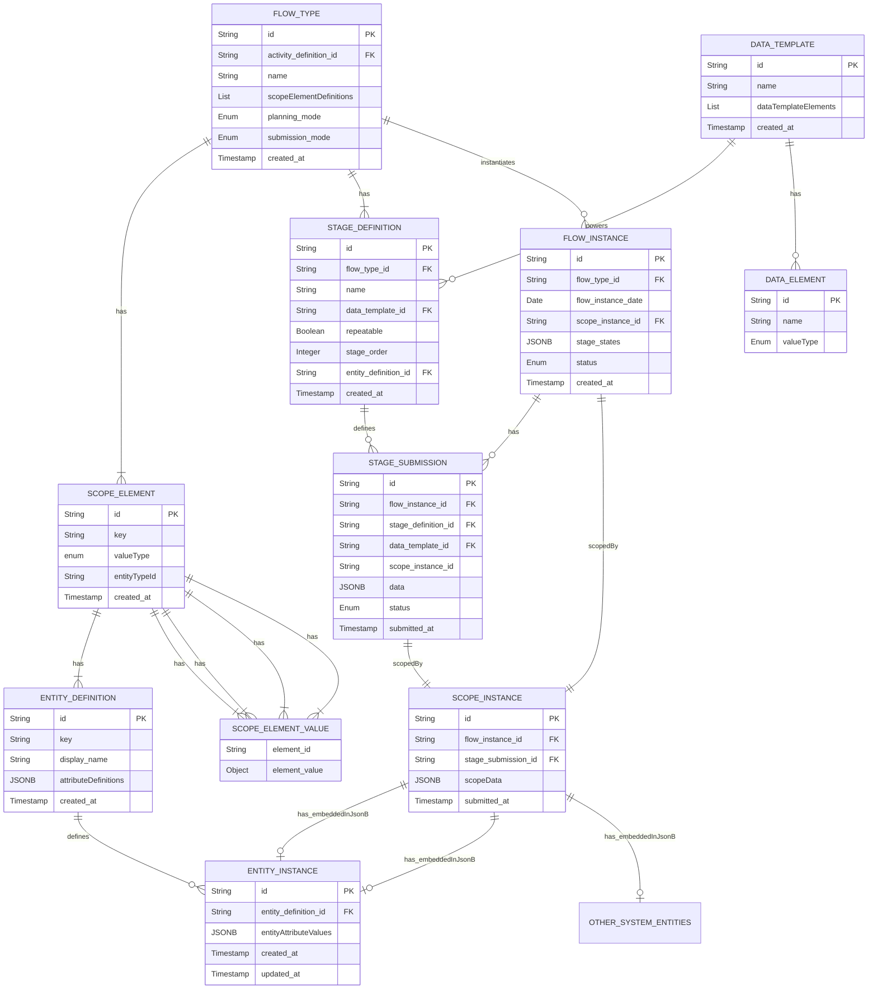

### 1. Overall System Sequence Diagram

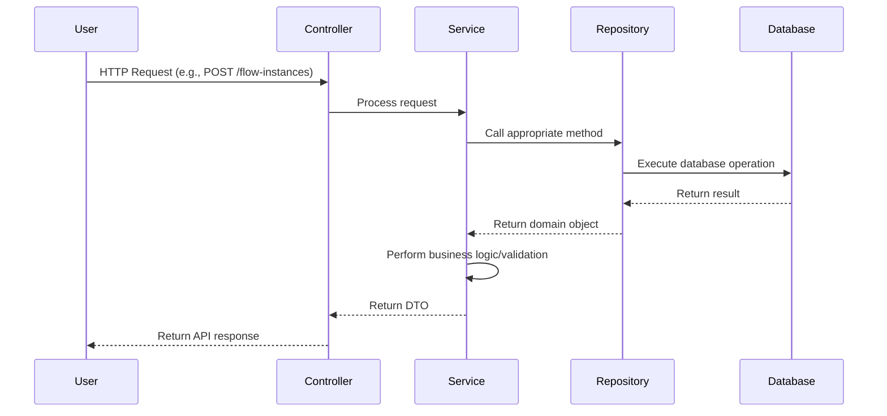

### 2. FlowInstance Creation Sequence

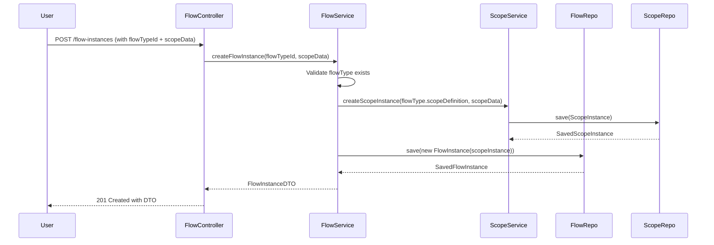

### 3. StageSubmission Sequence (Entity-Bound)

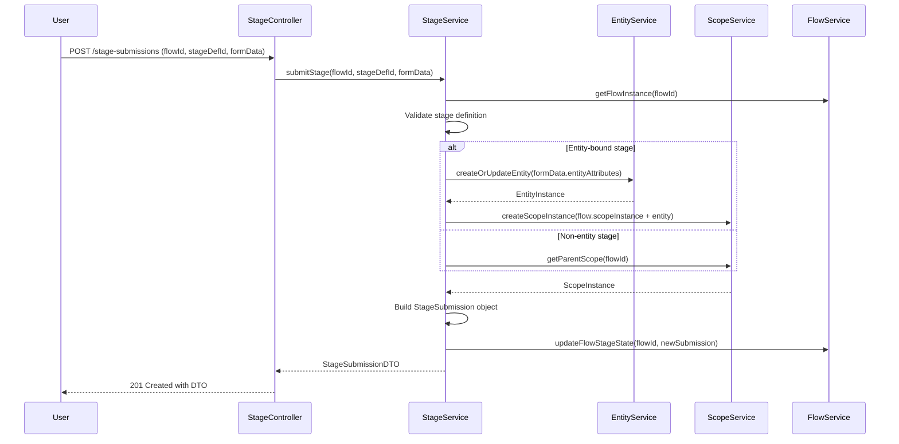

### 4. State Transition Diagram for FlowInstance

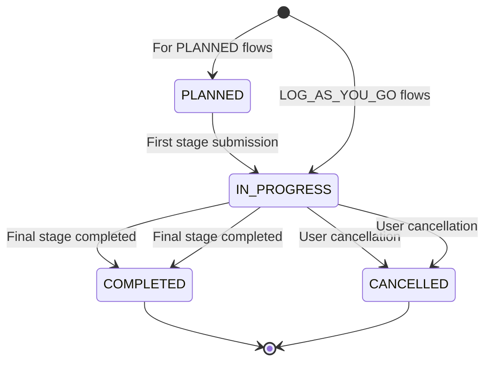

### 5. ScopeInstance Resolution Process

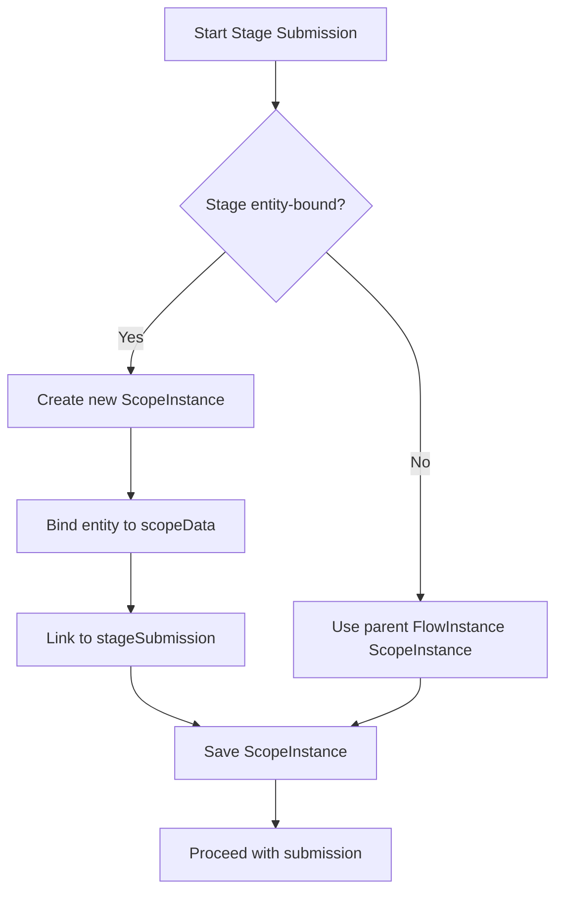

---

### 1. Entity Relationships metadata

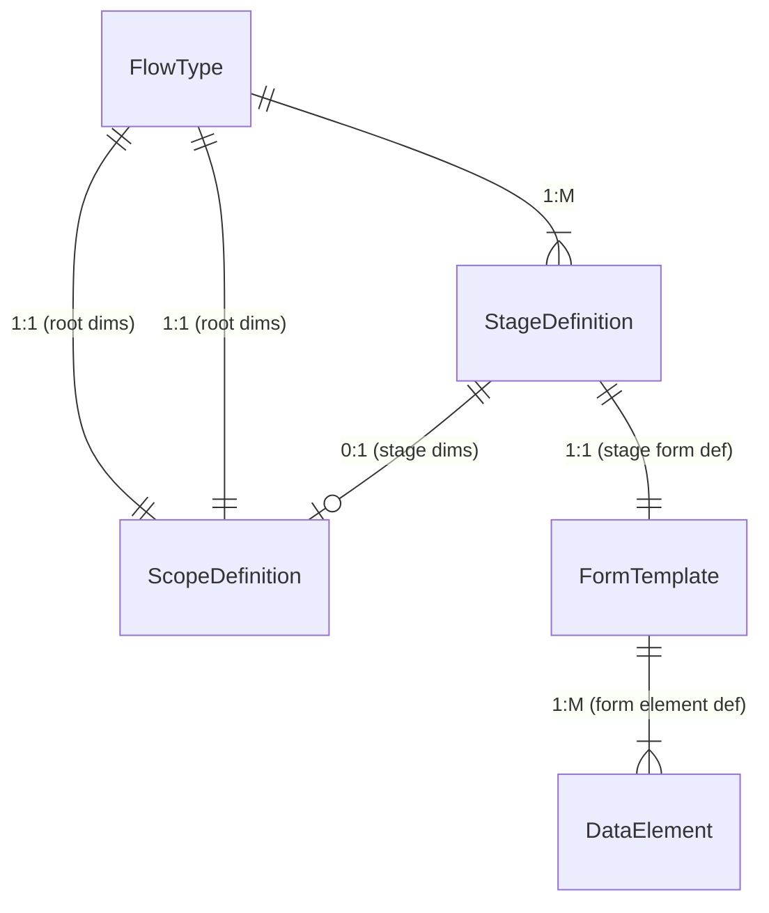

### 1. Entity Relationships

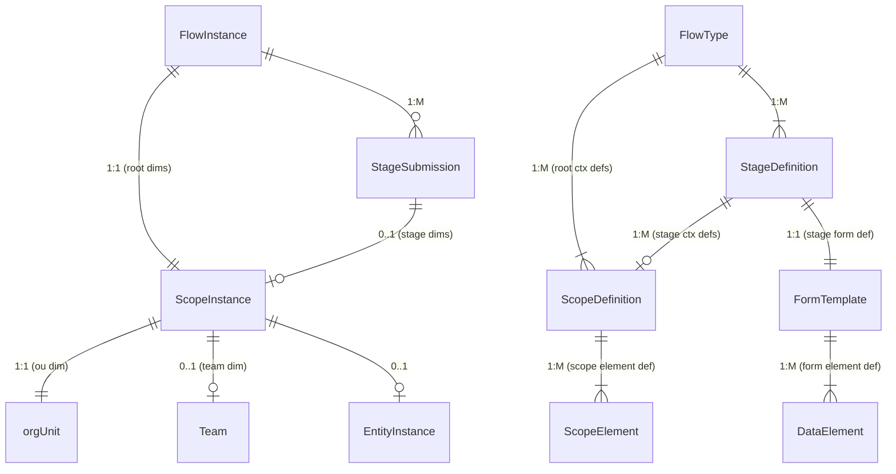

#### 2. Key Operations Sequence

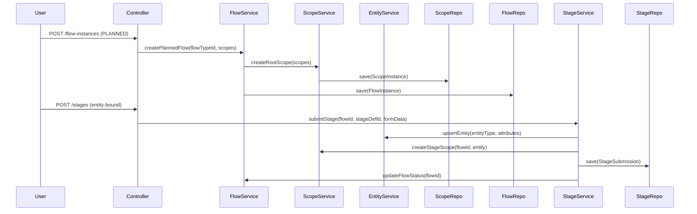
