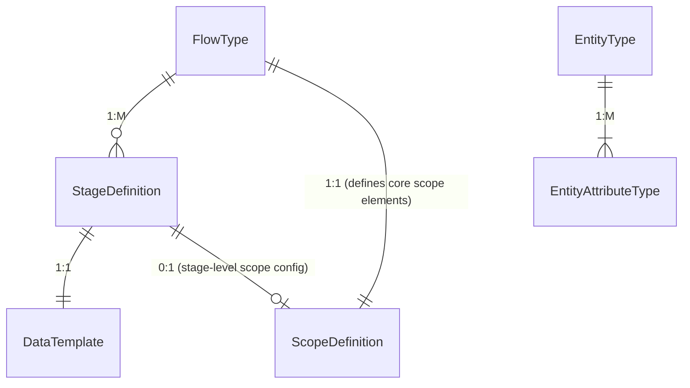
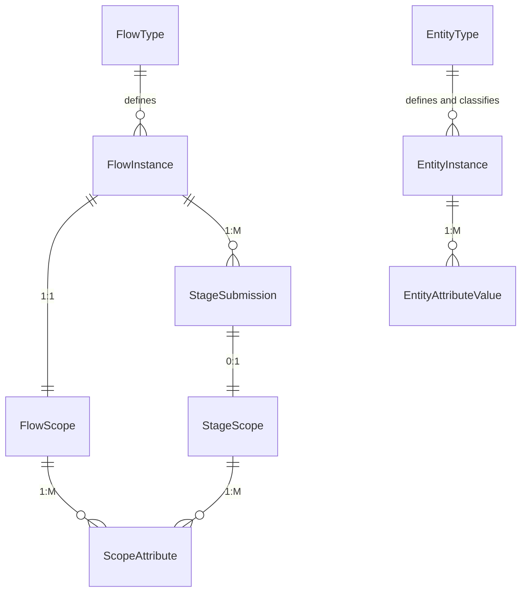

## Understanding

Designing a metadata-driven workflow system supporting multi-stage data entry flows across domains (inventory,
healthcare, surveys). Key requirements:

1. **Flexible Scoping**: Capture context (orgUnit/team/date/entity) at flow and stage levels for filtering and future
   reporting, but focus first on clear transactional schema.
2. **Multi-Stage Support**: Handle repeatable stages with possible entity-binding.
3. **Evolution Simplicity**: Start minimal (single developer), with straightforward schema migrations to evolve as needs
   arise.

## Initial Assumptions

1. Moderate data volumes (<500K flows/year initially).
2. Spring Boot with JPA/Hibernate for ORM.
3. No immediate real-time analytics requirements; reporting layer can be built later.
4. Early flexibility via an EAV (`scope_attribute`) for uncommon scope dimensions; core dimensions as explicit columns.

---

## Core Concepts

### 1. Flows (the shape and configuration of a process)

#### FlowType

* Defines the shape of a process: workflow template (scope/stage definitions).
* Configurable scopeDefinition: core scope elements (e.g., ORGUNIT, DATE, TEAM, optional primary entity) plus allowed
  dynamic keys.
* One or more StageDefinitions.

#### FlowInstance

* Runtime instance of a FlowType.
* Links to exactly one FlowScope (root scope for this instance).
* Has status (e.g., IN\_PROGRESS, COMPLETED, CANCELLED).
* Contains multiple StageSubmissions per StageDefinition.

### 2. Domain Object `Entity`

#### EntityType

* Defines a referencable domain object (e.g., Household, Patient).
* Lists key attributes (EntityAttributeTypes) used for lookup/upsert.

#### EntityAttributeType

* Definition of an attribute (id, type, required); used by EntityInstance.

#### EntityInstance

* Instance of an EntityType; holds values per EntityAttributeValue.
* May be created or looked up during planning or stage submission.
* Rarely updated after creation, but can be referenced in multiple flows.

#### EntityAttributeValue

* One record for one attribute value, linked to EntityInstance and its type.

### 3. Scopes (Dimensioning data)

A clear, explicit schema for capturing context at flow and stage levels:

#### FlowScope (Flow-level scope)

* One-to-one with FlowInstance.
* Core columns: `orgUnitId` (String), `scopeDate` (LocalDate), optional `teamId`, optional `entityInstanceId` (
  String), etc.
* Additional dynamic attributes in an EAV table `scope_attribute` when needed.

#### StageScope (Stage-level scope)

* One-to-one with StageSubmission, only created when a stage requires its own scope (e.g., entity-bound stage).
* Core columns: e.g., `entityInstanceId` if entity-bound, plus other common overrides if needed.
* Additional dynamic attributes in `scope_attribute` as needed.

#### ScopeAttribute (EAV for dynamic scope dimensions)

* Table storing key-value pairs linked either to a FlowScope or a StageScope.
* Columns: id, scopeType (enum FLOW or STAGE), flowInstanceId (FK) or stageSubmissionId (FK), attributeKey,
  attributeValue.
* A CHECK ensures exactly one of flowInstanceId or stageSubmissionId is non-null.
* Used for less-common or evolving scope dimensions; when a dynamic key becomes common/hot, migrate it into a dedicated
  column in FlowScope or StageScope via schema migration.

### 4. Stages (the row data)

#### StageDefinition

* A named step in a multi-stage FlowType.
* Points to one DataTemplate (form) and has a repeatable flag.
* Indicates whether it requires its own scope (e.g., entity-binding). Metadata: e.g., `entityTypeId` if
  entity-bound.

#### StageSubmission

* Actual submission of a stage in a given FlowInstance.
* Links to FlowInstance and StageDefinition.
* If scope-bound, also links to one StageScope; otherwise relies on FlowScope for context.
* Contains `data` (JSONB) for the form answers and status/timestamps.

---

## Core Relationships (Configuration vs Instances)

### Configuration Entities



### Instance Entities



Notes:

* `ScopeDefinition` refers to metadata about which core columns and dynamic keys are allowed; not shown as a
  separate instance table here but used in validation.
* `FlowScope` and `StageScope` are distinct tables, each with explicit columns for common dimensions.

---

This is supposed to cover different workflows scenarios: campaign-data, inventory, health facility cases, surveys ...
scenarios: We are designing a system where the scope (context) at both the flow and stage levels is configurable. The
goal is to
support dynamic scenarios such as:

1. **Flow-Level Scope**: For an "Issue Inventory" flow, we might capture:

    - `orgUnit` (the warehouse issuing the items)
    - `team` (the warehouse manager team)
    - `invoiceNumber` (a dynamic string attribute)

2. **Stage-Level Scope**: For a repeatable "issuing" stage, we might capture per stage:
    - `orgUnit` (the receiving orgUnit, e.g., a clinic)
    - `team` (the receiving team, if applicable)
    - `item` (an entity of type "Item")
    - `batch` (a dynamic string attribute for batch number)
    - `date` (the date of issue for that specific item)

here different scoping levels at parent's flow, and at stage in same flow.

another scenarios is that only the flow level scope is configured, stages just collect data without any
stageScopeDefinition configured for the stage, here the stage data is scoped by parent scope elements.

the scope is a joint point, a dimensions by which data are grouped, queried, reported.

this is the core goal of the system, designing data flows for any scenario is possible (maybe through different ways),
the goal is that the data of stage always has an anchore, a dimension by which it is grouped and joined, whether on
parents if stage doesn't define its own scope, or on stage and paren flow scope if both define a hierarchical scope.

## Example OF WorkFlow Configuration for “Receive Inventory”:

**User sees “Receive Inventory” on their FlowInstance List**

### **FlowInstance**

* **Flow Instance Scope dims Capturing**
    * Form fields:

        1. **ScopeDefinition elements:**
            * `supplierId` (core dim `ENTITY`: `EntityType` “Supplier” dropdown)
            * `teamId` (core dim `TEAM`: automatically injected, or selected, current user’s team) or select
            * `orgUnitId` (core dim `ORG_UNIT`: warehouse location for this assignment)
            * `invoiceNumber` (extra dim `STRING`) value will be stored in `ScopeAttributes`
            * `receiveDate` (extra dim `DATE`) value will be stored in `ScopeAttributes`
        2. **dataTemplate elements**:{`quantityReceived` (number), `qualityStatus` (Good/Damaged)}

    * On “Save,” we insert a `FlowInstance` row, and `FlowScope` row with core attributes and extra dim
      scopeAttributes.
    * No EntityInstances created, just suppliers are selected from a pre-existing entities.

    * **Stage 1: “Unpack & Quality Check”**
        * Stage definition fields:
            1. **ScopeDefinition elements:**
                * `itemId` (core dim `ENTITY`: EntityType “Item” dropdown)
                * `batchNumber` (extra dim `STRING`:)
                * `expirationDate` (extra dim `DATE`)
            2. **dataTemplate elements**:{`quantityReceived` (number), `qualityStatus` (Good/Damaged)}
            3. repeatable = true

    * **Stage 3: “Store in Warehouse” Single‐submission stage:**
        * Stage definition fields:
            1. **ScopeDefinition elements:**
                * `storageLocationId` (core dim `ENTITY`: “Location/Shelf” or simple dropdown item)
            2. **dataTemplate elements**:{`quantityReceived` (number), `qualityStatus` (Good/Damaged)}
                * `storageLocationId` (EntityType “Location” or simple dropdown)
                * Optionally, a multi‐select of which `EntityInstance` items (from Stage 2) go to that location—though
                  we can also assume “all from Stage 2” if our process dictates.
            3. repeatable = false.

### INSERTS SAMPLES

Below is a concrete **Warehouse Inventory** example showing how we’d model **Receive**, **Issue**, and **Discard** flows
with the metadata‐driven engine. It includes:

1. **EntityType** definitions for the core “things” (Item, Supplier).
2. **FlowType** definitions for the three key workflows.
3. Example **FlowInstance** JSON for each.
4. Sketches of **StageSubmission** and **EntityInstance** behavior.

Receive Inventory Flow Example

---

### 1. EntityType Definitions

#### 1.1. `Item`

```jsonc
// POST /api/entity-types
{
  "id": "itemEntityTypeId",
  "name": "Inventory Item",
  "attributes": [
    { "id":"itemId",        "type":"string", "required":true },
    { "id":"itemName",      "type":"string", "required":true },
    { "id":"unitOfMeasure", "type":"string", "required":true }
  ]
}
```

#### 1.2. `Supplier`

```jsonc
{
  "id": "supplierEntityTypeId",
  "name": "Supplier",
  "attributes": [
    { "id":"supplierId",   "type":"string", "required":true },
    { "id":"supplierName", "type":"string", "required":true }
  ]
}
```

// other entityTypes definition as needed

#### 2. FlowType Definitions

##### 2.1. Receive Inventory Flow type

```jsonb
// POST /api/flow-types
{
    "id": "receiveInventory",
    "name": "Receive Inventory",
    "forceStageOrder": true,
    "submissionMode": "MULTI_STAGE",
    "flowScopeDefinition": {
        "scopeElements": [
            { "key":"supplier","type":"ENTITY",   "required":true,  "multiple":false, "entityTypeId":"Supplier" }
            { "key":"team",    "type":"TEAM",     "required":true,  "multiple":false },
            { "key":"orgUnit", "type":"ORG_UNIT", "required":true,  "multiple":false },
            { "key":"date",    "type":"DATE",     "required":true,  "multiple":false },
            { "key":"invoiceNumber",    "type":"NUMBER",     "required":true,  "multiple":false },
        ]  
  },
  "stages": [
    {
      "id":"unpackCheck",
      "name":"Unpack & Quality Check",
      "sortOrder": 2,
      "formTemplateId":"unpackForm", // {contains: quantityReceived, and qualityStatus elements definitions }
      "repeatable":true,
      "stageScopeDefinition": {
        "scopeElements": [
            { "key":"item","type":"ENTITY",   "required":true,  "multiple":false, "entityTypeId":"ItemEntityTypeId" }         
        ]
      }
    },
    {
      "id":"storeItem",
      "sortOrder": 3,
      "name":"Store Items",
      "formTemplateId":"storeForm",
      "repeatable":false,
      "stageScopeDefinition": {
        "scopeElements": [ // or it can be defined as an optionSet dropdown, not entity.
            { "key":"item","type":"ENTITY",   "required":true,  "multiple":false, "entityTypeId": "storageLocationEntityTypeId" }         
        ]
      }
    }
  ]
}
```

##### 2.2. Issue Inventory

```jsonc
{
  "id": "issueInventory",
  "name": "Issue Inventory",
  "forceStageOrder": true,
  "submissionMode": "MULTI_STAGE",
  "stageScopeDefinition": {
        "scopeElements": [ 
            { "key":"team","type":"TEAM","required":true,"multiple":false },
            { "key":"orgUnit","type":"ORG_UNIT","required":true,"multiple":false },
            { "key":"date","type":"DATE","required":true,"multiple":false }         
        ]
   }
  "stages":[
    {
      "id":"pickItems",
      "name":"Pick Items",
      "formTemplateId":"pickForm",
      "sortOrder": 1,
      "repeatable":true,
      "stageScopeDefinition": {
        "scopeElements": [
            { "key":"item","type":"ENTITY",   "required":true,  "multiple":false, "entityTypeId":"ItemEntityTypeId" }         
        ]
      }
    },
    {
      "id":"validateRecipient",
      "name":"Validate Recipient",
      "sortOrder": 2,
      "formTemplateId":"recipientForm",
      "repeatable":false
    },
    {
      "id":"finalizeIssue",
      "name":"Finalize Issue",
      "sortOrder": 3,
      "formTemplateId":"issueForm",
      "repeatable":false
    }
  ]
}
```

##### 2.3. Discard Inventory

```jsonc
{
  "id": "discardInventory",
  "name": "Discard Inventory",
  "planningMode": "PLANNED",
  "submissionMode": "SINGLE",
  "stageScopeDefinition": {
        "scopeElements": [ 
            { "key":"team","type":"TEAM","required":true,"multiple":false },
            { "key":"orgUnit","type":"ORG_UNIT","required":true,"multiple":false },
            { "key":"date","type":"DATE","required":true,"multiple":false }     
        ]
   }
  "stages":[...]
}
```

## Service-Layer Patterns

### FlowInstance Creation

1. Validate required core scope inputs (orgUnitId, scopeDate); if primary entity specified upfront, lookup or create
   `EntityInstance`.
2. Create `FlowInstance` and linked `FlowScope` in a single `@Transactional` operation with core columns (if defined).
3. For dynamic attributes (e.g., invoiceNumber), add `ScopeAttribute` entries under the new `FlowScope` after validating
   against FlowType metadata.

### Stage Submission Processing

1. Load `FlowInstance`, verify current stage and status.
2. If the StageDefinition requires its own scope:

    * Lookup or create any `EntityInstance` needed.
    * Create `StageSubmission` and linked `StageScope` in a single `@Transactional` with core columns overrides (if
      defined) (e.g.,
      `orgUnitId, teamId, ..., entityInstanceId`), plus any dynamic attributes via `ScopeAttribute` after validation
      against metadata.
3. If no stage-level scope needed: create only `StageSubmission` (context from `FlowScope`).
4. Update FlowInstance status or stageStates as appropriate.

### Future possible Extensibility & Evolution

* **New core scope dimensions**: add columns to `flow_scope` or `stage_scope` via migrations. Service validation updated
  accordingly.
* **Dynamic dims**: continue using `scope_attribute`; monitor usage and migrate hot keys into columns when needed.
* **Hierarchical orgUnits**: implement OrgUnit hierarchy separately; queries on `flow_scope.orgUnitId` can join to
  hierarchy table.
* **Multi-actor handoffs**: add assignment fields (e.g., `assignedUserId`) to `StageScope` or new columns in
  `stage_submission`; enforce via service logic.
* **Sub-flows or cross-flow links**: add `parent_flow_instance_id` in `flow_instance` if needed; existing scope tables
  remain unchanged.

---

## Example Use Case: Planned Household Visits

### Option A: Pre-create FlowInstance per Household Visit

1. FlowType scopeDefinition includes core elements: orgUnit, scopeDate, and optional household entity.
2. For each planned household visit, user selects existing or creates new `EntityInstance` for Household.
3. Service creates `FlowInstance` with `FlowScope` containing `{orgUnitId, scopeDate, entityInstanceId=HH123}`.
4. StageDefinition for visit data uses no additional scope (reuses FlowScope) or may have its own StageScope if needed.
5. Reporting: query `flow_scope` by orgUnitId and scopeDate and entityInstanceId, and FlowInstance.status for
   pending vs completed.

### Option B: Single FlowInstance per OrgUnit-Date with Repeatable Stage

1. FlowType scopeDefinition includes only orgUnit and scopeDate.
2. StageDefinition is repeatable and its scope includes entity-bound type to Household.
3. On execution, user opens one FlowInstance for that orgUnit-date, submits multiple `StageSubmission` entries, each
   creating a `StageScope` with `entityInstanceId=HH123`, etc.
4. If planning stage is separate, can allow user to add households before execution; StageScope rows represent planned
   visits and later updated to completed via submission status.
5. Reporting: query `stage_scope` rows linked to FlowInstance to see all households planned/visited.

### Option C: Two-Phase Planning+Execution

1. Planning FlowType: scope orgUnit-date, repeatable StageDefinition with entity-bound to Household. User lists
   households to
   plan.
2. After planning, service iterates planned households and either pre-creates execution FlowInstances (Option A) or
   schedules tasks for execution.
3. Execution FlowType: handles actual visit data per household.
4. Links preserved via references (e.g., in `scope_attribute` or a parent-child field in `flow_instance`).

Use whichever pattern fits project scale; all are supported by explicit FlowScope/StageScope schema.

---

## Trade-offs & Recommendations

* **Explicit schema clarity**: strong typing, easy to query and validate. Preferred for maintainability.
* **EAV for dynamic dims**: avoids frequent migrations; migrate hot keys into columns when needed.
* **Separate FlowScope/StageScope tables**: clear semantics, no ambiguous single-table overload.
* **Deferred reporting optimization**: build read-model or materialized views later; keep transactional model simple
  now.
* **Start simple**: implement core dimensions first (orgUnit, date, optional primary entity). Use Option A or B for
  planned visits depending on volume and UX requirements. Evolve to Option C if planning complexity grows.

---

## Next Steps / Action Items

1. **Implement Schema & Entities**: Create tables and JPA entities as sketched.
2. **Service Logic**: Build FlowInstance creation and StageSubmission processing with FlowScope/StageScope.
3. **Metadata Validation**: Use FlowType metadata to validate core and dynamic scope attributes.
4. **Prototype Use Case**: Pick Option A or B for planned household visits, implement and test behavior.
5. **Tests & Migrations**: Write unit/integration tests and Flyway migrations for evolving columns.
6. **Reporting Read-Model**: Once core usage stabilizes, design read views joining flow\_scope, stage\_scope, and
   scope\_attribute for analytics.
7. **Documentation**: Document the scoping pattern (explicit columns + EAV) and evolution process for the team.
