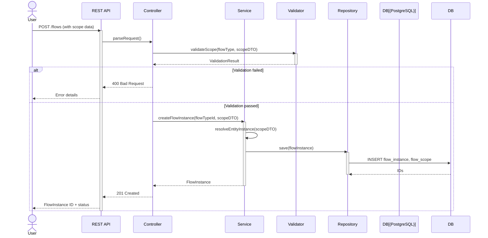
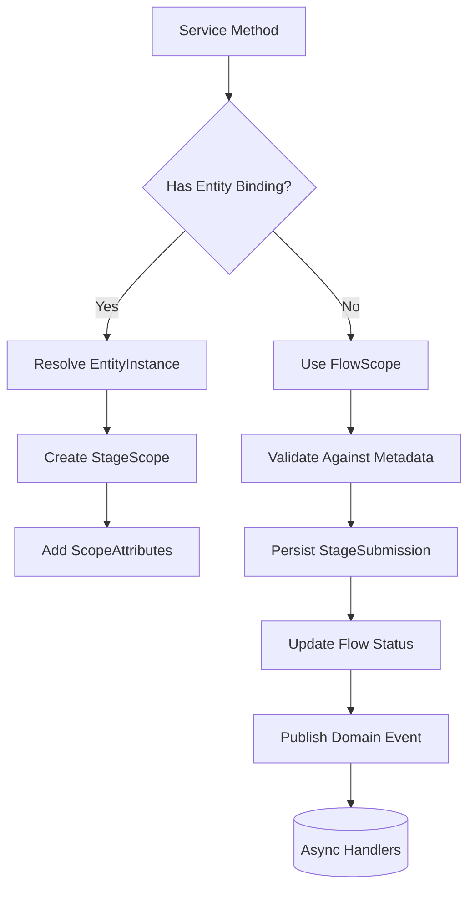
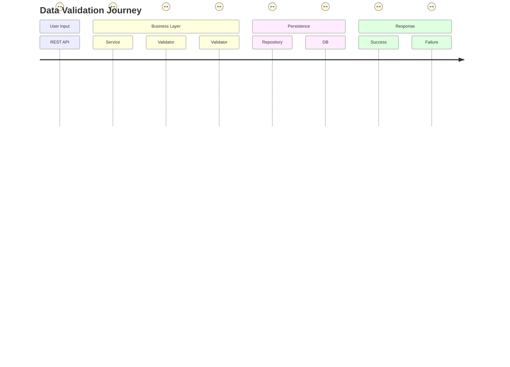
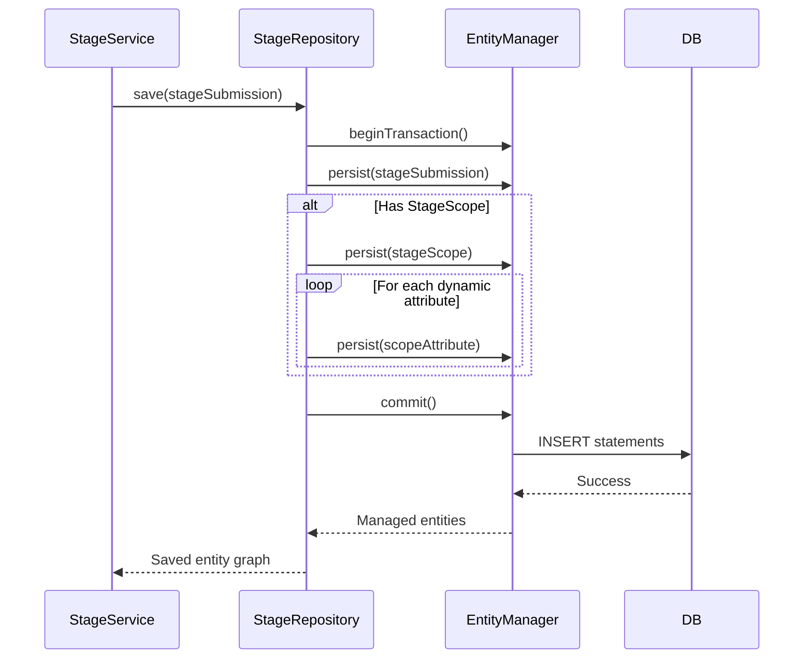

Based on your requirements, here are Mermaid diagrams visualizing key flows through the system layers, including
validation and processing patterns:

### 1. End-to-End Flow: User Submission to Persistence



### 2. Stage Submission Flow with Validation

```mermaid
sequenceDiagram
    actor Field Agent
    participant Mobile API
    participant StageController
    participant StageService
    participant ScopeValidator
    participant EntityResolver
    participant StageRepo
    Field Agent ->> Mobile API: POST /stages (JSON data)
    activate Mobile API
    Mobile API ->> StageController: handleSubmission()
    StageController ->> ScopeValidator: validateStageScope(stageDef, scopeData)
    activate ScopeValidator
    ScopeValidator ->> EntityResolver: resolveEntity(scopeData)
    EntityResolver -->> ScopeValidator: EntityInstance
    ScopeValidator -->> StageController: ValidationStatus
    deactivate ScopeValidator

alt Invalid entity/scope
StageController-->>Mobile API: 422 Unprocessable
Mobile API-->>Field Agent: Error message
else Valid
StageController->>StageService: submitStage(flowId, stageDefId, data)
StageService->>StageRepo: saveStageSubmission()
StageRepo->>StageRepo: Transaction:
- Create StageSubmission
- Create StageScope (if bound)
- Insert scope_attributes
StageService-->>StageController: SubmissionReceipt
StageController-->>Mobile API: 202 Accepted
Mobile API-->>Field Agent: Success + timestamps
end
deactivate Mobile API
```

### 3. Service Layer Processing Pattern



### 4. Validation Flow Through Layers



### 5. Repository Save Sequence



### Key Design Notes:

1. **Validation Layering**:
    - REST: Schema integrity
    - Service: Business rules/metadata compliance
    - Repository: Data integrity constraints
    - DB: Final safeguard

2. **Entity Resolution**:
   ```mermaid
   flowchart LR
       Request-->EntityResolver
       EntityResolver-->|Existing|EntityRepo[Entity Repository]
       EntityResolver-->|New|EntityFactory
       EntityFactory-->EntityService
   ```

3. **Transaction Boundaries**:
    - Flow creation: Single transaction (instance + scope)
    - Stage submission: Nested transaction with rollback
    - EAV attributes: Batched inserts

4. **Error Handling**:
    - Validation failures: Return 422 with error paths
    - DB errors: Spring DataExceptions translated to 503

These diagrams follow the explicit scope pattern with:

- Clear separation between flow-level and stage-level scoping
- Metadata-driven validation
- Entity binding resolution
- Progressive persistence through layers
- EAV attributes as extension points

Would you like me to elaborate on any specific flow or add diagrams for reporting/evolution patterns?
