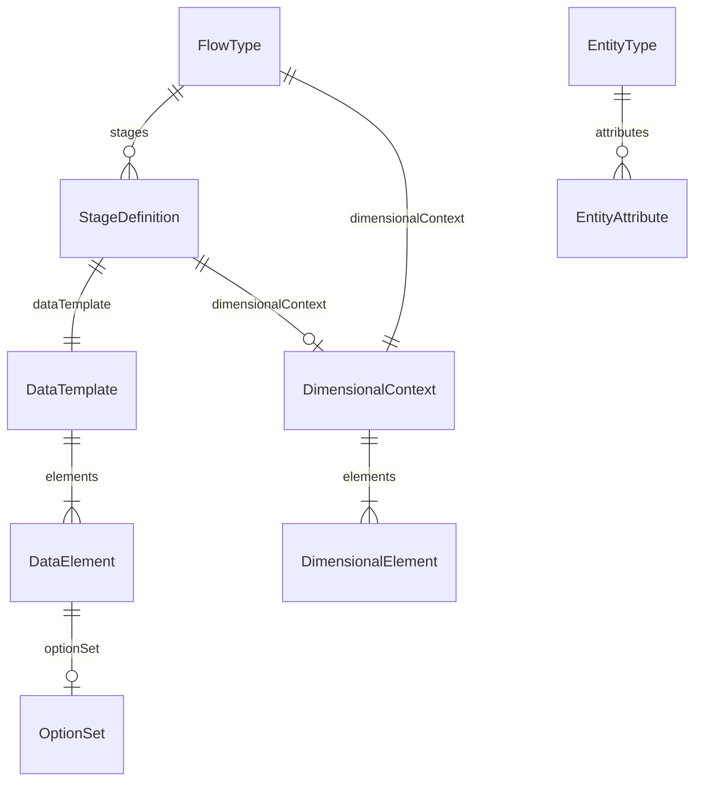
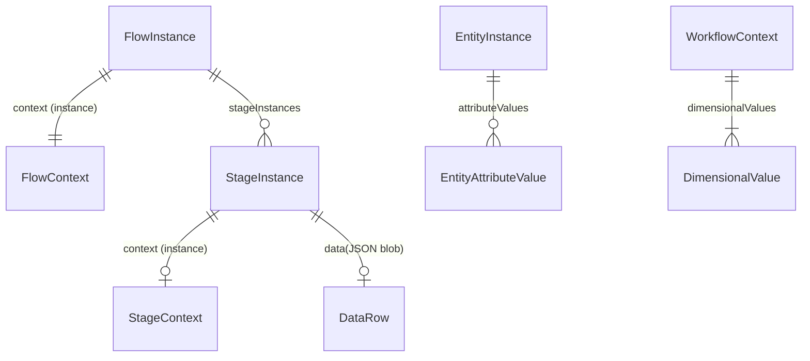
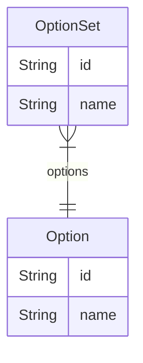
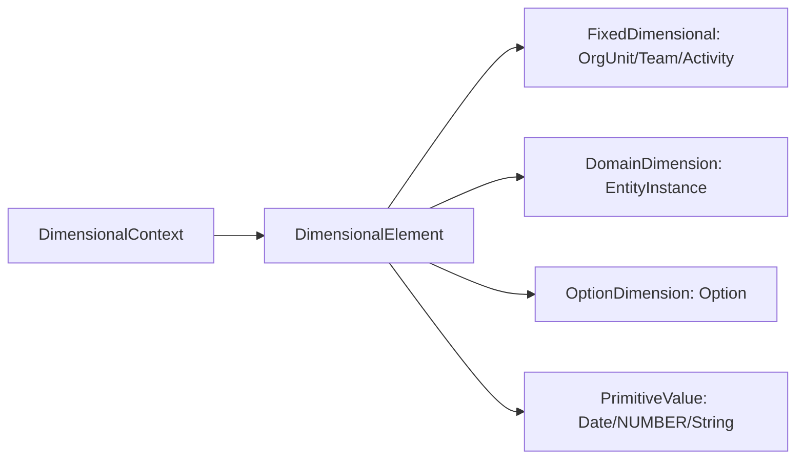
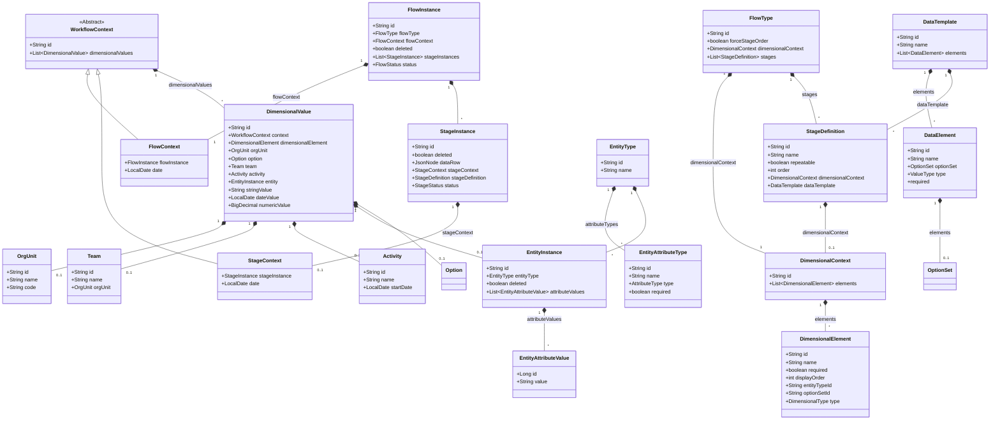
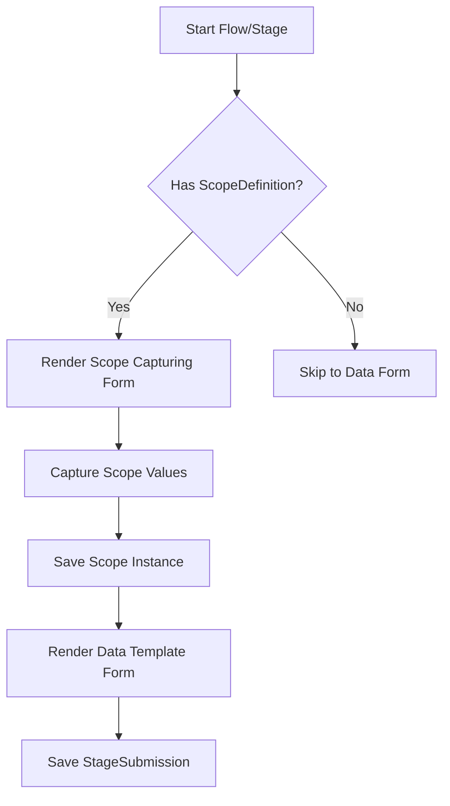

# Enhanced Multi-Step System Model with Dynamic Dimensional Context Handling

We are building a metadata-driven workflow system designed to handle multi-stage data entry across diverse domains such
as inventory management, healthcare, and surveys. The system addresses the need for flexible scoping at both flow and
stage levels, allowing contextual data (like organization unit, team, date, and entity) to be captured dynamically. It
supports repeatable stages and entity binding, enabling complex processes like campaign distributions or inventory
receipts.

## Purpose & Capabilities

**Purpose**

The system's core purpose is to provide a configurable framework for defining and executing domain-specific workflows
without requiring code changes for each new use case. It separates workflow configuration (metadata) from runtime
execution, allowing non-technical users to model processes.

1. Simple and Flexible Yet Structured.
2. **Flexible Dimensional Context Configuration**: Captures a workflow context at flow and stage levels (e.g., warehouse
   for inventory, health, facility for patient intake, a team, ...) without hardcoding (used for tracking and filtering
   workflow data by a group of Dimensional elements).
3. **Multi-Stage Support**: Handles linear or repeatable stages (e.g., registering multiple households in a campaign).
4. **Flexible DataTemplate**: links to stages to define a row of data data elements' configuration (transactional data).
5. **Domain Entity Binding to Context**: link domain entities (e.g., items, patients) to workflow Context.
6. **Core Entities Binding to Context**: link a core Elements (e.g., Team, OrgUnit, Activity) to workflow Context.
7. **Primitive Attribute Binding to Context**: (e.g., NUMBER, TEXT (invoiceNumber)).
8. **Schema Evolution**: Starts minimal and evolves via configuration, avoiding complex migrations.
9. **Context Preservation**: Metadata changes don't compromise historical context integrity, allowing querying
   historical context independently.

**Core Functionality**

- **Metadata-Driven Configuration**: Define workflows via `FlowType` (process template) and `StageDefinition` (steps),
  `DataTemplate` (a row of data template).
- **Flexible Scoping**:
    - Fixed dimensions: `OrgUnit`, `Team`, `Activity` (predefined tables)
    - Dynamic entities: `Household`, `Item`, `Patient` (runtime-configurable)
    - Flow and Stage: each can define a Dimensional Context.
    - stage can have transactional data defined, configured using `DataTemplate`, and captured separately from its
      Context.
- **Runtime Execution**:
    - Create `FlowInstance` with `FlowContext`, submit `StageInstance` with `StageContext`.
    - `StageInstance` comprise of a Context data `StageContext`, and a data row `data`, both defined separately and both
      can be captured Separately.
    - A Stage's dataRow is anchored by defined stage's and flow's dimensional contexts.

### Supported Scenarios

| **Domain** | **Use Case**        | **Key Dimensional Elements**                        |  
|------------|---------------------|-----------------------------------------------------|  
| Inventory  | Receiving shipments | `OrgUnit` (warehouse), `Item` (dynamic entity)      |  
| Healthcare | Patient intake      | `OrgUnit` (clinic), `Patient` (dynamic entity)      |  
| Campaigns  | ITNS distribution   | `Activity` (campaign), `Household` (dynamic entity) |  
| Surveys    | Crop assessment     | `Team` (field team), `Farm` (dynamic entity)        |  

**Reporting Capabilities**

- Filter by core dimensions: `OrgUnit`, `date`, `Team`
- Aggregate by dynamic entities: "Total nets distributed per household"
- Join flow/stage Contexts: "Items received in WH_MAIN with quality issues"

## Conceptual Model

- **FlowType**: Template for workflows (e.g., "Inventory Receiving"), defining:
    - `dimensionalContext`: Core/dynamic attributes at flow level (e.g., warehouse, invoice number).
    - `stages`: Sequence of steps (StageDefinitions).
- **StageDefinition**: Step in a workflow (e.g., "Unpack Items"), with:
    - `dimensionalContext`: Stage-specific context (e.g., item batch).
    - `repeatable`: Whether the step can be executed multiple times.
    - `dataTemplate`: defines and configure `DataElement`a used to power the dataRow captured in a stage.
- **Context Architecture**:
    - **Core Elements**: Fixed entities (OrgUnit, Team, Activity) and dynamic entities (Household, Item) captured in
      flows via `DimensionalValue`.
- **Custom Domain Entity**:
    - `EntityType`: Defines domain objects (e.g., "Patient") and their attributes.
    - `EntityInstance`: Runtime instances (e.g., "Patient XX") with values for the defined attributes
- **DataTemplate**:
    - `DataElement`: a transactional element, should resolve to a context (its value has no meaning without a captured
      context)

### Workflow Elements

#### 1. Configuration Parts (metadata definition):

* **Work Flow:**
    * `FlowType`
    * `StageDefinition`: A Flow Stage configuration,
    * `DimensionalContext`: A Define a context grouping one or more Dimensionals.
    * `DimensionalElement`: a Dimensional Element definition in a `DimensionalContext`.
    * `DataTemplate`: contains DataElements powering a row of data.
    * `DataElement`: an Data element definition
* **Custom Domain Entity**
    * `EntityType`: a definition of a domain object or Entity with Attributes.
    * `EntityAttribute`: a definition of an `EntityType`'s attribute.

**diagram shows the configuration part of a work flow (ERD)**



#### 2. Running Parts

* **Work Flow:**
    * **FlowInstance**: link all, contains captured context.
    * **StageInstance**: contains captured context (optionally defined), and captured data
    * **FlowContext**: A container of DimensionalValues (at the flow level)
    * **StageContext**: A container of DimensionalValues (at the stage level)
    * **DimensionalValue**: A captured value of a defined dimensional context element.
* **Custom Domain Entity**
    * **EntityInstance**
    * **EntityAttributeValue**

**This diagram shows the Running instances of a workflow (ERD)**



#### 3. Fixed System Parts (can be a DimensionalElement i.e can define a context)

* **OrgUnit**: hierarchical orgUnits (districts, villages, facilities...etc)
* **Team**: a Contract in a Workflow, a dimensional that can link someone(s), party, people, position, or a user to
  a workflow.
* **Activity**: optional dimensional to group workflows data
* **OptionSet**: a group of `Options` (e.i predefined select options)
* **Option**: can be used as a dimensional, an entityAttribute, or a data element value.

**This diagram shows the Running instances of a workflow (ERD)**



### 1. Domain Dimensional Context Configuration



### 2. System Class Diagram



## How It Works in Each Scenario

- Context capture through a dedicated Form, Dimensional Element value can be inferred and filled out from user's
  context (his team), if it cannot be inferred `More than One Value available` then user selects one.
- Context Custom Domain Entity: User bind (i.e. enroll, select) to a context only pre-existing Entity Instances (from
  dropdown, search and select...etc), Creating a new EntityInstance is done separately through a dedicated EntityType
  form, and only if user is allowed to add new can he add one.
- if user is allowed to add new entity instance (register), he can do the two operation from with the Context capturing
  operation (i.e, register new, and bind to context at the same time). --need to think of payloads sent to backend Dtos.

## Flow configurations for different use cases examples

### Use case 1: Inventory Receiving (Repeatable Stage)

**FlowType Configuration**

```bash
{
  "id": "INV_RECEIVE",
  "name": "Inventory Receiving",
  "dimensionalContext": {
    "elements": [
      {"id": "warehouse", "type": "ORG_UNIT", "name": "Warehouse", "required": true},
      {"id": "receivingTeam", "type": "TEAM", "name": "ReceivingTeam", "required": true},
      {"id": "invoiceNumber", "type": "TEXT", "name": "Invoice Number", "required": true}
    ]
  },
  "stages": [
    {
      "id": "unpack-verify",
      "name": "Unpack & Verify",
      "repeatable": true,  // Key for repeatable stage
      "dimensionalContext": {
        "elements": [
          {"id": "item", "type": "ENTITY", "name": "Item", "entityTypeId": "ITEM", "required": true},
          {"id": "batch", "type": "TEXT", "name": "Batch", "required": false}
        ]
      },
      "dataTemplate": {
        "id": "unpackItems",
        "name": "unpack-verify Items Template",
        "elements": [
          {"id": "quantity", "type": "NUMBER", "name": "Quantity", "required": true},
          {"id": "condition", "type": "TEXT", "name": "Condition", "required": true}         
        ]
      }
    }
  ]
}
```

**Flow Creation**

```bash
POST /flows
{
  "flowTypeId": "INV_RECEIVE",
  "context": {
    "warehouse": {"id": "WH_MAIN"},       // OrgUnit ref
    "receivingTeam": {"id": "TEAM_RECV1"}, // Team ref
    "invoiceNumber": "INV-2024-001"       // Primitive value
  }
}
```

**Stage Instance (Repeatable)**

```bash
# First item
POST /stages
{
  "flowInstanceId": "FLOW_001",
  "stageDefinitionId": "unpack-verify",
  "context": {
    "item": {"id": "ITEM_PARACETAMOL"}, // EntityInstance ref
    "batch": "BATCH-0424A"
  },
  "dataRow": {
    "quantity": 100,
    "condition": "GOOD"
  }
}

# Second item
POST /stages
{
  "flowInstanceId": "FLOW_001",
  "stageDefinitionId": "unpack-verify",
  "context": {
    "item": {"id": "ITEM_VITAMINC"},
    "batch": "BATCH-0424B"
  },
  "dataRow": {
    "quantity": 50,
    "condition": "DAMAGED"
  }
}
```

---

### Use Case 2: Patient Intake (Healthcare)

**FlowType Configuration**

```json-sample
{
  "id": "PATIENT_INTAKE",
  "name": "Patient Registration & Vitals",
  "dimensionalContext": {
    "elements": [
      {"id": "facilityDimensionalId", "type": "ORG_UNIT", "name": "Facility", "required": true},
      {"id": "providerDimensionalId", "type": "ENTITY", "name": "Staff", "entityTypeId": "STAFF", "required": true},
      {"id": "patientDimensionalId", "type": "ENTITY", "name": "Patient", "entityTypeId": "PATIENT", "required": true}     
    ]
  },
  "stages": [
    {
      "id": "vitals",
      "name": "Vital Signs",
      "dimensionalContext": {},
      "dataTemplate": {
        "id": "vitalTemplateId",
        "name": "vital data collection Template",
        "elements": [
          {"id": "bpDataElementId", "type": "TEXT", "name": "Pb", "required": true},
          {"id": "pulseDataElementId", "type": "NUMBER", "name": "Pulse", "required": true}
        ]
      }
    }
  ]
}
```

**Flow Creation**

```bash
# Registration and enrollment Stage
POST /flows
{
  "flowTypeId": "PATIENT_INTAKE",
  "context": {
    "facilityDimensionalId": {"id": "CLINIC_A"},  // OrgUnit ref
    "providerDimensionalId": {"id": "DR_SMITH"}   // EntityInstance ref 
    "patientDimensionalId": {  // new EntityInstance with attributes, backend lookup or create)
        "id": "PT_JOHNDOE",
        "nameDataElementId": "John Doe",
        "dobDataElementId": "1985-04-12"
        } 
  }
}
```

**Stage Instances**

```bash
# Vitals Stage (no Context)
POST /stages
{
  "flowInstanceId": "FLOW_002",
  "stageDefinitionId": "vitals",
  "dataRow": {
    "bpDataElementId": "120/80",
    "pulseDataElementId": 72
  }
}
```

---

### User Case 3: ITNS Campaign Distribution (Repeatable + Multi-Stage)

ITNs campaign have many interconnected use cases scenarios

#### 1. Distribution Team's flow config

**Field's Team leader per household distribution details, different configuration ways**

* **way 1:** Flow Context per village, and a repeatable stage with distribution details dataTemplate and houseHold at
  stage's context.

* **another way:** Flow per village and household, single context-less stage with distribution details dataTemplate

**FlowType Configuration sample (Way 1)**

```json-sample
{
  "id": "ITNS_CAMPAIGN",
  "name": "Mosquito Net Distribution",
  "dimensionalContext": {
    "elements": [
      {"id": "campaignElementId", "name": "Campaign", "type": "ACTIVITY", "required": true},
      {"id": "villageElementId", "name": "Village", "type": "ORG_UNIT", "required": true}      
    ]
  },
  "stages": [
    {
      "id": "hh-enrollment-and-distribution",
      "name": "Household Net Distribution",
      "repeatable": true,
      "dimensionalContext": {
        "elements": [          
          {"id": "householdElementId", "type": "ENTITY", "entityTypeId": "HOUSEHOLD", "required": true}
        ]
      },
      "dataTemplate": {
        "id": "netDistribution",
        "name": "Net Distribution Template",
        "elements": [
          {"id": "hhSizeElement", "type": "NUMBER", "name": "HH Size", "required": true},
          {"id": "gpsIdElement", "type": "TEXT", "name": "GPS", "required": true},
          {"id": "hhSizeElement", "type": "NUMBER", "name": "HH Size", "required": true},
          {"id": "netsDistributedElement", "type": "NUMBER", "name": "Nets", "required": true},
          {"id": "recipientElement", "type": "TEXT", "name": "Recipient Name", "required": true}
        ]
      }
    }
  ]
}
```

**Flow Creation**

```bash
POST /flows
{
  "flowTypeId": "ITNS_CAMPAIGN",
  "context": {
    "campaignElementId": {"id": "CAMP_2024_MAL"}, // Activity ref
    "villageElementId": {"id": "VILLAGE_ALPHA"} // OrgUnit ref
  }
}
```

**Stage Instances**

```bash
# Household Net Distribution (repeatable)
POST /stages
{
  "flowInstanceId": "FLOW_003",
  "stageDefinitionId": "hh-enrollment-and-distribution",
  "context": {
    "householdElementId": {"id": "HH_123"}       // EntityInstance ref
  },
  "dataRow": {
    "hhSizeElement": 5,
    "gpsElement": "-1.234,36.789",
    "netsDistributedElement": 3,
    "recipientElement": "Jane Doe"
  }
}
```

#### 2. Supervisor Team's flow config

- One supervisor supervises one or more of Distribution teamsSupervisors.
- Supervisor reports daily data summaries (per team daily totals)
- Supervisor also supervise field warehouse movement.
- Supervisor sends daily warehouse movement per team, distribution teams vehicles are loaded with a sum of itns quantity
  based on the distance of his target from field warehouse
  per their daily target each day, if far away he might withdraw all of his target in day1
- A distribution team returns to the Field warehouse to withdraw more when he is about to go short in quantity.
- these sums are sent daily by the supervisor.

- Different possible ways of configuring the same use case, One way would be like:

**FlowType Configuration sample (Way 1)**: different type of stages in same supervisor daily flow

```json-sample
{
  "id": "ITNS_CAMPAIGN_SUPER_SUMMARY",
  "name": "Supervisor Daily Distribution Teams summary",
  "dimensionalContext": {
    "elements": [
      {"id": "campaignElementId", "name": "Campaign", "type": "ACTIVITY", "required": true},
      {"id": "supervisorTeamElementId", "name": "Supervisor", "type": "TEAM", "required": true},
      {"id": "warehouseElementId", "name": "Warehouse Name", "type": "ORG_UNIT", "required": true},
      {"id": "dayDateElementId", "name": "Date of Work", "type": "DATE", "required": true}
    ]
  },
  "stages": [
    {
      "id": "distribution-team-daily-summary",
      "name": "Distribution Daily Summary (Per Distribution team)",
      "repeatable": true,
      "dimensionalContext": {
        "elements": [          
          {"id": "distributionTeamElementId", "type": "TEAM", "name": "Distribution Team", "required": true},
          {"id": "villageElementId", "type": "ORG_UNIT", "name": "village", "required": true}
        ]
      },
      "dataTemplate": {
        "id": "netDistributionSummary",
        "name": "Net Distribution Summary Template",
        "elements": [
          {"id": "netsDistributedElement", "type": "NUMBER", "name": "Nets", "required": true},
          {"id": "houseHoldsCountElement", "type": "NUMBER", "name": "Population Count", "required": true},
          {"id": "populationCountElement", "type": "TEXT", "name": "GPS", "required": true}
        ]
      }
    },
    {
      "id": "warhouse-movement-daily",
      "name": "Warehouse Daily movement per team",
      "repeatable": true,
      "dimensionalContext": {
        "elements": [          
          {"id": "distributionTeamElementId", "type": "TEAM", "name": "Distribution Team", "required": true},    
          {"id": "transactionTypeElementId", "type": "OPTION_SET", "name": "TransactionType (in/out)", "required": true}   
        ]
      },
      "dataTemplate": {
        "id": "transaction-quantity",
        "name": "Warehouse Transaction Value Template",
        "elements": [
          {"id": "quantity", "type": "NUMBER", "name": "transaction quantity", "required": true}       
        ]
      }
    }
  ]
}
```

---

#### Key Patterns Demonstrated:

1. **Repeatable Stages**
    - `INV_RECEIVE`/`unpack-verify`: Multiple items in one flow
    - `ITNS_CAMPAIGN`/`hh-registration-and-distribution`: Multiple households
2. **Mixed dimensional elements Types**
    - **Fixed Entities**: `OrgUnit` (warehouse/facility/district), `Team`, `Activity`
    - **Dynamic Entities**: `ITEM`, `PATIENT`, `HOUSEHOLD`
    - **Primitives**: `invoiceNumber` (string)

3. **Stage-Context Entities**
    - Household in `hh-registration` stage
    - Item in `unpack-verify` stage

---

## UI Concept

a highly configurable UI approach that aligns with the above model.

**Goal:**

1. a unified, configurable way to handle dimensional context capture across all domains while maintaining
   domain-specific flexibility.
2. a clear separation between context capture and data entry to creates a consistent user experience whether working
   with
   campaigns, inventory, or healthcare workflows.

### Unified Context/Entity/Workflow Capturing UI Concept

### Unified Scope Capturing UI Concept



#### 2. Inventory Receiving

**Sample UI Flow**:

1. Flow-level context Capture:
   ```
   [ Warehouse:  ▾ Warehouse A ]
   [ Team:       ▾ Receiving Team 1 ]
   [ Invoice #:  INV-2024-001 ]
   ```
2. Item-level context Capture:
   ```
   [ Item:      ▾ Paracetamol 500mg ]
   [ Batch #:   BATCH-0424A ]
   [ Expiry:    2025-12-31 ]
   ```
3. Data capture:
   ```
   [ Quantity: 100 ]
   [ Condition: ▾ Good ]
   ```
4. Entity Capture (if entity not found and user can add new):
      ```
      [ Patient Name: ______________ ]
      [ Date of Birth: ▁▁▁▁▁▁▁▁▁▁▁▁▁▁ ]
      [Save and bind to context (enroll)]
      ```
   
## Benefits of This Model

1. **Flexible Yet Structured**:
    - Fixed core entities for common dimensions (OrgUnit/Team/Activity)
    - Dynamic entities for domain-specific objects (Household/Item/Patient)
    - Primitive values for simple attributes

2. **Runtime Entity Management**:
    - Create new EntityTypes without schema changes
    - Define attributes through configuration
    - Maintain referential integrity

3. **Optimized Query Performance**:
    - Direct joins for fixed core entities
    - Indexed entity references
    - Materialized views for complex reports

4. **Consistent Dimensional Context Handling**:
    - Unified pattern for flow and stage Dimensional context
    - Inheritable Context values (at query and service-the closest context current stage or flow)
    - Configurable requirements per workflow

---

## Limits & Solutions

| **Limit**                          | **Solution**                                     |  
|------------------------------------|--------------------------------------------------|  
| Complex cross-entity queries       | Materialized views or analytics DB replication   |  
| Real-time reporting at scale       | Async aggregation jobs                           |  
| UI customization for dynamic forms | Flutter form engine with domain-specific widgets |  
| Validation of Domain Context       | Metadata-driven rules engine                     |  

**Key Constraint**

- **No ad-hoc joins**: Cannot dynamically join arbitrary entity types.  
  *Solution*: Predefine reporting views for common entity combinations.

## Summary

This engine solves domain-agnostic workflow execution with:

1. **Configurable Dimensional Context** mixing fixed dimensional elements, domain entities, variables
2. **Repeatable stages** for bulk operations (e.g., item receiving)
3. **Extensible metadata** to avoid schema changes
4. **Cross-domain consistency** via unified Context/data models

**Problems Solved**

1. **Domain Rigidity**: Support healthcare, inventory, and surveys with same engine
2. **Context Bloat**: Avoid custom columns for every new dimension
3. **Stage Flexibility**: Repeatable stages with entity binding (e.g., multiple items in one receipt)
4. **Evolution**: Add new Context dimensions without migrations

Reporting focuses on indexed core dimensions, with materialized views for dynamic entity aggregations. UI flexibility is
achieved through a metadata-driven Flutter form renderer.

### Technical Scope

- **Included**:
    - Configurable scoping (flow/stage)
    - Dynamic entity binding
    - Repeatable stages
    - Primitive value capture (date/number/string)
- **Excluded**:
    - Real-time analytics
    - Ad-hoc relationship modeling
    - UI theme customization

## Next Steps:

1. **Validation Rules**.
2. **Bulk Operations**:
    - API support for bulk stage Instances?
3. **Flutter UI Components**:
    - Prioritize widgets for:
        - Entity selectors (dynamic + fixed)
        - Repeatable stage controller
        - Context/domain Entity/data form separator
