# Enhanced Multi-Step System Model with Dynamic Scope Handling

We are building a metadata-driven workflow system designed to handle multi-stage data entry across diverse domains such
as inventory management, healthcare, and surveys. The system addresses the need for flexible scoping at both flow and
stage levels, allowing contextual data (like organization unit, team, date, and entity) to be captured dynamically. It
supports repeatable stages and entity binding, enabling complex processes like campaign distributions or inventory
receipts.

## Purpose & Capabilities

**Note:**
**Purpose**

The system's core purpose is to provide a configurable framework for defining and executing domain-specific workflows
without requiring code changes for each new use case. It separates workflow configuration (metadata) from runtime
execution, allowing non-technical users to model processes.

1. **Flexible Dimensional Context Configuration**: Captures a workflow context at flow and stage levels (e.g., warehouse
   for inventory, health, facility for patient intake, a team, ...) without hardcoding (used for tracking and filtering
   workflow data by a group of Dimensional elements).

2. **Multi-Stage Support**: Handles linear or repeatable stages (e.g., registering multiple households in a campaign).
3. **Flexible DataTemplate**: links to stages to define a row of data data elements' configuration.
4. **Domain Entity Binding to Context**: link domain entities (e.g., items, patients) to workflow Context.
5. **Core Entities Binding to Context**: link a core Elements (e.g., Team, OrgUnit, Activity) to workflow Context.
6. **Schema Evolution**: Starts minimal and evolves via configuration, avoiding complex migrations.
7. **Context Preservation**: Metadata changes don't compromise historical context integrity, allowing querying
   historical context independently.

**Core Functionality**

- **Metadata-Driven Configuration**: Define workflows via `FlowType` (process template) and `StageDefinition` (steps),
  `DataTemplate` (a row of data template).
- **Flexible Scoping**:
    - Fixed dimensions: `OrgUnit`, `Team`, `Activity` (predefined tables)
    - Dynamic entities: `Household`, `Item`, `Patient` (runtime-configurable)
    - Flow and Stage: each can define a Scope and have their own context with stage's grouped by scope of the parent's
      containing them.
    - stage can have data defined, configured using `DataTemplate`, and captured separately from its scope.
- **Runtime Execution**:
    - Create `FlowInstance` with `FlowScope`, submit `StageSubmission` with `StageScope`.
    - `StageSubmission` comprise of a a scope data `StageScope`, and a data row `data`, both defined separately and both
      can be captured Separately.
    - A Stage's dataRow is scoped or anchored by stage's and flow's captured contexts.

### Supported Scenarios

| **Domain** | **Use Case**        | **Key Scope Elements**                              |  
|------------|---------------------|-----------------------------------------------------|  
| Inventory  | Receiving shipments | `OrgUnit` (warehouse), `Item` (dynamic entity)      |  
| Healthcare | Patient intake      | `OrgUnit` (clinic), `Patient` (dynamic entity)      |  
| Campaigns  | ITNS distribution   | `Activity` (campaign), `Household` (dynamic entity) |  
| Surveys    | Crop assessment     | `Team` (field team), `Farm` (dynamic entity)        |  

**Reporting Capabilities**

- Filter by core dimensions: `OrgUnit`, `date`, `Team`
- Aggregate by dynamic entities: "Total nets distributed per household"
- Join flow/stage scopes: "Items received in WH_MAIN with quality issues"

## Conceptual Model

- **Fixed System Entities**: The system's regularly used Concrete entities `User`, `OrgUnit`, `Team`, `Activity`...etc.
- **FlowType**: Template for workflows (e.g., "Inventory Receiving"), defining:
    - `flowScopeDefinition`: Core/dynamic attributes at flow level (e.g., warehouse, invoice number).
    - `stages`: Sequence of steps (StageDefinitions).
- **StageDefinition**: Step in a workflow (e.g., "Unpack Items"), with:
    - `stageScopeDefinition`: Stage-specific context (e.g., item batch).
    - `repeatable`: Whether the step can be executed multiple times.
    - `dataTemplate`: defines and configure `DataElement`a used to power the dataRow captured in a stage.
- **Scope Architecture**:
    - **Core Elements**: Fixed entities (OrgUnit, Team, Activity) and dynamic entities (Household, Item) captured in
      flows via `ScopeElementValue`.
- **Dynamic Attributes**: Key-value pairs for less common dimensions (`ScopeAttribute`).
- **Dynamic Entities**:
    - `EntityType`: Defines domain objects (e.g., "Patient") and their attributes.
    - `EntityInstance`: Runtime instances (e.g., "Patient John Doe") with values for the defined attributes
- **DataTemplate**:
    - `DataElements`:

### Workflow Elements

1. **Configuration Parts (metadata definition)**:
    - FlowType
    - StageDefinition: A Flow Stage configuration,
    - DimensionalContext: A Define a context grouping one or more Dimensionals.
    - Dimensional: a Dimensional Element definition in a `DimensionalContext`.
    - DataElement: an Data element definition
    - DataTemplate: configuration of a row of `DataElement`s values.
    - EntityType: a definition of a domain object or Entity with Attributes.
    - EntityAttribute: a definition of an EntityType's attribute.
2. **Runtime Parts**:
    - FlowInstance
    - StageInstance
    - FlowContext
    - StageContext
    - DimensionalValue
    - EntityInstance
    - EntityAttributeValue
3. Fixed System Parts
    * **Dimensional Elements**: can be used in a DimensionalContext
        * OrgUnit: hierarchical orgUnits (districts, villages, facilities...etc)
        * Team: a Contract in a Workflow, a dimensional that can link someone(s), party, people, position, or a user to
          a workflow.
        * Activity: optional dimensional to group workflows data
        * OptionSet: a group of `Options` (e.i predefined select options)
        * Option: can be used as a dimensional, an entityAttribute, or a data element value.

### 1. Entity Relationship Diagram (ERD) Core System Entities

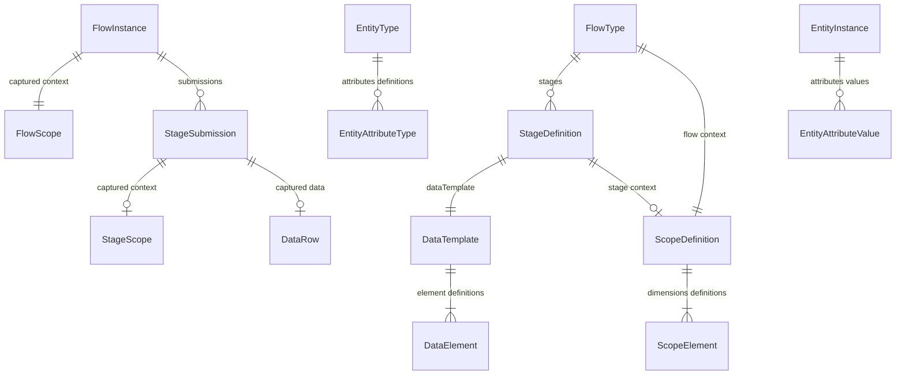

### 2. System Class Diagram

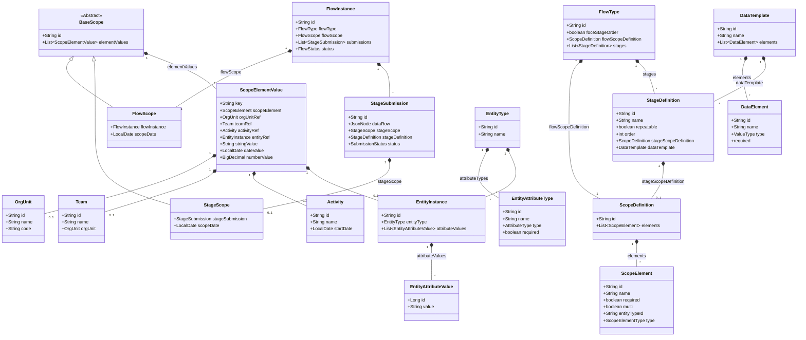

### How It Works in Each Scenario

#### Scenario 1: Inventory Receiving (Repeatable Stage)

**FlowType Configuration**

```bash
{
  "id": "INV_RECEIVE",
  "name": "Inventory Receiving",
  "flowScopeDefinition": {
    "elements": [
      {"id": "warehouse", "type": "ORG_UNIT", "required": true},
      {"id": "receivingTeam", "type": "TEAM", "required": true},
      {"id": "invoiceNumber", "type": "STRING", "required": true}
    ]
  },
  "stages": [
    {
      "id": "unpack-verify",
      "name": "Unpack & Verify",
      "repeatable": true,  // Key for repeatable stage
      "stageScopeDefinition": {
        "elements": [
          {"id": "item", "type": "ENTITY", "name": "Item", "entityTypeId": "ITEM", "required": true},
          {"id": "batch", "type": "STRING", "name": "Batch", "required": false}
        ]
      },
      "dataTemplate": {
        "id": "unpackItems",
        "name": "unpack-verify Items Template",
        "elements": [
          {"id": "quantity", "type": "Number", "name": "Quantity", "required": true},
          {"id": "condition", "type": "Text", "name": "Condition", "required": true}         
        ]
      }
    }
  ]
}
```

**Flow Creation**

```bash
POST /flows
{
  "flowTypeId": "INV_RECEIVE",
  "scope": {
    "warehouse": {"id": "WH_MAIN"},       // OrgUnit ref
    "receivingTeam": {"id": "TEAM_RECV1"}, // Team ref
    "invoiceNumber": "INV-2024-001"       // Primitive value
  }
}
```

**Stage Submission (Repeatable)**

```bash
# First item
POST /stages
{
  "flowInstanceId": "FLOW_001",
  "stageDefinitionId": "unpack-verify",
  "scope": {
    "item": {"id": "ITEM_PARACETAMOL"}, // EntityInstance ref
    "batch": "BATCH-0424A"
  },
  "data": {
    "quantity": 100,
    "condition": "GOOD"
  }
}

# Second item
POST /stages
{
  "flowInstanceId": "FLOW_001",
  "stageDefinitionId": "unpack-verify",
  "scope": {
    "item": {"id": "ITEM_VITAMINC"},
    "batch": "BATCH-0424B"
  },
  "data": {
    "quantity": 50,
    "condition": "DAMAGED"
  }
}
```

---

#### Scenario 2: Patient Intake (Healthcare)

**FlowType Configuration**

```json-sample
{
  "id": "PATIENT_INTAKE",
  "name": "Patient Registration & Vitals",
  "flowScopeDefinition": {
    "elements": [
      {"id": "facilityScopeElementId", "type": "ORG_UNIT", "name": "Facility", "required": true},
      {"id": "providerScopeElementId", "type": "ENTITY", "name": "Staff", "entityTypeId": "STAFF", "required": true},
      {"id": "patientScopeElementId", "type": "ENTITY", "name": "Patient", "entityTypeId": "PATIENT", "required": true}     
    ]
  },
  "stages": [
    {
      "id": "vitals",
      "name": "Vital Signs",
      "stageScopeDefinition": {},
      "dataTemplate": {
        "id": "vitalTemplateId",
        "name": "vital data collection Template",
        "elements": [
          {"id": "bpDataElementId", "type": "Text", "name": "Pb", "required": true},
          {"id": "pulseDataElementId", "type": "Number", "name": "Pulse", "required": true}
        ]
      }
    }
  ]
}
```

**Flow Creation**

```bash
# Registration and enrollment Stage
POST /flows
{
  "flowTypeId": "PATIENT_INTAKE",
  "scope": {
    "facilityScopeElementId": {"id": "CLINIC_A"},  // OrgUnit ref
    "providerScopeElementId": {"id": "DR_SMITH"}   // EntityInstance ref 
    "patientScopeElementId": {  // new EntityInstance with attributes, backend lookup or create)
        "id": "PT_JOHNDOE",
        "nameDataElementId": "John Doe",
        "dobDataElementId": "1985-04-12"
        } 
  }
}
```

**Stage Submissions**

```bash
# Vitals Stage (no scope)
POST /stages
{
  "flowInstanceId": "FLOW_002",
  "stageDefinitionId": "vitals",
  "data": {
    "bpDataElementId": "120/80",
    "pulseDataElementId": 72
  }
}
```

---

#### Scenario 3: ITNS Campaign Distribution (Repeatable + Multi-Stage)

**FlowType Configuration**

```json-sample
{
  "id": "ITNS_CAMPAIGN",
  "name": "Mosquito Net Distribution",
  "flowScopeDefinition": {
    "elements": [
      {"id": "campaignElementId", "name": "Campaign", "type": "ACTIVITY", "required": true},
      {"id": "villageElementId", "name": "Village", "type": "ORG_UNIT", "required": true}      
    ]
  },
  "stages": [
    {
      "id": "hh-enrollment-and-distribution",
      "name": "Household Net Distribution",
      "repeatable": true,
      "stageScopeDefinition": {
        "elements": [          
          {"id": "householdElementId", "type": "ENTITY", "entityTypeId": "HOUSEHOLD", "required": true}
        ]
      },
      "dataTemplate": {
        "id": "netDistribution",
        "name": "Net Distribution Template",
        "elements": [
          {"id": "hhSizeElement", "type": "Number", "name": "HH Size", "required": true},
          {"id": "gpsIdElement", "type": "Text", "name": "GPS", "required": true},
          {"id": "hhSizeElement", "type": "Number", "name": "HH Size", "required": true},
          {"id": "netsDistributedElement", "type": "Number", "name": "Nets", "required": true},
          {"id": "recipientElement", "type": "Text", "name": "Recipient Name", "required": true}
        ]
      }
    }
  ]
}
```

**Flow Creation**

```bash
POST /flows
{
  "flowTypeId": "ITNS_CAMPAIGN",
  "scope": {
    "campaignElementId": {"id": "CAMP_2024_MAL"}, // Activity ref
    "villageElementId": {"id": "VILLAGE_ALPHA"} // OrgUnit ref
  }
}
```

**Stage Submissions**

```bash
# Household Net Distribution (repeatable)
POST /stages
{
  "flowInstanceId": "FLOW_003",
  "stageDefinitionId": "hh-enrollment-and-distribution",
  "scope": {
    "householdElementId": {"id": "HH_123"}       // EntityInstance ref
  },
  "data": {
    "hhSizeElement": 5,
    "gpsElement": "-1.234,36.789",
    "netsDistributedElement": 3,
    "recipientElement": "Jane Doe"
  }
}
```

---

#### Key Patterns Demonstrated:

1. **Repeatable Stages**
    - `INV_RECEIVE`/`unpack-verify`: Multiple items in one flow
    - `ITNS_CAMPAIGN`/`hh-registration-and-distribution`: Multiple households
2. **Mixed Scope Types**
    - **Fixed Entities**: `OrgUnit` (warehouse/facility/district), `Team`, `Activity`
    - **Dynamic Entities**: `ITEM`, `PATIENT`, `HOUSEHOLD`
    - **Primitives**: `invoiceNumber` (string)

3. **Stage-Scoped Entities**
    - Household in `hh-registration` stage
    - Item in `unpack-verify` stage

---

## UI Concept

a highly configurable UI approach that aligns with the above model.

**Goal:**

1. a unified, configurable way to handle scope capture across all domains while maintaining domain-specific flexibility.
2. a clear separation between scope capture and data entry to creates a consistent user experience whether working with
   campaigns, inventory, or healthcare workflows.

### Unified Scope Capturing UI Concept

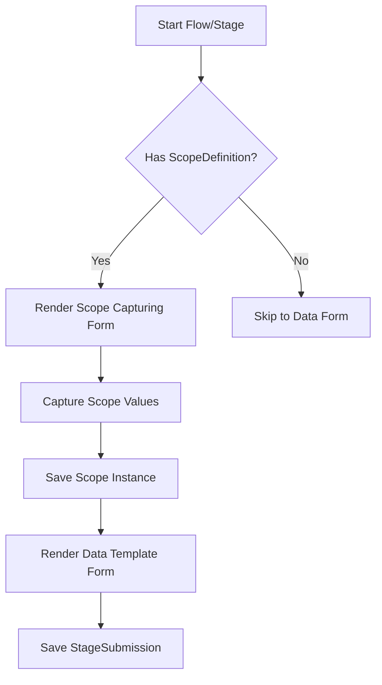

### Scenario Implementations:

#### 1. Campaign Distribution (ITNs)

**Scope Capture Flow**:

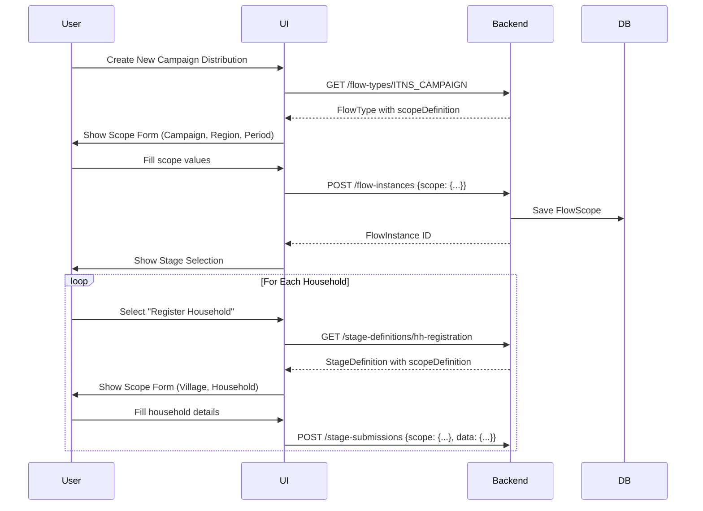

**Sample UI Flow**:

1. Campaign-level scope form:
   ```
   [ Campaign: ______________ ]
   [ Region:   ______________ ]
   [ Period:   ▁▁▁▁▁▁▁▁▁▁▁▁▁▁ ]
   ```
2. Household registration scope form:
   ```
   [ Village:   ______________ ]
   [ Household: ______________ ]
   [ HH Size:   ▁▁▁▁▁▁▁▁▁▁▁▁▁▁ ]
   ```
3. Data form (appears after scope capture):
   ```
   [ GPS Coordinates: ______________ ]
   [ Notes:           ______________ ]
   ```

#### 2. Inventory Receiving

**Scope Capture Flow**:

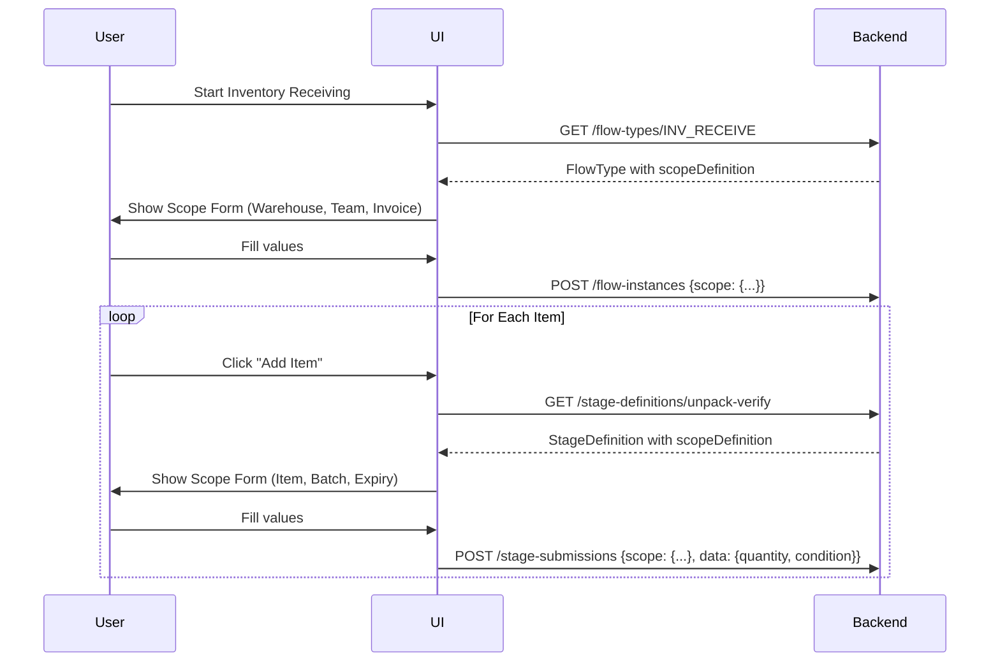

**Sample UI Flow**:

1. Flow-level scope:
   ```
   [ Warehouse:  ▾ Warehouse A ]
   [ Team:       ▾ Receiving Team 1 ]
   [ Invoice #:  INV-2024-001 ]
   ```
2. Item-level scope:
   ```
   [ Item:      ▾ Paracetamol 500mg ]
   [ Batch #:   BATCH-0424A ]
   [ Expiry:    2025-12-31 ]
   ```
3. Data form:
   ```
   [ Quantity: 100 ]
   [ Condition: ▾ Good ]
   ```

#### 3. Patient Intake (Healthcare)

**Scope Capture Flow**:

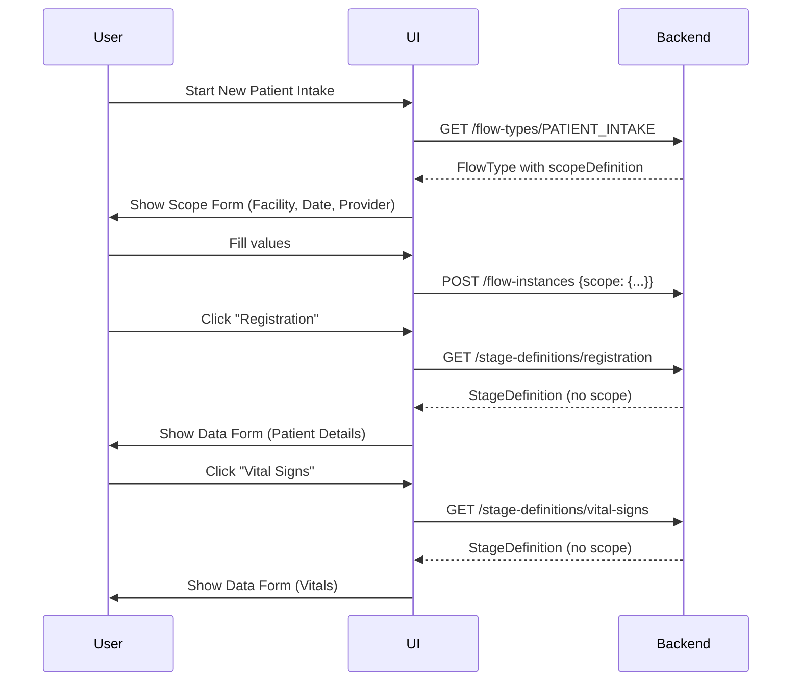

**Sample UI Flow**:

1. Facility-level scope:
   ```
   [ Facility: ▾ Main Clinic ]
   [ Date:     2024-06-18 ]
   [ Provider: ▾ Dr. Smith ]
   ```
2. Registration (no scope, direct to data):
   ```
   [ Patient Name: ______________ ]
   [ Date of Birth: ▁▁▁▁▁▁▁▁▁▁▁▁▁▁ ]
   ```

### Submission API Contracts

**1. Create Flow Instance**:

```json-sample
POST /api/flow-instances
{
  "flowTypeId": "INV_RECEIVE",
  "scope": {
    "warehouse": "WH_MAIN",
    "team": "TEAM_RECV_1",
    "invoiceNumber": "INV-2024-001"
  }
}

// Response
{
  "id": "FLOW_01H...",
  "status": "IN_PROGRESS",
  "scope": { ... } // created scope
}
```

**2. Create Stage Submission (with scope)**:

```json-sample
POST /api/stage-submissions
{
  "flowInstanceId": "FLOW_01H...",
  "stageDefinitionId": "unpack-verify",
  "scope": {
    "item": "ITEM_PARACETAMOL",
    "batch": "BATCH-0424A",
    "expiry": "2025-12-31"
  },
  "data": {
    "quantityReceived": 100,
    "condition": "GOOD"
  }
}
```

**3. Create Stage Submission (no scope)**:

```json-sample
POST /api/stage-submissions
{
  "flowInstanceId": "FLOW_01H...",
  "stageDefinitionId": "vital-signs",
  "data": {
    "bp": "120/80",
    "pulse": 72
  }
}
```

### Configuration for Different Domains

**Healthcare (Patient Referral)**:

```json-sample
{
  "id": "PATIENT_REFERRAL",
  "flowScopeDefinition": {
    "elements": [
      {"key": "referringFacility", "type": "ORG_UNIT", "label": "Referring Facility"},
      {"key": "referralDate", "type": "DATE", "label": "Referral Date"},
      {"key": "urgency", "type": "OPTION", "options": ["Emergency", "Urgent", "Routine"]}
    ]
  },
  "stages": [
    {
      "id": "clinical-summary",
      "stageScopeDefinition": {
        "elements": [
          {"key": "diagnosis", "type": "ENTITY", "entityTypeId": "DIAGNOSIS", "label": "Primary Diagnosis"}
        ]
      }
    }
  ]
}
```

**Education (Student Enrollment)**:

```json-sample
{
  "id": "STUDENT_ENROLLMENT",
  "flowScopeDefinition": {
    "elements": [
      {"key": "school", "type": "ORG_UNIT", "label": "School"},
      {"key": "academicYear", "type": "STRING", "label": "Academic Year"}
    ]
  },
  "stages": [
    {
      "id": "student-details",
      "stageScopeDefinition": {
        "elements": [
          {"key": "student", "type": "ENTITY", "entityTypeId": "STUDENT", "label": "Student"}
        ]
      }
    },
    {
      "id": "guardian-info",
      "repeatable": true,
      "stageScopeDefinition": {
        "elements": [
          {"key": "guardian", "type": "ENTITY", "entityTypeId": "GUARDIAN", "label": "Guardian"},
          {"key": "relationship", "type": "STRING", "label": "Relationship"}
        ]
      }
    }
  ]
}
```

### Benefits of This Approach

1. **Consistent UX Pattern**:
    - Scope form → Data form sequence works for all domains
    - Same UI components for scope capture across workflows

2. **Progressive Disclosure**:
   ```mermaid
   journey
       title Form Progression
       section Flow Initiation
         Scope Capture: 5: User
         Data Templates: 0
       section Stage Execution
         Scope Capture: 3: User
         Data Capture: 5: User
   ```


- Only show relevant scope elements per context
- Separate scope concerns from transactional data
- Add new scope elements without UI changes
- Domain-specific labels and input types

### 1. Entity Relationship Diagram (ERD) Scope handling

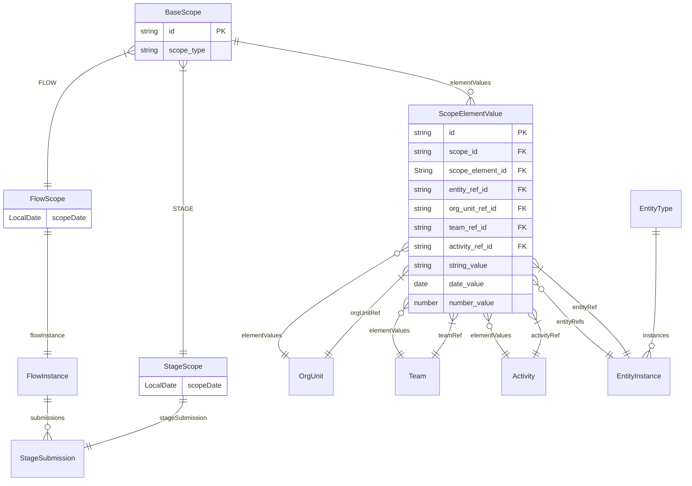

## System Components Explained

### 1. Scope Hierarchy

| **Component**       | **Description**                                 | **Relationships**              |
|---------------------|-------------------------------------------------|--------------------------------|
| `BaseScope`         | Abstract base for all scopes                    | Parent of FlowScope/StageScope |
| `FlowScope`         | Flow-level context (orgUnit, date, etc.)        | 1:1 with FlowInstance          |
| `StageScope`        | Stage-level context (entity binding, overrides) | 1:1 with StageSubmission       |
| `ScopeElementValue` | Configurable dimension with typed value storage | M:1 with BaseScope             |

### 2. Fixed Core Entities

| **Entity** | **Description**                                                      |
|------------|----------------------------------------------------------------------|
| `OrgUnit`  | Organizational units (health facilities, warehouses, districts)      |
| `Team`     | Teams executing workflows (clinical teams, inventory teams)          |
| `Activity` | Activities or campaigns (vaccination drives, distribution campaigns) |

### 3. Dynamic Entity System

| **Component**          | **Description**                                                  |
|------------------------|------------------------------------------------------------------|
| `EntityType`           | Definition of domain entities (Household, Item, Patient)         |
| `EntityInstance`       | Concrete instance of an entity (Household-123, Item-PARACETAMOL) |
| `EntityAttributeType`  | Attribute definition for entities (name, batch, expiry)          |
| `EntityAttributeValue` | Value storage for entity attributes                              |

### 4. Workflow Components

| **Component**     | **Description**                                  |
|-------------------|--------------------------------------------------|
| `FlowType`        | Workflow template (e.g., "Vaccination Campaign") |
| `FlowInstance`    | Runtime instance of a workflow                   |
| `StageDefinition` | Step template (e.g., "Patient Registration")     |
| `StageSubmission` | Actual execution of a stage with data            |
| `DataTemplate`    | Form configuration for stage data                |

## System Capabilities

### 1. Dynamic Scope Configuration

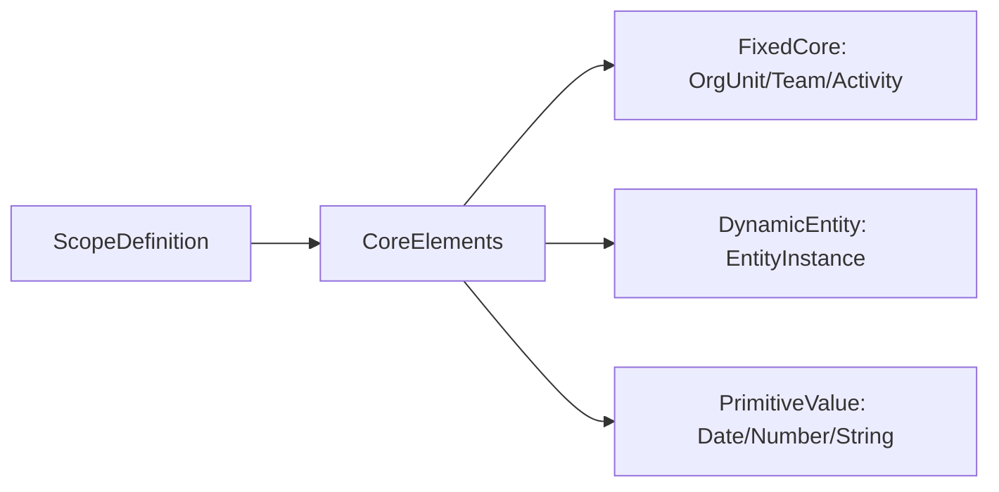

### 2. Entity Lifecycle

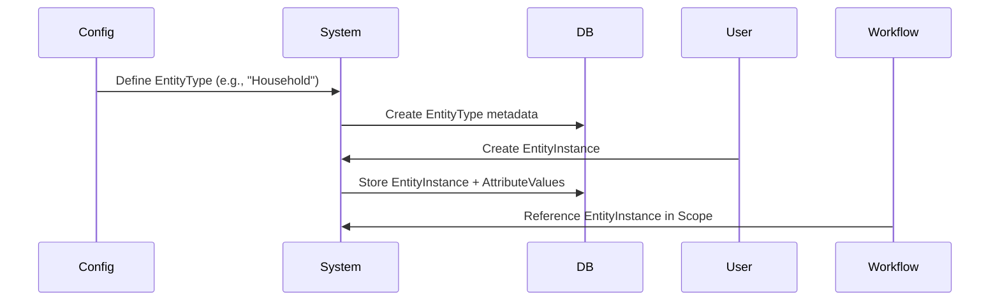

### 3. Workflow Execution

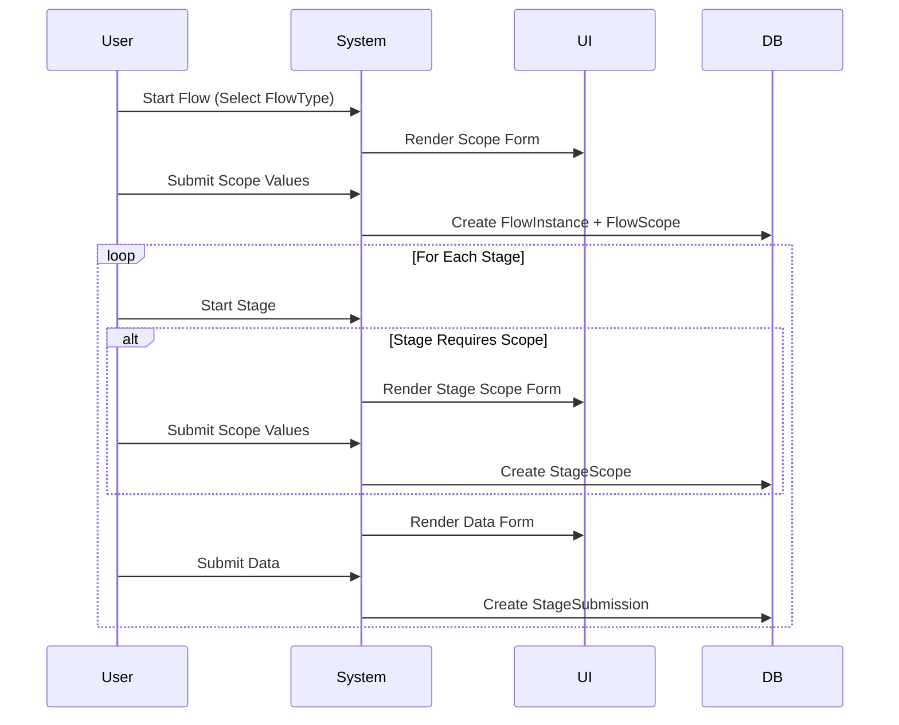

## Benefits of This Model

1. **Flexible Yet Structured**:
    - Fixed core entities for common dimensions (OrgUnit/Team/Activity)
    - Dynamic entities for domain-specific objects (Household/Item/Patient)
    - Primitive values for simple attributes

2. **Runtime Entity Management**:
    - Create new EntityTypes without schema changes
    - Define attributes through configuration
    - Maintain referential integrity

3. **Optimized Query Performance**:
    - Direct joins for fixed core entities
    - Indexed entity references
    - Materialized views for complex reports

4. **Consistent Scope Handling**:
    - Unified pattern for flow and stage scopes
    - Inheritable scope values
    - Configurable requirements per workflow

## Sample System Output

**FlowType Configuration (YAML)**

```yaml
flowType:
    id: VACCINATION_CAMPAIGN
    name: Community Vaccination Drive
    forceStageOrder: true
    flowScopeDefinition:
        elements:
            -   id: healthFacility
                type: ORG_UNIT
                name: Facility
                required: true
            -   id: team
                type: TEAM
                required: true
            -   id: campaign
                type: ACTIVITY
                name: Campaign
                required: true

    stages:
        -   id: HOUSEHOLD_REGISTRATION
            stageScopeDefinition:
                elements:
                    -   id: household
                        type: ENTITY
                        entityTypeId: HOUSEHOLD
                        required: true
            dataTemplate: HOUSEHOLD_FORM

        -   order: 1
        -   id: VACCINATION_RECORD
            stageScopeDefinition:
                elements:
                    -   id: patient
                        type: ENTITY
                        name: Patient
                        entityTypeId: PATIENT
                        required: true
            dataTemplate: VACCINATION_FORM
```

**EntityType Configuration (JSON)**

```json
{
    "id": "HOUSEHOLD",
    "name": "Household",
    "attributes": [
        {
            "id": "hhId",
            "type": "STRING",
            "required": true
        },
        {
            "id": "location",
            "type": "GPS"
        },
        {
            "id": "members",
            "type": "INTEGER"
        }
    ]
}
```

---

### 3. Sequence Diagram: Stage Submission Flow

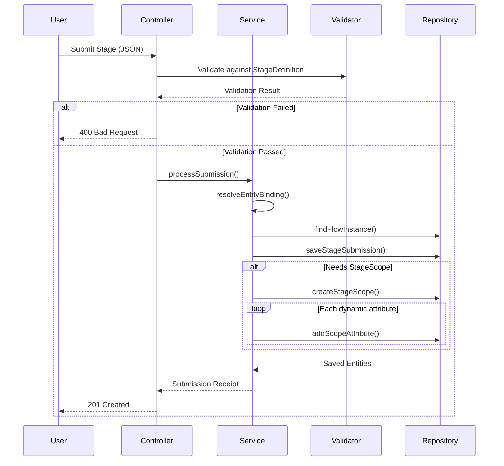

### 4. State Diagram: Flow Lifecycle

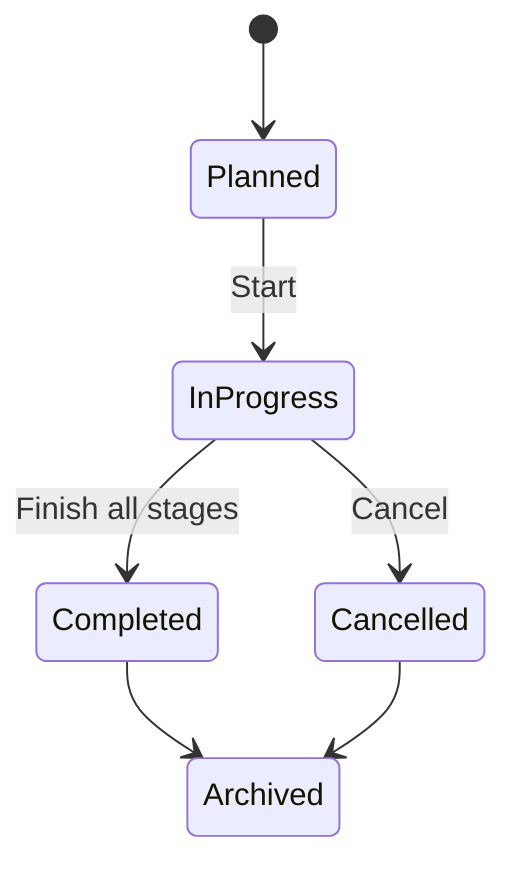

---

## Limits & Solutions

| **Limit**                          | **Solution**                                     |  
|------------------------------------|--------------------------------------------------|  
| Complex cross-entity queries       | Materialized views or analytics DB replication   |  
| Real-time reporting at scale       | Async aggregation jobs                           |  
| UI customization for dynamic forms | Flutter form engine with domain-specific widgets |  
| Validation of dynamic scope        | Metadata-driven rules engine                     |  

**Key Constraint**

- **No ad-hoc joins**: Cannot dynamically join arbitrary entity types.  
  *Solution*: Predefine reporting views for common entity combinations.

### Technical Scope

- **Included**:
    - Configurable scoping (flow/stage)
    - Dynamic entity binding
    - Repeatable stages
    - Primitive value capture (date/number/string)
- **Excluded**:
    - Real-time analytics
    - Ad-hoc relationship modeling
    - UI theme customization

## Summary

This engine solves domain-agnostic workflow execution with:

1. **Configurable scopes** mixing fixed dimensions and dynamic entities
2. **Repeatable stages** for bulk operations (e.g., item receiving)
3. **Extensible metadata** to avoid schema changes
4. **Cross-domain consistency** via unified scope/data models

**Problems Solved**

1. **Domain Rigidity**: Support healthcare, inventory, and surveys with same engine
2. **Scope Bloat**: Avoid custom columns for every new dimension
3. **Stage Flexibility**: Repeatable stages with entity binding (e.g., multiple items in one receipt)
4. **Evolution**: Add new scope dimensions without migrations

Reporting focuses on indexed core dimensions, with materialized views for dynamic entity aggregations. UI flexibility is
achieved through a metadata-driven Flutter form renderer.

## Next Steps:

1. **Validation Rules**:
    - Should we add `min/max` for numbers (e.g., `quantity > 0`)?
2. **Cross-Stage References**:
    - How to enforce that `net-distribution` references a household from `hh-registration`?
3. **Bulk Operations**:
    - API support for bulk stage submissions?
4. **Flutter UI Components**:
    - Prioritize widgets for:
        - Entity selectors (dynamic + fixed)
        - Repeatable stage controller
        - Scope/data form separator
