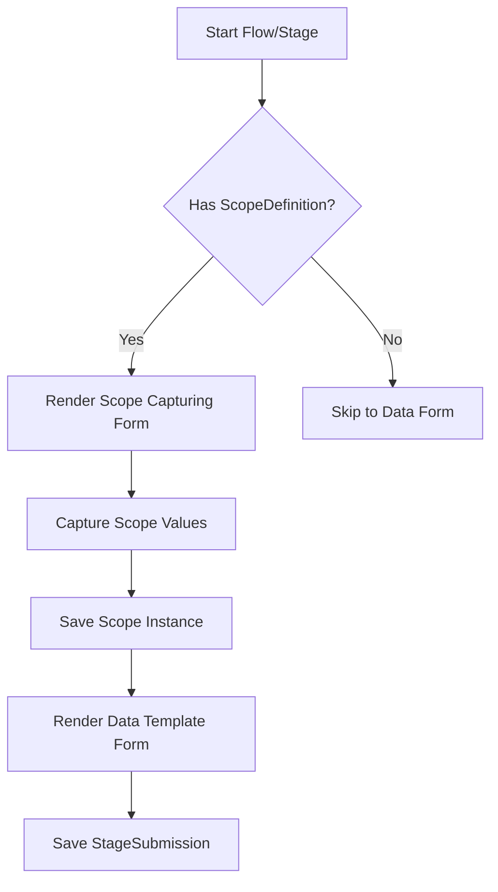
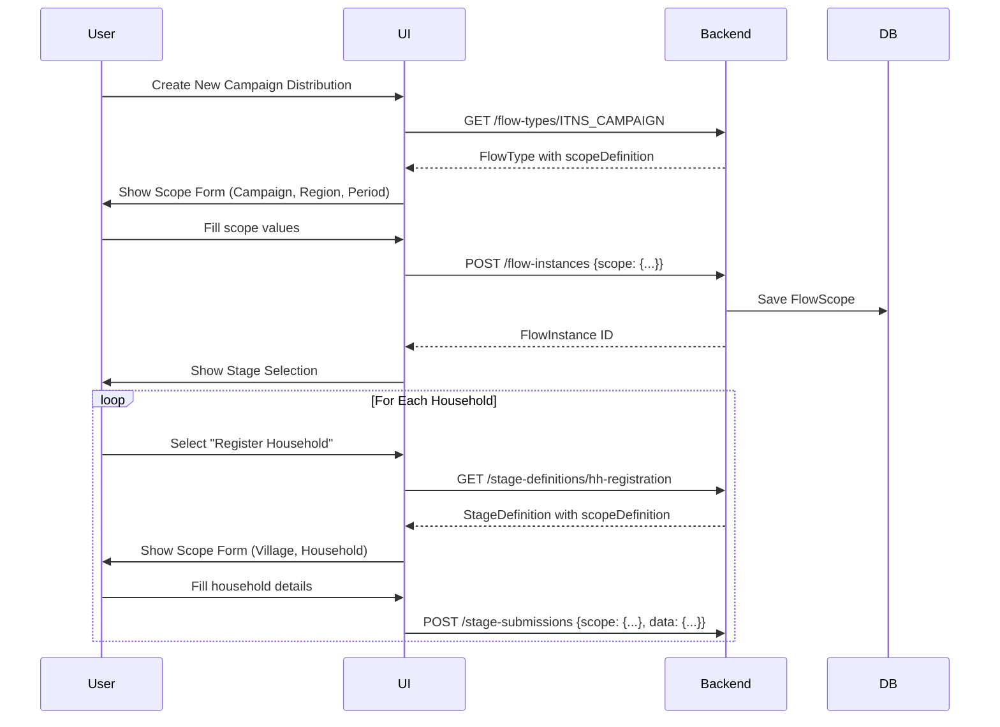
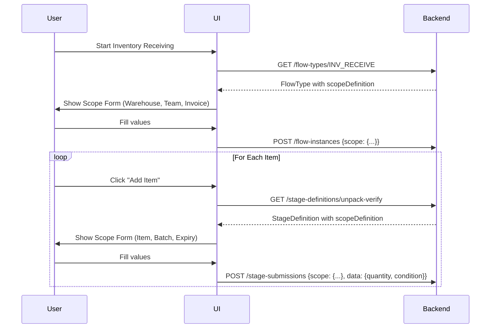
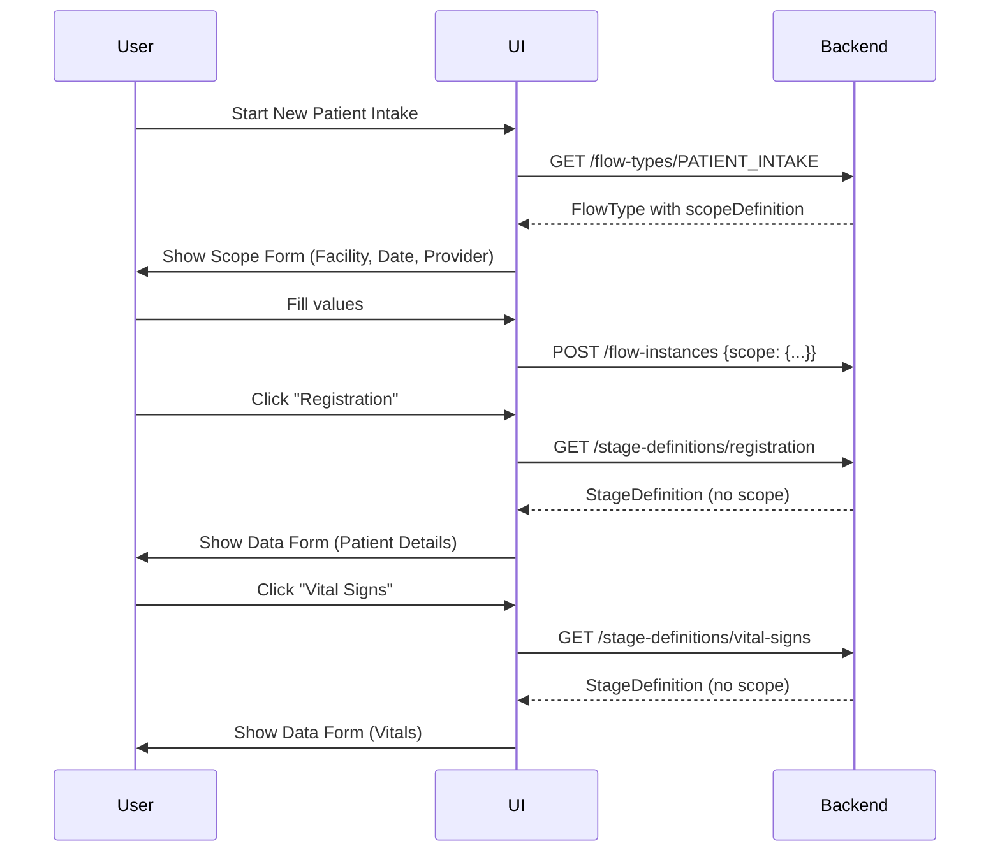

## UI Concept

a highly configurable UI approach that aligns with our model.

**Goal:**

1. Design a unified, configurable way to handle scope capture across all domains while maintaining
   domain-specific flexibility.
2. A clear separation between scope capture and data entry to reduces cognitive load and
   creates a consistent user experience whether working with campaigns, inventory, or healthcare workflows.

### Unified Scope Capturing UI Concept



### Implementation Components:

1. **ScopeFormRenderer Service**:

```java
public class ScopeFormRenderer {
    public FormDefinition renderForm(ScopeDefinition definition) {
        List<FormField> fields = new ArrayList<>();

        for (ScopeElement element : definition.getElements()) {
            fields.add(new FormField(
                element.getKey(),
                element.getLabel(),
                mapToFieldType(element.getType()),
                element.isRequired()
            ));
        }
        return new FormDefinition("scope-form", fields);
    }

    private FieldType mapToFieldType(ScopeElementType type) {
        return switch (type) {
            case ORG_UNIT -> FieldType.ENTITY_SELECTOR;
            case TEAM -> FieldType.TEAM_SELECTOR;
            case ENTITY -> FieldType.ENTITY_SELECTOR;
            case DATE -> FieldType.DATE_PICKER;
            case STRING -> FieldType.TEXT;
            case NUMBER -> FieldType.NUMBER;
            // ... other mappings
        };
    }
}
```

2. **Form Rendering Engine** (React example):

```jsx
const DynamicForm = ({definition, onSubmit}) => {
    return (
        <form onSubmit={onSubmit}>
            {definition.fields.map(field => (
                <FormField
                    key={field.name}
                    field={field}
                    value={values[field.name]}
                    onChange={(value) => setValue(field.name, value)}
                />
            ))}
            <button type="submit">Save Scope</button>
        </form>
    );
};

// Usage in Flow Creation
<DynamicForm
    definition={flowType.scopeDefinition}
    onSubmit={saveFlowScope}
/>
```

### Scenario Implementations:

#### 1. Campaign Distribution (ITNS)

**Scope Capture Flow**:



**Sample UI Flow**:

1. Campaign-level scope form:
   ```
   [ Campaign: ______________ ]
   [ Region:   ______________ ]
   [ Period:   ▁▁▁▁▁▁▁▁▁▁▁▁▁▁ ]
   ```
2. Household registration scope form:
   ```
   [ Village:   ______________ ]
   [ Household: ______________ ]
   [ HH Size:   ▁▁▁▁▁▁▁▁▁▁▁▁▁▁ ]
   ```
3. Data form (appears after scope capture):
   ```
   [ GPS Coordinates: ______________ ]
   [ Notes:           ______________ ]
   ```

#### 2. Inventory Receiving

**Scope Capture Flow**:



**Sample UI Flow**:

1. Flow-level scope:
   ```
   [ Warehouse:  ▾ Warehouse A ]
   [ Team:       ▾ Receiving Team 1 ]
   [ Invoice #:  INV-2024-001 ]
   ```
2. Item-level scope:
   ```
   [ Item:      ▾ Paracetamol 500mg ]
   [ Batch #:   BATCH-0424A ]
   [ Expiry:    2025-12-31 ]
   ```
3. Data form:
   ```
   [ Quantity: 100 ]
   [ Condition: ▾ Good ]
   ```

#### 3. Patient Intake (Healthcare)

**Scope Capture Flow**:



**Sample UI Flow**:

1. Facility-level scope:
   ```
   [ Facility: ▾ Main Clinic ]
   [ Date:     2024-06-18 ]
   [ Provider: ▾ Dr. Smith ]
   ```
2. Registration (no scope, direct to data):
   ```
   [ Patient Name: ______________ ]
   [ Date of Birth: ▁▁▁▁▁▁▁▁▁▁▁▁▁▁ ]
   ```

### Submission API Contracts

**1. Create Flow Instance**:

```json-sample
POST /api/flow-instances
{
  "flowTypeId": "INV_RECEIVE",
  "scope": {
    "warehouse": "WH_MAIN",
    "team": "TEAM_RECV_1",
    "invoiceNumber": "INV-2024-001"
  }
}

// Response
{
  "id": "FLOW_01H...",
  "status": "IN_PROGRESS",
  "scope": { ... } // created scope
}
```

**2. Create Stage Submission (with scope)**:

```json-sample
POST /api/stage-submissions
{
  "flowInstanceId": "FLOW_01H...",
  "stageDefinitionId": "unpack-verify",
  "scope": {
    "item": "ITEM_PARACETAMOL",
    "batch": "BATCH-0424A",
    "expiry": "2025-12-31"
  },
  "data": {
    "quantityReceived": 100,
    "condition": "GOOD"
  }
}
```

**3. Create Stage Submission (no scope)**:

```json-sample
POST /api/stage-submissions
{
  "flowInstanceId": "FLOW_01H...",
  "stageDefinitionId": "vital-signs",
  "data": {
    "bp": "120/80",
    "pulse": 72
  }
}
```

### Configuration for Different Domains

**Healthcare (Patient Referral)**:

```json-sample
{
  "id": "PATIENT_REFERRAL",
  "flowScopeDefinition": {
    "elements": [
      {"key": "referringFacility", "type": "ORG_UNIT", "label": "Referring Facility"},
      {"key": "referralDate", "type": "DATE", "label": "Referral Date"},
      {"key": "urgency", "type": "OPTION", "options": ["Emergency", "Urgent", "Routine"]}
    ]
  },
  "stages": [
    {
      "id": "clinical-summary",
      "stageScopeDefinition": {
        "elements": [
          {"key": "diagnosis", "type": "ENTITY", "entityTypeId": "DIAGNOSIS", "label": "Primary Diagnosis"}
        ]
      }
    }
  ]
}
```

**Education (Student Enrollment)**:

```json-sample
{
  "id": "STUDENT_ENROLLMENT",
  "flowScopeDefinition": {
    "elements": [
      {"key": "school", "type": "ORG_UNIT", "label": "School"},
      {"key": "academicYear", "type": "STRING", "label": "Academic Year"}
    ]
  },
  "stages": [
    {
      "id": "student-details",
      "stageScopeDefinition": {
        "elements": [
          {"key": "student", "type": "ENTITY", "entityTypeId": "STUDENT", "label": "Student"}
        ]
      }
    },
    {
      "id": "guardian-info",
      "repeatable": true,
      "stageScopeDefinition": {
        "elements": [
          {"key": "guardian", "type": "ENTITY", "entityTypeId": "GUARDIAN", "label": "Guardian"},
          {"key": "relationship", "type": "STRING", "label": "Relationship"}
        ]
      }
    }
  ]
}
```

### Benefits of This Approach

1. **Consistent UX Pattern**:
    - Scope form → Data form sequence works for all domains
    - Same UI components for scope capture across workflows

2. **Progressive Disclosure**:
   ```mermaid
   journey
       title Form Progression
       section Flow Initiation
         Scope Capture: 5: User
         Data Templates: 0
       section Stage Execution
         Scope Capture: 3: User
         Data Capture: 5: User
   ```

3. **Reduced Cognitive Load**:
    - Only show relevant scope elements per context
    - Separate scope concerns from transactional data

4. **Configuration-Driven**:
    - Add new scope elements without UI changes
    - Domain-specific labels and input types

5. **Mobile Optimization**:
    - Single-column layout for scope forms
    - Step-by-step progression

### Implementation Tips

1. **Scope Form Caching**:
   ```js
   // Cache scope definitions to reduce roundtrips
   const scopeDefinitions = useMemo(() => 
     new Map(flowType.stages.map(s => [s.id, s.scopeDefinition]))
   , [flowType]);
   ```

2. **Progressive Saving**:
   ```json-sample
   // Save scope immediately when captured
   POST /api/flow-scopes/temp
   {
     "flowInstanceId": "FLOW_01H...",
     "values": {"warehouse": "WH_MAIN"}
   }
   ```

3. **Contextual Help**:
   ```jsx
   <FormField 
     field={field}
     helpText={getScopeHelpText(field.key, currentDomain)}
   />
   ```

4. **Dependent Elements**:
   ```json
   {
     "key": "ward",
     "type": "ORG_UNIT",
     "dependsOn": "facility",
     "filter": "parentId={facility}"
   }
   ```

5. **Scope Summary Preview**:
   ```jsx
   <ScopeSummary 
     values={currentScope} 
     definition={scopeDefinition}
   />
   ```
