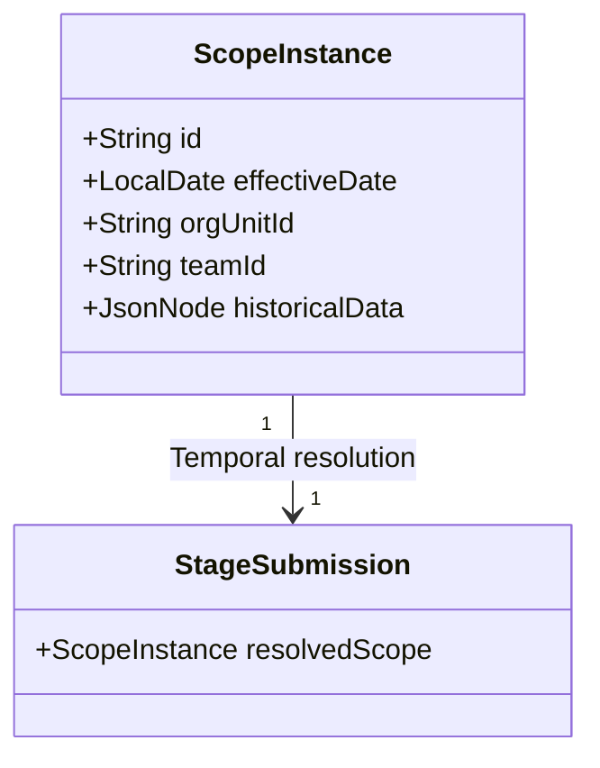
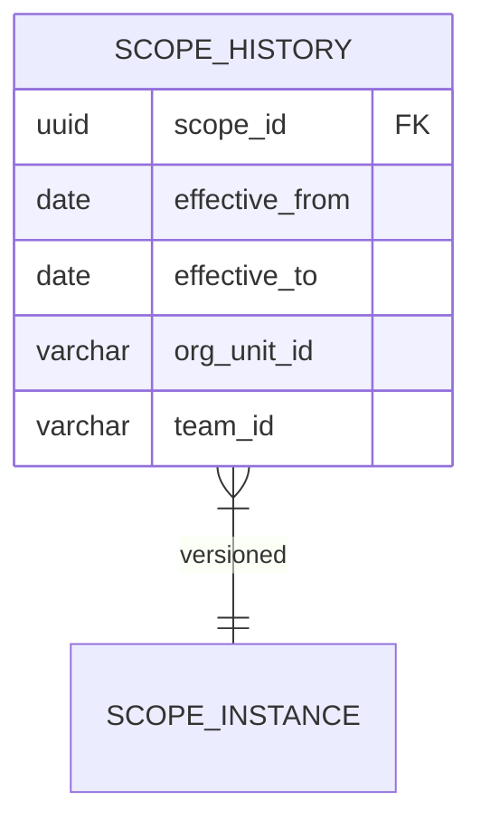

### Clarifying "Temporal Overrides" in Scope Resolution

#### What Temporal Overrides Mean

**Temporal overrides** allow scope dimensions to change value during a flow's lifecycle *without* creating new scope
instances, with the system automatically applying context-appropriate values based on time. Think of it as:  
*"What team was responsible when this stage was submitted?"* rather than *"What team is assigned now?"*

---

### Key Scenarios Requiring Temporal Overrides

1. **Team Reassignment**  
   Flow starts with Team A → Stage 3 completed → Team B takes over → Stage 4 submitted  
   *Reporting needs:* Stage 1-3 = Team A, Stage 4 = Team B

2. **Entity State Changes**  
   Patient admitted to ER (scope: ER) → Transferred to ICU (scope: ICU)  
   *Data must reflect:* Triage stage = ER context, Surgery stage = ICU context

3. **Geographical Adjustments**  
   ITNs campaign starts in District A → Moves to District B mid-flow  
   *Requirement:* Early stages = District A, Later stages = District B

---

### Implementation Approaches

#### Option 1: Point-in-Time Snapshots (Recommended)



**Logic**:

```java
public ScopeInstance resolveScope(FlowInstance flow, StageSubmission stage) {
    return scopeRepo.findByFlowAndDate(
        flow.getId(),
        stage.getSubmittedAt() // Critical temporal anchor
    );
}
```

**Pros**: Simple audit trail, no data mutation  
**Cons**: Storage overhead

---

#### Option 2: Versioned Scope Dimensions

```json
// scope_data column example
{
    "team": {
        "2023-01-10": "team_a",
        "2023-06-15": "team_b"
    },
    "location": {
        "2023-01-10": "district_7",
        "2023-08-22": "district_9"
    }
}
```

**Query**:

```sql
SELECT value -> 'team' AS team
FROM scope_instance, jsonb_each(scope_data -> 'team')
WHERE key <= '2023-07-01'
ORDER BY key DESC
LIMIT 1;
```

**Pros**: Single record per context  
**Cons**: Complex queries, JSONB performance hit

---

#### Option 3: Effective Dating (ERP-style)



**Usage**:

```sql
SELECT *
FROM scope_history
WHERE scope_id = 'sc_123'
  AND '2023-05-15' BETWEEN effective_from AND effective_to
```

**Pros**: Enterprise-grade temporal queries  
**Cons**: High complexity, 40% schema expansion

---

### Critical Tradeoffs

| **Approach**     | Reporting Accuracy | Storage Cost | Query Complexity | Auditability |
|------------------|--------------------|--------------|------------------|--------------|
| Point-in-Time    | ⭐⭐⭐                | ⭐⭐☆          | ⭐⭐☆              | ⭐⭐⭐          |
| Versioned JSON   | ⭐⭐☆                | ⭐☆☆          | ⭐⭐⭐              | ⭐⭐☆          |
| Effective Dating | ⭐⭐⭐                | ⭐⭐⭐          | ⭐⭐☆              | ⭐⭐⭐          |

---

### Recommended Implementation

1. **Add temporal anchors**:
   ```java
   @Entity
   public class StageSubmission {
       @Column(nullable = false)
       private Instant submittedAt; // Critical for temporal resolution
   }
   ```

2. **Implement point-in-time resolution**:
   ```java
   @Query("""
   SELECT s FROM ScopeInstance s
   WHERE s.flowInstance = :flow
     AND s.effectiveDate = (
         SELECT MAX(s2.effectiveDate) 
         FROM ScopeInstance s2 
         WHERE s2.flowInstance = :flow 
           AND s2.effectiveDate <= :anchorDate
     )
   """)
   ScopeInstance findEffectiveScope(@Param("flow") FlowInstance flow, 
                                   @Param("anchorDate") LocalDate anchor);
   ```

3. **Add historical tracking** (optional but recommended):
   ```java
   @Entity
   public class ScopeHistory {
       @Id UUID id;
       @ManyToOne ScopeInstance scope;
       LocalDate effectiveFrom;
       LocalDate effectiveTo;
       String orgUnitId;
       String teamId;
   }
   ```

---

### When to Implement Temporal Overrides?

- **DO Implement** if:
    - Flows last >3 months
    - Team/territory reassignments occur >1x/month
    - Audit requirements include historical context
- **Postpone** if:
    - All flows complete within 1 week
    - Scope dimensions never change mid-flow
    - Initial launch simplicity is critical

For healthcare/inventory systems, temporal overrides are **highly recommended** due to shifting teams, locations, and
entity states. For simple forms, they're likely overkill.
