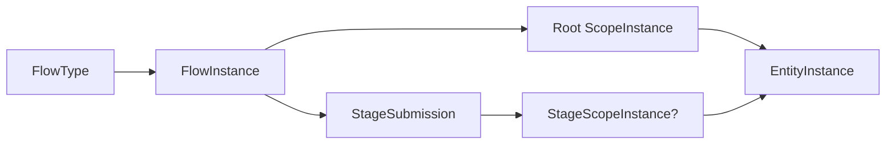
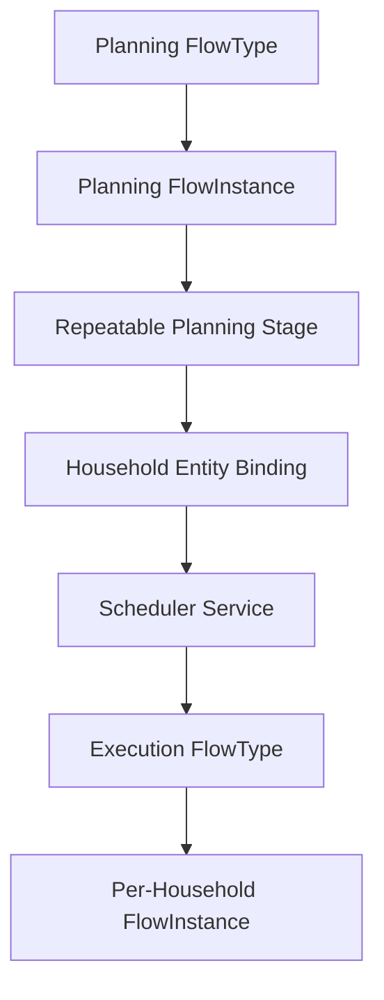
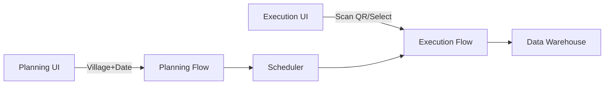

### Requirements Restatement
I understand you need to model **planned household visits** in a metadata-driven workflow system with these core requirements:
1. Support pre-creation of `FlowInstances` for village/date contexts
2. Bind households (existing/new) during planning or execution
3. Maintain flexibility for entity binding at flow/stage levels
4. Avoid overcomplication while preserving core scope model

---

### Assumptions
1. Households are `EntityType = "Household"`
2. Users can create entities during planning/execution
3. Permission checks exist for flow creation
4. JSONB storage used for flexible dimensions

---

### Use Case Restatement: Planned Village Visits
**Scenario**: Health worker plans visits for Village X on 2025-07-01:
- Option A: Pre-create 50 `FlowInstances` (1 per household)
- Option B: Create 1 `FlowInstance` with 50 `StageSubmissions`

---

### Current Model Analysis
#### Existing Capabilities


**Gaps for This Use Case**:
1. No clear path for batch creation of planned flows
2. Ambiguity in entity binding timing (planning vs execution)
3. Missing bulk assignment patterns

---

### Alternative Configurations
#### Option 1: Per-Household FlowInstances (Full Scope)
```json
// FlowType Configuration
{
  "scopes": [
    {"key": "orgUnit", "type": "ORG_UNIT", "required": true},
    {"key": "date", "type": "DATE", "required": true},
    {"key": "household", "type": "ENTITY", "entityType": "Household", "required": true}
  ]
}
```
**Service Logic**:
```java
void planVillageVisits(String orgUnit, LocalDate date, List<String> householdIds) {
  for (String hhId : householdIds) {
    FlowInstance fi = new FlowInstance().setStatus(PLANNED);
    ScopeInstance si = new ScopeInstance()
      .setOrgUnitId(orgUnit)
      .setScopeDate(date)
      .setEntityInstance(householdRepo.loadOrCreate(hhId));
    fi.setFlowScope(si);
    flowRepo.save(fi);
  }
}
```
**Pros**: Simple assignment per household  
**Cons**: 50+ flow instances for one village-day

#### Option 2: Single Flow with Multi-Household Stages
```json
// FlowType Configuration
{
  "scopes": [
    {"key": "orgUnit", "type": "ORG_UNIT", "required": true},
    {"key": "date", "type": "DATE", "required": true}
  ],
  "stages": [{
    "id": "household_visit",
    "repeatable": true,
    "entityBoundEntityTypeId": "Household"
  }]
}
```
**Service Logic**:
```java
FlowInstance planVillageVisit(String orgUnit, LocalDate date) {
  FlowInstance fi = new FlowInstance().setStatus(PLANNED);
  fi.setFlowScope(new ScopeInstance()
    .setOrgUnitId(orgUnit)
    .setScopeDate(date));
  return flowRepo.save(fi);
}

void addHouseholdVisit(FlowInstance fi, String hhId) {
  StageSubmission ss = new StageSubmission();
  ss.setStageScope(new ScopeInstance()
    .setEntityInstance(householdRepo.loadOrCreate(hhId)));
  fi.addStage(ss);
}
```
**Pros**: Single flow for logical grouping  
**Cons**: Complex stage management

---

### Design Proposal: Hybrid Approach
#### FlowType Configuration
```json
{
  "id": "village_visit",
  "planningMode": "PLANNED",
  "scopes": [
    {"key": "orgUnit", "type": "ORG_UNIT", "required": true},
    {"key": "date", "type": "DATE", "required": true},
    {"key": "household", "type": "ENTITY", "entityType": "Household", 
     "required": false, "bindAt": "PLANNING_OR_EXECUTION"} // New property
  ]
}
```

#### Service Skeleton
```java
public class VisitPlanner {
  @Transactional
  public FlowInstance planVisit(String orgUnit, LocalDate date, 
                               @Nullable String householdId) {
    FlowInstance fi = new FlowInstance(flowTypeRepo.get("village_visit"));
    
    ScopeInstance rootScope = new ScopeInstance()
      .setOrgUnitId(orgUnit)
      .setScopeDate(date);
    
    if (householdId != null) {
      rootScope.setEntityInstance(
        householdRepo.findById(householdId)
          .orElseGet(() -> createPlaceholderHousehold(householdId))
      );
    }
    
    fi.setFlowScope(rootScope);
    return flowRepo.save(fi);
  }

  public void executeVisit(FlowInstance fi, String householdId) {
    if (fi.getFlowScope().getEntityInstance() == null) {
      // Bind household during execution
      fi.getFlowScope().setEntityInstance(
        householdRepo.findById(householdId)
          .orElseThrow(NotFoundException::new)
      );
    }
    // Proceed with stage submissions...
  }
}
```

#### Batch Planning API
```java
@PostMapping("/visits/batch")
public ResponseEntity<String> planBatchVisits(
  @RequestBody BatchVisitRequest request
) {
  List<CompletableFuture<FlowInstance>> futures = request.householdIds()
    .parallelStream()
    .map(hhId -> asyncService.submit(() -> 
      planVisit(request.orgUnit(), request.date(), hhId))
    .toList();
  
  return ResponseEntity.accepted().body("Batch processing started");
}
```

---

### Trade-offs & Recommendations
| **Approach** | **Dev Complexity** | **Runtime Performance** | **Flexibility** |  
|--------------|-------------------|-------------------------|----------------|  
| Per-Household Flows | Low | Medium (many flows) | Medium |  
| Single Flow | Medium | High (large flow) | Low |  
| **Hybrid** | **Medium** | **Optimized** | **High** |  

**Recommendation**: Implement hybrid model with:
1. Optional `bindAt` property in scope definitions
2. Placeholder entity support
3. Async batch creation API
4. Lazy entity binding during execution

---

### Next Steps / Questions
1. **Prototype Hybrid Model**:
    - Implement `bindAt` property in `ScopeDefinition`
    - Add `createPlaceholderHousehold()` method
    - Test with 1000 household batch

2. **Permission Scenarios**:
    - How to handle "create household" permission during planning vs execution?

3. **Placeholder Cleanup**:
    - Should unbound placeholder households auto-expire?

4. **Critical Question**:  
   *Should we introduce a `PlanningContext` object to encapsulate batch creation parameters?*

```java
public class PlanningContext {
  private String orgUnit;
  private LocalDate visitDate;
  private List<String> householdIds;
  private boolean allowPlaceholders;
}
```

---

### Requirements Restatement
I understand you need an intuitive, manageable solution for planned household visits that:
1. Separates planning (selecting households) from execution (data collection)
2. Handles both pre-planned and ad-hoc visits
3. Avoids major model changes
4. Maintains metadata-driven flexibility

---

### Assumptions
1. Households are entity-bound (`EntityType = "Household"`)
2. Users need distinct UIs for planning vs execution
3. Traceability between planning and execution is required
4. Existing scope/flow model remains foundation

---

### Proposed Solution: Two-Phase Flow Orchestration
#### Intuitive Pattern Inspired By:
- **Salesforce Campaigns**: Campaign (planning) → Campaign Members (targets) → Leads/Contacts (execution)
- **Jira**: Epic (planning) → Stories (execution tasks)

---

### Design Without Model Changes


---

### Phase 1: Planning Flow Configuration
#### FlowType: `household_visit_planning`
```json
{
  "id": "household_visit_planning",
  "planningMode": "PLANNED",
  "scopes": [
    {"key": "orgUnit", "type": "ORG_UNIT", "required": true},
    {"key": "visitDate", "type": "DATE", "required": true}
  ],
  "stages": [{
    "id": "add_households",
    "name": "Select Households",
    "repeatable": true,
    "entityBoundEntityTypeId": "Household",
    "formTemplateId": "household_selector_form"
  }]
}
```

#### Service Logic: Planning Completion Handler
```java
public void onPlanningComplete(FlowInstance planningFlow) {
  List<StageSubmission> plannedHouseholds = 
    stageRepo.findByFlowAndStage(planningFlow, "add_households");
  
  plannedHouseholds.forEach(planned -> {
    // Create execution flow per household
    FlowInstance execution = new FlowInstance();
    execution.setType("household_visit_execution");
    execution.setParentFlow(planningFlow); // Link back to plan
    
    ScopeInstance executionScope = new ScopeInstance()
      .copyCoreDimensions(planningFlow.getFlowScope()) // orgUnit/date
      .setEntityInstance(planned.getStageScope().getEntityInstance());
    
    execution.setFlowScope(executionScope);
    flowRepo.save(execution);
    
    // Schedule for visit date
    scheduler.schedule(
      execution.getId(), 
      planningFlow.getFlowScope().getScopeDate()
    );
  });
}
```

---

### Phase 2: Execution Flow Configuration
#### FlowType: `household_visit_execution`
```json
{
  "id": "household_visit_execution",
  "planningMode": "PLANNED",
  "scopes": [
    {"key": "orgUnit", "type": "ORG_UNIT", "required": true},
    {"key": "visitDate", "type": "DATE", "required": true},
    {"key": "household", "type": "ENTITY", "entityType": "Household", "required": true}
  ],
  "stages": [{
    "id": "data_collection",
    "name": "Household Survey",
    "formTemplateId": "visit_data_form"
  }]
}
```

---

### Handling Unplanned Visits
#### "Ad-Hoc Visit" Service Method
```java
public FlowInstance createAdHocVisit(String orgUnit, LocalDate date, String householdId) {
  // Find existing planning flow for context
  FlowInstance planningFlow = flowRepo.findPlanningFlow(orgUnit, date)
    .orElseGet(() -> createPlaceholderPlan(orgUnit, date));
  
  // Create execution flow
  FlowInstance execution = new FlowInstance();
  execution.setType("household_visit_execution");
  execution.setParentFlow(planningFlow);
  
  // Create/bind household
  EntityInstance hh = householdRepo.findById(householdId)
    .orElseGet(() -> createHousehold(householdId));
  
  ScopeInstance scope = new ScopeInstance()
    .setOrgUnitId(orgUnit)
    .setScopeDate(date)
    .setEntityInstance(hh);
  
  execution.setFlowScope(scope);
  
  // Add to planning flow retroactively
  StageSubmission adHocRecord = new StageSubmission()
    .setStageDefinition("add_households")
    .setStageScope(scope.clone());
  planningFlow.addStage(adHocRecord);
  
  return flowRepo.save(execution);
}
```

---

### UI Layer Abstraction


**Planning UI Features**:
- Map-based household selection
- Bulk import from CSV
- Team assignment per household

**Execution UI Features**:
- Today's visits dashboard
- Offline-first data collection
- Quick add unplanned households

---

### Trade-offs Analysis
| **Aspect** | **Per-Household Flows** | **Single Flow** | **Two-Phase Flow** |  
|------------|-------------------------|----------------|---------------------|  
| **Scalability** | ⭐⭐☆ (Many small flows) | ⭐☆☆ (One giant flow) | ⭐⭐⭐ (Balanced) |  
| **Traceability** | ⭐☆☆ (Hard to group) | ⭐⭐⭐ (Natural grouping) | ⭐⭐⭐ (Explicit links) |  
| **Ad-Hoc Support** | ⭐☆☆ (Separate process) | ⭐⭐☆ (Complex stages) | ⭐⭐⭐ (Native handling) |  
| **UI Complexity** | ⭐⭐⭐ (Simple per-task) | ⭐☆☆ (Monolithic) | ⭐⭐☆ (Two views) |  
| **Storage** | ⭐⭐☆ (More flows) | ⭐⭐⭐ (Less overhead) | ⭐⭐☆ (Moderate) |  

**Recommendation**: Implement two-phase flow with:
1. Lightweight scheduler service
2. `parentFlow` linking for traceability
3. Retroactive planning stage additions

---

### Next Steps / Questions
1. **Prototype Scheduler**:
   ```java
   public interface VisitScheduler {
     void schedule(String flowId, LocalDate date);
     List<FlowInstance> getScheduledVisits(LocalDate date);
     void executeVisit(String flowId);
   }
   ```  
2. **Permission Scenarios**:
    - How to handle household creation permissions in ad-hoc mode?
3. **Placeholder Plans**:
    - Should placeholder planning flows auto-expire?
4. **Critical Question**:  
   *Should we add a `planning_status` (DRAFT/APPROVED) to planning flows to prevent premature execution?*

```java
public enum PlanningStatus {
  DRAFT, APPROVED, ARCHIVED
}
```
