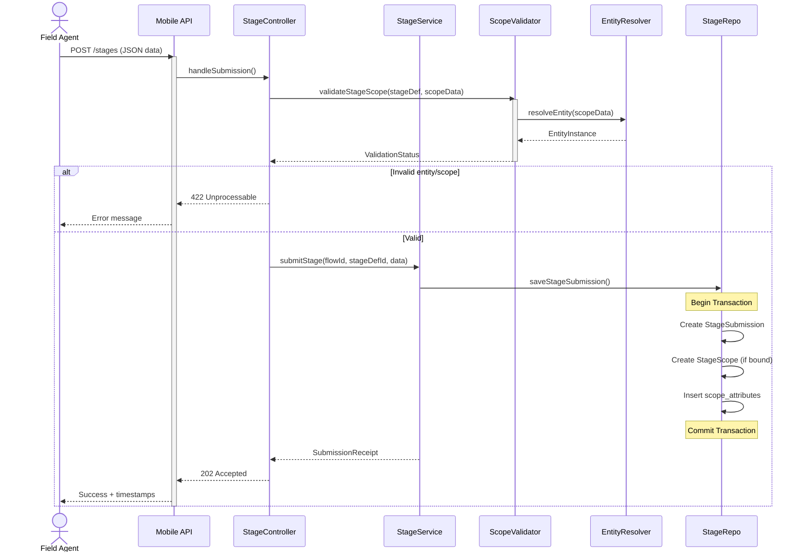
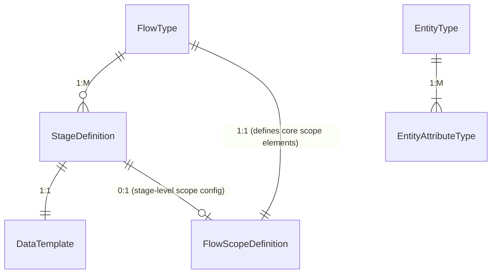
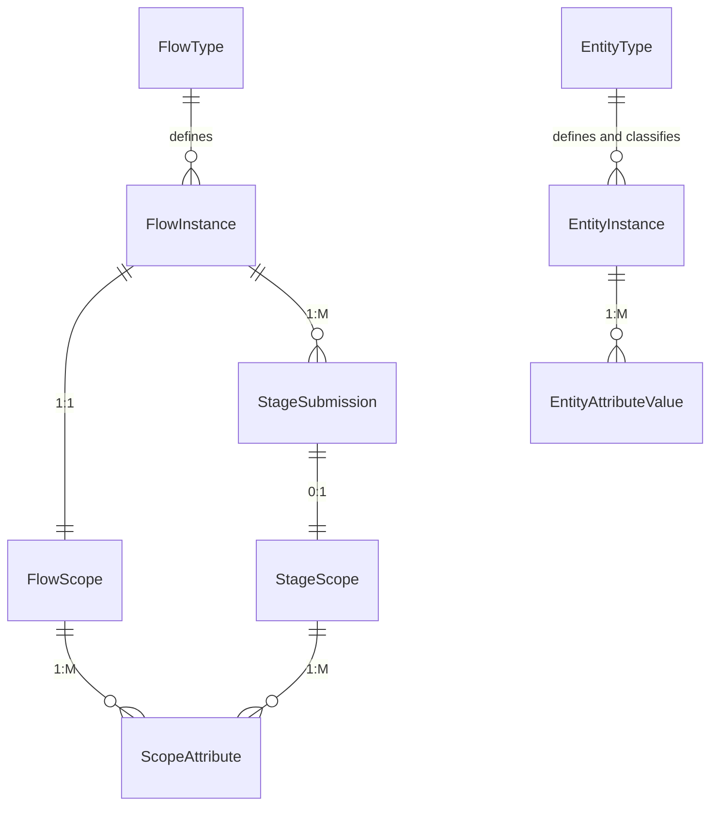

The user wants to design a metadata-driven workflow system that supports multi-stage data entry flows across different
domains like inventory, healthcare, and surveys. The key requirements include flexible scoping at flow and stage levels,
support for repeatable multi-stages, and simplicity for evolution with minimal initial development.

I will assume the system will be built using Spring Boot with JPA/Hibernate for ORM and that initial data volumes will
be moderate (<500K flows/year). Real-time analytics are not an immediate requirement.

## Design Proposal

### Understanding

The proposed system aims to provide a flexible and evolvable metadata-driven workflow for multi-stage data entry across
various domains. It focuses on capturing contextual information at both the flow and individual stage levels, while
ensuring a clear transactional schema that can adapt to future needs.

### Initial Assumptions

* Moderate data volumes are expected, specifically less than 500,000 flows per year initially.
* The technology stack will consist of Spring Boot with JPA/Hibernate for Object-Relational Mapping (ORM).
* There are no immediate requirements for real-time analytics; a reporting layer can be implemented later.
* Early flexibility for uncommon scope dimensions will be achieved using an EAV (Entity-Attribute-Value) model (
  `scope_attribute`), while core dimensions will be explicit columns.

### Core Concepts

The design is built around four core concepts: Flows, Domain Object `Entity`, Scopes, and Stages.

#### 1. Flows (the shape and configuration of a process)

* **FlowType**: Defines the template for a workflow, including scope and stage definitions. It has a configurable
  `scopeDefinition` for core and dynamic scope elements and one or more `StageDefinitions`.
* **FlowInstance**: A runtime instance of a `FlowType`, linked to a single `FlowScope` and having a status (e.g.,
  `IN_PROGRESS`, `COMPLETED`, `CANCELLED`). It contains multiple `StageSubmissions`.

#### 2. Domain Object `Entity`

* **EntityType**: Defines a referencable domain object (e.g., Household, Patient) and lists its key
  `EntityAttributeTypes`.
* **EntityAttributeType**: Defines an attribute (id, type, required) used by `EntityInstance`.
* **EntityInstance**: An instance of an `EntityType`, holding values per `EntityAttributeValue`. It can be created or
  looked up during planning or stage submission and is rarely updated after creation.
* **EntityAttributeValue**: A single record for one attribute value, linked to `EntityInstance` and its type.

#### 3. Scopes (Dimensioning data)

This concept provides a clear, explicit schema for capturing context at both flow and stage levels.

* **FlowScope**: One-to-one with `FlowInstance`, containing core columns like `orgUnitId`, `scopeDate`, optional
  `teamId`, and `primaryEntityInstanceId`. Additional dynamic attributes are stored in the `scope_attribute` EAV table.
* **StageScope**: One-to-one with `StageSubmission`, created only when a stage requires its own scope (e.g.,
  entity-bound stage). It includes core columns like `entityInstanceId` if entity-bound, and can have additional dynamic
  attributes in `scope_attribute`.
* **ScopeAttribute**: An EAV table for dynamic scope dimensions, storing key-value pairs linked to either `FlowScope` or
  `StageScope`. It includes `id`, `scopeType` (enum FLOW or STAGE), `flowInstanceId` (FK) or `stageSubmissionId` (FK),
  `attributeKey`, and `attributeValue`. A check constraint ensures exactly one foreign key is non-null.

#### 4. Stages (the row data)

* **StageDefinition**: A named step in a multi-stage `FlowType`, pointing to a `DataTemplate` (form) and having a
  repeatable flag. It indicates whether it requires its own scope and can include metadata like `entityDefinitionId` if
  entity-bound.
* **StageSubmission**: An actual submission of a stage within a `FlowInstance`. It links to `FlowInstance` and
  `StageDefinition`. If scope-bound, it links to a `StageScope`; otherwise, it relies on `FlowScope` for context. It
  contains `data` (JSONB) for form answers and status/timestamps.

### Core Relationships (Configuration vs Instances)

The relationships are categorized into Configuration Entities and Instance Entities.

#### Configuration Entities



#### Instance Entities



### Schema Sketch (PostgreSQL + JPA Entities)

#### 1. Tables

The following tables are proposed for the system:

* `flow_instance`: Stores runtime instances of `FlowType`.
* `flow_scope`: Stores flow-level context, with a one-to-one relationship with `flow_instance`.
* `stage_submission`: Stores actual submissions of stages within a `FlowInstance`.
* `stage_scope`: Stores stage-level context, one-to-one with `stage_submission` when required.
* `scope_attribute`: An EAV table for dynamic scope dimensions, linked to either `flow_scope` or `stage_scope`.

```sql
CREATE TABLE flow_instance
(
    id           VARCHAR PRIMARY KEY,
    flow_type_id VARCHAR     NOT NULL REFERENCES flow_type (id),
    status       VARCHAR     NOT NULL,
    created_at   TIMESTAMPTZ NOT NULL DEFAULT now(),
    created_by   VARCHAR     NULL
);

CREATE TABLE flow_scope
(
    flow_instance_id   VARCHAR PRIMARY KEY REFERENCES flow_instance (id) ON DELETE CASCADE,
    org_unit_id        VARCHAR NOT NULL,
    scope_date         DATE    NOT NULL,
    team_id            VARCHAR NULL,
    entity_instance_id VARCHAR NULL REFERENCES entity_instance (id)
);

CREATE TABLE stage_submission
(
    id                  VARCHAR PRIMARY KEY,
    flow_instance_id    VARCHAR     NOT NULL REFERENCES flow_instance (id) ON DELETE CASCADE,
    stage_definition_id VARCHAR     NOT NULL REFERENCES stage_definition (id),
    submitted_at        TIMESTAMPTZ NOT NULL DEFAULT now(),
    status              VARCHAR     NOT NULL,
    data                JSONB       NOT NULL
);

CREATE TABLE stage_scope
(
    stage_submission_id VARCHAR PRIMARY KEY REFERENCES stage_submission (id) ON DELETE CASCADE,
    entity_instance_id  VARCHAR NULL REFERENCES entity_instance (id)
);

CREATE TABLE scope_attribute
(
    id                  BIGSERIAL PRIMARY KEY,
    scope_type          VARCHAR NOT NULL CHECK (scope_type IN ('FLOW', 'STAGE')),
    flow_instance_id    VARCHAR NULL REFERENCES flow_scope (flow_instance_id) ON DELETE CASCADE,
    stage_submission_id VARCHAR NULL REFERENCES stage_scope (stage_submission_id) ON DELETE CASCADE,
    attribute_key       VARCHAR NOT NULL,
    attribute_value     TEXT    NOT NULL,
    CONSTRAINT scope_attr_one_fk CHECK (
        (flow_instance_id IS NOT NULL AND stage_submission_id IS NULL)
            OR (flow_instance_id IS NULL AND stage_submission_id IS NOT NULL)
        )
);
```

#### 2. JPA Entity Sketch

JPA entities are sketched for `FlowInstance`, `FlowScope`, `StageSubmission`, `StageScope`, and `ScopeAttribute`,
demonstrating relationships and basic properties.

```java

@Entity
@Table(name = "flow_instance")
public class FlowInstance {
    @Id
    private String id;

    @ManyToOne(optional = false)
    private FlowType flowType;

    @OneToOne(mappedBy = "flowInstance", cascade = CascadeType.ALL, optional = false)
    private FlowScope flowScope;

    @OneToMany(mappedBy = "flowInstance", cascade = CascadeType.ALL)
    private List<StageSubmission> submissions = new ArrayList<>();

    @Column(nullable = false)
    @Enumerated(EnumType.STRING)
    private FlowStatus status;

    @Column(nullable = false, updatable = false)
    private Instant createdAt;
    private String createdBy;

    @PrePersist
    public void prePersist() {
        createdAt = Instant.now();
    }
}

@Entity
@Table(name = "flow_scope")
public class FlowScope {
    @Id
    @Column(name = "flow_instance_id")
    private String flowInstanceId;

    @OneToOne
    @MapsId
    @JoinColumn(name = "flow_instance_id")
    private FlowInstance flowInstance;

    @Column(nullable = false)
    private String orgUnitId;

    @Column(name = "scope_date", nullable = false)
    private LocalDate scopeDate;

    @Column(nullable = true)
    private String teamId;

    @Column(name = "entity_instance_id", nullable = true)
    private String primaryEntityInstanceId;

    @OneToMany(mappedBy = "flowScope", cascade = CascadeType.ALL, orphanRemoval = true)
    private List<ScopeAttribute> attributes = new ArrayList<>();
}

@Entity
@Table(name = "stage_submission")
public class StageSubmission {
    @Id
    private String id;

    @ManyToOne(optional = false)
    private FlowInstance flowInstance;

    @ManyToOne(optional = false)
    private StageDefinition stageDefinition;

    @OneToOne(mappedBy = "stageSubmission", cascade = CascadeType.ALL)
    private StageScope stageScope; // null if not scope-bound

    @Type(type = "jsonb")
    @Column(columnDefinition = "jsonb", nullable = false)
    private JsonNode data;

    @Column(nullable = false)
    @Enumerated(EnumType.STRING)
    private SubmissionStatus status;

    @Column(nullable = false, updatable = false)
    private Instant submittedAt;

    @PrePersist
    public void prePersist() {
        submittedAt = Instant.now();
    }
}

@Entity
@Table(name = "stage_scope")
public class StageScope {
    @Id
    @Column(name = "stage_submission_id")
    private String stageSubmissionId;

    @OneToOne
    @MapsId
    @JoinColumn(name = "stage_submission_id")
    private StageSubmission stageSubmission;

    @Column(name = "entity_instance_id", nullable = true)
    private String entityInstanceId;

    @OneToMany(mappedBy = "stageScope", cascade = CascadeType.ALL, orphanRemoval = true)
    private List<ScopeAttribute> attributes = new ArrayList<>();
}

@Entity
@Table(name = "scope_attribute")
public class ScopeAttribute {
    @Id
    @GeneratedValue
    private Long id;

    @Column(name = "scope_type", nullable = false)
    @Enumerated(EnumType.STRING)
    private ScopeType scopeType; // FLOW or STAGE

    @ManyToOne
    @JoinColumn(name = "flow_instance_id", nullable = true)
    private FlowScope flowScope;

    @ManyToOne
    @JoinColumn(name = "stage_submission_id", nullable = true)
    private StageScope stageScope;

    @Column(name = "attribute_key", nullable = false)
    private String key;

    @Column(name = "attribute_value", nullable = false)
    private String value;

    @PrePersist
    public void validateAssociation() {
        if ((flowScope == null && stageScope == null) || (flowScope != null && stageScope != null)) {
            throw new IllegalStateException("ScopeAttribute must reference exactly one of FlowScope or StageScope");
        }
    }
}
```

### Service-Layer Patterns

#### FlowInstance Creation

1. Validate required core scope inputs (`orgUnitId`, `scopeDate`, ...). If a primary entity is specified as an element
   in flowType scope definition upfront, lookup or create the `EntityInstance`.
2. Create `FlowInstance` and `FlowScope` in a single `@Transactional` operation.
3. For dynamic attributes (e.g., `invoiceNumber`), add `ScopeAttribute` entries under the new `FlowScope` after
   validating against `FlowType` metadata.

#### Stage Submission Processing

1. Load `FlowInstance` and verify the current stage and status.
2. If the `StageDefinition` requires its own scope:
    * Lookup or create any needed `EntityInstance`.
    * Create `StageSubmission` and a linked `StageScope` with core columns (e.g., `entityInstanceId`), plus any dynamic
      attributes via `ScopeAttribute` after validation against metadata.
3. If no stage-level scope is needed: create only `StageSubmission` (context from `FlowScope`).
4. Update `FlowInstance` status or `stageStates` as appropriate.

### Example Use Case: Planned Household Visits

The document provides three options for handling planned household visits, all supported by the explicit `FlowScope`/
`StageScope` schema.

* **Option A: Pre-create FlowInstance per Household Visit**: Creates a `FlowInstance` for each household visit, linking
  it to a household `EntityInstance` via `FlowScope`.
* **Option B: Single FlowInstance per OrgUnit-Date with Repeatable Stage**: Uses a single `FlowInstance` for an
  organization unit and date, with a repeatable stage that creates a `StageScope` for each household visit.
* **Option C: Two-Phase Planning+Execution**: Separates planning and execution into two distinct flow types, linking
  them via references.

### Trade-offs & Recommendations

* **Explicit schema clarity**: Provides strong typing, ease of querying, and validation, which is preferred for
  maintainability.
* **EAV for dynamic dimensions**: Avoids frequent migrations for evolving dimensions, with a recommendation to migrate "
  hot keys" into dedicated columns when they become common.
* **Separate FlowScope/StageScope tables**: Ensures clear semantics and avoids ambiguity.
* **Deferred reporting optimization**: Recommends starting with a simple transactional model and building read-models or
  materialized views for reporting later.
* **Start simple**: Implement core dimensions first (orgUnit, date, optional primary entity) and choose Option A or B
  for planned visits initially, evolving to Option C if planning complexity increases.

## Next Steps / Questions

1. Implement the database schema and JPA entities as sketched.
2. Develop the service logic for `FlowInstance` creation and `StageSubmission` processing, incorporating `FlowScope` and
   `StageScope`.
3. Implement metadata validation using `FlowType` for core and dynamic scope attributes.
4. Prototype a chosen use case (e.g., Option A or B for planned household visits) to test functionality.
5. Write unit/integration tests and set up Flyway migrations for schema evolution.
6. Design a reporting read-model by joining `flow_scope`, `stage_scope`, and `scope_attribute` once core usage
   stabilizes.
7. Document the scoping pattern (explicit columns + EAV) and the evolution process for the team.
