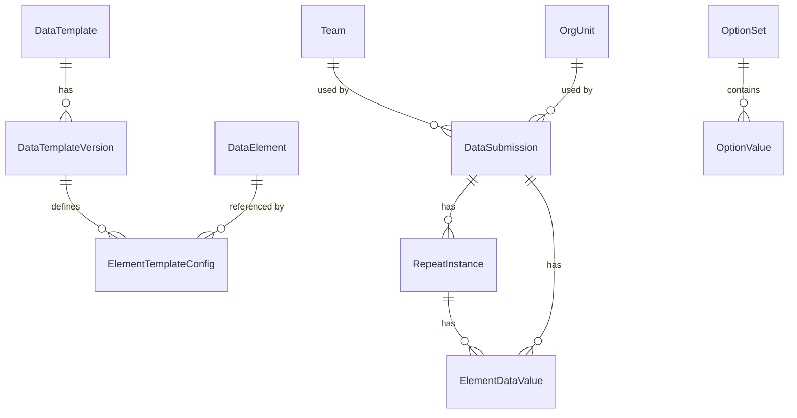
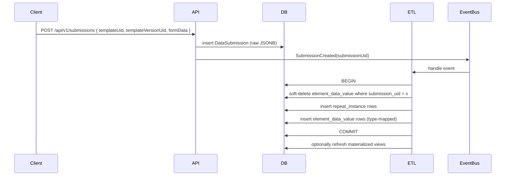

```plantuml
@startuml
' Compact Entity box for ElementTemplateConfig

hide circle
skinparam classAttributeIconSize 0

entity "ELEMENT_TEMPLATE_CONFIG" as ETC {
  * id : BIGINT <<PK, sequence: element_template_config_seq>>
  --
  uid : VARCHAR(11) <<UNIQUE, updatable=false, NOT NULL>>
  template_uid : VARCHAR(11) <<NOT NULL, INDEX>>
  template_version_uid : VARCHAR(11) <<NOT NULL, INDEX>>
  template_version_no : INTEGER <<NOT NULL>>
  data_element_uid : VARCHAR(11) <<NOT NULL, INDEX>>
  id_path : TEXT <<NOT NULL>>
  template_order : INTEGER
  name_path : TEXT
  name : TEXT <<NOT NULL>>
  value_type : VARCHAR <<ENUM(ValueType)>>
  aggregation_type : VARCHAR <<ENUM(AggregationType), default=DEFAULT>>
  is_reference : BOOLEAN
  reference_table : VARCHAR(100)
  option_set_uid : VARCHAR(11)
  is_repeatable : BOOLEAN <<DEFAULT FALSE>>
  category_for_repeat : VARCHAR(26)
  repeat_path : TEXT
  is_multi : BOOLEAN <<DEFAULT FALSE>>
  is_measure : BOOLEAN <<DEFAULT FALSE>>
  is_dimension : BOOLEAN
  show_in_summary : BOOLEAN <<DEFAULT FALSE>>
  is_category : BOOLEAN <<DEFAULT FALSE>>
  display_label : JSONB
  definition_json : JSONB
  element_kind : VARCHAR(16) <<ENUM(FIELD/SECTION), DEFAULT FIELD>>
  created_at : TIMESTAMP WITH TIME ZONE <<NOT NULL, updatable=false>>
}

' Minimal related entities (only identifiers shown)
entity DATA_TEMPLATE as DT { uid : VARCHAR(11) }
entity DATA_TEMPLATE_VERSION as DTV { uid : VARCHAR(11) \n version_no : INTEGER }
entity DATA_ELEMENT as DE { uid : VARCHAR(11) }
entity OPTION_SET as OS { uid : VARCHAR(11) }

' Relationships (business-uid linking)
DT ||--o{ ETC : "template_uid -> uid"
DTV ||--o{ ETC : "template_version_uid -> uid"
DE ||--o{ ETC : "data_element_uid -> uid"
OS ||--o{ ETC : "option_set_uid -> uid"

note right of ETC
  - UNIQUE(template_uid, template_version_uid, id_path)
  - Indexes: (template_uid,template_version_uid), data_element_uid, repeat_path
  - PrePersist: set uid (CodeGenerator), created_at (UTC), aggregationType default
  - equals()/hashCode() based on (templateUid, templateVersionUid, dataElementUid)
end note

@enduml
```

# Datarun — Implementation & UI Model Spec

A compact, developer-ready document that explains inner workings, key infrastructure choices, and a UI-facing model contract so **developers or an AI** can start implementing without guessing the template model or drifting to a different architecture.

> Goal: serve as an attachable doc for UI teams and implementers. Keep it close to code-level detail but focused — no cognitive overload.

---

## Quick summary (one-line)

Store raw JSON submissions, reference an immutable template version, and run an idempotent ETL that normalizes values into typed, query-friendly columns for analytics.

---

## What this doc contains

1. Key infrastructure design choices (why we did things).
2. The canonical data flow with diagrams (system & ERD).
3. UI model contract — what frontends must send and what they can expect.
4. ETL guarantees and pseudocode (idempotence, keys).
5. Implementation checklist for a developer / AI to start immediately.
6. Operational notes (deploy, monitoring, migration, testing).

---

# 1. Key infrastructure design choices (decisions & rationale)

* **Immutable template versions (DataTemplateVersion JSONB)**

    * *Why*: Reproducible reports and safe re-processing; fixes and schema changes don't break historical data.
    * *Implication*: When UI publishes a template version, it must be persisted as-is and referenced by submissions.

* **Single JSONB raw ledger (DataSubmission.formData)**

    * *Why*: Source of truth and ability to re-run ETL after bug fixes or new analytics needs.
    * *Implication*: ETL must always be able to find the version referenced by the submission.

* **ULID PKs + short business `uid`**

    * *Why*: ULIDs are lexicographically sortable and globally unique; short uids simplify API payloads.
    * *Implication*: Internally join on ULID, externally use `uid` (11 chars) for client requests and interoperability.

* **Typed value columns in `element_data_value`**

    * *Why*: Avoid JSON parsing during analytics; fast numeric aggregations and efficient joins.
    * *Implication*: ETL must map value types to right columns and expand select-multi to multiple rows.

* **Idempotent ETL: sweep-and-update**

    * *Why*: Support re-runs after fixes without duplicates.
    * *Implication*: Use stable dedup keys derived from `submission.uid + element_uid + repeat_index + option_uid`.

* **Materialized views for analytics (e.g., `pivot_grid_facts`)**

    * *Why*: Pre-join heavy dimensions and speed up dashboard queries.
    * *Implication*: Refresh strategy must be documented (on write vs scheduled) and linked to ETL lifecycle.

* **Closure table for org-unit hierarchy**

    * *Why*: Fast ancestor/descendant queries for arbitrary depth.
    * *Implication*: Maintain `org_unit_hierarchy` on changes to organizational structure.

---

# 2. System diagrams (developer-ready)

## System flow (high level)

```mermaid
flowchart TB
    subgraph Canonical[Canonical Dimensions]
        DE[DataElement]
        OS[OptionSet]
        OV[OptionValue]
        TM[Team]
        OU[OrgUnit]
        AC[Activity]
    end

    subgraph Config[Template Configuration]
        DT[DataTemplate]
        DTV[DataTemplateVersion]
        ETC[ElementTemplateConfig]
    end

    Client[Client (Angular / Flutter)] -->|POST| API[Spring Boot API]
    API -->|save| DB[(Postgres)]
    DTV -->|references| DE
    DTV -->|references| OS
    DB -->|Event / Job| ETL[ETL Service]
    ETL -->|writes| Repeat[repeat_instance]
    ETL -->|writes| EDV[element_data_value]
    EDV -->|feeds| MV[PivotGridFacts MV]

    API -->|serves| UI[UI]

    classDef db fill:#f9f,stroke:#333,stroke-width:1px;
    class DB,DE,OS,OV,TM,OU,AC db;
```

## ERD (core tables)



## ETL sequence (simplified)



---

# 3. UI model contract (what frontends must send & expect)

> Keep this attached to the UI repo so UI engineers know exact names, paths, and constraints.

## API: Create Submission (POST)

**Endpoint**: `POST /api/v1/submissions`

**Payload (minimal)**

```json
{
  "uid": "<client-generated or blank - server will assign>",
  "templateUid": "<DataTemplate.uid>",
  "templateVersionUid": "<DataTemplateVersion.uid>",
  "startEntryTime": "2025-09-07T...Z",
  "finishedEntryTime": "2025-09-07T...Z",
  "assignmentUid": "optional",
  "formData": { /* nested object keyed by element.name */ }
}
```

**`formData` rules**

* Use element `name` (not label) at each node.
* Repeats are arrays under the configured `section.path` (e.g., `household.children` → array of items).
* For multi-select, send array of selected option UIDs (option.value.uid / option.code depending on client mapping).
* Dates must be ISO8601 UTC strings.

**Responses**

* `201 Created` with persisted `submission.uid` and `createdDate`.
* `400` for validation errors (include field-level messages).
* `409` for duplicate `uid` if client reuses same submission UID incorrectly.

**Note for UI teams**: Do **not** generate DataTemplateVersion JSON — use the template service to fetch `DataTemplateInstanceDto` for rendering. The DTO contains resolved labels, optionSets.

---

# 4. ETL: guarantees & pseudocode (developer-copyable)

## Guarantees

* **Idempotence**: ETL must use stable keys so re-runs do not produce duplicates.
* **Re-processability**: keep raw JSON (submission.formData) and immutable `templateVersionUid`.
* **Typed storage**: map value types to typed columns for fast analytics.

## Stable deduplication key

```
fact_key = concat(submission_uid, '::', element_uid, '::', coalesce(repeat_index,'0'), '::', coalesce(option_uid,''))
```

Store or ensure uniqueness with a unique index equivalent to the `ux_element_value_unique` pattern.

## ETL pseudocode (sweep-and-update)

```java
// simplified steps
handleSubmission(submissionUid) {
  template = loadTemplateVersion(submission.templateVersionUid);
  formData = submission.formData;

  beginTransaction();
  // mark old rows deleted (soft-delete) for this submission
  softDeleteElementDataValues(submissionUid);

  // create repeat instances recursively
  repeatRows = buildRepeatInstances(formData, template);
  upsertRepeatInstances(repeatRows);

  // extract values for every element conf
  valueRows = [];
  for (each elementConf in template.elements) {
    values = extractValues(formData, elementConf); // yields multiple rows for repeats / multi-select
    for (v: values) {
      row = mapToTypedColumns(v, elementConf);
      valueRows.add(row);
    }
  }

  upsertElementDataValues(valueRows); // uses stable keys to deduplicate
  commitTransaction();
}
```

**Important**: `upsertElementDataValues` must rely on unique keys and either `INSERT ... ON CONFLICT DO UPDATE` or a safe delete/insert cycle within a transaction.

---

# 5. Developer / AI quick-start checklist (start implementing now)

1. **Fetch template DTO** — implement `GET /api/v1/templates/{templateUid}/versions/{versionUid}/instance` to return `DataTemplateInstanceDto`. UI consumes this.
2. **Submission API** — implement `POST /api/v1/submissions` using JSON schema validation. Persist raw JSONB and link to template version.
3. **Eventing** — emit `SubmissionCreated` event after saving submission (Event Bus / Kafka / in-process).
4. **ETL worker** — subscribe to submission events and implement `handleSubmission()` pseudocode.
5. **Typed mapping** — implement `mapToTypedColumns()` that maps valueType → column and handles Select-Multi expansion.
6. **Repeat instance builder** — recursively create repeat\_instance rows with stable repeat indexes.
7. **Uniqueness** — ensure `ux_element_value_unique` constraint or similar dedupe index exists.
8. **Materialized views** — provide a refresh schedule; if doing immediate analytics, refresh after ETL commit (careful with concurrency).
9. **Testing** — set up integration tests with Testcontainers that: insert templateVersion, submit nested JSON, run ETL, assert element\_data\_value rows and pivot MV correctness.
10. **Docs for UI** — attach `DataTemplateInstanceDto` contract to UI team; call out required `formData` shapes for repeats and multi-select.

---

# 6. UI model: `DataTemplateInstanceDto` (preview)

This DTO is the UI contract that must be used to render forms. Provide this exact shape to UI teams.

```ts
interface FormDataElementConf {
  id: string; // DataElement.uid
  name: string; // element name used in formData
  valueType: string; // e.g. 'INTEGER' | 'TEXT' | 'SELECT_ONE' | 'SELECT_MULTI'
  optionSetUid?: string;
  path: string; // e.g. 'household.children.age'
  parent?: string;
  label: Record<string, string>;
  otherProperties?: Record<string, any>;
  rules?: Record<string, any>;
}

interface FormSectionConf {
  name: string;
  path: string;
  parent?: string;
  label: Record<string,string>;
  isRepeatable: boolean;
  repeatCategoryElementId?: string;
}

interface DataTemplateInstanceDto {
  templateUid: string;
  versionUid: string;
  elements: FormDataElementConf[];
  sections: FormSectionConf[];
}
```

**UI rule**: Always fetch the `DataTemplateInstanceDto` before rendering. Do not attempt to compose or infer element `path` or `id` client-side.

---

# 7. Operational notes (deploy / migration / monitoring)

* **Migrations**: use Liquibase XML changelogs; include generated-expression immutability checks for STORED columns.
* **Backfill / Re-process**: create a backfill job that iterates `data_submission` rows and re-runs ETL (use pagination/batches).
* **Performance**: benchmark heavy templates: consider partitioning `element_data_value` by year or template, and adding targeted indexes.
* **Materialized view refresh**: for near-real-time dashboards, refresh MV per commit only for affected template(s) or use incremental refresh if possible.
* **Monitoring**: ETL job metrics (runs, failures, average latency), DB growth for `formData` JSONB and `element_data_value` row counts.
* **Security**: validate `templateVersionUid` against published templates and check ACLs before associating submissions.

---

# 8. Attachments & next steps

* This document contains code-level diagrams, UI DTOs, ETL pseudocode, and a clear checklist.
* If you want I can:

    1. Produce a downloadable PDF/Markdown export of this spec.
    2. Generate a more detailed ERD SQL DDL file (fully annotated).
    3. Produce the `INSERT ... ON CONFLICT` example for element\_data\_value and `repeat_instance` upserts.

---

*End of spec — keep this with the UI repo and the backend repo as `docs/implementation-spec.md`.*
