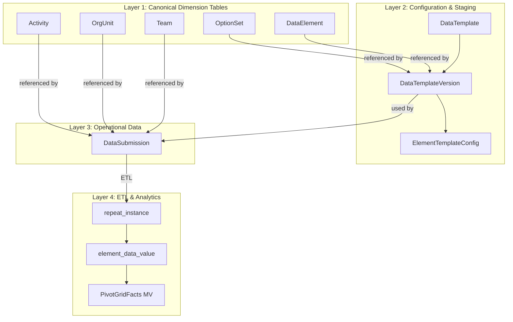
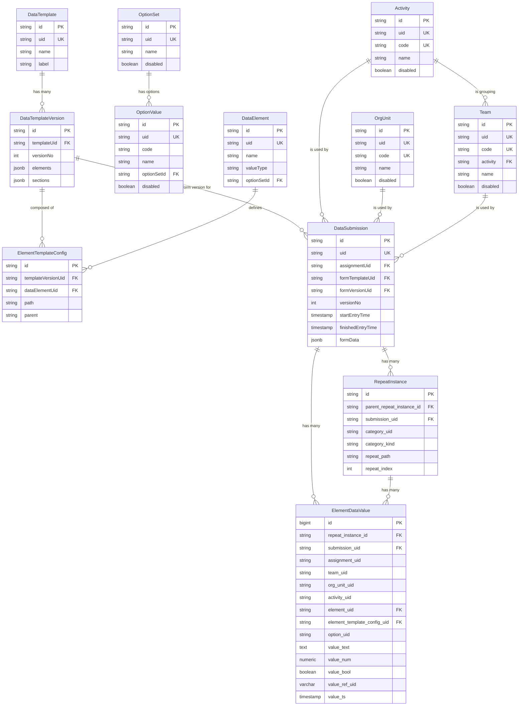
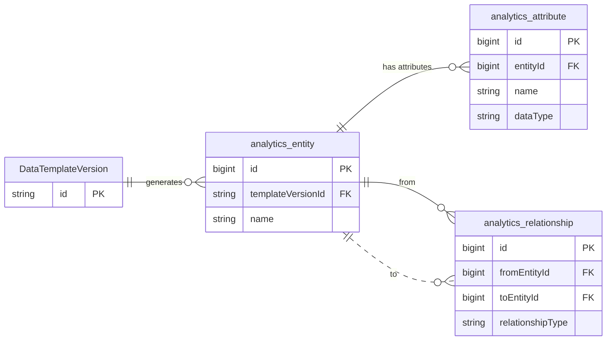
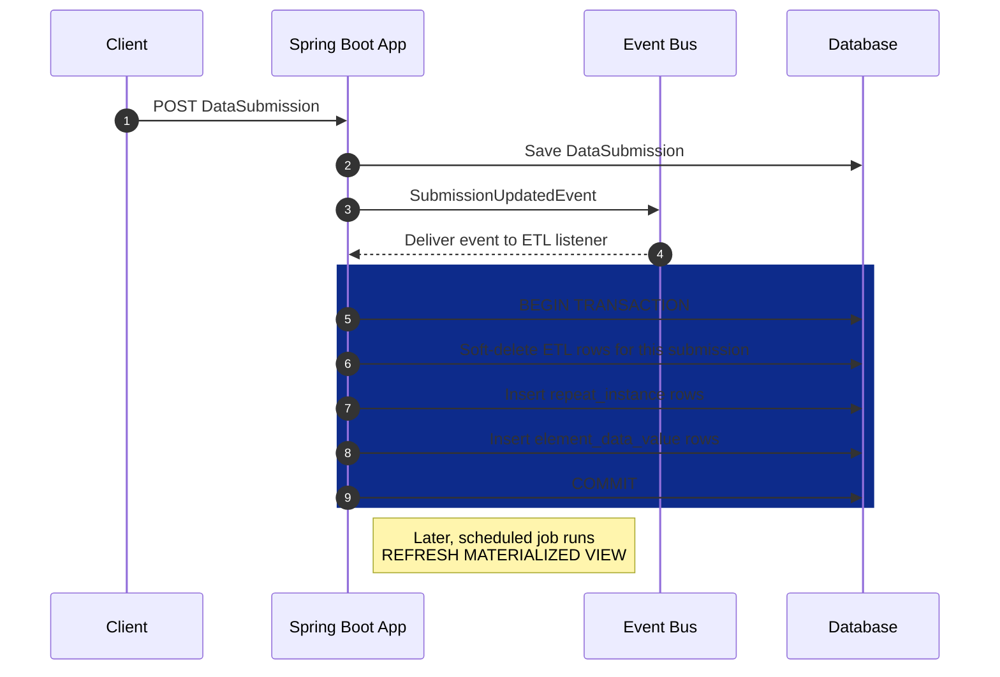
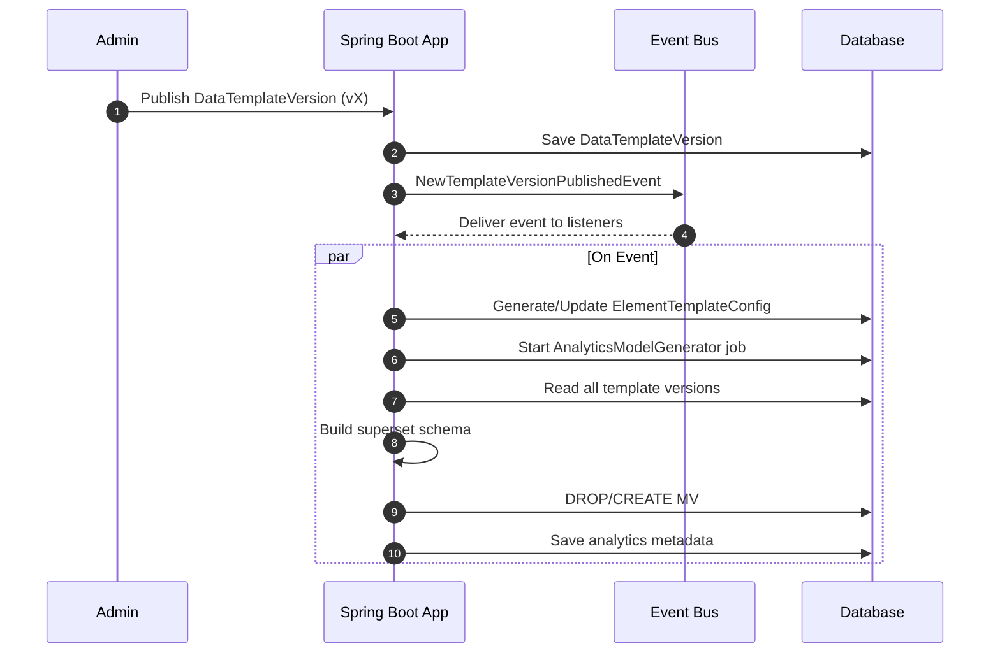

# Datarun platform

a data collection platform built with a **Spring Boot** backend and a **PostgreSQL >= v15** database. The platform
functions similarly to ODK (Open Data Kit) but collects data as structured JSON. Our system includes several *
*immutable, canonical dimension tables** that are used for reference.

This document give

- a quick overview of the running main platform's components,
- and then outlines the current implemented design of a re-runnable ETL (Extract, Transform, Load) pipeline that
  normalizes
  hierarchical JSON-based submission data into a structured, relational schema. The primary goal of this architecture is
  to enable efficient and flexible data aggregation and analysis by modeling every data point against a clear
  dimensional hierarchy.

## 1.1 Platform / Build Assumptions

The current system is built upon:

* **Java 17+ (Spring Boot 3.4.2)**: A Maven-based project, initially generated with JHipster and extended.
* **PostgreSQL (tested with v16.x)**: Utilizes a compatible PostgreSQL JDBC driver.
* **Liquibase (XML)**: Used for managing schema migrations.
* **Spring Security & Application-level ACLs**: Integrated for security.
* **`jOOQ` & `NamedParameterJdbcTemplate`/`JdbcTemplate`**: Available for analytical queries.
* **Caching**: Employs Ehcache and Hibernate 2nd-level cache annotations where appropriate.
* **Mapping and Codegen Tools**: Lombok and MapStruct are used.
* **Testing**: Testcontainers (Postgres), JUnit 5, and AssertJ are used for testing.
* **User authentication**: JWT, and Basic
* **Client, web (Angular >=v19), and mobile (Flutter >= 3.35)**.

---
Note: The following sections outlines the core entities and their key attributes. For brevity, some properties and
related services have been omitted. All entities have a primary key (`id`), a 26-character ULID that is immutable and
guarantees
uniqueness.

## 1. **Source/Operational Data Layer**

**Common Characteristics of entities:**

- optimized for writing, updating, and managing the core entities of the platform (Users, Projects, Forms, and
  especially raw Submissions.
- all have the common attributes: `{uid, name}`, and have their own standard Service side e.g. api end point,
  Jpa entity, Jpa repository, and service.
-

### 1.2 Identifiers

- Primary identifiers across tables are **ULIDs** (26-character Base32-encoded strings), stored as `VARCHAR(26)`: Only
  for internal use i.e db transaction and relationships, etc.
- Additionally, a stable, immutable, non-nullable business key named `uid` (11-character long of random
  `chars and number`, system generated and verified, unique across the system), used externally, for client requests and
  queries.
- **Proper versioning and hard-delete protection where needed:** entities include soft-deleted/disabled, and proper
  versioning where needed.

### 1.3 **Standard Entities layer**

- These entities contain the descriptive attributes that we use to slice, dice, and filter our
  facts. They provide context to the measures, include:
  `Activity`, `Team`, `OrgUnit`, `DataElement`, `OptionSet` & `Options`,
  and `DomainEntity`.

1. **DataElement (db / DTO)**

    * Purpose: canonical element definition re-used across templates.
    * DTO fields (example):
        * `id` (ULID string),
        * `Uid` (uid string),
        * `name` (technical name),
        * `valueType` (`TEXT`, `INTEGER`, `DATE`, `SELECT_ONE`, `SELECT_MULTI`, `BOOLEAN`),
        * `optionSetId?` (string FK).
        * `label` (map by locale).

2. **OptionSet (db / DTO)**

    * Purpose: canonical optionSet definition re-used across templates.
    * DTO fields (example):
        * `id` (ULID string),
        * `Uid` (uid string unique across the system),
        * `name` (technical name, unique across optionSets),
        * `label` (map by locale).
        * `disabled` (default false)

3. **OptionValue (db / DTO)**
    * Purpose: canonical option definition re-used across templates, and grouped updated, per by owner optionSet, always
      looked for linked by optionSet
    * DTO fields (example):
        * `id` (ULID string),
        * `Uid` (uid string unique across the system),
        * `code` (code string unique across optionSet this option belong to)
        * `name` (technical name unique across optionSet this option belong to),
        * `optionSetId` FK,
        * `label` (map by locale).
        * `disabled` (default false)

4. `Team`, `OrgUnit`, `Activity` (db / DTO): same, each is canonical entity referenced everywhere, and all have each one
   of them have (`id`, `uid`, `code`, `name`, `disabled`), and other uncommon properties in each one.

### 1.4 **Data Collection Layer:**

#### 1.4.1 Data Collection Key entity summaries (canonical fields)

##### 1. FormDataElementConf (json in DataTemplateVersion) DTO

* Purpose: a DTO configuration of a template's linked `DataElement`.
* Fields (canonical):

    * `id` — (ref to `DataElement.uid`), enforced single unique data_element per same level (root-level, or
      repeat-level).
    * `name` — copied from `DataElement`, copied from `DataElement`, cannot be overridden per template.
    * `valueType` — copied from `DataElement`, copied from `DataElement`, cannot be overridden per template
    * `optionSetUid?` FK — optional for select elements single or multi, also copied from `DataElement`, cannot be
      overridden per template
    * `path` — unique within template, e.g. `household.children.age`. local config
    * `parent` — name (canonical form). local config.
    * `label` — map by locale, default to that of `DataElement` and can be overridden in the template.
    * other properties object with keys like `isMultiSelect`, `mandatory`, `readonly`, `default`,
    * `rules` — object for visibility/validation expressions

### FormSectionConf (json in DataTemplateVersion) DTO

* Purpose: section / group configuration (can be repeatable) and can be just ui grouping (elements are on same level) .
* Fields (canonical):

    * `name` (unique within same level)
    * `path` (e.g. `household.children`)
    * `parent` (path)
    * `label` (map)
    * `isRepeatable` (boolean)
    * `repeatCategoryElementId?` — element `uid` used as category inside the repeated item

### DataTemplate (db)

* Purpose: template header and pointer to latest version.
* Fields: `id`, `uid`, `name`, `label`, `latestVersionUid`, `latestVersionNo`, `createdBy`, `createdDate`, etc.

### DataTemplateVersion (db)

* Purpose: versioned template payload (jsonb).
* Fields: `id`, `templateUid`, `versionNo`, `elements: List<FormDataElementConf>`, `sections: List<FormSectionConf>`,
  `releaseNotes`.


* The Raw Field configuration: `DataTemplateVersion.fields`  & `DataTemplateVersion.sections` (JSONB) List.
    1. **Configuration Source of Truth:**
    2. **Re-process-ability:** re-generating `element_template_config`.

### DataTemplateInstanceDto (computed)

* Purpose: ready-to-render (Runtime) template for UI — merges `DataTemplate` header with the selected
  `DataTemplateVersion` and resolves computed fields (display labels, optionSet info). Not stored.

### DataSubmission (db)

* Purpose: single submission instance.
* Fields (canonical):

    * `id` (DB row id),
    * `uid` (unique, client submission or server-generated uid business key),
    * `assignmentUid`, the is of an assignment
    * `formTemplateUid` (DataTemplate.id),
    * `formVersionUid` (DataTemplateVersion.id),
    * `versionNo` (integer),
    * `startEntryTime`, `finishedEntryTime`, `deleted` (bool), `deletedAt` (timestamp),
    * `formData` (jsonb map: nested objects and arrays keyed by `name` mirroring the materialized paths),
    * `createdBy`, `createdDate`, `lastModifiedBy`, `lastModifiedDate`, etc.

**Keying formData:** store nested JSON that mirrors the template's tree materialized by the `paths`.
**Versioning:** `DataTemplateVersion` immutable. Submissions reference the template and its version by `templateUid`,
`templateVersionUid` and `versionNo` — essential for reproducible reports.

* The Raw Data Archive: `DataSubmission.formData` (JSONB)
* **What it is:** A single JSONB column that stores the exact, original payload received from a client device.
* **Purpose and What it Offers:**
    * **Source of Truth:** This is the system's incorruptible raw data ledger. No matter what happens in the ETL or
      downstream, you can always go back to the original submission.
    * **Re-process-ability:** If a bug is found in the ETL logic or a new analytical requirement
      emerges.

---

## 2. **ETL Data Layer**

### ETL Process Generated Facts (UID-Native)

**Facts Generation Flow (High level View):**

- The Submission Flow: "sweep and update" ETL pattern for submissions for ensuring data consistency. It's an idempotent
  process, Re-running the ETL for a submission will always result in the correct final state without creating duplicate
  data.

#### 1. What Comes from `data_element` vs. `element_template_config`

* **Immutable/Canonical Attributes (`data_element`)**: Core, authoritative attributes that are globally consistent, such
  as `data_element.name`, `valueType`, `aggregation_type`, and `is_measure`/`is_dimension`, should be sourced from the *
  *`data_element`** table.
* **Template-Specific Attributes (`element_template_config`)**: A canonical, queryable template-field catalog, contains
  attributes that only meaningful within a specific template version, sourced mostly from the *
  *`DataTemplateVersion.fields`** and context. Examples include display label,
  `repeat_path`, `template_name_path`, and `is_category`.

#### 2. `valueType` Mapping

The `element_data_value` table uses different columns to store data based on its `valueType`, optimizing storage and
retrieval.

* **Numerical values** (`Number`, `Integer`, etc.) are stored in `element_data_value.value_num`.
* **Boolean values** (`Boolean`, `TrueOnly`) are stored in `element_data_value.value_bool`.
* **Select-Multi** options are stored as separate rows, with each selected option's UID in the
  `element_data_value.option_uid` column.
* **Reference types** (`SelectOne`, `Activity`, `Team`, etc.) are stored in `element_data_value.value_ref_uid`.
* **Date/Time** values are stored in `element_data_value.value_ts`.
* All other types are stored in `element_data_value.value_text`.

For querying repeat categories, the `category_uid` column is used for reference types that have been configured as
categories, enabling "simple" fast hierarchical joins for main category.

---

## Appendix and DDLs

### 1. ETL Facts:

1. **`repeat_instance`:**
    ```sql
    CREATE TABLE IF NOT EXISTS repeat_instance
    (
        id                        varchar(26) PRIMARY KEY,
        parent_repeat_instance_id varchar(26),
        repeat_section_label      jsonb                  DEFAULT '{}'::jsonb,
        submission_uid            varchar(11)   NOT NULL,
        category_uid              varchar(11),
        category_kind             varchar(200), -- reference table
        repeat_path               varchar(3000) NOT NULL,
        repeat_index              bigint,
        client_updated_at         timestamp,
        deleted_at                timestamp,
        submission_completed_at   timestamp,
        created_date              timestamp     NOT NULL DEFAULT now(),
        last_modified_date        timestamp,
        last_modified_by          varchar(100),
        created_by                varchar(100)
    );
    CREATE INDEX IF NOT EXISTS idx_repeat_instance_submission_path ON repeat_instance (submission_uid, repeat_path);
    CREATE INDEX IF NOT EXISTS idx_repeat_instance_parent_id ON repeat_instance (parent_repeat_instance_id);
    ALTER TABLE repeat_instance
        ADD CONSTRAINT fk_repeat_instance_parent
            FOREIGN KEY (parent_repeat_instance_id) REFERENCES repeat_instance (id);
    ```

2. **`element_data_value` DDL:**
    ```sql
    CREATE TABLE IF NOT EXISTS element_data_value
    (
        id                          bigserial PRIMARY KEY,
        repeat_instance_id          varchar(26),
        submission_uid              varchar(11) NOT NULL,
        assignment_uid              varchar(11),
        team_uid                    varchar(11),
        org_unit_uid                varchar(11),
        activity_uid                varchar(11),
        element_uid                 varchar(11) NOT NULL,
        element_template_config_uid varchar(11) NOT NULL,
        option_uid                  varchar(11), -- only for multi select or null
        value_text                  text,
        value_num                   numeric,
        value_bool                  boolean,
        value_ref_uid               varchar(11),
        value_ts                    timestamp,
        deleted_at                  timestamp,
        created_date                timestamp   NOT NULL DEFAULT now(),
        last_modified_date          timestamp,
        repeat_instance_key         text GENERATED ALWAYS AS (COALESCE(repeat_instance_id, '')) STORED,
        selection_key               text GENERATED ALWAYS AS (COALESCE(option_uid, '')) STORED,
        row_type                    char(1)     NOT NULL DEFAULT 'S'
    );
    CREATE UNIQUE INDEX IF NOT EXISTS ux_element_value_unique
        ON element_data_value (
                               submission_uid,
                               element_uid,
                               repeat_instance_key,
                               row_type,
                               selection_key
            );
    
    -- other indexes omitted for brevity
    ```

### 2. Materialized View (MVs)

The `pivot_grid_facts` MV is a UID-native view optimized for analytics.

```sql
CREATE MATERIALIZED VIEW pivot_grid_facts AS
SELECT ev.ID                          AS value_id,
       ev.submission_uid              AS submission_uid,
-------------------------------------
-- (specific template filtering/grouping mode)
--------------------------------------
       sub.template_uid               AS form_template_uid,-- (template mode filtering)
       sub.template_version_uid       AS form_version_uid,
       etc.uid                        AS etc_uid,-- (template mode filtering)
-- Template metadata (per-template overrides from element_template_config)
       etc.repeat_path                AS template_repeat_path,
       etc.name_Path                  AS template_name_path,-- element Path built with element names (ends with name)
       etc.id_Path                    AS template_id_path,-- element Path built with section names, (ends with element uid)
-------------------------------------
-- REPEAT CONTEXT
-- HIERARCHICAL_CONTEXT (specific template filtering/grouping mode)
--------------------------------------
       child_ri.ID                    AS repeat_instance_id,--  ULID PK is used only for repeat instance, rest is uid-native
       parent_ri.ID                   AS parent_repeat_instance_id,
-- Repeat hierarchy
       child_ri.repeat_path,
       child_ri.repeat_section_label,-- json e.g. {"en": "...", "ar": "..."}
       parent_ri.repeat_section_label AS parent_repeat_section_label,
-------------------------------------
-- Submission / Assignment context
-- CORE_DIMENSION
--------------------------------------
       ev.assignment_uid              AS assignment_uid,
       ev.team_uid                    AS team_uid,
       tm.code                        AS team_code,
       ev.org_unit_uid                AS org_unit_uid,
       ou.NAME                        AS org_unit_name,
       ev.activity_uid                AS activity_uid,
       act.NAME                       AS activity_name,
       sub.finished_entry_time        AS submission_completed_at,
-------------------------------------
-- REPEAT INSTANCE canonical CATEGORY
-- HIERARCHICAL_CONTEXT (across templates filtering/grouping mode)
--------------------------------------
       child_ri.category_uid          AS child_category_uid,
       parent_ri.category_uid         AS parent_category_uid,
       child_ri.category_kind         AS child_category_kind,
       parent_ri.category_kind        AS parent_category_kind,
       etc.display_label,-- json e.g. {"en": "...", "ar": "..."}
       etc.category_for_repeat,-- the element pointed to in this row is part of (if configured)
-------------------------------------
-- data_element (canonical) (Global i.e across templates filtering/grouping mode)
--------------------------------------
-- Global data_element metadata (join)
       de.uid                         AS de_uid,
       de.NAME                        AS de_name,
       de.TYPE                        AS de_value_type,
-- Option metadata (selects)
       ops.uid                        AS de_option_set_uid,
       ev.option_uid                  AS option_uid,
       ov.uid                         AS option_value_uid,
       ov.NAME                        AS option_name,
       ov.code                        AS option_code,

--------------------------------------
-- Category names resolved live by UID + kind
--------------------------------------
       CASE
           WHEN child_ri.category_kind = 'team' THEN child_team.name
           WHEN child_ri.category_kind = 'org_unit' THEN child_ou.name
           WHEN child_ri.category_kind = 'activity' THEN child_activity.name
           WHEN child_ri.category_kind = 'option' THEN child_opt.name
           END                        AS child_category_name,

       CASE
           WHEN parent_ri.category_kind = 'team' THEN parent_team.name
           WHEN parent_ri.category_kind = 'org_unit' THEN parent_ou.name
           WHEN parent_ri.category_kind = 'activity' THEN parent_activity.name
           WHEN parent_ri.category_kind = 'option' THEN parent_opt.name
           END                        AS parent_category_name,

--------------------------------------
-- Measures
--------------------------------------
       ev.value_num,
       ev.value_text,
       ev.value_bool,
       ev.value_ts,
       ev.value_ref_uid,
       ev.deleted_at
FROM element_data_value ev
         JOIN data_submission sub ON ev.submission_uid = sub.uid
         LEFT JOIN data_element de ON ev.element_uid = de.uid
         LEFT JOIN element_template_config etc ON ev.element_template_config_uid::text = etc.uid::text
         LEFT JOIN option_value ov ON ev.option_uid = ov.uid
         LEFT JOIN option_set ops ON de.option_set_id = ops.id
         LEFT JOIN team tm ON ev.team_uid = tm.uid
         LEFT JOIN org_unit ou ON ev.org_unit_uid = ou.uid
         LEFT JOIN activity act ON ev.activity_uid = act.uid

         LEFT JOIN repeat_instance child_ri ON ev.repeat_instance_id = child_ri.id
         LEFT JOIN repeat_instance parent_ri ON child_ri.parent_repeat_instance_id = parent_ri.id

-- Live category joins (child)
         LEFT JOIN team child_team ON child_ri.category_uid = child_team.uid AND child_ri.category_kind = 'team'
         LEFT JOIN org_unit child_ou ON child_ri.category_uid = child_ou.uid AND child_ri.category_kind = 'org_unit'
         LEFT JOIN activity child_activity
                   ON child_ri.category_uid = child_activity.uid AND child_ri.category_kind = 'activity'
         LEFT JOIN option_value child_opt ON child_ri.category_uid = child_opt.uid AND child_ri.category_kind = 'option'

-- Live category joins (parent)
         LEFT JOIN team parent_team ON parent_ri.category_uid = parent_team.uid AND parent_ri.category_kind = 'team'
         LEFT JOIN org_unit parent_ou ON parent_ri.category_uid = parent_ou.uid AND parent_ri.category_kind = 'org_unit'
         LEFT JOIN activity parent_activity
                   ON parent_ri.category_uid = parent_activity.uid AND parent_ri.category_kind = 'activity'
         LEFT JOIN option_value parent_opt
                   ON parent_ri.category_uid = parent_opt.uid AND parent_ri.category_kind = 'option';

-- ... some other indexes omitted for brevity
```

## 4. Auxiliary Dimension Tables

### 4.1 `org_unit_hierarchy` (Closure Table)

**Purpose:** Provides an efficient way to query for all descendants or ancestors of an organizational unit, regardless
of depth.

**DDL:**

```sql
CREATE TABLE org_unit_hierarchy
(
    ancestor_id   VARCHAR(26) NOT NULL REFERENCES org_unit (id),
    descendant_id VARCHAR(26) NOT NULL REFERENCES org_unit (id),
    depth         INTEGER     NOT NULL,
    PRIMARY KEY (ancestor_id, descendant_id)
);
CREATE INDEX idx_ou_hierarchy_ancestor ON org_unit_hierarchy (ancestor_id);
CREATE INDEX idx_ou_hierarchy_descendant ON org_unit_hierarchy (descendant_id);
```

### 4.2 `ou_level`

**Purpose:** Provides human-readable names and descriptions for organizational hierarchy levels.

**DDL:**

```sql
CREATE TABLE ou_level
(
    level       INTEGER PRIMARY KEY,
    name        VARCHAR(255) NOT NULL UNIQUE,
    description TEXT
);
```

---

## System diagram

**Flowchart — illustrates the data and processing layers, showing how data flows from configuration to analytics.**
This diagram captures the layered architecture. It shows how canonical dimension tables relate to configuration, which
feeds submissions and is ETL-processed into analytics-ready facts.



---



---

1. **Analytics Metadata Model: ERD**
   Shows proposed analytics_entity, analytics_attribute, and analytics_relationship tables and how they relate to
   existing DataTemplateVersion.



**B. Submission ETL Flow ("Sweep and Update")**: Visualizes the idempotent ETL process on new/updated submissions.



**Process & Event Flows A. Template Publishing & Analytics Model Generation**



