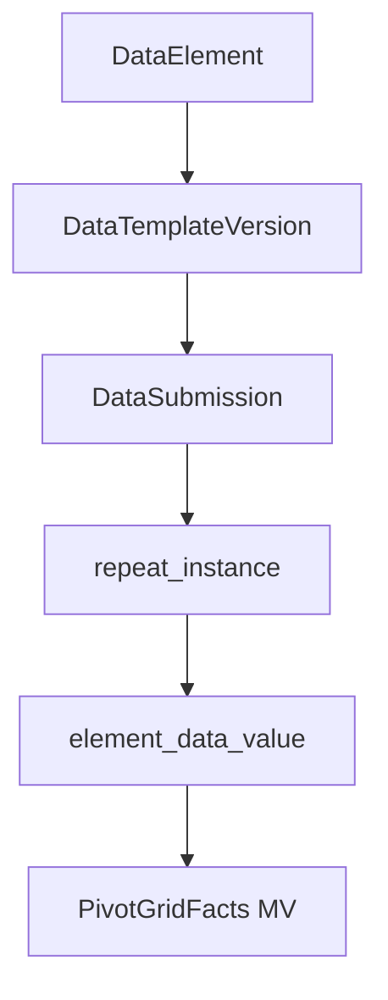

# Datarun — Backend Data Model Reference (Revised)

> **Goal:** a compact, accurate reference for Datarun's backend data model — purpose-built for implementing the metadata mapping and query engine.

---

## Audience & Usage

* **Primary:** backend engineers building ETL, metadata mappers, and the analytics/query engine.
* **Secondary:** frontend devs, QA, architects who need a clear model of how submissions become analytics facts.

---

## 1. Purpose in one line

Keep the raw JSON submission as the immutable source-of-truth and transform it, idempotently, into typed, analytical facts that are easy to aggregate, filter, join, and re-run across template versions.

---

## 2. High-level architecture (summary)

1. **Canonical dimensions** (DataElement, OptionSet, OptionValue, Team, OrgUnit, Activity, DomainEntity)
2. **Template versioning** (DataTemplate → DataTemplateVersion → ElementTemplateConfig)
3. **Operational data** (DataSubmission — raw JSONB)
4. **ETL normalized facts** (repeat\_instance, element\_data\_value)
5. **Analytics layer** (materialized views, pivot\_grid\_facts, analytics metadata tables)

Mermaid flow:

---

## 3. Key entities & concise roles

* **DataElement**: canonical definition of a field (uid, name, valueType, aggregation\_type, is\_measure/is\_dimension). Authoritative for semantics.
* **OptionSet / OptionValue**: reusable choices for select types.
* **DataTemplate / DataTemplateVersion**: versioned form configuration. Version is immutable and referenced by submissions.
* **ElementTemplateConfig**: denormalized, template-specific metadata per element (path, label override, is\_multi, mandatory, rules). Produced at publish-time.
* **DataSubmission**: raw JSONB `formData` + submission metadata (templateVersionUid, assignmentUid, times, createdBy).
* **repeat_instance**: one row per repeated group occurrence; stores hierarchy and repeat index.
* **element_data_value**: typed-value store (value_num, value_bool, value_text, value_ts, value_ref_uid, option_uid). One logical selection -> one row; multi-select -> many rows.
* **pivot_grid_facts (MV)**: analytics-ready denormalized view used by dashboards and queries.
* **org_unit_hierarchy / ou_level**: auxiliary dimensions for hierarchical org queries.

---

## 4. Storage & typing rules (practical mapping)

* Map element `valueType` → column:

    * Numeric → `value_num`
    * Date/Datetime → `value_ts`
    * Boolean / TrueOnly → `value_bool`
    * SelectOne / ref → `value_ref_uid`
    * SelectMulti → `option_uid` with one-row-per-selection
    * Free text → `value_text`
* **References always store `uid`** (not internal numeric PK) to simplify joins and to be stable across deployments.
* **Multi-select:** expand into multiple `element_data_value` rows with same `submission_uid` + `element_uid` + `repeat_instance_id` and distinct `option_uid`.

---

## 5. Idempotence & deduplication strategy

* Use a stable synthetic key for facts:

    * `fact_key = concat(submission_uid, '|', element_uid, '|', COALESCE(repeat_instance_index, '0'), '|', COALESCE(selection_key, ''))`
* ETL flow: **soft-delete existing facts for submission** → insert fresh facts → unique constraint prevents duplicates. The DDL shows a unique index `ux_element_value_unique (submission_uid, element_uid, repeat_instance_key, row_type, selection_key)`.

---

## 6. Repeat handling model

* Each repeated group occurrence produces a `repeat_instance` row with `id` (ULID), `parent_repeat_instance_id` (nullable), `repeat_index`, `repeat_path`.
* Store `repeat_section_label` as JSONB for UI/analytics-friendly text.
* `element_data_value.repeat_instance_id` links value rows to their repeat context.

---

## 7. Analytics metadata & mapping engine (recommended)

Create three small metadata tables to drive the mapping and query-generation logic:

* **analytics_entity**(id, template_version_uid, name, logical_path)
* **analytics_attribute**(id, analytics_entity_id, element_uid, name, data_type, aggregation_hint, template_path)
* **analytics_relationship**(id, from_entity_id, to_entity_id, relationship_type, join_hint)

**Responsibilities:**

* Generated at publish-time from `DataTemplateVersion` + `ElementTemplateConfig`.
* Provide canonical attribute names, data types, and join paths for the query engine.
* Allow multiple entity views per template (eg. `Household`, `Child`, `Visit`).

---

## 8. Query engine & mapping rules (practical guidance)

* **Join strategy:** prefer `uid`-based joins (e.g., `element_data_value.value_ref_uid = team.uid`).
* **Grouping by repeated context:** pivot on `repeat_instance_id` or `repeat_path` depending on desired granularity.
* **Aggregation hints:** use `analytics_attribute.aggregation_hint` to choose SUM/AVG/COUNT/COUNT_DISTINCT.
* **Templates with repeats:** map repeated sections to separate entities in `analytics_entity` so queries can either drill into or aggregate up by repeat index.

Suggested API endpoints for metadata/querying (server-side):

* `GET /api/analytics/templates/{templateUid}/entities` — returns entities + attributes.
* `POST /api/analytics/query` — accepts an entity, filters, dimensions, measures, returns a paginated result set.

---

## 9. Performance & operational notes

* **Indexes:** ensure indexes on `element_data_value(submission_uid)`, `(element_uid, value_num)`, `(value_ts)` and `repeat_instance(submission_uid, repeat_path)`.
* **Partitioning:** consider partitioning `element_data_value` by time (created_date) for high-volume systems.
* **MV refresh:** schedule `pivot_grid_facts` refreshes during low-traffic windows; for near-real-time use, maintain a delta table and incremental refresh.
* **ETL concurrency:** ETL should operate per-submission or batch with row-level keys to avoid contention; wrap each submission's ETL in a transaction for the sweep-and-update pattern.

---

## 10. Implementation checklist (practical next steps)

1. Confirm `ElementTemplateConfig` fields required by analytics generator (path, id_path, name_path, is_multi, display_label).
2. Add `analytics_*` tables and publish-time generator that creates entities/attributes per template version.
3. Implement ETL idempotence test harness (re-run same submission → identical facts).
4. Create mapping-driven query API that uses `analytics_*` metadata to build SQL safely (parameterized).
5. Add monitoring/metrics for ETL runs (duration, rows written, checksum) and MV refresh status.

---

## 11. Common pitfalls & suggested mitigations

* **Pitfall:** mixing canonical `data_element` attributes with template overrides at runtime.

    * *Mitigation:* copy immutable fields (valueType, aggregation_type) into `element_template_config` at publish time and **always** read from template-aware config during ETL.
* **Pitfall:** stale `uid` references after data migrations.

    * *Mitigation:* keep `uid` stable; if renaming required, create a deprecation mapping layer rather than changing historical `uid`s.
* **Pitfall:** explosion of rows from high-cardinality multi-selects.

    * *Mitigation:* document cardinality, limit multi-select options, and consider pre-aggregation for heavy workloads.

---

## 12. Where to keep authoritative DDL & examples

Keep DDL, sample ETL queries, and MV definitions in a dedicated `docs/schema/` folder in the repo. The appendix in the existing backend spec should link to those files.

---

## Appendix (quick references)

* **Id strategy:** `id` = ULID (VARCHAR(26)), `uid` = human-friendly business key (\~11 chars).
* **Unique fact constraint:** `ux_element_value_unique (submission_uid, element_uid, repeat_instance_key, row_type, selection_key)`.
* **Best-practice:** all ETL writes include `etl_run_id`, `etl_version`, and `created_date` for traceability.

---

*End of revised reference — use this doc to generate the metadata mapping and the query engine. If you'd like, I can now:*

* produce the SQL DDL for `analytics_*` tables, or
* generate the publish-time generator pseudo-code that builds `analytics_entity`/`analytics_attribute` from `DataTemplateVersion`.
