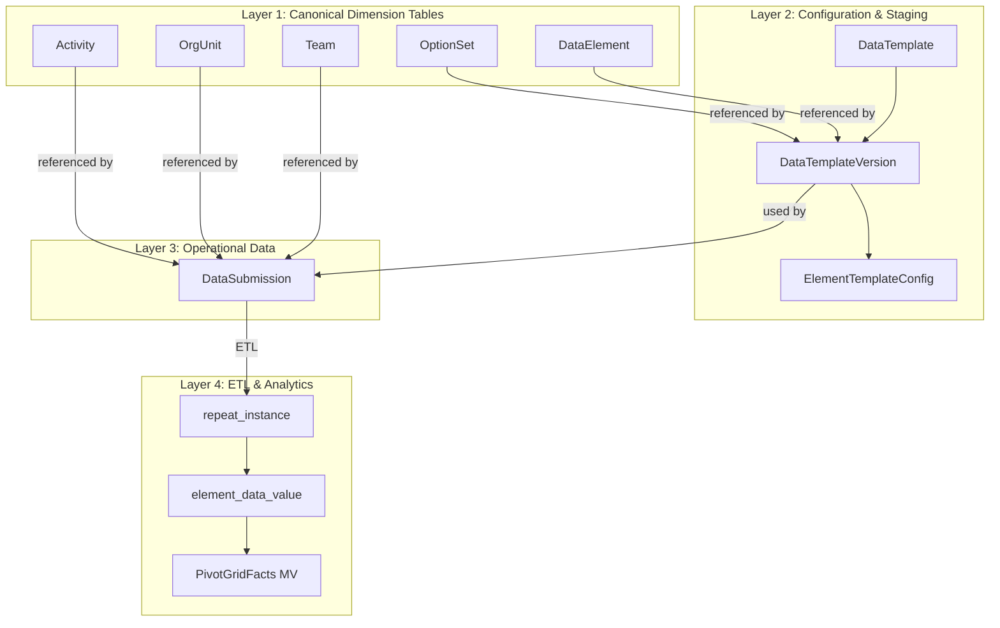
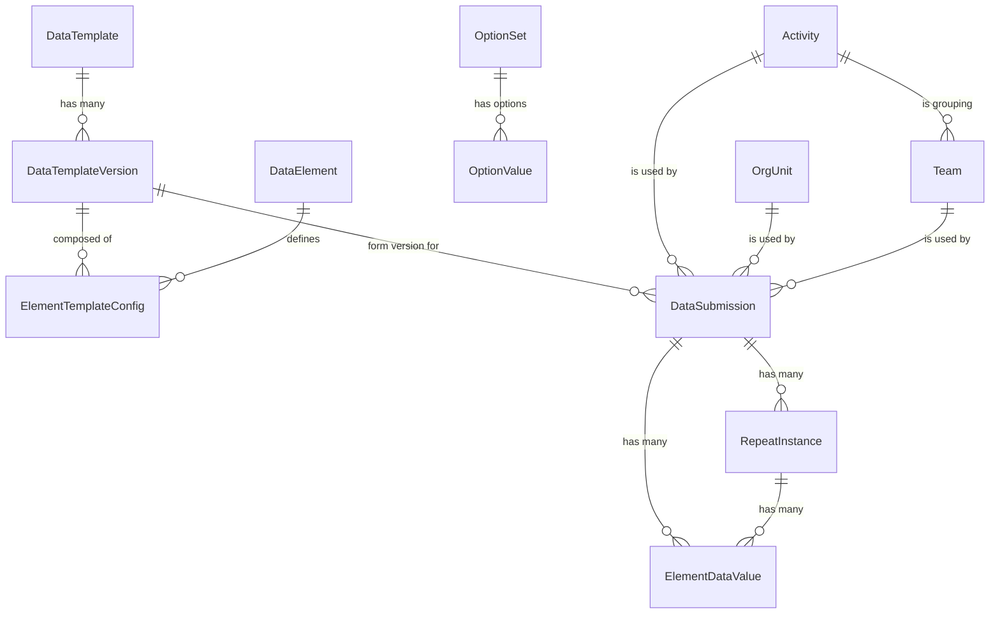
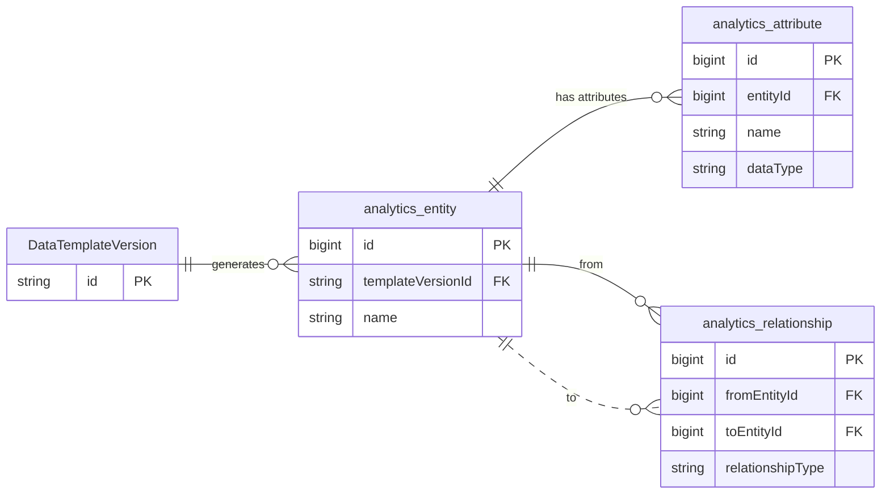
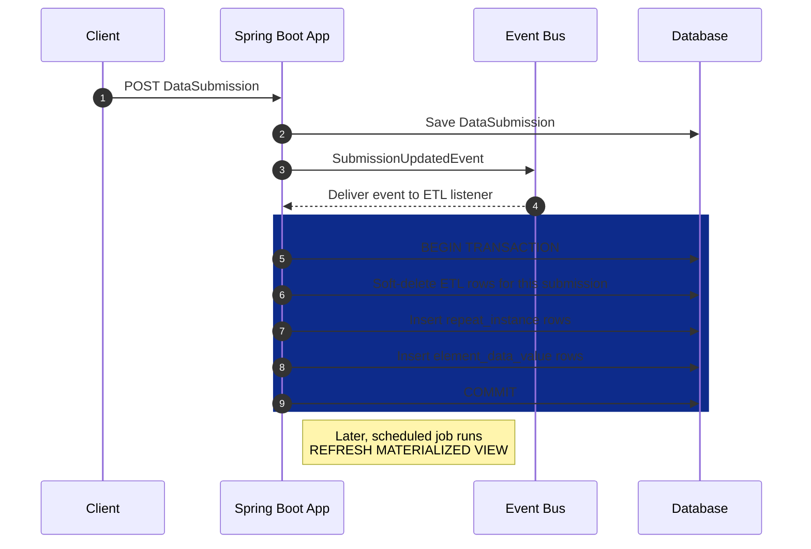
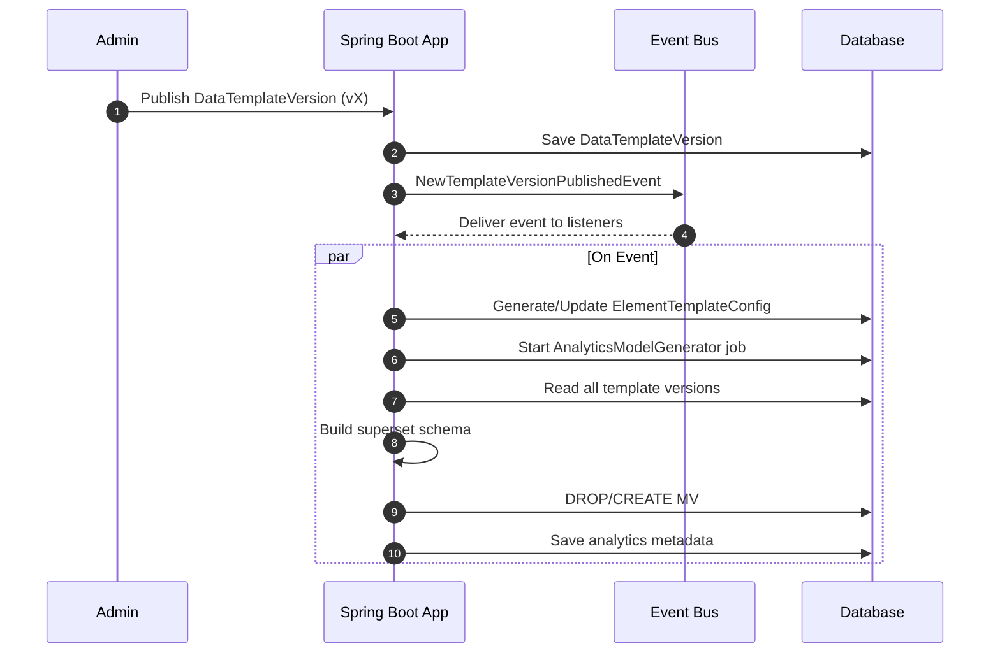

# Datarun platform

A concise reference for the Datarun data-collection platform.
Backend: **Spring Boot (Java 17+, Spring Boot 3.4.x)**.
Primary DB: **PostgreSQL (v15+)**.
Design goal: collect nested JSON submission payloads from clients, store a raw source-of-truth, and run a **re-runnable,
idempotent ETL** that normalizes those JSON submissions into a relational schema optimized for flexible aggregation and
analytics.

---

## Quick at-a-glance

**What this doc contains**

* Short platform & build assumptions.
* Source / Operational Data Layer: canonical entities and how templates/submissions are modeled.
* ETL Data Layer: how facts are generated, key mapping rules, and value storage schema.

---

# 1. Platform / Build assumptions

Core stack and infra used in the current system:

* **Language / Framework:** Java 17+, Spring Boot 3.4.x (Maven, JHipster scaffold extended).
* **Database:** PostgreSQL (tested on v16.x; supports JSONB and advanced features).
* **Migrations:** Liquibase (XML).
* **Security:** Spring Security + application-level ACLs; JWT authentication + refresh flow.
* **Query / persistence:** jOOQ available for analytic queries; Spring `JdbcTemplate` / `NamedParameterJdbcTemplate`
  used where appropriate.
* **Caching:** Ehcache + Hibernate 2nd-level cache annotations as needed.
* **Codegen / mapping:** Lombok, MapStruct.
* **Testing:** Testcontainers (Postgres), JUnit5, AssertJ.
* **Clients:** Angular (web, >= v19) and Flutter (mobile, >= 3.35).

> All entities use an immutable 26-character ULID (`id`) as primary key. Business-facing stable `uid` values are also
> present (shorter, human-friendly).

---

# 2. Source / Operational Data Layer

### 2.1 Common characteristics

* Optimized for create/update of core entities (Users, Projects, Forms, Submissions).
* Each entity exposes standard service/repository/DTO and a REST API surface.
* Versioning and soft-delete are standard where needed (audit-friendly, reproducible).

### 2.2 Identifiers

* **`id`**: ULID, `VARCHAR(26)`, internal PK used for joins and transactions (immutable).
* **`uid`**: stable business key (shorter, \~11 chars, system generated and unique) for external APIs and user-level
  linking.
* Entities support soft-delete/disabled flags and optimistic versioning where applicable.

### 2.3 Standard canonical entities

These provide the dimensional context for analytical facts (used to slice/dice measures):

* **DataElement**

    * Purpose: canonical definition reused across templates.
    * Example fields: `id` (ULID), `uid`, `name` (technical), `optionSetId?`, `label` (localized map), `is_measure`,
      `is_dimension`, `aggregation_type`, `valueType` (
      `Text`/`Integer`/`Date`/`Datetime`/`Time`/`SelectOne`/`SelectMulti`/`Boolean`/`TrueOnly, Team, OrgUnit`).
    * `valueType`: SelectOne, and SelectMulti Elements would have optionSet not null

* **OptionSet**

    * Purpose: reusable option group.
    * Example fields: `id` (ULID), `uid`, `name` (unique), `label` (map), `disabled` (bool).

* **OptionValue**

    * Purpose: values inside an OptionSet.
    * Example fields: `id` (ULID), `uid`, `code` (unique within OptionSet), `name` (unique within OptionSet),
      `optionSet` (FK), `label` (map), `disabled` (bool).

* **Team, OrgUnit, Activity, DomainEntity**

    * Canonical lookup tables used across templates.
    * Shared canonical fields: `id`, `uid`, `code`, `name`, `disabled`, plus entity-specific attributes.

---

# 3. Data Collection layer (templates & submissions)

### 3.1 Template configuration — concepts

* **DataTemplate** (db): template header and pointer to latest version.

    * Fields: `id`, `uid`, `name`, `label`, `latestVersionUid`, `latestVersionNo`, `createdBy`, `createdDate`, …

* **DataTemplateVersion** (db, JSONB): immutable versioned payload.

    * Fields: `id`, `templateUid`, `versionNo`, `elements: List<FormDataElementConf>`,
      `sections: List<FormSectionConf>`, `releaseNotes`, `createdDate`.

* **DataTemplateInstanceDto** (computed, not stored): runtime-ready template used by UI — merges header + specific
  version and resolves computed fields (labels, optionSet details). Useful for rendering and validation on client.

### 3.2 Element / section configuration (JSON objects inside DataTemplateVersion)

These are the template-level, versioned configuration objects the ETL references.

* **FormDataElementConf** (one per input element)

    * Purpose: links a template field to a canonical `DataElement`.
    * Canonical fields:

        * `id` — references `DataElement.uid`.
        * `name` — copied from DataElement (cannot be overridden per template).
        * `valueType` — copied from DataElement (immutable per template).
        * `optionSetUid?` — optional `optionSet.uid` for select elements.
        * `path` — materialized path within the template (e.g., `household.children.age`).
        * `parent` — parent path/name.
        * `label` — localized map (defaults to DataElement label, can override).
        * `otherProperties` — e.g., `isMultiSelect`, `mandatory`, `readonly`, `default`.
        * `rules` — visibility/validation expressions.

* **FormSectionConf**

    * Purpose: grouping/section metadata (can be repeatable).
    * Canonical fields:

        * `name` (unique within same level), `path` (e.g., `household.children`), `parent` (path), `label` (map),
          `isRepeatable` (bool).

### 3.3 DataSubmission (db) — raw incoming submission

* Purpose: store the original payload; reference template and version used during entry.
* Canonical fields:

    * `id` (DB row id / ULID), `uid` (submission business key), `assignmentUid` (optional), `formTemplateUid`,
      `formVersionUid`, `versionNo`.
    * `startEntryTime`, `finishedEntryTime`, `deleted` (bool), `deletedAt` (timestamp).
    * `formData` (JSONB): nested objects and arrays keyed by element `name` and materialized `path`.
    * `createdBy`, `createdDate`, `lastModifiedBy`, `lastModifiedDate`, etc.

**Key principles**

* `DataTemplateVersion` is **immutable**. Submissions reference the exact version used so ETL is reproducible.
* `DataSubmission.formData` is the **raw data archive** (see next).

---

# 4. Raw Data Archive (single JSONB column)

**`DataSubmission.formData`** — the canonical raw payload:

* Stores the exact JSON received from the client (nested objects/arrays).
* Serves as the **source of truth**: always available to re-run ETL, correct bugs, or satisfy new analytics needs.
* Enables **re-processability**: ETL can be re-run against the exact original payload and template version.

---

# 5. ETL Data Layer — design & rules

### 5.1 High-level ETL pattern

* ETL follows an idempotent **"sweep-and-update"** pattern:

    * Re-running ETL for the same submission should produce the same final state and must not create duplicates.
    * ETL writes normalized fact rows and updates indexes/rollups as required; it can safely be re-run after bug fixes
      or schema changes.

### 5.2 Source of truth for attributes

* **Global / immutable attributes → `data_element` table**

    * Examples: `data_element.name`, `valueType`, `aggregation_type`, `is_measure`, `is_dimension`.
    * These are authoritative across templates and should NOT be overridden by template-level configuration.

* **Template-specific attributes → `element_template_config` (from DataTemplateVersion)**

    * Examples:
        1. overrides and template specific: (display `label`, `repeat_path`, `template_name_path`, `id_path`,
           `name_path` UI hints, template-scoped rules).
        2. immutable sourced to `data_element` properties: copied for query fast from single place (name,
           `data_element_uid`, `value_type`, `aggregation_type`, `is_dimension`, `is_measure`, `is_multi`)
    * These are queryable and versioned per template version—used by ETL to know where to extract values and how to
      interpret them.

### 5.3 Value storage strategy (`element_data_value` table)

To optimize retrieval and avoid repeated parsing, the ETL maps each element value into typed columns based on
`valueType`:

* `value_num` — numerical types (Number, Integer, Decimal).
* `value_bool` — boolean types (Boolean, TrueOnly).
* `value_ref_uid` — reference types (SelectOne, Activity, Team, OrgUnit, DomainEntity) — stores referenced entity `uid`.
* `option_uid` — for Select-Multi: ETL stores **one row per selected option**, `option_uid` references OptionValue.uid.
* `value_ts` — date / timestamp types (Date, DateTime).
* `value_text` — everything else (free text, long text, etc.).

**Notes**

* Reference columns store canonical `uid` values where possible—this simplifies joins to dimension tables.
* Select-multi expands into multiple rows to make aggregations and counting straightforward.

### 5.4 Repeat

* Repeat groups become hierarchical relationships: each repeated item gets its own runtime identifier linking to the
  submission and parent repeat row.

---

# 6. Operational notes & guarantees

* **Reproducibility**: because submissions reference an immutable `DataTemplateVersion`, reports and ETL outputs are
  reproducible over time.
* **Idempotence**: ETL is designed to be re-runnable without duplicating facts—use stable keys derived from
  `submission.uid + element.path + occurrenceIndex` for fact deduplication.
* **Soft-deletes & versioning**: entities support soft-delete; templates and template versions are immutable to ensure
  consistent historical interpretation.
* **Performance**: separate storage of typed value columns allows efficient analytical queries (numeric aggregates, date
  filtering, joins on reference columns). Consider materialized views / summary tables for heavy aggregated workloads.
* **Auditability**: keep `DataSubmission.formData` unchanged as the ledger; ETL output tables record metadata about ETL
  run (timestamp, version, ETL checksum) to trace transformations.

---

# 7. Appendix

* DDLs, example ETL queries, and schema diagrams are maintained separately

### 1. ETL Facts:

1. **`repeat_instance`:**
    ```sql
    CREATE TABLE IF NOT EXISTS repeat_instance
    (
        id                        varchar(26) PRIMARY KEY,
        parent_repeat_instance_id varchar(26),
        repeat_section_label      jsonb                  DEFAULT '{}'::jsonb,
        submission_uid            varchar(11)   NOT NULL,
        repeat_path               varchar(3000) NOT NULL,
        repeat_index              bigint,
        client_updated_at         timestamp,
        deleted_at                timestamp,
        submission_completed_at   timestamp,
        created_date              timestamp     NOT NULL DEFAULT now(),
        last_modified_date        timestamp,
        last_modified_by          varchar(100),
        created_by                varchar(100)
    );
    CREATE INDEX IF NOT EXISTS idx_repeat_instance_submission_path ON repeat_instance (submission_uid, repeat_path);
    CREATE INDEX IF NOT EXISTS idx_repeat_instance_parent_id ON repeat_instance (parent_repeat_instance_id);
    ALTER TABLE repeat_instance
        ADD CONSTRAINT fk_repeat_instance_parent
            FOREIGN KEY (parent_repeat_instance_id) REFERENCES repeat_instance (id);
    ```

2. **`element_data_value` DDL:**
    ```sql
    CREATE TABLE IF NOT EXISTS element_data_value
    (
        id                          bigserial PRIMARY KEY,
        repeat_instance_id          varchar(26),
        submission_uid              varchar(11) NOT NULL,
        assignment_uid              varchar(11),
        team_uid                    varchar(11),
        org_unit_uid                varchar(11),
        activity_uid                varchar(11),
        element_uid                 varchar(11) NOT NULL,
        element_template_config_uid varchar(11) NOT NULL,
        option_uid                  varchar(11), -- only for multi select or null
        value_text                  text,
        value_num                   numeric,
        value_bool                  boolean,
        value_ref_uid               varchar(11),
        value_ts                    timestamp,
        deleted_at                  timestamp,
        created_date                timestamp   NOT NULL DEFAULT now(),
        last_modified_date          timestamp,
        repeat_instance_key         text GENERATED ALWAYS AS (COALESCE(repeat_instance_id, '')) STORED,
        selection_key               text GENERATED ALWAYS AS (COALESCE(option_uid, '')) STORED,
        row_type                    char(1)     NOT NULL DEFAULT 'S'
    );
    CREATE UNIQUE INDEX IF NOT EXISTS ux_element_value_unique
        ON element_data_value (
                               submission_uid,
                               element_uid,
                               repeat_instance_key,
                               row_type,
                               selection_key
            );
    
    -- other indexes omitted for brevity
    ```

### 2. Materialized View (MVs)

The `pivot_grid_facts` MV is a UID-native view optimized for analytics.

```sql
CREATE MATERIALIZED VIEW pivot_grid_facts AS
SELECT ev.ID                          AS value_id,
       ev.submission_uid              AS submission_uid,
-------------------------------------
-- (specific template filtering/grouping mode)
--------------------------------------
       sub.template_uid               AS form_template_uid,-- (template mode filtering)
       sub.template_version_uid       AS form_version_uid,
       etc.uid                        AS etc_uid,-- (template mode filtering)
-- Template metadata (per-template overrides from element_template_config)
       etc.repeat_path                AS template_repeat_path,
       etc.name_Path                  AS template_name_path,-- element Path built with element names (ends with name)
       etc.id_Path                    AS template_id_path,-- element Path built with section names, (ends with element uid)
-------------------------------------
-- REPEAT CONTEXT
-- HIERARCHICAL_CONTEXT (specific template filtering/grouping mode)
--------------------------------------
       child_ri.ID                    AS repeat_instance_id,--  ULID PK is used only for repeat instance, rest is uid-native
       parent_ri.ID                   AS parent_repeat_instance_id,
-- Repeat hierarchy
       child_ri.repeat_path,
       child_ri.repeat_section_label,-- json e.g. {"en": "...", "ar": "..."}
       parent_ri.repeat_section_label AS parent_repeat_section_label,
-------------------------------------
-- Submission / Assignment context
-- CORE_DIMENSION
--------------------------------------
       ev.assignment_uid              AS assignment_uid,
       ev.team_uid                    AS team_uid,
       tm.code                        AS team_code,
       ev.org_unit_uid                AS org_unit_uid,
       ou.NAME                        AS org_unit_name,
       ev.activity_uid                AS activity_uid,
       act.NAME                       AS activity_name,
       sub.finished_entry_time        AS submission_completed_at,

       etc.display_label,-- json e.g. {"en": "...", "ar": "..."}
-------------------------------------
-- data_element (canonical) (Global i.e across templates filtering/grouping mode)
--------------------------------------
-- Global data_element metadata (join)
       de.uid                         AS de_uid,
       de.NAME                        AS de_name,
       de.TYPE                        AS de_value_type,
-- Option metadata (selects)
       ops.uid                        AS de_option_set_uid,
       ev.option_uid                  AS option_uid,
       ov.uid                         AS option_value_uid,
       ov.NAME                        AS option_name,
       ov.code                        AS option_code,
--------------------------------------
-- Measures
--------------------------------------
       ev.value_num,
       ev.value_text,
       ev.value_bool,
       ev.value_ts,
       ev.value_ref_uid,
       ev.deleted_at
FROM element_data_value ev
         JOIN data_submission sub ON ev.submission_uid = sub.uid
         LEFT JOIN data_element de ON ev.element_uid = de.uid
         LEFT JOIN element_template_config etc ON ev.element_template_config_uid::text = etc.uid::text
         LEFT JOIN option_value ov ON ev.option_uid = ov.uid
         LEFT JOIN option_set ops ON de.option_set_id = ops.id
         LEFT JOIN team tm ON ev.team_uid = tm.uid
         LEFT JOIN org_unit ou ON ev.org_unit_uid = ou.uid
         LEFT JOIN activity act ON ev.activity_uid = act.uid

         LEFT JOIN repeat_instance child_ri ON ev.repeat_instance_id = child_ri.id
         LEFT JOIN repeat_instance parent_ri ON child_ri.parent_repeat_instance_id = parent_ri.id
-- ... some other indexes omitted for brevity
```

## 4. Auxiliary Dimension Tables

### 4.1 `org_unit_hierarchy` (Closure Table)

**Purpose:** Provides an efficient way to query for all descendants or ancestors of an organizational unit, regardless
of depth.

**DDL:**

```sql
CREATE TABLE org_unit_hierarchy
(
    ancestor_id   VARCHAR(26) NOT NULL REFERENCES org_unit (id),
    descendant_id VARCHAR(26) NOT NULL REFERENCES org_unit (id),
    depth         INTEGER     NOT NULL,
    PRIMARY KEY (ancestor_id, descendant_id)
);
CREATE INDEX idx_ou_hierarchy_ancestor ON org_unit_hierarchy (ancestor_id);
CREATE INDEX idx_ou_hierarchy_descendant ON org_unit_hierarchy (descendant_id);
```

### 4.2 `ou_level`

**Purpose:** Provides human-readable names and descriptions for organizational hierarchy levels.

**DDL:**

```sql
CREATE TABLE ou_level
(
    level       INTEGER PRIMARY KEY,
    name        VARCHAR(255) NOT NULL UNIQUE,
    description TEXT
);
```

---

## System diagram

**Flowchart — illustrates the data and processing layers, showing how data flows from configuration to analytics.**
This diagram captures the layered architecture. It shows how canonical dimension tables relate to configuration, which
feeds submissions and is ETL-processed into analytics-ready facts.



---



---

1. **Analytics Metadata Model: ERD**
   Shows proposed analytics_entity, analytics_attribute, and analytics_relationship tables and how they relate to
   existing DataTemplateVersion.



**B. Submission ETL Flow ("Sweep and Update")**: Visualizes the idempotent ETL process on new/updated submissions.



**Process & Event Flows A. Template Publishing & Analytics Model Generation**



