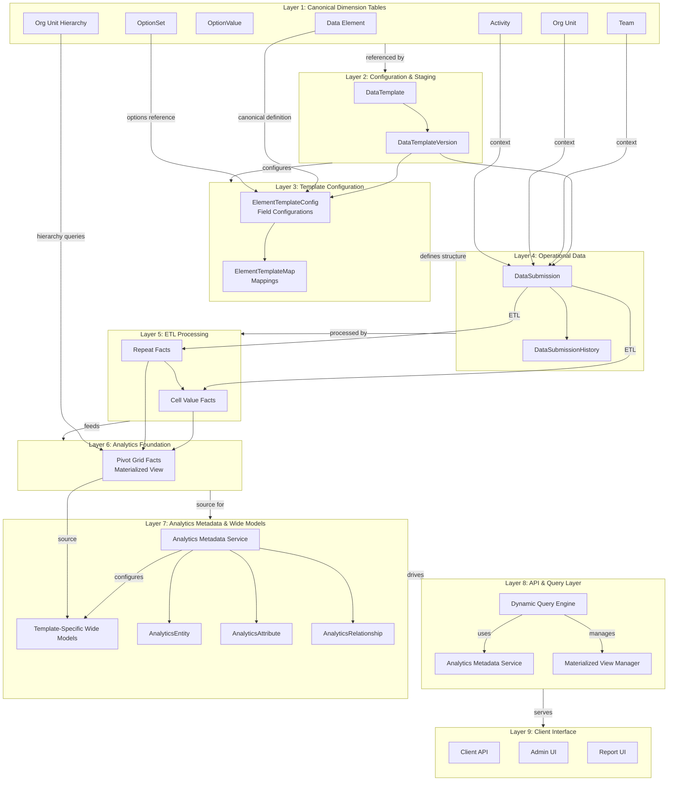
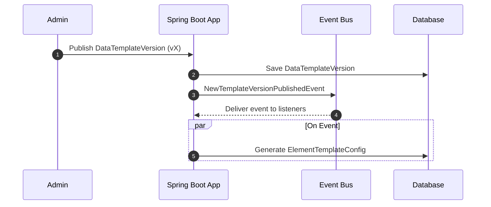
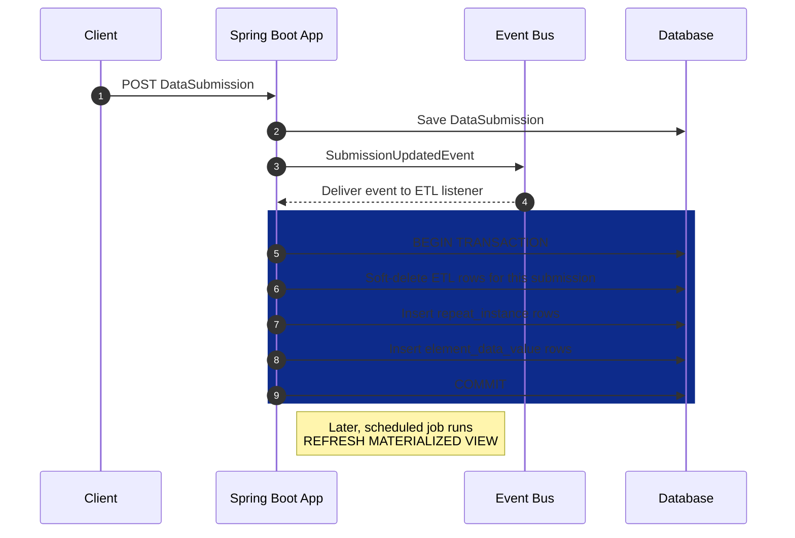
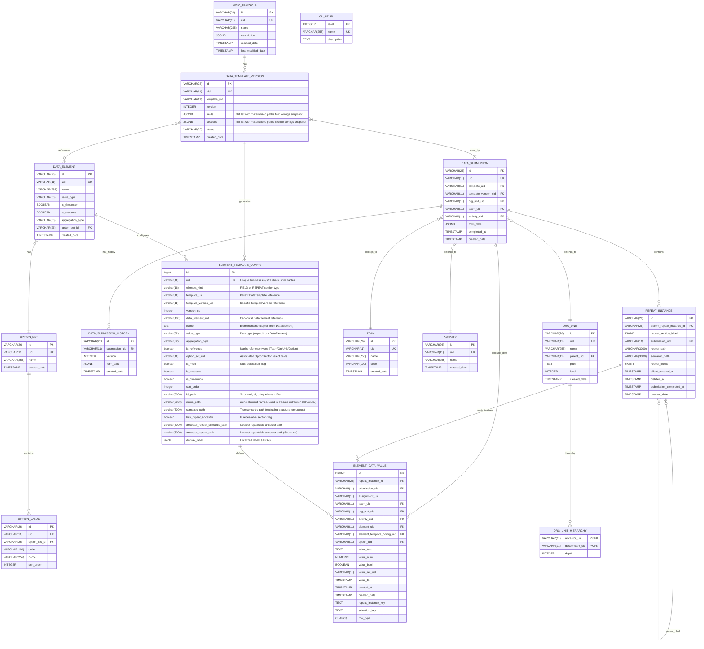
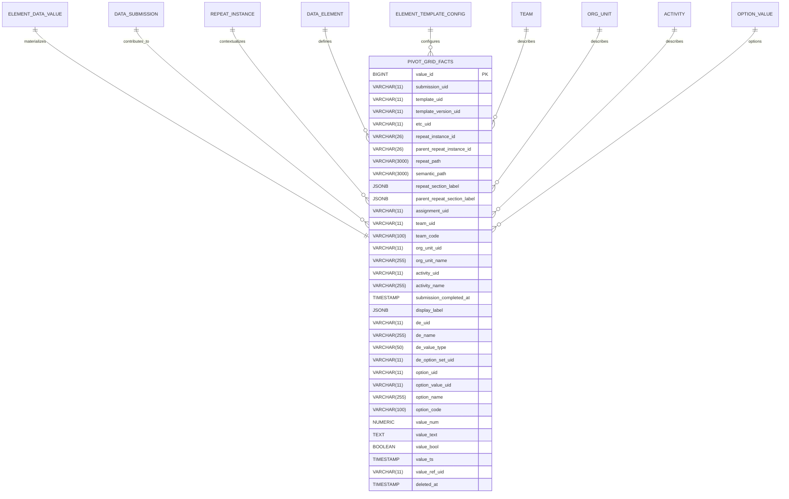

# Datarun ERD (Mermaid) + Fixes

A concise reference for the Datarun data-collection platform.

## 1.1 Platform / Build Assumptions

The current system is built upon:

* **Java 17+ (Spring Boot 3.4.2)**: A Maven-based project, initially generated with JHipster and extended.
* **PostgreSQL (tested with v16.x)**: Utilizes a compatible PostgreSQL JDBC driver.
* **Liquibase (XML)**: Used for managing schema migrations.
* **Spring Security & Application-level ACLs**: Integrated for security.
* **`jOOQ` & `NamedParameterJdbcTemplate`/`JdbcTemplate`**: Available for analytical queries.
* **Caching**: Employs Ehcache and Hibernate 2nd-level cache annotations where appropriate.
* **Mapping and Codegen Tools**: Lombok and MapStruct are used.
* **Testing**: Testcontainers (Postgres), JUnit 5, and AssertJ are used for testing.
* **User authentication**:  sending basic user's credentials and receiving Access/Refresh tokens.

---

## Key model clarifications

### 1. IDs, UIDs and business keys

* **id**: internal primary key (VARCHAR(26)) ULID format. Immutable, never recycled. Used for all foreign-key
  relationships.
* **uid**: short system generated business key (VARCHAR(11)), globally unique, stable across environments, used
  extensively in api client's requests and analytics for human-friendly references.

## Overview — design choices already applied to Datarun

Datarun is following strong, production-grade design choices that improve data integrity and long-term
maintainability:

### 1. **Canonical, immutable entities.** Most system entities referenced in submissions (e.g., `Activity`, `Team`,

`OrgUnit`, `DataElement`, `OptionSet`, `Option`) are canonical, identified by UID, and managed with an explicit
lifecycle (publish, deprecate/soft-delete). Once published and used, these entities are *not* mutated in-place (no
changing `valueType` or semantics).
*Benefit:* prevents semantic drift and keeps analysis reproducible.

### 2. **Immutability as the bedrock of integrity**

**Principle:** once an entity is published and used by submissions, its semantic contract is immutable. Practical
rules implemented so far:

    * `DataTemplateVersion` (the form schema) is locked on publication — schema changes create a new version.
    * `DataElement.valueType` (semantic type: number/string/date/…) cannot change once the element has been used in
      submissions; changes produce a new element/version.
    * `DataSubmission` references (`template_id`, `template_version_id`) are immutable after creation.

### 3. Strict Separation of Concerns

**Principle:** Clear distinction between timeless concepts and contextual applications

- **Canonical (The "What"):** DataElement represents pure abstract definition
- **Contextual (The "How"):** ElementTemplateConfig represents specific usage in a template

### 4. Idempotent, Transactional Processes

**Principle:** All data processing operations are designed to be safely repeatable

- **ETL Process:** Uses "sweep-and-update" pattern within transactions.
- **Metadata Generation:** Event-driven with proper transaction boundaries

### 5. Repeats Grain canonical, stable identifier

we introduced a canonical identifier for repeat groups that decouples analytical grain semantics from
presentation/layout. Key changes:

1. Add `semantic_repeat_path VARCHAR(3000)` to `ElementTemplateConfig` — a canonical, stable identifier for the grain (
   repeat group) within a template.
   *Purpose:* a stable semantic key that survives cosmetic renames or UI reordering.

## High level view of System layers

**Flowchart — illustrates a high level view of the data and processing layers, showing how data flows from configuration
to analytics.**
This diagram captures the layered architecture. It shows how canonical dimension tables relate to configuration, which
feeds submissions and is ETL-processed into analytics-ready facts.

## 1. Complete System Architecture with Analytics Layer

illustrates a high level view of the data and processing layers, showing how data flows from configuration
to analytics. This diagram captures the layered architecture. It shows how canonical dimension tables relate to
configuration, which
feeds submissions and is ETL-processed into analytics-ready facts.

**Note:** Layer **7**, **8**, and **9** are still a "general idea" and not implemented yet.

## Detailed picture of the flow

### creat/update DataTemplateVersion flow

**Process & Event Flows A. Template Publishing & Analytics Model Generation**

* **`ElementTemplateConfig` Key Points:**

1. **Core Identity**: Uses a sequential `id` as primary key and a unique 11-character `uid` as business key
2. **Template Context**: Links to template (`template_uid`) and specific version (`template_version_uid`, `version_no`)
3. **Element Reference**: Connects to canonical DataElement via `data_element_uid`
4. **Type Information**: Captures value type, aggregation type, and element kind (FIELD/REPEAT)
5. **Structural Metadata**: Contains multiple path fields (`id_path`, `name_path`, `semantic_path`) for hierarchical
   positioning
6. **Analytics Configuration**: Flags for dimension/measure categorization and reference types
7. **Localization Support**: `display_label` stores multilingual labels as JSON
8. **Immutability**: `created_at` tracks creation time; most fields are not updatable after creation

**See Appendix** detailed diagrams

---

#### ETL model & execution (uid-native)

The ETL result is a generalized star schema tables, it is for all templates. It provides a single, unified, and scalable
way to query any piece of data. it maintains a "tall" fact table, but surrounds it with rich dimension tables for
context (for start our existing tables (`Team`, `OrgUnit`, `Activity`, `DataElement`, `OptionSet`, `Option`, etc) are
already perfect dimension tables.)

**A. Submission ETL Flow ("Sweep and Update")**: Visualizes the idempotent ETL process on new/updated submissions.

- ETL is idempotent and implemented as a sweep-update transaction per submission:
    1. Load `data_submission.form_data` and the referenced `data_template_version.fields/sections`.
    2. Insert or upsert `repeat_instance` rows representing repeats and their hierarchy.
    3. Normalize values into `element_data_value` typed rows (one atomic value per row; select-multi expands to multiple
       rows).
    4. Multi-select are expanded to multi `element_data_value` rows
    5. Soft-mark stale rows from previous runs (if any) and insert current rows.
    6. Record ETL run metadata (`etl_version`, `run_ts`, `checksum`) for traceability.
- Deduplication is enforced by unique constraints using stable composite keys (e.g.,
  `submission_uid` + `element_uid` + `repeat_instance_id` + `option_uid` (for MultiSelect)).

**See Appendix** detailed diagrams

---

##### 1.2 — Fact storage

- `element_data_value` stores normalized atomic values with typed columns:
    - `value_num`, `value_bool`, `value_ref_uid`, `option_uid`, `value_ts`, `value_text`.
- Context columns include `submission_uid`, `assignment_uid`, `team_uid`, `org_unit_uid`, `activity_uid`, `element_uid`,
  `element_template_config_uid`, `repeat_instance_id`.
- Unique index `ux_element_value_unique` enforces idempotence for re-run ETL.

---

##### 1.3 — Repeat groups

- Repeat groups are modeled as rows in `repeat_instance`:
    - Each row captures `id`, `parent_repeat_instance_id`, `submission_uid`, `repeat_path`, `semantic_path`,
      `repeat_index`, and
      `repeat_section_label`.
- `element_data_value` rows link to the corresponding `repeat_instance_id` so the hierarchy is preserved for analytics
  joins.

---

## materialized view

- catch all `PIVOT_GRID_FACTS` Materialized view, flatten `element_data_value` with submission, template metadata,
  option
  labels, and dimension joins for efficient reporting.
- MV refresh jobs are scheduled.

---

## Auxiliary Dimension Tables

* **`org_unit_hierarchy` (Closure Table)** generated from canonical `OrgUnit` for analytics
  **Purpose:** Provides an efficient way to query for all descendants or ancestors of an organizational unit, regardless
  of depth.

* **`ou_level`**
  **Purpose:** Provides human-readable names and descriptions for organizational hierarchy levels.

---

## Appendix

### 1. System Minimal ERD Diagrams (Conceptual, With Configuration layer and ETL Entities)

### 2. ANALYTICS CATCH ALL `PIVOT_GRID_FACTS` MV ERD

---

### Common Abbreviations Used Throughout The System

* `act`: Activity.
* `de`: DataElement.
* `dt`: DataTemplate.
* `dtv`: DataTemplateVersion.
* `etc`: ElementTemplateConfiguration
* `ops`: OptionSet.
* `ou`: OrgUnit.
* `ov`: OptionValue.
