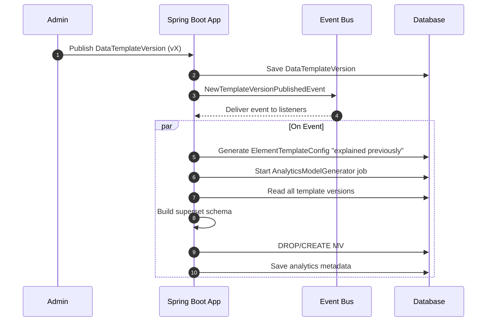
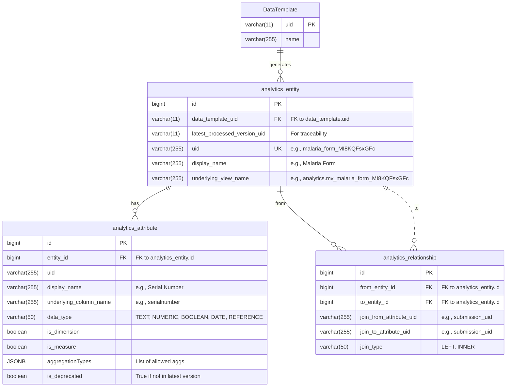

# Expanded: Template-Specific Wide Models (The Performance Layer)

* our generalized mv `analytics.pivot_grid_facts` would be our catch-all model.
* For most frequently analyzed data templates. we create fully pivoted, wide models that are even easier to query. This
  is an *optimization* built on top of our `analytics.pivot_grid_facts`, raw data, and facts.
* ensuring extensibility because adding new, highly-optimized analytics views requires **configuration, not code changes
  ** in our core query logic. You are simply teaching your existing engine about new "words" (entities and attributes)
  it can use.

---

## A Metadata-Driven Abstraction

The core idea is to create a layer (metadata) that defines the "shape" of the analytics data. This metadata will drive
everything: API responses, query generation, and even the UI components on the frontend.

### Key Components in Our Backend (Spring Boot)

1. **The Analytics Metadata Service:** The brain of the operation.
2. **The Dynamic Query Engine:** The muscle that builds and runs the SQL.
3. **The Materialized View (MV) Manager:** The automated housekeeper.

Let's detail each one.

## 1. The Analytics Metadata Service

This service's job is to describe your analytics models (the star schemas and wide MVs) in a consistent,
machine-readable way. You will define these models in your Java code.

- `AnalyticsEntity`, `AnalyticsAttribute`, `AnalyticsRelationship`

### Core Principle: The Automated "Unified Superset Model"

encored to the same:  **Process & Event Flows A.Template Publishing & Analytics Model Generation**
event after generating the `ElementTemplateConfig`.



* **Results**:
  in addition to the  **1.`ElementTemplateConfig`** (detailed
  in [datarun_infrastructure_high_level_view.md](datarun_infrastructure_high_level_view.md) doc):
  The system will also maintain **one** logical `AnalyticsEntity` per `DataTemplate`. This entity's schema will be a
  dynamic **superset** of all fields that have **ever existed** across all published versions of that template.

### 2. The Analytics Metadata Database Schema

This metadata will live in the database to be managed transactionally. Here is a suggested schema.



**Key Refinements:**

* `analytics_entity` is linked directly to `data_template.uid`, as it represents the template as a whole.
* `latest_processed_version_uid` is added for auditing and traceability.
* `is_deprecated` is added to `analytics_attribute`. The `AnalyticsModelGenerator` will set this flag if a field exists
  in the superset but not in the *latest* version of the template. This allows the UI to de-emphasize or hide obsolete
  fields while keeping them queryable.

### 3. The `AnalyticsModelGenerator` Logic

This service is the automated heart of the system. It is triggered by the `NewTemplateVersionPublishedEvent`.

**Algorithm:**

1. **Trigger:** Receives the event with a `template_uid`.

2. **Input:** The `template_uid` of the `DataTemplate` that was just updated.

3. **Superset Schema Discovery:**
    * Query the `element_template_config` table for **ALL** records associated with the given `template_uid`, spanning
      all its historical versions.
    * Iterate through these records to build a distinct list of all unique fields and repeatable sections that have ever
      existed for this template. This is the **"superset schema"**.

4. **DDL & Metadata Generation:**
    * Generate the DDL for `CREATE OR REPLACE MATERIALIZED VIEW analytics.mv_{template_name}_{template_uid} AS ...` for
      each grain (root and each repeatable section). The `SELECT` clause will contain a pivot `CASE` statement for every
      single field in the superset schema.
    * Generate the corresponding metadata records (`AnalyticsEntity`, `AnalyticsAttribute`, `AnalyticsRelationship`) in
      memory. For each attribute, compare its existence in the *latest* version's `ElementTemplateConfig` to set the
      `is_deprecated` flag.

5. **Transactional Database Update:**
    * Begin a single, isolated transaction.
    * **Step A:** Execute the `CREATE OR REPLACE MATERIALIZED VIEW` DDL statements. `OR REPLACE` is idempotent and
      handles both creation and updates.
    * **Step B:** Upsert the `analytics_entity` record for this template using its `uid`.
    * **Step C:** `DELETE` all `analytics_attribute` and `analytics_relationship` records associated with this entity's
      ID. This is the simplest way to ensure the metadata perfectly reflects the new superset schema.
    * **Step D:** Bulk `INSERT` the new `analytics_attribute` and `analytics_relationship` records generated in step 4.
    * Commit the transaction.

---

### The Core Analogy: A Curated Library for Your Data

### 1. `AnalyticsEntity` (The Book)

#### **Purpose:**

To represent a single, logical, and queryable "business object" or "grain" in the analytics system. It is the primary
subject of any analytical query. It answers the business question: **"What am I analyzing?"** (e.g., Submissions,
Medicines, Lab Tests).

#### **Key Properties and Interactions:**

| Property             | Type        | Example Value                        | Why It's Crucial                                                                                                                                                                |
|:---------------------|:------------|:-------------------------------------|:--------------------------------------------------------------------------------------------------------------------------------------------------------------------------------|
| `id`                 | `bigint`    | `101`                                | Internal database primary key. Used for all FK relationships within the metadata schema itself.                                                                                 |
| `uid`                | `String`    | `"malaria_form_MI8KQFsxGFc"`         | The unique, machine-readable identifier. Used in API requests to specify the target entity. The generator creates this.                                                         |
| `dataTemplateUid`    | `String`    | `"MI8KQFsxGFc"`                      | **Traceability Link.** Connects this analytical model directly back to the canonical `DataTemplate` it was generated from                                                       |
| `displayName`        | `String`    | `"Malaria Form (Submission)"`        | The human-friendly name displayed in the UI's dropdowns. Sourced from the `DataTemplate`'s name.                                                                                |
| `description`        | `String`    | `"..."`                              | Provides helpful tooltips or context in the UI, explaining what a user is looking at.                                                                                           |
| `underlyingViewName` | `String`    | `"analytics.mv_malaria_MI8KQFsxGFc"` | **The physical link.** This tells the `DynamicQueryEngine` exactly which database view or table to query (`FROM ...`). This decouples the logical `uid` from the physical name. |
| `attributes`         | `List<...>` | `[...]`                              | The list of all the fields (columns) available for this entity. The heart of the entity's definition.                                                                           |
| `relationships`      | `List<...>` | `[...]`                              | Defines how this entity can be joined to others. This is what enables multi-entity queries.                                                                                     |

---

### 2. `AnalyticsAttribute` (The Chapter or Column)

#### **Purpose:**

To represent a single, queryable field within an `AnalyticsEntity`. It defines all the necessary properties for the UI
to render it correctly and for the query engine to use it. It answers the business question: **"What specific detail can
I view, filter by, or calculate?"** (e.g., Patient Age, Diagnosed Disease).

#### **Key Properties and Interactions:**

| Property                    | Type                                                             | Example Value          | Why It's Crucial                                                                                                                                                                                     |
|:----------------------------|:-----------------------------------------------------------------|:-----------------------|:-----------------------------------------------------------------------------------------------------------------------------------------------------------------------------------------------------|
| `id`                        | `bigint`                                                         | `2001`                 | Internal database primary key.                                                                                                                                                                       |
| `entityId`                  | `bigint`                                                         | `101`                  | **Interaction:** Links the attribute back to its parent `AnalyticsEntity`. Every attribute belongs to exactly one entity.                                                                            |
| `uid`                       | `String`                                                         | `"..."`                | The unique business key for the attribute *within its entity*. Sourced from the `etc.uid`.                                                                                                           |
| `displayName`               | `String`                                                         | `"Serial Number"`      | The human-friendly label shown in the UI's field lists and table headers. Sourced from the `etc`'s `label`.                                                                                          |
| `underlyingColumnName`      | `String`                                                         | `"serialnumber"`       | **The physical link.** This tells the `DynamicQueryEngine` which column to select (`SELECT serialnumber ...`).                                                                                       |
| `dataType`                  | `enum` (e.g., `TEXT`, `NUMERIC`, `BOOLEAN`, `DATE`, `REFERENCE`) | `NUMERIC`              | **Drives UI and Query Logic.** The UI uses this to show the right filter input (a calendar for DATE, a number field for NUMERIC). The query engine uses it to know whether to wrap values in quotes. |
| `isDimension` / `isMeasure` | `boolean`                                                        | `true` / `true`        | **Drives UI Placement & Behavior.** From `DataElement`. Dimensions are for grouping/slicing (Rows/Columns). Measures are for aggregation (Values).                                                   |
| `aggregationTypes`          | `List<enum>` (`SUM`, `AVG`, `MIN`, `MAX`, `COUNT`)               | `[SUM, AVG, MIN, MAX]` | If it's a measure, this tells the UI which aggregation functions are valid and should be shown in a dropdown.                                                                                        |
| `references`                | `String`                                                         | `"options"`            | For `REFERENCE` data types, this can indicate which dimension table holds the actual value (e.g., `option`, `org_unit`). Useful for populating filter dropdowns with valid choices.                  |
| `isDeprecated`              | `boolean`                                                        | `false`                | **Drives UI Visibility.** If `true`, the UI can hide or de-emphasize this attribute. It's a "chapter" from an older edition but is kept for historical analysis.                                     |

---

### 3. `AnalyticsRelationship` (The Cross-Reference)

#### **Purpose:**

To define a formal, machine-readable join path between two `AnalyticsEntity` objects. It is the "verb" that connects
the "nouns" (the entities), enabling rich, multi-grain queries. It answers the business question: **"How does a '
Medicine' relate to a 'Submission'?"**

#### **Key Properties and Interactions:**

| Property               | Type     | Example                      | Purpose & Interaction                                                                                                                                 |
|:-----------------------|:---------|:-----------------------------|:------------------------------------------------------------------------------------------------------------------------------------------------------|
| `id`                   | `bigint` | `51`                         | Internal database primary key.                                                                                                                        |
| `fromEntityId`         | `bigint` | `102` (Medicines Entity ID)  | **Interaction:** The starting point of the relationship. It defines a relationship *from* one entity.                                                 |
| `toEntityId`           | `bigint` | `101` (Submission Entity ID) | **Interaction:** The destination of the relationship. It defines a relationship *to* another entity.                                                  |
| `joinFromAttributeUid` | `String` | `"submission_uid"`           | The `uid` of the attribute in the `fromEntity` that acts as the foreign key. The query engine uses this to find the column for the `ON` clause.       |
| `joinToAttributeUid`   | `String` | `"submission_uid"`           | The `uid` of the attribute in the `toEntity` that acts as the primary key for the join.                                                               |
| `joinType`             | `enum`   | `LEFT`                       | Specifies the SQL join type. `LEFT` is the standard for analytics to ensure no data is dropped (e.g., show a submission even if it has no medicines). |

### The Power of This Domain Model

By formally defining this domain, you achieve:

1. **Complete Decoupling:** The frontend knows nothing about PostgreSQL, materialized views, or column names.
2. **UI Automation:** The frontend can be built generically.
3. **Intelligent Querying:** The `DynamicQueryEngine` becomes a universal translator.

---

how the backend resolves and shapes the data for the frontend is what creates a great experience. The frontend should *
*never** have to join `gender_uid` to a separate list of gender options. That is a backend responsibility.

## the three core contracts

### Contract #1: The Metadata Contract (`GET /api/analytics/metadata/entities`)

This is the "menu" the frontend uses to build the UI. It must be rich and descriptive, containing everything the UI
needs for display and behavior, pre-resolved and localized.

**Key Principle:** The backend does all the thinking. The frontend just renders what it's told.

#### Request (from Frontend)

The frontend sends the desired language in the `Accept-Language` header.
`GET /api/analytics/metadata/entities`
`Accept-Language: ar` (or `en`, etc.)

#### Response (from Backend)

The backend returns an array of `AnalyticsEntity` objects. The crucial part is that `displayName` and any other
user-facing strings are **already localized** by the backend.

```json-lines
[
  {
    "uid": "malaria_form_MI8KQFsxGFc",
    "displayName": "نموذج الملاريا", // Localized
    "attributes": [
      {
        "uid": "patient_temperature",
        "displayName": "درجة حرارة المريض", // Localized
        "dataType": "NUMERIC",
        "isDimension": true,
        "isMeasure": true
      },
      {
        "uid": "gender",
        "displayName": "الجنس", // Localized
        "dataType": "REFERENCE",
        "isDimension": true,
        "isMeasure": false,
        "referenceInfo": { // <-- AUXILIARY PAYLOAD
          "type": "OPTION_SET",
          "validOptionsEndpoint": "/api/optionsets/Bu2LhXFDicp/options" // The UI now knows where to get the filter choices
        }
      },
      {
        "uid": "diagnosed_disease_type",
        "displayName": "نوع المرض المشخص", // Localized
        "dataType": "REFERENCE",
        "isDimension": true,
        "isMeasure": false,
        "referenceInfo": {
          "type": "OPTION_SET",
          "validOptionsEndpoint": "/api/optionsets/AjpOXeUAqnQ/options"
        }
      }
    ],
    "relationships": [
      // ... relationship definitions
    ]
  }
]
```

**What this Auxiliary Payload (`referenceInfo`) provides:**

* **Smart Filtering:** When the user wants to filter on "Gender", the frontend sees `dataType: "REFERENCE"`. It then
  looks at `referenceInfo` and knows it can call the `validOptionsEndpoint` to get a list of valid choices (
  `[{ "uid": "MALE", "displayName": "ذكر" }, ...]`) to populate a dropdown. This is a huge functional win.

---

### Contract #2: The Query Contract (`POST /api/analytics/query`)

This is the "order" the frontend places. It must be simple, logical, and based on the `uid`s from the metadata contract.

**Key Principle:** The query is "dumb". It only knows about logical UIDs, not physical database columns or join logic.

#### Request (from Frontend)

This is the same simple, scalable shape we discussed before.
`POST /api/analytics/query`
`Accept-Language: ar`

```json-lines
{
  "entityUid": "malaria_medicines_MI8KQFsxGFc",
  "dimensions": [
    "submission.diagnosed_disease_type",
    "submission.gender"
  ],
  "measures": [
    {
      "attributeUid": "quantity",
      "aggregation": "AVG"
    }
  ],
  "filters": []
}
```

---

### Contract #3: The Data Response Contract (The Result)

This is the most critical part, and it directly addresses your point about **denormalization**. The answer is **yes, the
backend must denormalize and provide ready-to-display values.**

**Key Principle:** The response payload should require **zero** post-processing or lookups by the frontend. It should be
immediately renderable.

#### Response (from Backend)

The backend receives the query, generates the SQL, executes it, and then **enriches the result set** before sending it
to the client.

```json-lines
{
  "columnHeaders": [ // <-- AUXILIARY PAYLOAD
    { "uid": "submission.diagnosed_disease_type", "displayName": "نوع المرض المشخص", "dataType": "TEXT" },
    { "uid": "submission.gender", "displayName": "الجنس", "dataType": "TEXT" },
    { "uid": "quantity_AVG", "displayName": "متوسط الكمية", "dataType": "NUMERIC" }
  ],
  "rowData": [
    {
      "submission.diagnosed_disease_type": { // <-- Each value is an object
        "uid": "malaria",
        "value": "ملاريا" // The resolved, localized display value
      },
      "submission.gender": {
        "uid": "FEMALE",
        "value": "أنثى"
      },
      "quantity_AVG": {
        "uid": null,
        "value": 2.8
      }
    },
    {
      "submission.diagnosed_disease_type": {
        "uid": "dengue_fever",
        "value": "حمى الضنك"
      },
      "submission.gender": {
        "uid": "MALE",
        "value": "ذكر"
      },
      "quantity_AVG": {
        "uid": null,
        "value": 1.7
      }
    }
    // ... more rows
  ]
}
```

---

## not yet to think about things, but to consider in mind for later tuning

critical auxiliary backend capabilities not yet to think about, but to look for after we finalize the previous steps.

### 1. Foundational Capabilities (The Bedrock)

These services are essential for making the core query engine robust and usable:

* **A. A Cached, Centralized Metadata Service**
* **B. Robust Error Handling and Logging**

### 2. Performance & Scalability Enhancers (The Engine Room)

These features ensure the system remains fast and stable under heavy load and with large datasets:

* **A. Asynchronous Query Execution & Caching**
* **B. Resource Management: Query Timeouts and Connection Pooling**
* **C. Materialized View Refresh Management**

### 3. Intelligence & Administration Features (The "Pay Off")

* **A. Query Auditing and Usage Analytics (The Meta-Feature)**
* **B. A "Health Check" and Admin Dashboard**
