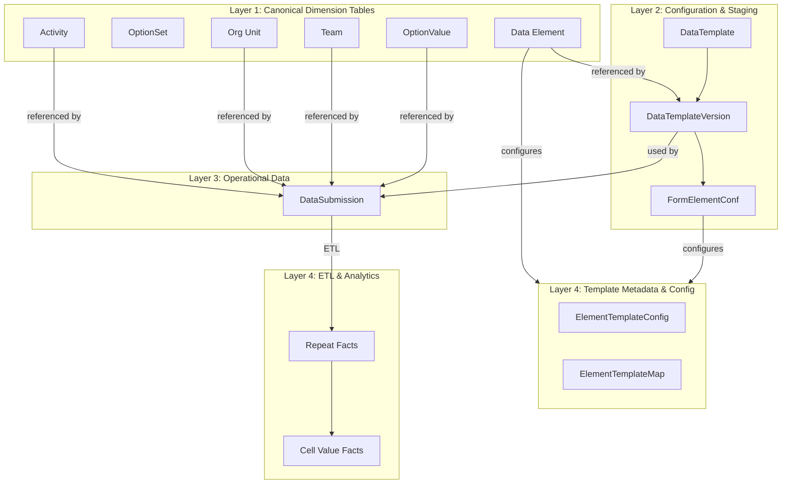
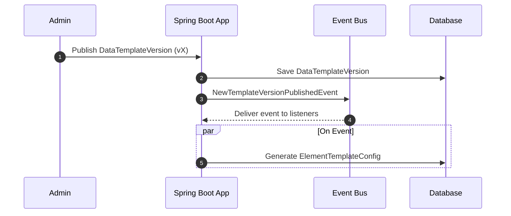
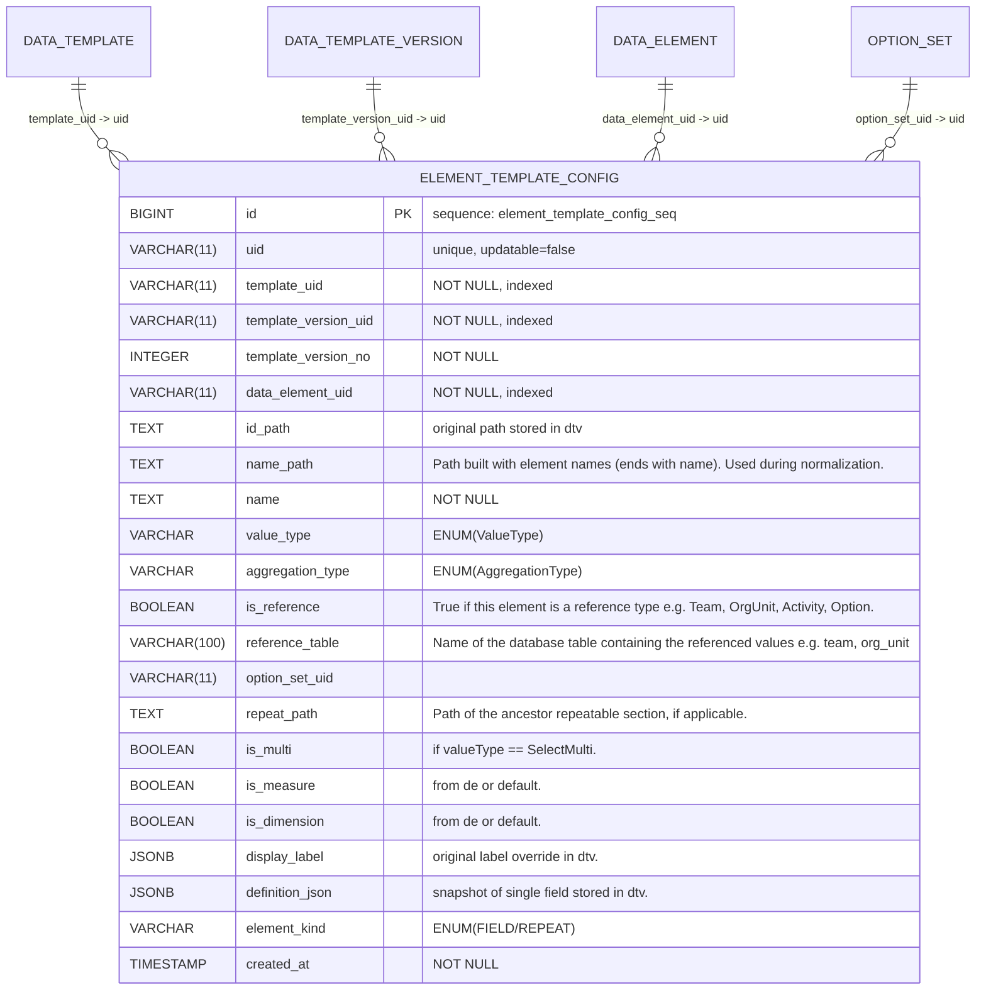
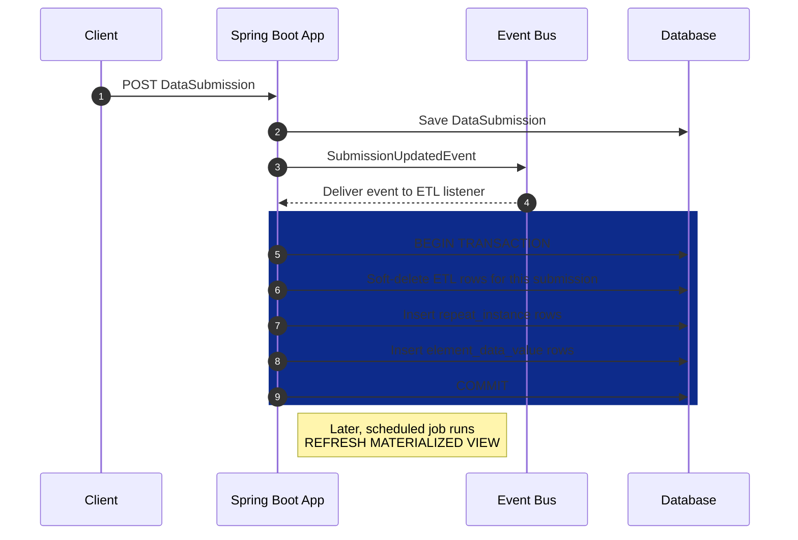

# Datarun ERD (Mermaid) + Fixes

A concise reference for the Datarun data-collection platform.

## 1.1 Platform / Build Assumptions

The current system is built upon:

* **Java 17+ (Spring Boot 3.4.2)**: A Maven-based project, initially generated with JHipster and extended.
* **PostgreSQL (tested with v16.x)**: Utilizes a compatible PostgreSQL JDBC driver.
* **Liquibase (XML)**: Used for managing schema migrations.
* **Spring Security & Application-level ACLs**: Integrated for security.
* **`jOOQ` & `NamedParameterJdbcTemplate`/`JdbcTemplate`**: Available for analytical queries.
* **Caching**: Employs Ehcache and Hibernate 2nd-level cache annotations where appropriate.
* **Mapping and Codegen Tools**: Lombok and MapStruct are used.
* **Testing**: Testcontainers (Postgres), JUnit 5, and AssertJ are used for testing.
* **User authentication**:  sending basic user's credentials and receiving Access/Refresh tokens.

---

## Key model clarifications

### 1. IDs, UIDs and business keys

* **id**: internal primary key (VARCHAR(26)). Immutable, never recycled. Used for all foreign-key relationships.
* **uid**: short system generated business key (VARCHAR(11)), globally unique, stable across environments, used in
  UI/exports and for human-friendly references. Keep `uid` unique at table level unless explicitly documented otherwise.
* Always prefer `id` for FK joins in SQL; `uid` is for presentation, analytics, and external references.

### 4. Template/version relationship

* `data_submission.template_id` and `data_submission.template_version_id` are immutable: once a submission is created
  they must never be updated — they capture the exact template and version used for that submission.
* `data_template_version` rows are immutable once published: `fields`/`sections` cannot be mutated; create a new version
  instead.

### 5. Data element semantics

* `data_element.value_type` Examples: `Text`, `Integer`, `Number`, `SelectOne`, `SelectMulti`, `Date`, `DateTime`,
  `Time`, `Team`.
* `data_element.is_dimension` and `is_measure` control UI affordances and pivot/analytics defaults. Default values:
  `is_dimension = true`, `is_measure = false` unless explicitly set.
* `aggregation_type` is a string/enum (nullable). If NULL, the service resolves a default aggregation based on the
  `value_type` (e.g., `sum` for numeric, `count` for boolean, `last` for datetime).
* `option_set_id` is nullable only if `value_type` does not require options. If `SelectOne`/`SelectMulti`,
  `option_set_id` must be NOT NULL and point to a valid `option_set`.

### 6. Option sets & option values

* `option_set` is the container; `option_value.option_set_id` is NOT NULL and mandatory.
* For each `option_set`:

    * `option_value.code` unique within the set (indexed as `(option_set_id, code)`).
    * `option_value.name` unique within the set (indexed as `(option_set_id, name)`).
    * `option_value.uid` may remain globally unique but is optional for scoped uniqueness checks.

### 7. Submission & history semantics

* `data_submission` stores the authoritative JSON payload in `form_data` and top-level metadata (
  orgUnit/team/activity/template/version).
* `data_submission` `template_id`/`template_version_id` are **immutable** after insert.
* `data_submission_history` stores snapshots of the submission over time.
* The history table is append-only; retain the last `N` snapshots per submission per retention policy.

### 9. `org_unit.path` and hierarchy queries

* `org_unit.path` stores comma-delimited `uid`s: e.g. `root_uid,country_uid,state_uid`.
* `parent_id` is the immediate parent FK; `level` is the integer depth from root (root = 0).
* `level`, and `org_unit.path` have periodically @scheduled maintenance in service

### 10. Template configuration — concepts

* **DataTemplateVersion's fields and sections service typed DTOs**

- `FormDataElementConf` / `FormSectionConf`:

* **FormDataElementConf** (one per input element)
    * Purpose: links a template field to a canonical `DataElement`.
    * Canonical fields:
        * `id` — references `DataElement.uid`.
        * `name` — copied from DataElement (cannot be overridden per template).
        * `valueType` — copied from DataElement (immutable per template).
        * `optionSetUid?` — optional `optionSet.uid` for select elements.
        * `parent` — parent section's name or null.
        * `path` — application generated using `parent` and `name` and stored materialized path within the template (
          e.g.,`household.children.age`), calculated for every pushed template's version.
        * `label` — localized map (defaults to DataElement label, can override).
        * `otherProperties` — e.g., `mandatory`, `readonly`, `defaultValue`.
        * `rules` — visibility/validation expressions.

* **FormSectionConf**
    * Purpose: grouping/section metadata (can be repeatable).
    * Canonical fields:
        * `name` (e.g `children`), `parent` (parent section's name or null e.g. `household`), `label` (map),
          `isRepeatable` (bool), `path`, `rules` — visibility/validation expressions.

---

## High level view of System layers

**Flowchart — illustrates a high level view of the data and processing layers, showing how data flows from configuration
to analytics.**
This diagram captures the layered architecture. It shows how canonical dimension tables relate to configuration, which
feeds submissions and is ETL-processed into analytics-ready facts.



## Detailed picture of the flow

### creat/update DataTemplateVersion flow

**Process & Event Flows A. Template Publishing & Analytics Model Generation**



* **Results**:

after persisting the `DataTemplateVersion`:

**1. `ElementTemplateConfig` (etc)**: A canonical, queryable template-field uid-native catalog, application generated
and stored per template and template version. It contains denormalized attributes from `DataElement`,
`DataTemplateVersion`, and context. stores info only about Fields, and repeatable section



---

###       

#### ETL model & execution (uid-native)

The ETL result is a generalized star schema tables, it is for all templates. It provides a single, unified, and scalable
way to query any piece of data. it maintains a "tall" fact table, but surrounds it with rich dimension tables for
context (for start our existing tables (`Team`, `OrgUnit`, `Activity`, `DataElement`, `OptionSet`, `Option`, etc) are
already perfect dimension tables.)

**A. Submission ETL Flow ("Sweep and Update")**: Visualizes the idempotent ETL process on new/updated submissions.



- ETL is idempotent and implemented as a sweep-update transaction per submission:
    1. Load `data_submission.form_data` and the referenced `data_template_version.fields/sections`.
    2. Insert or upsert `repeat_instance` rows representing repeats and their hierarchy.
    3. Normalize values into `element_data_value` typed rows (one atomic value per row; select-multi expands to multiple
       rows).
    4. Soft-mark stale rows from previous runs (if any) and insert current rows.
    5. Record ETL run metadata (`etl_version`, `run_ts`, `checksum`) for traceability.
- Deduplication is enforced by unique constraints using stable composite keys (e.g.,
  `submission_uid + element_uid + repeat_instance_key + selection_key`).

---

##### 1.2 — Fact storage

- `element_data_value` stores normalized atomic values with typed columns:
    - `value_num`, `value_bool`, `value_ref_uid`, `option_uid`, `value_ts`, `value_text`.
- Context columns include `submission_uid`, `assignment_uid`, `team_uid`, `org_unit_uid`, `activity_uid`, `element_uid`,
  `element_template_config_uid`, `repeat_instance_id`.
- Unique index `ux_element_value_unique` enforces idempotence for re-run ETL.

---

##### 1.3 — Repeat groups

- Repeat groups are modeled as rows in `repeat_instance`:
    - Each row captures `id`, `parent_repeat_instance_id`, `submission_uid`, `repeat_path`, `repeat_index`, and
      `repeat_section_label`.
- `element_data_value` rows link to the corresponding `repeat_instance_id` so the hierarchy is preserved for analytics
  joins.

---

## materialized view

- Materialized view `pivot_grid_facts` flatten `element_data_value` with submission, template metadata, option
  labels, and dimension joins for efficient reporting.
- MV refresh jobs are scheduled and `etl_version` is recorded for traceability of which ETL run produced the derived
  rows.

---

## Appendix and DDLs

### 1. ETL Facts DDLs:

1. **`repeat_instance`:**
    ```sql
    CREATE TABLE IF NOT EXISTS repeat_instance
    (
        id                        varchar(26) PRIMARY KEY,
        parent_repeat_instance_id varchar(26),
        repeat_section_label      jsonb                  DEFAULT '{}'::jsonb,
        submission_uid            varchar(11)   NOT NULL,
        repeat_path               varchar(3000) NOT NULL,
        repeat_index              bigint,
        client_updated_at         timestamp,
        deleted_at                timestamp,
        submission_completed_at   timestamp,
        created_date              timestamp     NOT NULL DEFAULT now(),
        last_modified_date        timestamp,
        last_modified_by          varchar(100),
        created_by                varchar(100)
    );
    CREATE INDEX IF NOT EXISTS idx_repeat_instance_submission_path ON repeat_instance (submission_uid, repeat_path);
    CREATE INDEX IF NOT EXISTS idx_repeat_instance_parent_id ON repeat_instance (parent_repeat_instance_id);
    ALTER TABLE repeat_instance
        ADD CONSTRAINT fk_repeat_instance_parent
            FOREIGN KEY (parent_repeat_instance_id) REFERENCES repeat_instance (id);
    ```

2. **`element_data_value` DDL:**
    ```sql
    CREATE TABLE IF NOT EXISTS element_data_value
    (
        id                          bigserial PRIMARY KEY,
        repeat_instance_id          varchar(26),
        submission_uid              varchar(11) NOT NULL,
        assignment_uid              varchar(11),
        team_uid                    varchar(11),
        org_unit_uid                varchar(11),
        activity_uid                varchar(11),
        element_uid                 varchar(11) NOT NULL,
        element_template_config_uid varchar(11) NOT NULL,
        option_uid                  varchar(11), -- only for multi select or null
        value_text                  text,
        value_num                   numeric,
        value_bool                  boolean,
        value_ref_uid               varchar(11),
        value_ts                    timestamp,
        deleted_at                  timestamp,
        created_date                timestamp   NOT NULL DEFAULT now(),
        last_modified_date          timestamp,
        repeat_instance_key         text GENERATED ALWAYS AS (COALESCE(repeat_instance_id, '')) STORED,
        selection_key               text GENERATED ALWAYS AS (COALESCE(option_uid, '')) STORED,
        row_type                    char(1)     NOT NULL DEFAULT 'S'
    );
    CREATE UNIQUE INDEX IF NOT EXISTS ux_element_value_unique
        ON element_data_value (
                               submission_uid,
                               element_uid,
                               repeat_instance_key,
                               row_type,
                               selection_key
            );
    
    -- other indexes omitted for brevity
    ```

### 2. Materialized View (DDL)

The `pivot_grid_facts` MV is a UID-native view optimized for 

```sql
CREATE MATERIALIZED VIEW pivot_grid_facts AS
SELECT ev.ID                          AS value_id,
       ev.submission_uid              AS submission_uid,
-------------------------------------
-- (specific template/version config scope filtering/grouping)
--------------------------------------
       sub.template_uid               AS template_uid,
       sub.template_version_uid       AS template_version_uid,
       etc.uid                        AS etc_uid,-- (element template unique uid)

-- Template metadata (per-template overrides from element_template_config)
       etc.repeat_path                AS template_repeat_path, -- if applicable
       etc.name_Path                  AS template_name_path,-- element Path built with element names (ends with name)
       etc.id_Path                    AS template_id_path,-- element Path built with section names, (ends with element uid)
-------------------------------------
-- REPEAT HIERARCHICAL CONTEXT
--------------------------------------
       child_ri.ID                    AS repeat_instance_id,--  ULID PK is used only for repeat instance, rest is uid-native
       parent_ri.ID                   AS parent_repeat_instance_id, -- for HIERARCHICAL nesting, if applicable
       child_ri.repeat_path, -- a repeat's repeat path, if applicable or null
       child_ri.repeat_section_label,-- json e.g. {"en": "...", "ar": "..."} ui section's display labels
       parent_ri.repeat_section_label AS parent_repeat_section_label,
-------------------------------------
-- Submission / Assignment context
--------------------------------------
       ev.assignment_uid              AS assignment_uid,
       ev.team_uid                    AS team_uid,
       tm.code                        AS team_code,
       ev.org_unit_uid                AS org_unit_uid,
       ou.NAME                        AS org_unit_name,
       ev.activity_uid                AS activity_uid,
       act.NAME                       AS activity_name,
       sub.finished_entry_time        AS submission_completed_at,

       etc.display_label,-- element display labels, json e.g. {"en": "...", "ar": "..."}
-------------------------------------
-- data_element (canonical) (Global)
--------------------------------------
-- Global (canonical) data_element metadata (join)
       de.uid                         AS de_uid,
       de.NAME                        AS de_name,
       de.TYPE                        AS de_value_type,
-- Option metadata (selects)
       ops.uid                        AS de_option_set_uid,
       ev.option_uid                  AS option_uid,
       ov.uid                         AS option_value_uid,
       ov.NAME                        AS option_name,
       ov.code                        AS option_code,

--------------------------------------
-- Values
--------------------------------------
       ev.value_num,
       ev.value_text,
       ev.value_bool,
       ev.value_ts,
       ev.value_ref_uid,

       ev.deleted_at
FROM element_data_value ev
         JOIN data_submission sub ON ev.submission_uid = sub.uid
         LEFT JOIN data_element de ON ev.element_uid = de.uid
         LEFT JOIN element_template_config etc ON ev.element_template_config_uid::text = etc.uid::text
         LEFT JOIN option_value ov ON ev.option_uid = ov.uid
         LEFT JOIN option_set ops ON de.option_set_id = ops.id
         LEFT JOIN team tm ON ev.team_uid = tm.uid
         LEFT JOIN org_unit ou ON ev.org_unit_uid = ou.uid
         LEFT JOIN activity act ON ev.activity_uid = act.uid

         LEFT JOIN repeat_instance child_ri ON ev.repeat_instance_id = child_ri.id
         LEFT JOIN repeat_instance parent_ri ON child_ri.parent_repeat_instance_id = parent_ri.id
-- ... some other indexes omitted for brevity
```

## Auxiliary Dimension Tables

* **`org_unit_hierarchy` (Closure Table)** generated from canonical `OrgUnit` for analytics

**Purpose:** Provides an efficient way to query for all descendants or ancestors of an organizational unit, regardless
of depth.

**DDL:**

```sql
CREATE TABLE org_unit_hierarchy
(
    ancestor_uid   VARCHAR(11) NOT NULL REFERENCES org_unit (uid),
    descendant_uid VARCHAR(11) NOT NULL REFERENCES org_unit (uid),
    depth          INTEGER     NOT NULL,
    PRIMARY KEY (ancestor_uid, descendant_uid)
);
CREATE INDEX idx_ou_hierarchy_ancestor ON org_unit_hierarchy (ancestor_uid);
CREATE INDEX idx_ou_hierarchy_descendant ON org_unit_hierarchy (descendant_uid);
```

* **`ou_level`**

**Purpose:** Provides human-readable names and descriptions for organizational hierarchy levels.

**DDL:**

```sql
CREATE TABLE ou_level
(
    level       INTEGER PRIMARY KEY,
    name        VARCHAR(255) NOT NULL UNIQUE,
    description TEXT
);
```

---

### Common Abbreviations Used Throughout The System

* `act`: Activity.
* `de`: DataElement.
* `dt`: DataTemplate.
* `dtv`: DataTemplateVersion.
* `etc`: ElementTemplateConfiguration
* `ops`: OptionSet.
* `ou`: OrgUnit.
* `ov`: OptionValue.
