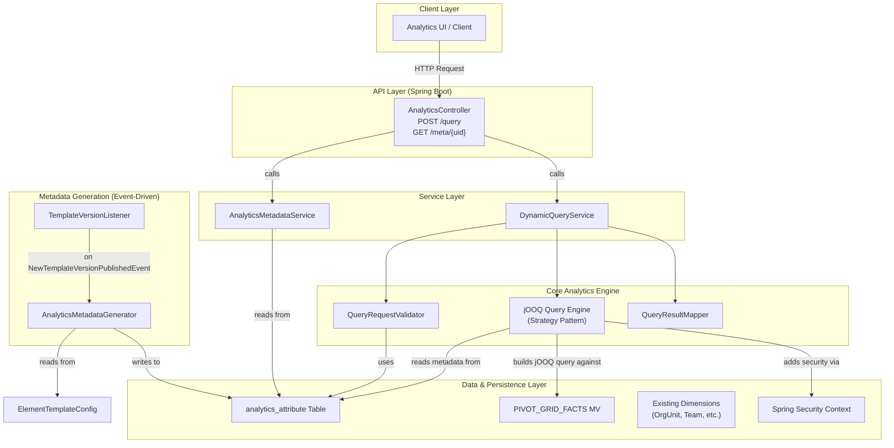

### High-Level Component Architecture

This diagram illustrates the key new components (in blue) and how they interact with your existing architecture to serve
analytics requests.



---

### Phase 1: Practical & Implementable Core Components

This is the foundational implementation that delivers the full contract functionality efficiently.

#### 1. The Analytics Metadata Subsystem (The "Dictionary")

This subsystem is responsible for generating, storing, and serving the metadata that drives the UI.

**A. New Database Table: `analytics_attribute`**

This table stores the generated, queryable "analytics attributes" for each template version. It's the single source of
truth for the metadata API.

```sql
CREATE TABLE analytics_attribute
(
    id                   BIGSERIAL PRIMARY KEY,
    uid                  VARCHAR(50) NOT NULL, -- e.g., "dim_ou_L3_name"
    template_version_uid VARCHAR(11) NOT NULL,

    attribute_type       VARCHAR(20) NOT NULL, -- DIMENSION, MEASURE
    display_name         JSONB       NOT NULL, -- {"en": "Province", "fr": "Province"}
    data_type            VARCHAR(20) NOT NULL, -- TEXT, NUMBER, ENTITY_REF

    -- Mapping & Configuration
    db_mapping_info      JSONB       NOT NULL, -- {"column": "ou_level_3_name", "source": "PIVOT_GRID_FACTS"}
    aggregation_type     VARCHAR(20),          -- For MEASURES: SUM, COUNT, AVG
    entity_ref_type      VARCHAR(50),          -- For ENTITY_REF: "team", "org_unit"

    -- Traceability
    source_element_uid   VARCHAR(11),          -- The original DataElement.uid
    source_semantic_path VARCHAR(3000),

    CONSTRAINT uk_analytics_attribute_uid UNIQUE (template_version_uid, uid)
);
```

* **`db_mapping_info` is the critical link.** It decouples the public `uid` from the physical database column. This is
  what allows the backend schema to evolve independently.

**B. Event Listener: `TemplateVersionListener`**

* **Trigger:** Asynchronously listens for the `NewTemplateVersionPublishedEvent`.
* **Action:** Invokes the `AnalyticsMetadataGenerator` to create the metadata for the newly published template version.

**C. Service: `AnalyticsMetadataGenerator`**

* **Responsibility:** The translator. It reads the `ElementTemplateConfig` records for a given template version and
  transforms them into `analytics_attribute` records.
* **Logic:**
    1. **Iterate through `ElementTemplateConfig` records.**
    2. **Generate Dimension Attributes:** For each `is_dimension` field, it creates an attribute.
        * `uid` is constructed programmatically (e.g., `dim_de_{data_element_uid}`).
        * `db_mapping_info` is set based on conventions (e.g., it knows `value_ref_uid` maps to a specific column in
          `PIVOT_GRID_FACTS`).
    3. **Generate Measure Attributes:** For each `is_measure` field, it creates attributes for each valid aggregation (
       e.g., `meas_de_{uid}_sum`, `meas_de_{uid}_avg`).
    4. **Generate System Attributes:** It also creates implicit attributes not present in `ElementTemplateConfig`,
       like "Submission Count" (`meas_submission_count`) or dimensions from the `DATA_SUBMISSION` table itself (e.g.,
       `dim_team_ref`).
    5. **Persist:** Saves the new records to the `analytics_attribute` table.

**D. Service: `AnalyticsMetadataService`**

* A simple, read-only service.
* **Method:** `getAttributes(templateVersionUid)`
* **Implementation:** Queries the `analytics_attribute` table. This endpoint should be **heavily cached** (e.g., with
  Spring's `@Cacheable`), as this data only changes when a template is published.

#### 2. The Dynamic Query Subsystem (The "Engine")

This is the runtime engine that securely executes client queries.

**A. Service: `DynamicQueryService`**

* The main entry point for the `POST /api/analytics/query` endpoint.
* **Orchestrates the flow:**
    1. Calls `QueryRequestValidator`.
    2. Calls `QueryEngine` to build and execute the query.
    3. Calls `QueryResultMapper` to format the response.

**B. Component: `QueryRequestValidator`**

* **Responsibility:** Prevents invalid or malicious queries *before* hitting the database.
* **Logic:** For a given `templateVersionUid`, it fetches the valid attribute `uid`s from the (cached)
  `AnalyticsMetadataService` and ensures that every dimension, measure, and filter in the incoming query request uses a
  valid `uid`.

**C. Component: `QueryEngine` (The Heart of the System)**

* **Responsibility:** Translates the validated `QueryRequest` JSON into a secure, executable `jOOQ` query.
* **Implementation:** Use a **Strategy Pattern** for maximum flexibility and extensibility.
    * It iterates through the `dimensions`, `measures`, and `filters` of the request.
    * For each item, it looks up the corresponding record in `analytics_attribute` to get its `db_mapping_info`.
    * It delegates the construction of a jOOQ query fragment to a specialized builder.
        * `DimensionBuilder`: Handles `groupBy()` clauses.
        * `MeasureBuilder`: Handles `select(sum(...))` or `select(count(...))` clauses based on `aggregation_type`.
        * `FilterBuilder`: A factory that creates handlers for different operators (`IN`, `BETWEEN`, `DESCENDANT_OF`).
          The `DESCENDANT_OF` builder would, for example, know how to join with the `org_unit_hierarchy` table.

**D. Security Integration: Row-Level Security**

* The `QueryEngine` must be aware of the current user's security context.
* **Implementation:** Before executing any query, it injects an implicit `WHERE` clause.
    1. Get the current user's ID and permissions from `SpringSecurityContext`.
    2. Determine the list of `OrgUnit` UIDs the user is allowed to see (this logic likely already exists in your
       application).
    3. **Append `...AND T1.org_unit_uid IN (:user_accessible_org_units)` to the jOOQ query.** This single step ensures
       that every query is automatically and non-negotiably scoped to the user's data access rights.

---

### Phase 2: Scalability & Future Evolution

The design of Phase 1 directly enables future enhancements without requiring changes to the client API contract.

**A. Introduce Template-Specific Materialized Views**

* **Problem:** As data grows, the single `PIVOT_GRID_FACTS` MV might become slow or too general.
* **Solution:**
    1. Create a new, highly optimized materialized view for a specific high-demand template (e.g.,
       `mv_malaria_annual_report_facts`).
    2. **Update the Data:** In the `analytics_attribute` table for that template, update the `db_mapping_info` to point
       to the new MV: `{"column": "malaria_cases", "source": "mv_malaria_annual_report_facts"}`.

    * **Result:** The `QueryEngine` will now automatically build queries against this new, faster data source. **Zero
      changes are needed in the `QueryEngine`'s logic or the client application.**

**B. Pluggable Data Sources (OLAP / Search)**

* **Problem:** Some analytics require near-instantaneous slicing and dicing that even MVs can't provide.
* **Solution:**
    1. Introduce a real OLAP data store (like Apache Druid) or a search index (like Elasticsearch) and create an ETL
       process to feed it.
    2. Create a new implementation of the `QueryEngine` interface (e.g., `ElasticsearchQueryEngine`).
    3. Update the `db_mapping_info` to include a source type:
       `{"source_type": "ELASTICSEARCH", "index": "datarun-analytics", "field": "malaria_cases"}`.
    4. The `DynamicQueryService` can now use a factory to select the correct query engine based on the metadata.

    * **Result:** You can seamlessly serve queries from the most appropriate backend (Postgres, Elasticsearch, etc.)
      while presenting a single, unified API to the client.

**C. AI-Powered & Advanced Features**

* **Natural Language Querying (NLQ):** An AI service could be built to translate a string like "show me malaria cases in
  the North province for last year" into the standard JSON `QueryRequest` format, which is then fed into the existing
  `DynamicQueryService`.
* **Automated Insights:** Because the metadata is so rich (e.g., it knows which fields are dimensions vs. measures, and
  their data types), a backend service could proactively run common queries to find correlations or anomalies and
  present them to users.

---

Of course. Let's break down the implementation of each server-side component with detailed logic, class structures, code
snippets, and specific considerations. This provides a clear blueprint for development.

### Phase 1 Detailed Implementation Blueprint

---

#### 1. The Analytics Metadata Subsystem (The "Dictionary")

This is the foundation. Its goal is to create a persistent, cached, and reliable source of truth for what can be
queried.

##### A. `analytics_attribute` Table (PostgreSQL)

This is the physical storage for our metadata contract. The `db_mapping_info` column is the core of the decoupling
strategy.

```sql
-- DDL for the metadata table
CREATE TABLE analytics_attribute
(
    id                   BIGSERIAL PRIMARY KEY,
    uid                  VARCHAR(50) NOT NULL, -- The public, stable identifier for the attribute (e.g., "meas_malaria_cases_sum")
    template_version_uid VARCHAR(11) NOT NULL REFERENCES data_template_version (uid),

    attribute_type       VARCHAR(20) NOT NULL CHECK (attribute_type IN ('DIMENSION', 'MEASURE')),
    display_name         JSONB       NOT NULL, -- e.g., '{"en": "Province", "fr": "Province"}'
    data_type            VARCHAR(20) NOT NULL CHECK (data_type IN ('TEXT', 'NUMBER', 'DATE', 'BOOLEAN', 'ENTITY_REF')),

    -- This JSONB column is the translation key for the query engine.
    db_mapping_info      JSONB       NOT NULL,

    aggregation_type     VARCHAR(20),          -- For MEASURES: SUM, COUNT, AVG, MIN, MAX
    entity_ref_type      VARCHAR(50),          -- For ENTITY_REF: 'team', 'org_unit', or an option_set_uid
     
    -- Traceability columns for debugging and context
    source_element_uid   VARCHAR(11),
    source_semantic_path VARCHAR(3000),

    -- Ensures each attribute UID is unique within a template version
    CONSTRAINT uk_analytics_attribute_uid UNIQUE (template_version_uid, uid)
);
CREATE INDEX idx_analytics_attribute_tv_uid ON analytics_attribute (template_version_uid);
```

**Example `db_mapping_info` values:**

* For a simple dimension: `{"source": "PIVOT_GRID_FACTS", "column": "value_text", "element_uid": "de_abc"}`
* For an aggregated measure:
  `{"source": "PIVOT_GRID_FACTS", "column": "value_num", "element_uid": "de_xyz", "aggregate_fn": "SUM"}`
* For a system-level dimension: `{"source": "PIVOT_GRID_FACTS", "column": "team_name"}`
* For a system-level measure:
  `{"source": "PIVOT_GRID_FACTS", "column": "submission_uid", "aggregate_fn": "COUNT_DISTINCT"}`

##### B. Event-Driven Generation Logic

The generation process is triggered asynchronously after a template version is published, ensuring it doesn't slow down
the user-facing action.

**`TemplateVersionListener.java`**

```java
import org.springframework.context.event.EventListener;
import org.springframework.scheduling.annotation.Async;
import org.springframework.stereotype.Component;

@Component
public class TemplateVersionListener {

    private final AnalyticsMetadataGenerator metadataGenerator;

    public TemplateVersionListener(AnalyticsMetadataGenerator metadataGenerator) {
        this.metadataGenerator = metadataGenerator;
    }

    @Async // Run this in a separate thread
    @EventListener
    public void handleNewTemplateVersionPublished(NewTemplateVersionPublishedEvent event) {
        // The event object would contain the templateVersionUid
        metadataGenerator.generateAndSaveAttributes(event.getTemplateVersionUid());
    }
}
```

**`AnalyticsMetadataGenerator.java`**

```java

@Service
public class AnalyticsMetadataGenerator {

    private final ElementTemplateConfigRepository etcRepository;
    private final AnalyticsAttributeRepository attributeRepository;

    // ... constructor ...

    @Transactional // All attributes for a version are generated in one transaction
    public void generateAndSaveAttributes(String templateVersionUid) {
        // 1. Clean up any old attributes for this version in case of re-generation
        attributeRepository.deleteAllByTemplateVersionUid(templateVersionUid);

        List<AnalyticsAttribute> attributes = new ArrayList<>();
        List<ElementTemplateConfig> configs = etcRepository.findByTemplateVersionUid(templateVersionUid);

        // 2. Generate attributes from ElementTemplateConfig
        for (ElementTemplateConfig etc : configs) {
            if (etc.isDimension()) {
                attributes.add(createDimensionAttribute(etc));
            }
            if (etc.isMeasure()) {
                attributes.addAll(createMeasureAttributes(etc)); // One measure can have multiple aggregations
            }
        }

        // 3. Generate system-level attributes (not tied to a specific data element)
        attributes.addAll(createSystemAttributes(templateVersionUid));

        // 4. Save all to the database
        attributeRepository.saveAll(attributes);
    }

    private AnalyticsAttribute createDimensionAttribute(ElementTemplateConfig etc) {
        // Logic to build a dimension attribute.
        // Sets uid, displayName, db_mapping_info based on etc.valueType, etc.isReference, etc.
        // For example, if value_type is a reference to OrgUnit, the dataType becomes ENTITY_REF
        // and entityRefType becomes "org_unit".
        // The db_mapping_info would point to the appropriate column (e.g., value_ref_uid).
    }

    private List<AnalyticsAttribute> createMeasureAttributes(ElementTemplateConfig etc) {
        // Logic to build a list of measure attributes for SUM, AVG, etc.
        // For each aggregation, it creates a new AnalyticsAttribute with a unique UID
        // (e.g., "meas_de_my_element_sum") and the corresponding "aggregate_fn"
        // in its db_mapping_info.
    }

    private List<AnalyticsAttribute> createSystemAttributes(String templateVersionUid) {
        // Logic to create attributes like "Submission Count", "Team Name", "Org Unit Level 3", etc.
        // These are not derived from ElementTemplateConfig but from the submission context itself.
        // Their db_mapping_info will point to columns directly on the materialized view
        // like `team_name` or use functions like `COUNT_DISTINCT(submission_uid)`.
    }
}
```

---

#### 2. The Dynamic Query Subsystem (The "Engine")

This is the runtime component that handles incoming API requests.

##### A. Controller and DTOs

This defines the public API shape.

**`AnalyticsController.java`**

```java

@RestController
@RequestMapping("/api/analytics")
public class AnalyticsController {

    private final DynamicQueryService queryService;
    private final AnalyticsMetadataService metadataService;

    // ... constructor ...

    @GetMapping("/meta/{templateVersionUid}")
    public ResponseEntity<List<AnalyticsAttributeDto>> getMetadata(@PathVariable String templateVersionUid) {
        return ResponseEntity.ok(metadataService.getAttributes(templateVersionUid));
    }

    @PostMapping("/query")
    public ResponseEntity<QueryResponse> executeQuery(@RequestBody @Valid QueryRequest request) {
        return ResponseEntity.ok(queryService.executeQuery(request));
    }
}
```

**`QueryRequest.java` (DTO)**

```java
public class QueryRequest {
    @NotNull
    private String templateVersionUid;
    private List<String> dimensions = new ArrayList<>();
    private List<String> measures = new ArrayList<>();
    private List<FilterClause> filters = new ArrayList<>();
    // ... other fields like orderBy, paging ...
    // ... getters and setters ...
}
```

##### B. `DynamicQueryService.java` (Orchestrator)

This service wires together the validation, execution, and mapping steps.

```java

@Service
public class DynamicQueryService {

    private final QueryRequestValidator validator;
    private final JooqQueryEngine queryEngine; // Injected implementation
    private final QueryResultMapper resultMapper;
    private final AnalyticsMetadataService metadataService;

    public QueryResponse executeQuery(QueryRequest request) {
        // 1. Fetch metadata needed for validation and execution
        Map<String, AnalyticsAttribute> attributeMap = metadataService.getAttributesAsMap(request.getTemplateVersionUid());

        // 2. Validate the request against the metadata
        validator.validate(request, attributeMap);

        // 3. Build and execute the jOOQ query
        Result<Record> result = queryEngine.execute(request, attributeMap);

        // 4. Map the raw jOOQ result to the final API response DTO
        return resultMapper.mapToResponse(result, request, attributeMap);
    }
}
```

##### C. `JooqQueryEngine.java` (The Core Logic)

This is where the translation from the abstract `QueryRequest` to concrete `jOOQ` SQL happens.

```java
import static org.jooq.impl.DSL.*;

import org.jooq.DSLContext;
import org.jooq.Field;
import org.jooq.Record;
import org.jooq.SelectQuery;
import org.springframework.stereotype.Component;

@Component
public class JooqQueryEngine {

    private final DSLContext dsl;

    public JooqQueryEngine(DSLContext dsl) {
        this.dsl = dsl;
    }

    public Result<Record> execute(QueryRequest request, Map<String, AnalyticsAttribute> attributeMap) {
        List<Field<?>> selectFields = new ArrayList<>();
        List<Field<?>> groupByFields = new ArrayList<>();

        Table<?> fromTable = table(name("PIVOT_GRID_FACTS")); // Base table

        // 1. Process Dimensions
        for (String dimUid : request.getDimensions()) {
            AnalyticsAttribute attr = attributeMap.get(dimUid);
            // Example mapping: {"source": "PIVOT_GRID_FACTS", "column": "ou_level_3_name"}
            Field<Object> field = field(name(attr.getDbMappingInfo().get("column").asText()))
                .as(dimUid); // CRITICAL: Alias the column with the public UID
            selectFields.add(field);
            groupByFields.add(field);
        }

        // 2. Process Measures
        for (String measUid : request.getMeasures()) {
            AnalyticsAttribute attr = attributeMap.get(measUid);
            // Example mapping: {"column": "value_num", "aggregate_fn": "SUM", "element_uid": "de_xyz"}
            Field<?> measureField = buildMeasureField(attr, fromTable);
            selectFields.add(measureField.as(measUid)); // CRITICAL: Alias with public UID
        }

        // 3. Build the base query
        SelectQuery<Record> query = dsl.selectQuery();
        query.addSelect(selectFields);
        query.addFrom(fromTable);

        // 4. Process Filters & Security
        Condition condition = buildFilterCondition(request, attributeMap, fromTable);
        Condition securityCondition = buildSecurityCondition(); // Gets user context
        query.addConditions(condition.and(securityCondition));

        // 5. Add Group By, Order By, Limit, Offset
        if (!groupByFields.isEmpty()) {
            query.addGroupBy(groupByFields);
        }
        // ... addOrderBy, addLimit, etc. ...

        // 6. Fetch the results
        return query.fetch();
    }

    private Field<?> buildMeasureField(AnalyticsAttribute attr, Table<?> table) {
        String col = attr.getDbMappingInfo().get("column").asText();
        String agg = attr.getDbMappingInfo().get("aggregate_fn").asText();

        switch (agg.toUpperCase()) {
            case "SUM":
                return sum(field(name(col), BigDecimal.class));
            case "COUNT":
                return count();
            case "COUNT_DISTINCT":
                return countDistinct(field(name(col)));
            // ... other aggregations
            default:
                throw new IllegalArgumentException("Unsupported aggregation: " + agg);
        }
    }

    private Condition buildFilterCondition(QueryRequest request, /*...*/) {
        // Iterates through request.getFilters()
        // For each filter, uses a factory to create a jOOQ Condition based on the operator.
        // e.g., for 'DESCENDANT_OF' on an Org Unit, it builds a sub-select:
        // field(name("org_unit_uid")).in(
        //   select(ORG_UNIT_HIERARCHY.DESCENDANT_UID)
        //   .from(ORG_UNIT_HIERARCHY)
        //   .where(ORG_UNIT_HIERARCHY.ANCESTOR_UID.eq(filter.getValues().get(0)))
        // )
        return trueCondition(); // returns combined conditions
    }

    private Condition buildSecurityCondition() {
        // 1. Get current user from Spring Security Context
        // 2. Load their accessible Org Unit UIDs
        List<String> userOus = ...;
        // 3. Return the jOOQ condition
        return field(name("org_unit_uid")).in(userOus);
    }
}
```

### Summary of the Detailed Design

* **Decoupling:** The `analytics_attribute` table and its `db_mapping_info` field are the linchpin. They act as an
  unbreakable contract. The `JooqQueryEngine` is completely ignorant of business logic; it is a stateless translator
  that reads its instructions from the metadata.
* **Security:** Security is not an afterthought. It's a non-negotiable, mandatory `AND` condition applied to every
  single query by the engine, ensuring no data leakage is possible.
* **Performance:** The metadata API is heavily cached. The query engine operates on a pre-aggregated, denormalized
  materialized view (`PIVOT_GRID_FACTS`), which is essential for performance.
* **Extensibility:** Adding a new aggregation function is as simple as updating the `AnalyticsMetadataGenerator` and
  adding a `case` to the `buildMeasureField` method. Supporting a new filter operator means adding a new builder to the
  `buildFilterCondition` logic. The core engine remains unchanged. This design is built for the future without
  over-engineering the present.
