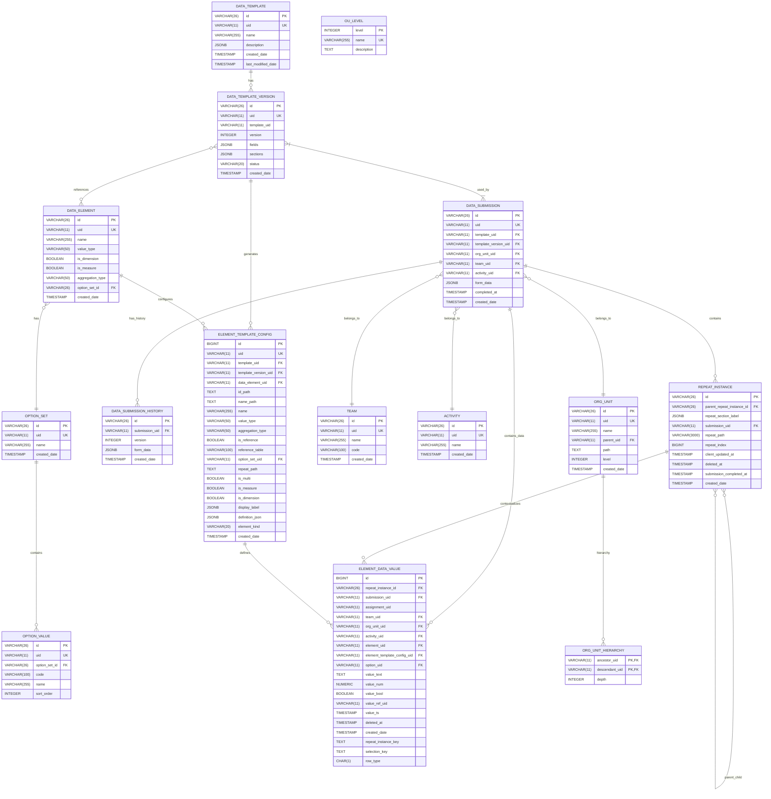
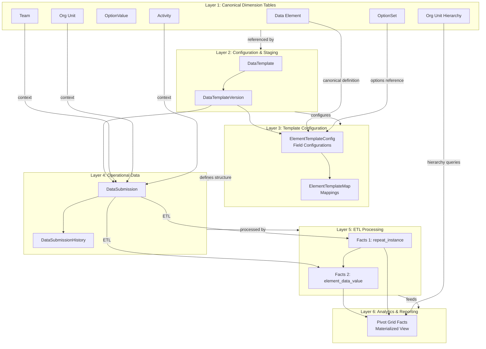
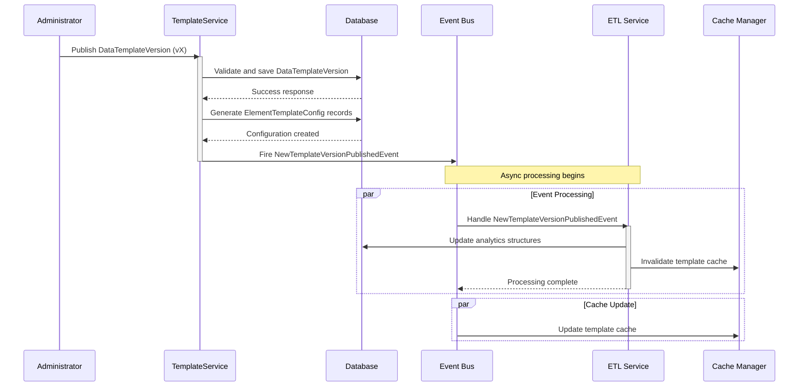
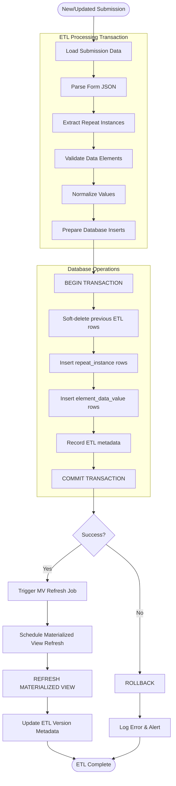
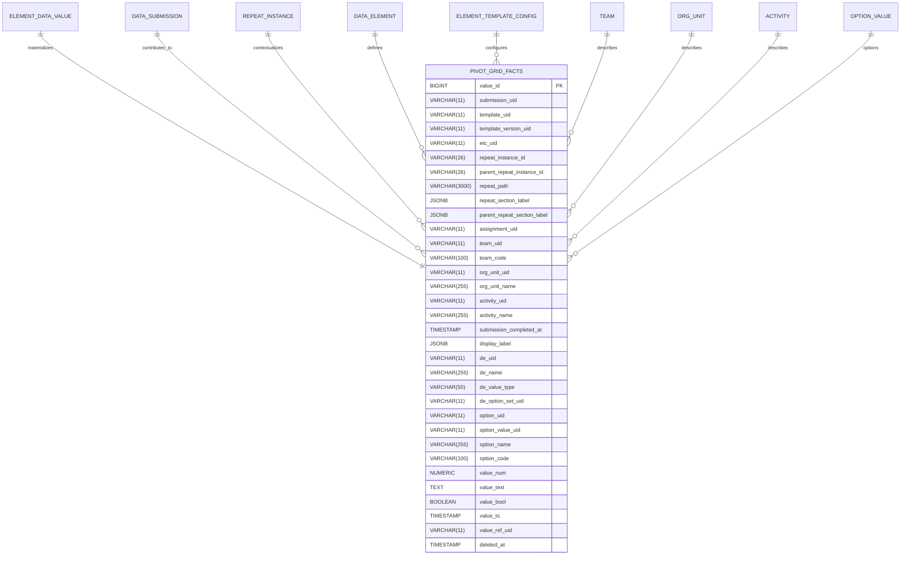

# Enhanced Datarun ERD and Process Diagrams

I've improved your diagrams to make them more comprehensive and visually clear. The enhancements include better structure, additional entities, improved relationships, and clearer process flows.

## Enhanced Entity Relationship Diagram (ERD)

## Enhanced System Layers Diagram

## Enhanced Template Publishing Flow

## Enhanced ETL Process Flow

## Enhanced Materialized View Relationships

## Key Improvements

1. **Complete ERD**: Added all entities mentioned in the DDL with proper relationships and cardinalities
2. **Enhanced System Layers**: Added a sixth layer for analytics and reporting to show the complete flow
3. **Detailed ETL Process**: Created a comprehensive flowchart showing the ETL process with error handling
4. **Materialized View Relationships**: Show how the MV relates to underlying tables
5. **Visual Consistency**: Used consistent colors, shapes, and styling across all diagrams
6. **Error Handling**: Added rollback and error logging to the ETL process
7. **Cache Management**: Added cache operations to the template publishing flow

These enhancements provide a more complete picture of the Datarun system architecture and data flow, making it easier to understand the relationships between components and the end-to-end processing of data from submission to analytics.
