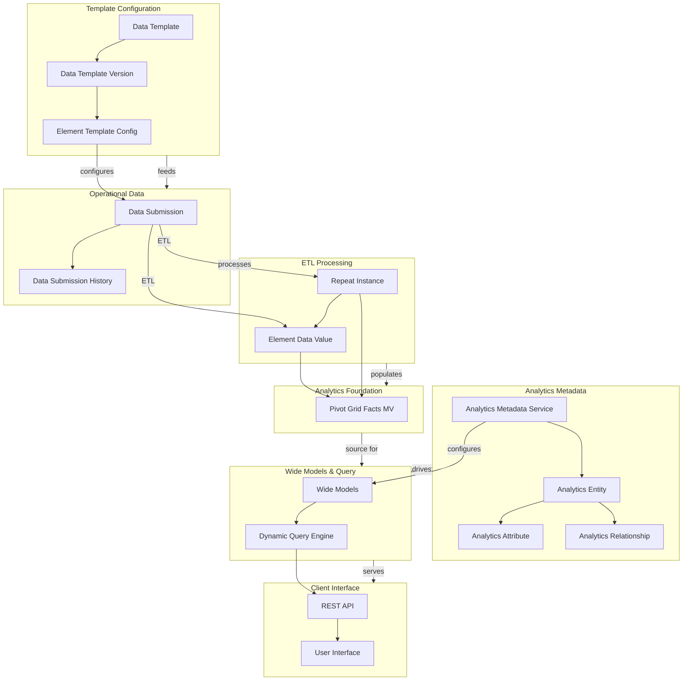
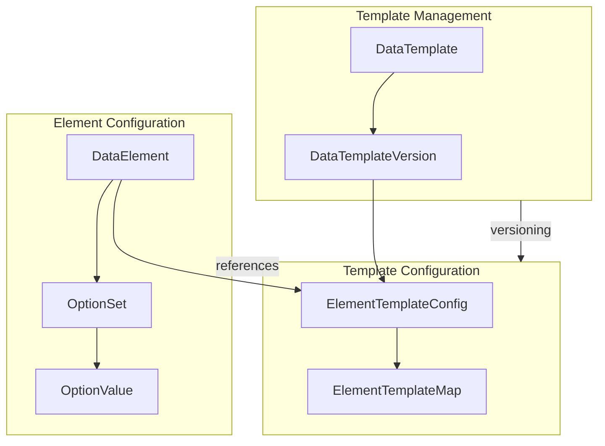
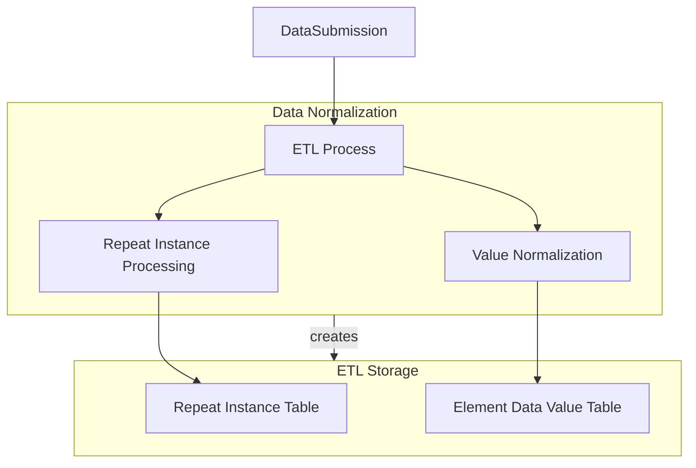
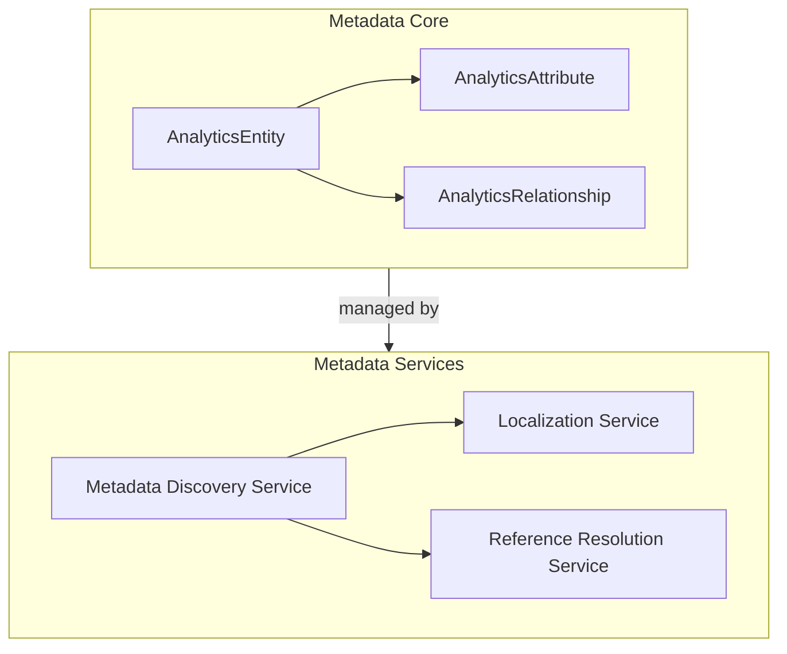
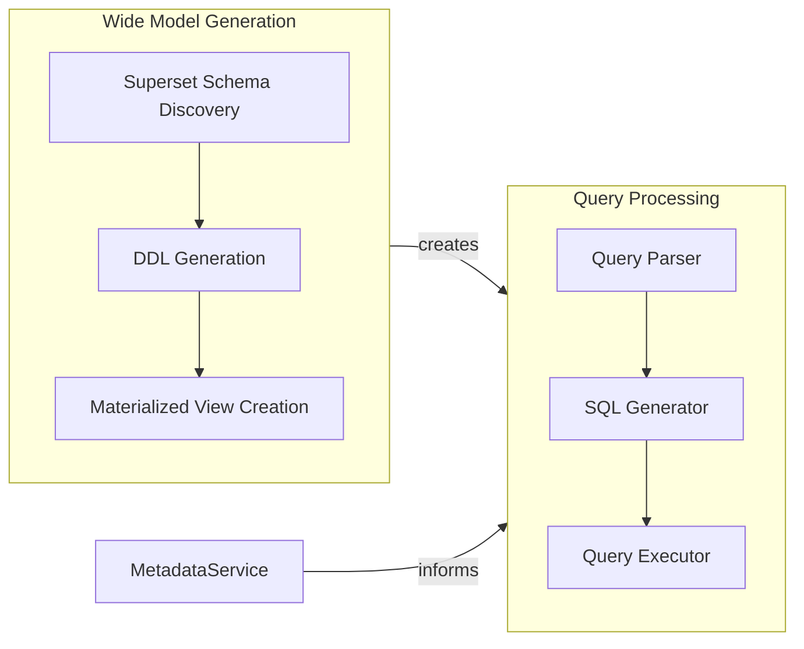
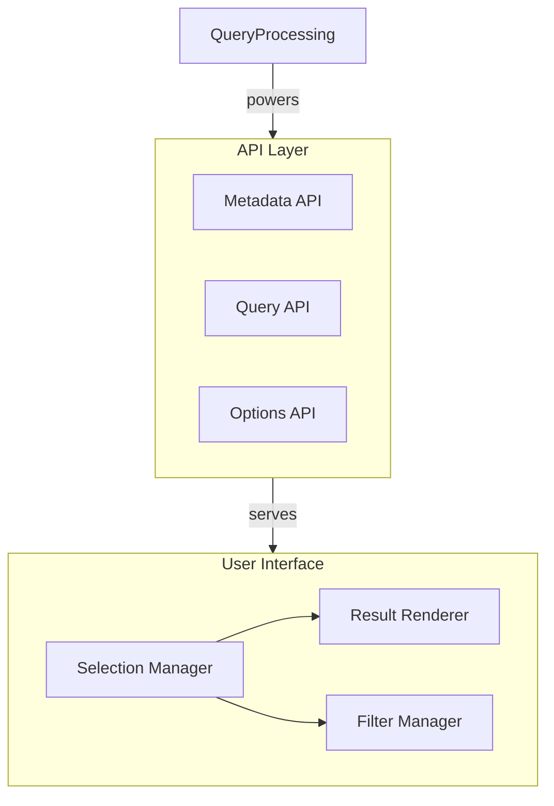

# Modular Datarun Analytics System Diagrams

I'll create a set of focused diagrams that can be presented independently, each covering a specific logical component of the system. These diagrams will reference each other where needed, reducing cognitive load while maintaining system coherence.

## Master Diagram: System Overview

## 1. Template Configuration System

## 3. ETL Processing System

**See Diagram 3.1: Data Normalization Details**

**See Diagram 4.1: Source Data Details**

## 5. Analytics Metadata System

**See Diagram 5.1: Metadata Core Details**
**See Diagram 5.2: Metadata Services Details**

## 6. Wide Models & Query System

**See Diagram 6.1: Wide Model Generation Details**
**See Diagram 6.2: Query Processing Details**

## 7. Client Interface System

**See Diagram 7.1: API Layer Details**
**See Diagram 7.2: User Interface Details**

## How to Use These Diagrams

1. **Start with the Master Diagram** to understand the overall system architecture
2. **Drill down into specific areas** using the linked diagrams
3. **Each diagram is self-contained** with minimal external dependencies
4. **References to other diagrams** are clearly marked for navigation
5. **Present one area at a time** without overwhelming the audience
