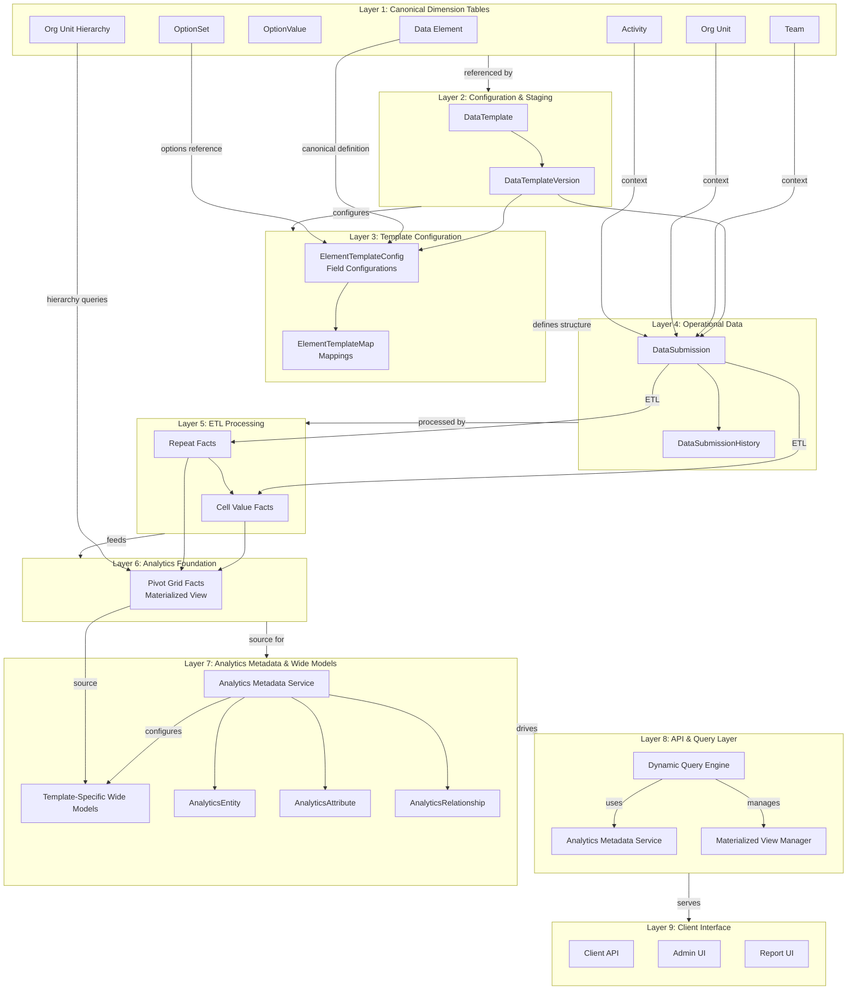
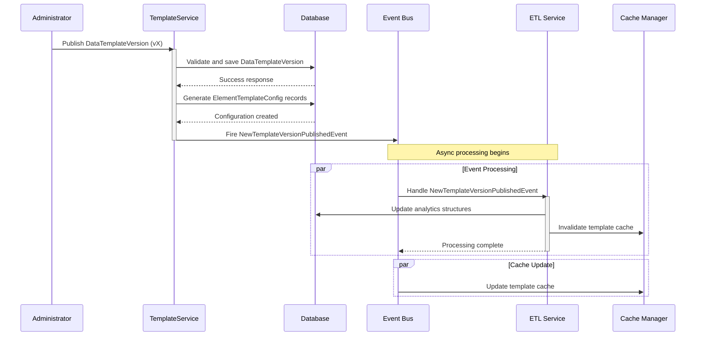
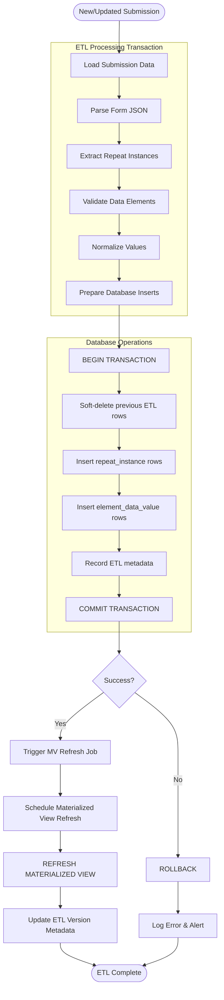

# Datarun: Key Architectural Principles & Diagrams
## Key System Properties

| Property            | Implementation                          | Benefit                   |
|---------------------|-----------------------------------------|---------------------------|
| **Idempotency**     | Transactional sweep-and-update ETL      | Safe retries, consistency |
| **Immutability**    | Versioned templates and elements        | Historical accuracy       |
| **Extensibility**   | Metadata-driven architecture            | Configuration over code   |
| **Performance**     | Layered storage with materialized views | Scalable analytics        |
| **Maintainability** | Clear separation of concerns            | Easier evolution          |

## 1. Complete System Architecture with Analytics Layer

## Enhanced Template Publishing Flow

## Enhanced ETL Process Flow

